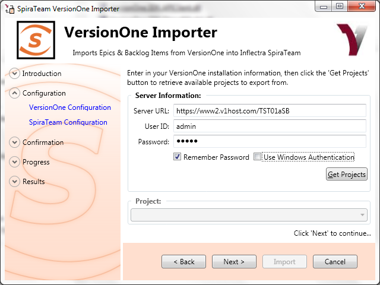
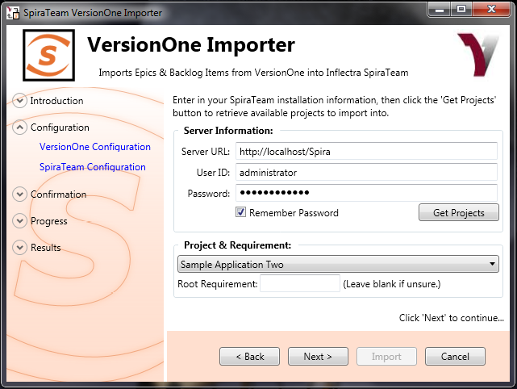
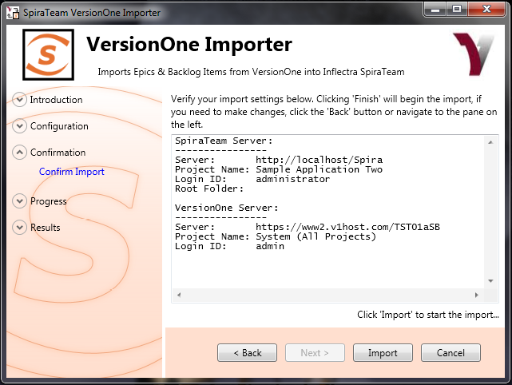
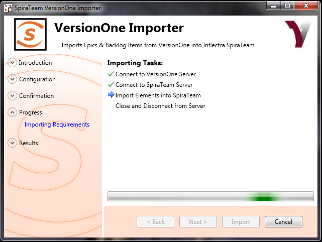
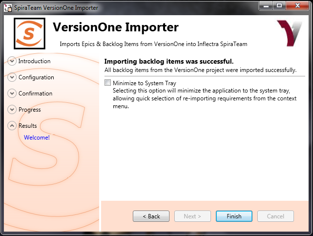

# Importing From VersionOne
!!! abstract "Compatible with SpiraTest, SpiraTeam, SpiraPlan"

This section outlines how to use the included Importer for importing Iterations/Sprints, Epics and Stories/Backlog Items from projects residing in VersionOne projects into equivalent projects in Spira.

## Installing the Importer
This section outlines how to install the importer onto a workstation so that you can then import requirements and use cases from VersionOne into Spira. It assumes that you already have a working installation of Spira v3.0 or later and a working installation of VersionOne 8.0 or later.

You can download the Importer from the Inflectra's website under "Downloads and Add-Ons". When downloaded, double-click the MSI file. Follow the instructions in the MSI file to install the importer.

## Importing from a VersionOne Project
Now that you have installed the integration adapter, you can launch it at any time by going to Start \> Programs \> Spira \> Tools \> VersionOne Adapter. This will launch the import application itself. You will be shown an introduction screen. Click 'Next' to get to the second screen:

You need to enter the VersionOne Server URL (including the port number if appropriate), the username and password you use to log onto the system, then click the *Get Projects* button. If you choose 'Use Windows Authentication' it will use the credentials of the currently logged-in user and disable the username/password text boxes.

The program will connect to the server and get a list of all available projects. Select the project you want to import into under the *Project* section. Once the project is selected, click *Next* to continue to the screen where you enter your Spira server and project information:

On this screen, you need to enter the Spira Server URL, the username and password you use to log onto the system, then click the *Get Projects* button. The program will connect to the server and get a list of all available projects. Select the project you want to import into under the *Project & Requirement* section.

The *Root Requirement* box is for specifying a base requirement to load all the VersionOne elements into. If left blank, then the importer will create a single placeholder requirement that all of the VersionOne epics and backlog items will be nested under.

If you have a requirement already in Spira, and want the VersionOne items to appear inside it, then you need to enter the requirement number into the *Root Requirement* text box. For example, if you have a requirement named "VersionOne Requirements" with a number of RQ1920, then put 1920 into the *Root Requirement* field and run the import. When import is finished, the Spira requirements will be nested underneath.

Note: At this time, change request and defect items are **not** imported from VersionOne projects.

Once the fields have been populated, click *Next* to get to the summary screen.

The summary screen tells you what will actions will be performed, and once you have verified the information, click the *Import* button to start the import:

Anything flagged with a red  failed, green  means that they succeeded. Once finished, click *Finish* to get to the last page of the wizard:

If the *Minimize to System Tray* option is selected, when you click Finish or exit the from the application, it will minimize to the system tray. Once in the system tray, you can right-click on the icon and the it will give you the option to either re-import from the same project or select another project for a fresh import. If the option is not selected, the program will exit, and you can re-launch the importer to import from the same or another VersionOne project.

## Using the System Tray Shortcut Menu
When the application is minimized to the system tray, there are several shortcuts available:

-   Double-Clicking the icon will bring the importer back to the first screen, allowing you to import another VersionOne project.
-   Right-clicking will give a shortcut menu with the following options:
-   Exit -- Close the program entirely.
-   Rerun Import -- Will provide you the screen to re-launch the last import you just ran.
-   Show Window -- Same as double-clicking on the icon, will bring the wizard back to the first screen, allowing new input options to be set.

## VersionOne & Spira Importing Notes
At this time, only requirements and iterations/sprints are imported into Spira from VersionOne. The epics in VersionOne become summary requirements in Spira and the backlog items / stories become child requirements in Spira. In addition, the following fields are brought over into Spira from VersionOne according to the following mapping table:

| **VersionOne Field**  | **Spira Field**                                                      |
| --------------------- | -------------------------------------------------------------------- |
| Name                  | Name                                                                 |
| Description           | Description (with HTML)                                              |
| Priority              | Importance: (maps as High to High, Medium to Medium, Low to Low)     |
| Status                | Status (see below for more details)                                  |
|                       | Author (not transferred, always set to user who ran the import last) |
| Iteration/Sprint      | Release / Iteration                                                  |
|                       | Owner (not transferred)                                              |
| Estimate              | Planned Effort (not transferred)                                     |
| VersionOne ID         | Custom Text Property TEXT\_01                                        |
| VersionOne Display ID | Custom Text Property TEXT\_02                                        |

| **VersionOne Status** | **Spira Status** |
| --------------------- | ---------------- |
| Future                | Requested        |
| Accepted              | Accepted         |
| Done                  | Completed        |
| In Progress           | In Progress      |

Using this adapter, you can manage the appropriate artifacts in VersionOne and then periodically re-run the import application to update Spira. The application will remember that the project was already used for an initial load and will simply update the requirements as appropriate as well as add any additional ones added. If you are using Spira v3.1 or later, the update process will also delete any artifacts removed in VersionOne.

Note that any changes to the requirement hierarchy are not reflected. This allows you to change the organization of the artifacts in Spira to make them easier to use without the changes being overwritten on the next import cycle.

Finally, should you want to start again and re-import a project from scratch that has already been imported once before, you may do so by re-running the Importer, and entering in **-1** as the *Root Requirement*. This will not delete requirements from Spira, only remove mappings, so the next time you run the importer on this file, all new requirements will be created.

***Note: This option is irreversible and should be performed with care.***