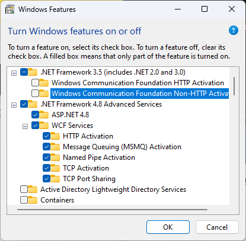
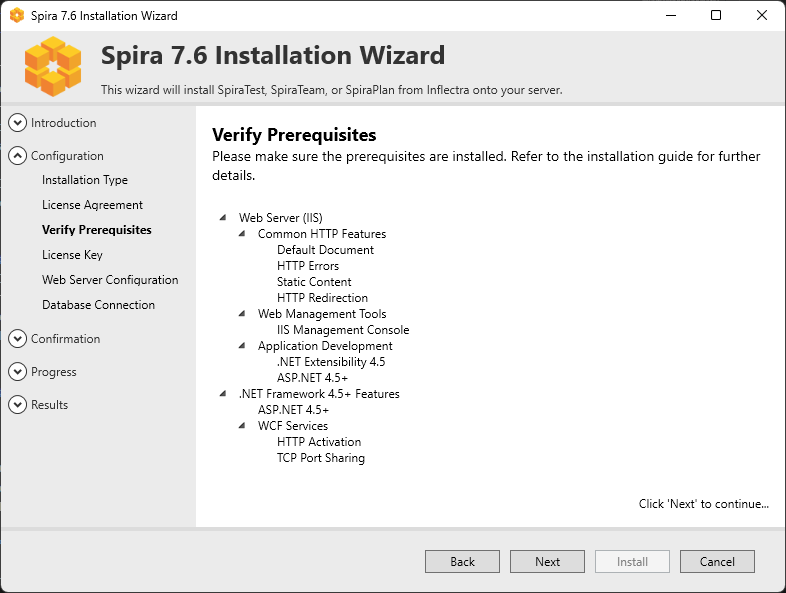

# Installing SpiraPlan®

This section outlines how to prepare your system for installation of SpiraPlan®; how to install the software; and how to ensure that your web-server is correctly configured to ensure secure operation.

The first sub-section will outline what hardware and software configurations are supported and the exact installation sequence for the different versions of Windows Server. The second sub-section will explain how to load the SpiraPlan® software onto the server, and discuss common problems and solutions.

The minimum hardware and software requirements for running the SpiraPlan® system are:

| **Server Requirements** |                                                   |
|-------------------------|---------------------------------------------------|
| **Requirement**         | **Minimum Specification**                         |
| **Processor:**          | Intel® or AMD® x86 or x64 compatible processor    |
| **Memory:**             | 4 GB, 8 GB recommended                            |
| **Operating System:**   | Windows Server 2019 (recommended)   Windows Server 2016 (recommended)                Windows Server 2012 R1 & R2   Windows Server 2008 R1 & R2  Windows 10, 8, 7 (for demoing)                    |
| **Database:**           | Microsoft SQL Server 2017   Microsoft SQL Server 2017 Express Edition   Microsoft SQL Server 2016   Microsoft SQL Server 2016 Express Edition   Microsoft SQL Server 2014             Microsoft SQL Server 2014 Express Edition   Microsoft SQL Server 2012   Microsoft SQL Server 2012 Express Edition   Microsoft SQL Server 2008 R2   Microsoft SQL Server 2008 R2 Express Edition      |
| **Web Server:**         | Internet Information Services (IIS) 7.0 or higher   ASP.NET Web Extensions 4.6 or higher |

---

| **Client Requirements** |                                                   |
|-------------------------|---------------------------------------------------| 
| **Web Browser:**        | Microsoft Edge   Internet Explorer 11.0+   Mozilla Firefox   Google Chrome (Desktop and Android)   Apple Safari (Desktop and iOS)   Opera                                             |
| **Other Components:**   | Microsoft Excel 2003+ (optional)   Microsoft Word 2003+ (optional)   Microsoft Project 2003+ (optional)                |

\*Note that SpiraPlan® can be loaded onto either Windows Server or workstation editions, provided that the IIS web-server is installed and that SQL Server is available as a database engine. However, Windows workstation editions can only support a maximum of 5 concurrent user web sessions. In general, unless there are only going to be a couple of client machines hitting the server, we recommend using Windows Server.

## System Prerequisites

Assuming that you have already installed the appropriate version of Microsoft Windows onto your computer (or that has been pre-installed for you), you need to then make sure that the various prerequisites have been correctly added to your installation before trying to install SpiraPlan®. The SpiraPlan® installer will check to ensure that the various prerequisites are in place, and will abort the installation if any are missing, indicating to you what action needs to be taken.

We recommend that you install / configure the prerequisites in the following order:

- Install the .NET Framework v4.6
- Install SQL Server 2017, 2016, 2014, 2012, 2008R2
- Install the latest version of Internet Explorer that your server OS
- allows
- Ensure that IIS is installed
- Ensure that ASP.NET 4.6 is enabled

### Install the .NET Framework v4.6, v4.7

On most modern Windows 10 and Windows Server installations, Microsoft
.NET Framework v4.6 is usually installed as part of the factory configuration, whereas on earlier operating systems, you might need to manually add the .NET 4.6 components to the factory configuration.

To see which version of the Microsoft .NET framework installed, open up Windows Explorer® and navigate to
`C:\WINDOWS\Microsoft.NET\Framework` and then the subfolders listed will indicate which version(s) of the framework you have installed:

To install the .NET Framework, launch Internet Explorer and enter the URL: <https://www.inflectra.com/CustomerArea>. Once you have logged-in to the customer area, under the "My Downloads" section there will be hyperlinks to download and install the appropriate version of the .NET Framework (version 4.6 at time of writing). Click on the option to download and install the .NET Framework, and follow the instructions provided. Once you have completed the install, verify that the installation was successful by looking in the "Administrative Tools" folder as illustrated above. You also need to make sure that .NET 4.6 has been installed if necessary.

### Install SQL Server 2017, 2016, 2014, 2012, or 2008R2

If you do not have a SQL Server instance ready, you can install the appropriate version of the database software, following the instructions provided with the installation. We recommend SQL Server Express Edition®
for most users. This free version of SQL Server will offer sufficient performance for most installations and can be easily downloaded from either the customer area of our website (<http://www.inflectra.com/CustomerArea>) or directly from the Microsoft® web-site at <http://www.microsoft.com/express/sql>.

### Ensure that IIS is installed

On Windows Server OS installations, IIS is usually installed as part of the factory configuration, whereas on Windows workstation OS installations, you typically need to manually add the components to the factory configuration. The steps that you need to take to verify its installation are listed below:

To check if you have IIS installed, click Start \> Control Panel \>
Administrative Tools. Under the "Administrative Tools folder", you should see an icon for "Internet Information Services (IIS) Manager". If you don't see this icon, then it means that you need to add IIS to your computer:

**a) Windows 7**

To install IIS on **Windows 7**, you need to click Start \> Control Panel \> Programs and Features, then choose the option to "Turn Windows features on or off". This will bring up the list of features and roles that can be configured on the server:

**b) Windows 8, Windows 8.1**

On **Windows 8 or 8.1**, to install IIS, you need to click Start \>
Control Panel \> Programs and Features, then choose the option to "Turn Windows features on or off". This will bring up the list of features and roles that can be configured on the server:

**c) Windows 10**

On **Windows 10**, to install IIS, you need to click Start \> Control Panel \> Programs and Features, then choose the option to "Turn Windows features on or off". This will bring up the list of features and roles that can be configured on the server:

Make sure that the following features are enabled within the 'Internet Information Services' folder:

- Web Management Tools
    - IIS 6 Management Compatibility
        - IIS Management Console
        - IIS Management Service
- World Wide Web Services
    - Application Development Features
        - .NET Extensibility 3.5
        - .NET Extensibility 4.8
        - ASP.NET 3.5
        - ASP.NET 4.8
        - ISAPI Extensions
        - ISAPI Filters
    - Common HTTP Features
        - Default Document
        - Directory Browsing
        - HTTP Errors
        - HTTP Redirection
        - Static Content

In the same panel ('Turn Windows Features on or off') you also need to check that the following features are enabled in the '.NET Framework
4.6 Advanced Services' folder:

- .NET Framework 4.6 Advanced Services
    - ASP.NET 4.6
    - WCF Services
        - HTTP Activation
        - TCP Port Sharing

To verify that this IIS is now installed, type
[http://localhost](http://localhost/) into the address bar of Internet Explorer on your computer. You should see a screen displaying the initial IIS startup page:

**d) Windows Server 2008 / 2008 R2**

On **Windows Server 2008**, you need to click on Server Manager, then under the "Roles" heading, choose the option to "Add Role" followed by selecting the new role "Web Server / IIS". Then click "Next" to bring up the role configuration screen:

Make sure that the following features are enabled:

- Common HTTP Features
- Static Content
- Default Document
- HTTP Errors
- HTTP Redirection
- Application Development
- ASP.NET
- .NET Extensibility
- ISAPI Extensions
- ISAPI Filters
- Management Tools
- IIS Management Console
- IIS Management Service

To verify that this IIS is now installed, type
[http://localhost](http://localhost/) into the address bar of Internet Explorer on your computer. You should see a screen displaying the initial IIS startup page:

**e) Windows Server 2012, 2016, 2019**

On **Windows Server 2012, 2016, 2019**, you need to click on Server Manager, then under the "Roles" heading, choose the option to "Add Role" followed by selecting the new role "Web Server / IIS". Then click "Next" to bring up the role configuration screen:

Make sure that the following features are enabled:

- Web Server (IIS)
- Web Server
- Common HTTP Features
- Default Document
- Directory Browsing
- HTTP Errors
- Static Content
- HTTP Redirection
- Application Development
- .NET Extensibility 3.5
- .NET Extensibility 4.5
- ASP.NET 3.5
- ASP.NET 4.5
- ISAPI Extensions
- ISAPI Filters
- Management Tools
- IIS Management Console
- IIS Management Service
- .NET Framework 4.5 Features
- .NET Framework 4.5
- ASP.NET 4.5
- WCF Services
- HTTP Activation
- TCP Port Sharing

### Ensure that ASP.NET is installed

Now that you have both IIS and .NET installed, you need to make sure that the Active Server Pages (ASP.NET) components that allow IIS to access the .NET framework have been correctly configured. If you installed .NET *after* IIS then ASP.NET is typically configured for you, but if you installed IIS afterwards, then further manual steps may be necessary.

To verify that ASP.NET has been correctly configured, click on Start \>
Control Panel \> Administrative Tools \> Internet Information Services (IIS) Manager to launch the IIS administrative console:

You should see a section called "ASP.NET" occupying the top third of the IIS screen. If not, then you need to go back to [Ensure that ASP.NET is installed](#ensure-that-aspnet-is-installed) and make sure that you chose the option to install ASP.NET when installing IIS.

## Installing the Software

Now that all the prerequisites have been correctly installed, you are now ready to install SpiraPlan® onto your system. To perform the installation, you will need the installation package downloaded from the Inflectra® website, the name of the organization that the software is licensed to, and the actual license key code which will be available in the customer area of the Inflectra® website.

To start the installation, double-click on the SpiraPlan® installation package (it will have a filename in the form of SpiraTestPlanTeam-vX.X.X.X.exe), and the Windows Installer will display the following dialog box:

### Select an Installation Type

Click the "Next" button to start the installation wizard. The wizard will gather information about what you want to do and how you want to do it. Before any changes are made to your system (installing web-server files and database components) you will get a chance to review everything again.

### Reviewing the License Agreement and Prerequisites

If installing a fresh installation or upgrading, after making your selection the next screen provides a copy of the SpiraPlan® End User License Agreement (EULA). Please read this carefully as it describes the legal contract between you -- the user of the software -- and Inflectra® Corporation, the developer and publisher. Once you have read the agreement and understood your rights and obligations, select the radio button marked "I accept the terms in the License Agreement" and click the "Next" button.

The next page of the wizard will display a list of the required pre-requisites and whether the installer could find them or not. The checks here are not fool-proof (in particular where a question mark is shown) so it is recommended to manually check the prerequisites in full as described above. The system will not require all prerequisites to be met before allowing the installation, but the application may display incorrectly if any are missing.

### License Information

The next stage of the wizard (for installing and upgrading) is entering license information:

You need to enter the ***organization that was issued the software license***, and the full license key that was provided with the software. The installer will verify the license information as you enter it. If the details entered are valid then the information will be displayed beneath the entry fields. This allows you to check that the correct application and license will be installed. On clicking Next, the installer will warn you of any discrepancies, and will not allow you to proceed until valid information has been provided.

If for any reason you are unable to get the provided license key to work, please contact Inflectra® customer support immediately and they will resolve the issue.

### Choosing an Installation Location \[Advanced only\]

If you checked "advanced" at the start of the installation process, you will have the option to choose where the application is installed.
**Please note that this is meant for advanced users only**.

You can choose an existing folder or make a new one and select that. By default it is C:\\Program Files (x86)\\\[Application Name\]).

### Web Server Configuration

Choose which web site to install Spira int using the available dropdown, which should list all available web sites in IIS on this machine. The Default Web Site will be preselected and is the best option in most circumstances.

**Virtual Directory \[advanced only\]**

If installing in advanced mode, then on this screen you will able to change the name of the web-site URL that will be used to access the system. By default, users would need to type into their browsers: http://"server name"/\[product name\]. Should you want to have a different name change the name in the Virtual Directory box, otherwise simply accept the default name and click "Next". Note: The installer will check to make sure that the name you have chosen is not already in use, and will warn you if it is.

### Connecting to the Database

SpiraPlan has an application (installed into a default folder on your system), a website (configured above), and a database. The next screen tells the installer how to connect to the database server on your system.

**a) Windows Authentication**

This is the easiest option when the application and database will be residing on the *same* server. It is the only option available for authentication during a standard installation. In this case, choose the "Windows Authentication" option and the Login/Password boxes will be disabled. In this case, the installer will connect to the database using your current Windows login to create the application database objects, and SpiraPlan® will connect to the database during normal operation using either the ASPNET or NETWORK SERVICE Windows accounts (it depends on the version of the operating system).

**b) SQL Server Authentication \[advanced only\]**

This is the easiest option when the application and databases will be residing on *different* servers across the network. In this case, choose "SQL Server Authentication" and provide a SQL Server Login that has Database Owner (DB-Owner) permissions -- e.g. the built in System Administrator (SA) account. The installer will use this DB-Owner account to create the database objects, and SpiraPlan® will use a special login (called SpiraPlan by default) for normal application operations.

**Setting the Correct Server Instance**

In the "Server" box, you need to enter the name of the Microsoft SQL Server instance that is running on your system; the installer will default it to the hostname of the server (which in many cases will be correct). The easiest way to find out the database server name is to open up the SQL Server Administrative console (typically by clicking Start \> Programs \> Microsoft SQL Server \> Enterprise Manager) and look for the name of the server.

For SQL Server 2005/2008 Express edition installations, the Server name is usually the name of your computer followed by "\\SQLEXPRESS", so for example, if your computer is called MyComputer, the server name would be MyComputer\\SQLEXPRESS. Omitting the second part (called the instance name) would lead to a "host not found" error.

You can also choose whether to install the sample products or not --
typically we recommend installing the sample products for evaluation installations and excluding them for production installs.

### Completing the Installation

Once you have entered the various pieces of information, click "Next". The installer will attempt to connect to the database using the provided information, and it will display an error message if any of the information is incorrect. Assuming the information is correct, the following screen will be displayed:

Once you have confirmed that everything is correct, click the
**"Install"** button to actually begin the process of installing SpiraPlan® onto your system. The installer will then display a progress bar as the installation proceeds. Once the installation is complete, the installer will provide confirmation, or display information about any problems it encountered.

Click the "Finish" button to complete the installation.

Congratulations! You have successfully installed SpiraPlan® onto your system. If you type <http://localhost/SpiraTeam> into your browser you should see the SpiraPlan® login page, as illustrated in the *SpiraPlan®
User Manual*. If for any reason you don't see the login page, please contact Inflectra®
Technical Support using one of the methods described at our website
<http://www.inflectra.com/Support>. 

### Upgrading

To upgrade an existing installation, execute the same installer, and on the Installation Type screen, select the "Upgrade" button:

You will then be asked to agree to the EULA, it will verify any missing prerequisites in case system requirements have changed, and then ask to verify your License Key. This key should match the new version you are upgrading to, not the existing version installed on the server.

Once that information is verified, you must point the installer to the location of the application. The installer will default to the default installation location and if this is not correct, click the folder icon to select the proper installation location:

After verifying the location, the installer will display the screen that shows the summary of actions to be performed.

In case of an upgrade failure, a backup of the database is made. The location is given on the summary screen, and is usually the default backup directory for SQL Server. To recover your system, all you need to do is restore the backup over top of the existing corrupted database. You can then try the upgrade again.

If problems persist, contact the support department, and they will explain how to retrieve the logs for remediation.

## Security Considerations

The Microsoft Internet Information Services (IIS) web-server and SQL Server database are powerful tools to managing web-based applications. However it is important to make sure that they are correctly secured to prevent unauthorized access to applications being hosted on them. This is a fast-changing field and beyond the scope of this guide to address, however we recommend reading the following article for details on how to secure IIS:

<http://www.iis.net/learn/manage/configuring-security>

In addition to the steps outlined in this article, it is important to note that by default, all web pages served by IIS using the HTTP protocol are unencrypted, and as such, the usernames and passwords used by SpiraPlan® to log into the application can be read by network sniffing tools. If you are using SpiraPlan® purely within an intranet environment, this may not be an issue. However, if you are externally hosting SpiraPlan® onto a publicly accessible website, we recommend installing a Secure Sockets Layer (SSL) encryption certificate, and restricting all web-traffic to the secure HTTPS protocol instead.

