# Product: General Settings

## Product History Changes

This page displays a list of changes made to items within the selected product. By default, items are shown in chronological order - with the most recent at the top.

The following artifact changes are recorded:

- Requirements
- Releases
- Documents (including tracking when versions are added, removed, or the default version changed) 
- Tasks
- Incidents
- Test Cases
- Test Steps
- Test Sets
- Automation Hosts

If baselining is enabled for this product, changes to assocations, test coverage, and positions of test steps, use case steps, and mitigations are recorded. Certain changes to artifacts are not recorded, such as location changes (indenting, outdenting) and comment additions.

Additionally, certain product administration changes are recorded and displayed. These include turning baselining on and off for a product, all testing settings, and some planning options (for example Work In Progress Limits).
 
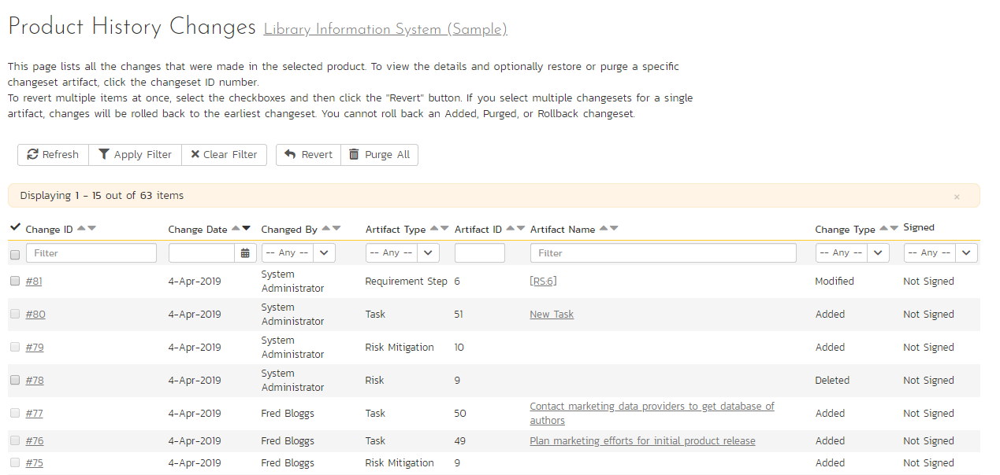

There are a handful of change types recorded and displayed here:

-   **Modified**: The most common, this means that one or more fields in this artifact were changed. Note that if a standard field and a custom field were changed at the same time, it will generate two separate entries, one for the standard fields, one for the custom fields.
-   **Added**: This means that this artifact was added, created in the system, either by using the New menu option or by copying. Pasting an item that was cut will not result in an Added entry being created.
-   **Rollback**: This items means that the artifact was rolled back to a specific event in the history.
-   **Deleted**: This entry is created when an artifact is deleted from the system.
-   **Undelete**: This entry is created when an artifact was deleted and then undeleted, making it live in the system again.
-   **Purged**: This entry is created (and all other history items are removed) when a deleted artifact is purged from the system. Purged items are removed from the database, and cannot be recovered.

***Note***: When upgrading from a version before v3.1, each individual field changed will be considered a unique change, due to how previous versions recorded history. However, as soon as the application is upgraded, simultaneous changes will be grouped together based on their last-update date.

This screen allows the administrator several options (below). NOTE: if baselining is enabled for this product you will not be able to purge all, and you will only be able to revert recent changes (those made since the last baseline for this product was created).

-   *Viewing Details*: The detail screen for each change set can be viewed by clicking on the change ID \#. This will take you to the history details screen, described below.
-   *Revert*: This button will roll back all items in the list that are checked. You must have at least one row checked to revert. See the section on reverting below.
-   *Purge All*: This button will permanently purge all deleted items from the database. Once items are purged, they cannot be restored.

### History Details Screen

The history details screen displays information on the selected change set:

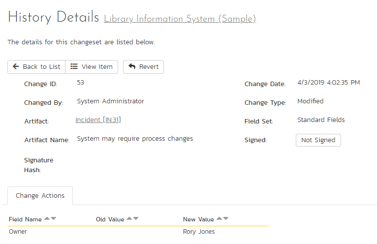

The History Details screen will show basic information as well as fields that were changed in this change set. Shown here is the Change ID, the date and time that the change was made, the user that made the change, the change type, the artifact affected, and the set of fields affected.

If a set of fields were affected (Standard or Custom), then the list of fields will be listed below. In the example above, the change was a Modification, and 5 fields were changed. In other change types, no fields will be displayed.

If the artifact is still available in the system, you can click the Artifact or click the 'View Item' button in the toolbar to view the item as it is currently. However, if the item has been deleted, a warning label will be displayed (as above in the example screenshot), the View Item links will be disabled, and a new option, "Purge" will appear on the toolbar.

!!! info "If baselining is turned on"
    If baselining is enabled for this product, you will only be able to revert or purge recent history items (those made since the last baseline for this product was created).

### Purging Items

Items that have been deleted by any user still remain in the database, but do not affect statistics or reports, and do not show up in reports and cannot be viewed. The artifacts are still in the database, however, and can be restored by clicking on the Restore button in the toolbar.

Purging an individual item can only be done while viewing one of its history detail screens. Once an item is purged, you will be taken back to the history list screen. All the previous history items for the artifact will be removed, and replaced with a single "Purged" history item.

Items that are purged cannot be restored into the database, as unique identifiers will be wiped from the database, so be sure that you are sure you want to purge an item before doing so.

You can purge all items in the product at once by clicking the "Purge All" button located on the History List page. This will take some time depending on how many deleted items are in your database, and it is recommended that the database files be compressed in SQL Management Studio afterwards to free up space and compress clustered indexes.

### Reverting Items

Reverting an artifact will attempt to reset all fields back to the selected change set, reverting all changes made after the selected change set as well. In certain cases, the artifact will not be able to be reverted -- cases like this could be caused by other items having been deleted or purged. (For example, if Requirement \#1 was linked to Release \#4, and that Release does not exist anymore.) In cases like this, no fields will be reverted and the artifact will remain unchanged.

Reverting an item will cause it to be undeleted if it has been deleted.

You can revert multiple items from the History List page -- however, the only items that can be reverted back are Deletes and Modifications. All other types will be ignored. When selecting multiple items, you can select more than a single change set for a specific artifact, the artifact will be rolled back to the earliest change set selected.

## Product Associations

By default, all products in SpiraPlan are completely self-contained. Artifacts in one product can only be linked or associated with artifacts in the same product. However, for some customers, they need a way to share artifacts between products. This administration screen lets the product admin specify which other products can access artifacts in the current product:

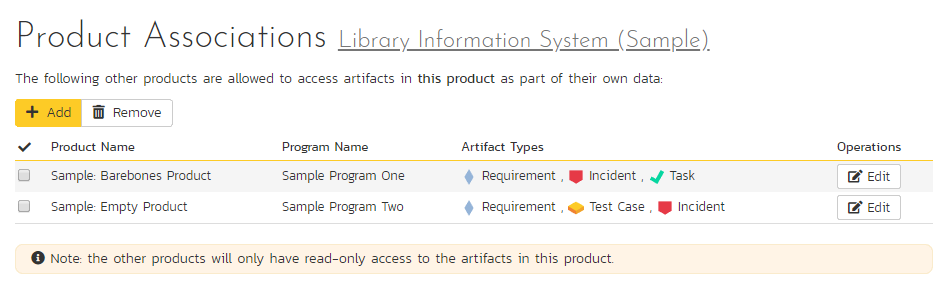

!!! info "Permissions when sharing artifacts across products"
    When you share artifacts from the current product to another product, the permissions and membership in the other product determine who can see what items. You therefore need to think about the impact of this before enabling cross product associations.

    For example: Marie is a member of Product A and can see its requirements. She is not a member of Product B and cannot see anything in Product B at all. If Product B shares its requirements with Product A, anyone who can see Product A's requirements (like Marie can) will now be able to see (not edit - only see) all of Product B's requirements too.

### What artifacts can be shared across products
You can share the following artifacts from one product to another:

- Incidents
- Requirements
- Risks
- Tasks
- Test Cases

When you share the above artifacts from the sharing product to another product, members of that product can now see (read only) all artifacts of that type from the sharing product. Users can see these artifacts in a number of places in the other product (the one being shared with). For example:

- Incidents: from the association panels of incidents, requirements, and risks
- Requirements: from the association panels of incidents, risks, and test cases; from the requirement coverage panel of test cases; by selecting "All Products" in the upper right on the requirement list page
- Risks: from the association panels of incidents, requirements, test cases, and risks
- Tasks: from the association panels of incidents and tasks
- Test Cases: from the test coverage panel of requirements; from the association panel of risks

### How to share artifacts with another product

To share artifacts with another product, click on the 'Add' button in the toolbar:

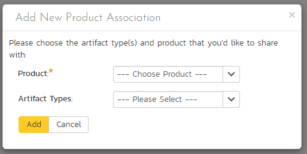

Select the name of the product you want to share with and choose which artifact(s) you want to share with this product:

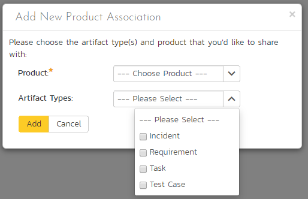

When you click the 'Add' button, SpiraPlan will add the new product association to the list.

You can change the product association (for example to change which artifacts are shared) by clicking on the 'Edit' button to the right. This updates the association list.

To remove an association, simply select its checkbox and click 'Remove'.

## Data Synchronization
This pages shows a list of all active integration plug-ins that the product is actively synchronizing with. Available plugins are [set system wide](System-Integration.md#data-synchronization). 

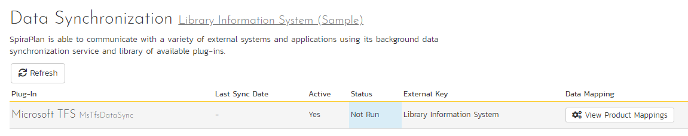

In the above example, only TFS is active for this particular product. Clicking on "View Product Mappings" will display a detailed page for configuring this product to work with this plug-in. Here you can set the external key to use in the external application and map all relevant fields between Spira and this application. To read about how to configure this page, refer to the guide for your particular *external bug tracking tool*.

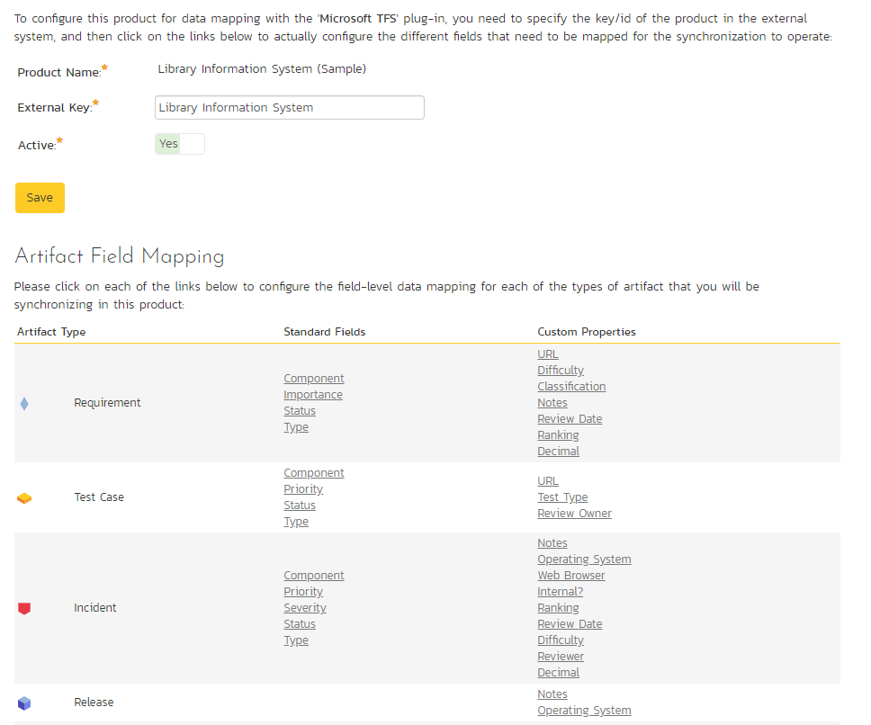

## Product Data Tools

This page contains several different data management tools that can be used to identify certain data issues in the system and correct them. There are two main sections to this page -- Data Caching and Indentation Hierarchy:

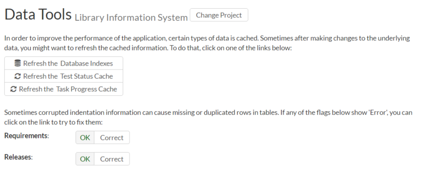

1. **Database Indexes**: In order to improve the performance of SpiraPlan®, it can be beneficial to refresh the database indexes. Clicking the "Refresh" button illustrated above will refresh all relevant database indexes across all SpiraPlan products. If for any reason performance seems to be slower than usual after a large import of data (for instance from Excel, or using the product migration tool) or after a recent database upgrade, you should consider refreshing the indexes. Depending on the size of the database, this could take some time. Please keep the web page open throughout the process to ensure it can complete successfully.

2. **Data Caching**: In order to improve the performance of SpiraPlan®, certain types of product data are cached. Very occassionally, the cache can get behind the data in the actual database. In such cases, refreshing the cache will make sure the cache is fully up to date and correct data is therefore displayed in the application. If users report this kind of problem in one of the cache areas, click the relevant Refresh Cache button.

3. **Indentation Hierarchy**: The Requirement and Releases pages use an "Indent" system for managing the hierarchy of information. This allows requirements and test cases to be nested under parent items and be rapidly searched and filtered on. Sometimes if a move/copy operation is interrupted (due to a network outage, etc.) the hierarchy may get corrupted. If you suspect a problem with either of these artifacts, click the "Check" button. Once the check has run, if you see a red Error message instead of the Green OK that means problems were found. If that happens, click the "Correct" button and the system will correct the indent levels.

## Source Code

Clicking on the Source Code link in the administration menu will, if a source code provider has been set up by a system administrator, show a screen like the one below.

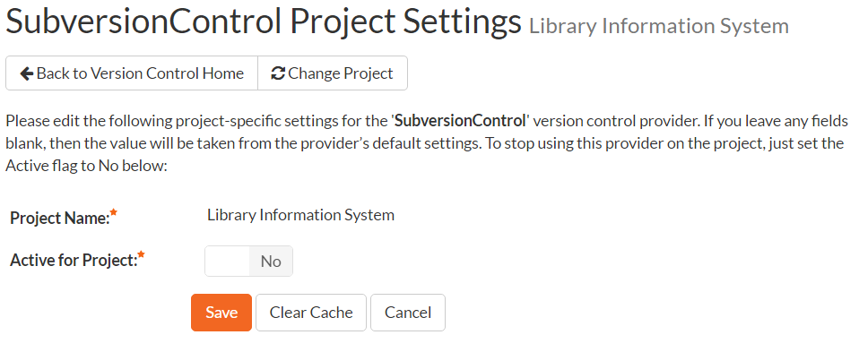

The first thing you need to do (regardless of whether you'll be overriding any of the settings) is to make the provider active for the current product. To do this, change the toggle to "Yes" and click \[Save\]:

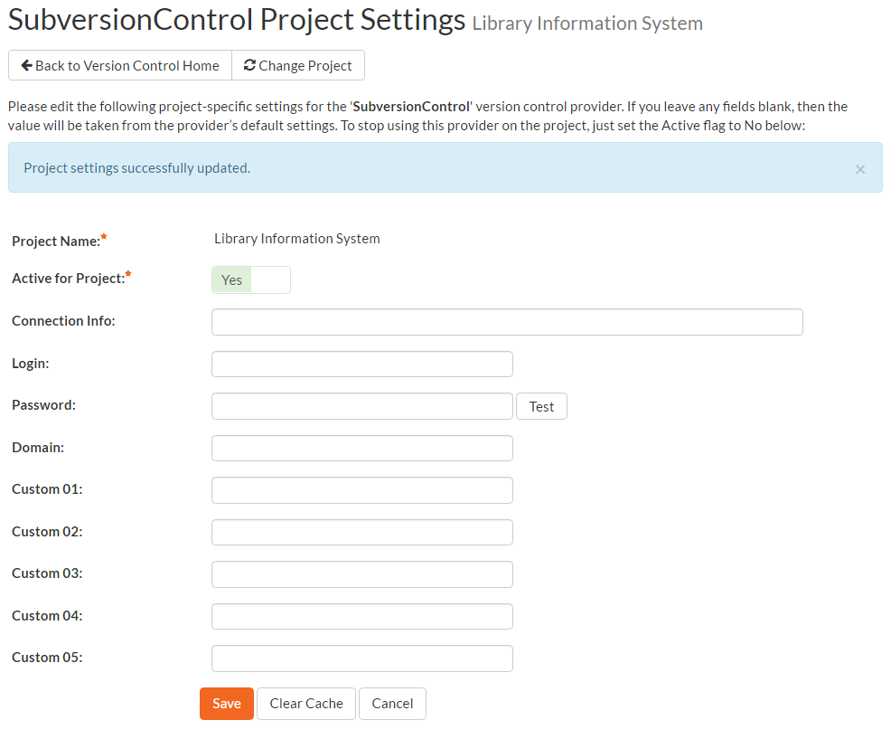

Now you can decide whether you want to override any of the default settings for this product. Any field left blank will automatically get its settings from the default values entered at the [system level](../System-Integration/#source-code-integration-on-premise-customers-only). In the example above, we have specified a product-specific repository path, login and password. Once you have correctly configured the product, click \[Save\] to commit the changes.

To improve performance, SpiraPlan will cache some of the data it receives from the source code provider. Normally SpiraPlan will know when to update the cached data based on changes made in the source code system automatically. However, sometimes you may wish to force the cache to refresh right now. To do so, click the "Refresh Cache" button. If you ever want to wipe the cache completely and have it rebuild from scratch, click  "Clear Cache".

You are now ready to use SpiraPlan® in conjunction with the source code tool you selected. For details on how to use the Source Code integration features of SpiraPlan, please see [here](../../Spira-User-Manual/Source-Code/).

## Baselines
This page displays a list of all baselines in the product. You can only access this page in products where baselining has been turned on.

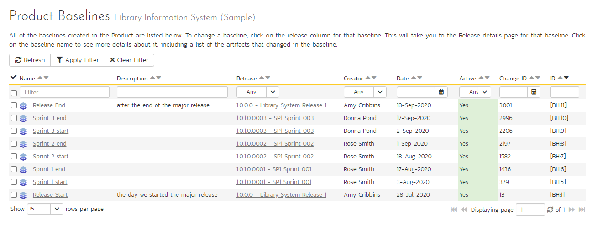

The table of baselines has the following columns:

- Name: baseline name

- Name (this links to the [baseline details page](#baseline-details))
- Description
- Release (this links to the release details page)
- Creator
- Date (hover to see a tooltip of the date and time)
- Active (yes or no)
- Change ID that the baseline is linked to
- ID

To filter and sort the list of baselines, use the filter and sort controls at the top of the table.

## Baseline Details
This page displays detailed information about a single baseline. You cannot edit information about the baseline on this page. That can only be done from the [release details page](../../Spira-User-Manual/Release-Management/#baselines).

Information about the baseline is divided into 4 sections:

1. The top of the page shows the baseline name
2. The full baseline description
3. Properties about the baseline (release, creator, creation date, previous baseline, active, change ID, baseline ID)
4. A table of all artifacts that have been added, modified, or deleted in this baseline.

!!! question "Why do we show the previous baseline?"
    A baseline is created against a point in time (more precisely, against a specific change event in this product). This is the end of the baseline. To know what happened during a baseline you need to know when a baseline starts. The start of a baseline is immediately after the end of the last baseline. If this is the first baseline in a product, then the baseline starts at the start of the product.  

    For example, let's say we start a new product. A few days later we create baseline 1. A week later we add baseline 2. Baseline 1 runs from the moment we created the product until the moment we created the baseline. More precisely, baseline 1 runs from the first change ID of the product, to the change ID that the baseline is linked to. Baseline 2 meanwhile runs from the moment baseline 1 was created through to the moment baseline 2 was created.

### Artifacts changed in a baseline
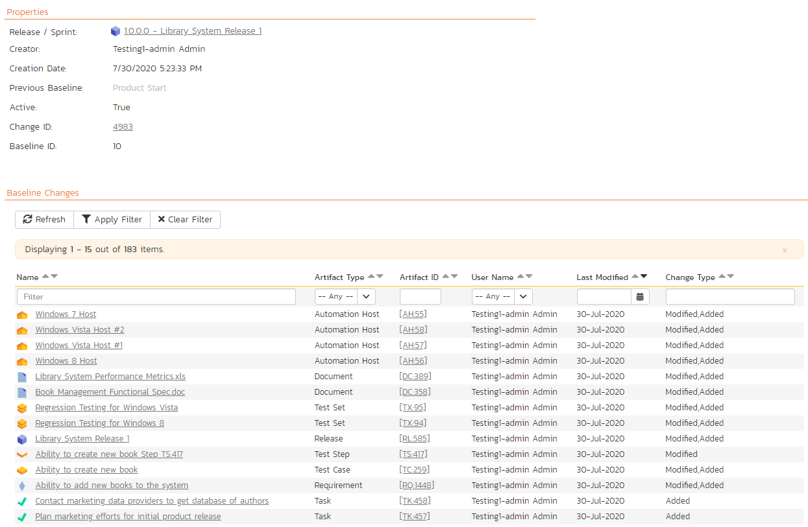

To filter and sort the list of artifacts shown in the table, use the filter and sort controls at the top of the table.

This table of artifacts only shows artifacts that changed in the baseline (between when this baseline was created and the previous baseline). Each artifact is only shown once, even if it changed multiple times. The changes that happened to the artifact are combined into a single description so you can easily see a summary of what happened to the artifact during the baseline (for example, was it only modified, or added then modified, or modified then deleted). 

This table shows the following information:

- Name (this links to the baseline artifact details page for this artifact in this baseline)
- Artifact Type (e.g. Requirement or Incident)
- Artifact ID (this links to the artifact details page for that artifact)
- User name (only one user is shown, even if multiple people have changed the specific artifact)
- Last modified date (hover to see a tooltip of the date and time)
- Change Type (this lists all of the types of change that the artifact went through during this baseline. Each type is only listed once, so if an artifact was added, then modified 10 times, it will show "Modified, Added")

## Baseline Artifact Details
This page displays detailed information about the changes made to a specific artifact for a specific baseline. This is a great way to see what happened to an artifact in the baseline.

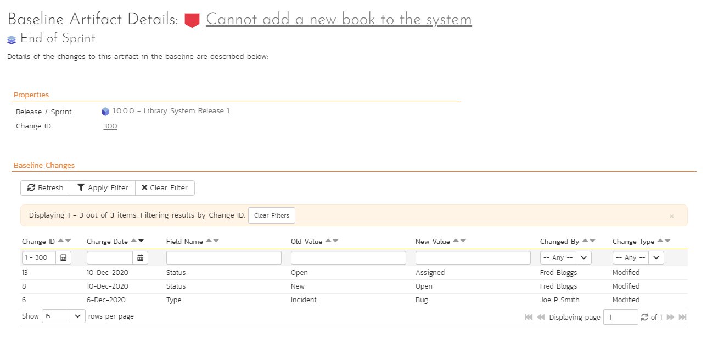

Information about the artifact at this baseline is divided into 3 sections:

1. The top of the page shows the artifact name (which links to the artifact details page for that artifact) and the baseline name
3. Properties about the baseline (release and change ID)
4. A table of all changes made to the artifacts in this baseline

The table of changes is very similar to what you see on the history tab when looking at an artifact. The key difference is that here only a subset of the history is displayed: only those changes that fall within the baseline. All other changes to the artifact are not shown.

This table shows the following columns. You can apply a filter using any of the fields except for Change ID (because this is already filtered to show the key range for the baseline).

- Change ID
- Change Date
- Field Name
- Old Value
- New Value
- Changed By
- Change Type

## SpiraApps

## SpiraApp Settings