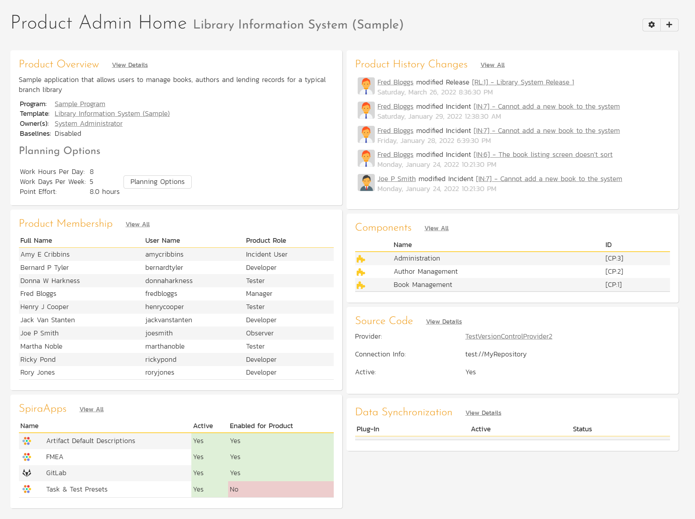

# Product: Home Page
!!! abstract "Available in SpiraTest, SpiraTeam, SpiraPlan"

The Product Administration Home page is accessible to users whose product role includes product admin permission. There are multiple ways to navigate to it: 

- Click the "Administration" link in the upper right. This will display the context aware administration menu popup. Then click on the Product Name at the top.
- On the Template Admin Home page, click on the Product Name in the Product List widget.

It provides Product Owners with quick access to important information.

As with other dashboards, you can edit these widgets, their position, and what is shown, using the two buttons in the top right (the cog and the plus).

## Product Overview
This widget displays general information about the product. To edit this information, click “View Details”.

## Product History Changes
This widget shows the latest history changes in the product. By default, 5 items are shown, but this number can be changed. To view the complete Product History list, click View All.

## Product Membership
This widget shows a list of product members. By default, 10 users are shown, but this number can be changed. To view the complete Product Membership list and edit it, click View All.

## Components
This widget shows the active components for the product. By default, 5 components are shown, but this number can be changed. To view or edit the complete list of components, click View All.

## Source Code
!!! abstract "Available in SpiraTeam and SpiraPlan only"

If a source code provider has been set up by a system administrator and is active for the current product, it will be displayed here. Click View Details to configure it. 

## SpiraApps
This widget shows a list of all active SpiraApps at the system level. It shows the SpiraApp icon and name, its system active status (which will always be Yes), and whether or not it is enabled for the product.

## Data Synchronization
If any Data Sync plug-ins have been set up by a system administrator, they will be displayed here. Click View Details to see more details and to configure them for the current product.