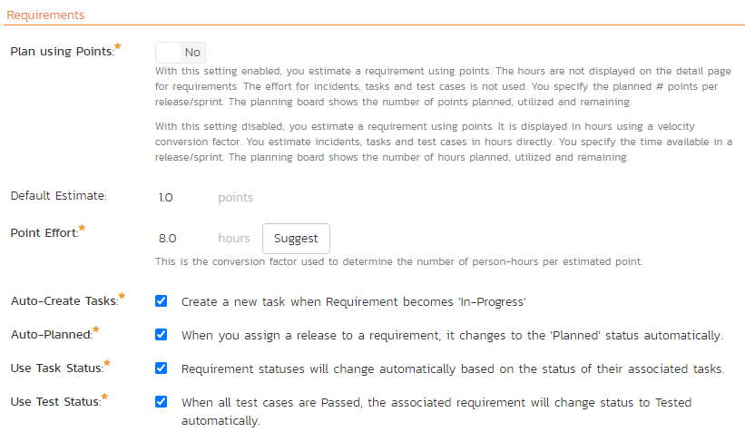
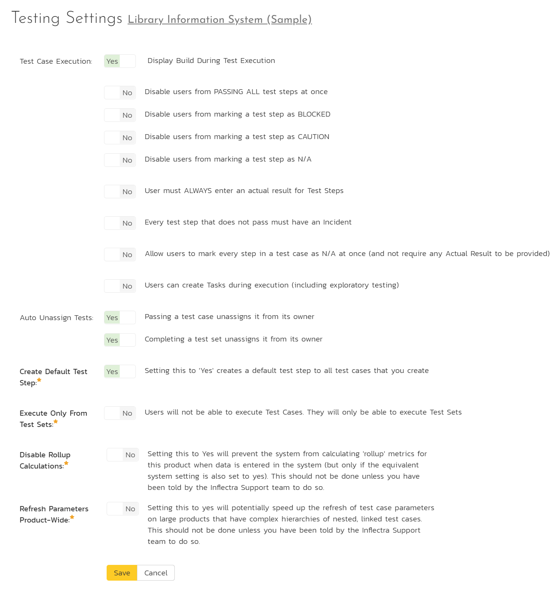

# Product: Planning

## Planning Options

The Planning Options page lets you configure the schedule and calendar options for the various product estimation and planning modules. The settings are specific to each product. The page is divided into a number of collapsible sections. 

### General

- **Work Hours Per Day**: this setting allow you to specify how many work hours should be used when converting an effort calculation from hours to calendar days. For example a 12 hour task will occupy two days if you set the working hours per day to 6 hours, whereas the same task will occupy 1 ½ days only if you set the working hours per day to 8 hours.
- **Work Days Per Week**: this setting allows you to specify how many days in the week are *typically* worked on the product. By default the system assumes a 5-day (Mon-Fri) working week, but if your organization works Saturdays (for example), you may want to switch to a 6-day working week. If you want to use partial days, then just round up to the nearest day and add non-working hours (see below) to compensate.
- **Non-Working Hours Per Month**: this setting allows to specify how many non-working hours *typically* need to be accounted for. This is useful if you want to have a working week that contains a fractional number of days or if you have recurring activities that need to be removed from each month. *Note that if you have specific holidays, vacation days that need to be accounted for, it is better to use the Release/Iteration non-working time feature instead.*
- **Effort Calculations**: When calculating how much effort has been scheduled in a release or iteration, the system will aggregate the individual effort values (both estimated and actual) for all the task, incident and test cases artifacts associated with the release/iteration. This setting allows you to specify if you want only task, incident, or test case effort values to be included in the release/iteration total. This is useful if your product management methodology requires that incident or test case effort values be excluded from the total.
- **Detected Release**: By default the Incident detected release field shows ALL releases in the product. This dropdown can become very hard to use if you have a very large number of releases (many hundreds or thousands). If you check the box for this setting the Incident detected release field will only show *active* releases, not all releases.

### Requirements

- **Plan by Points**: With this setting enabled, you only estimate a requirement using points. The hours are not displayed on the detail page for requirements. You also use points for planning releases/sprints. The planning board shows the number of points planned, utilized and remaining. With this setting disabled (default), you estimate a requirement using points but it is also shown in hours using a velocity conversion factor (discussed below). You specify the time available in a release/sprint in hours. The planning board shows the number of hours planned, utilized and remaining.
- **Default Estimate**: Normally when you create a new Requirement in the system it will be given an empty initial estimate (in points). However if many requirements are typically a standard size, then as a time-saver, the system will let you specify a default estimate value that will be used when a new requirement is created.
- **Point Effort**: When requirements are added to the Planning Board or Iteration planning screen, they will have an initial effort (in hours) that is used until tasks are added (see Auto-Create Tasks option). This field contains the standard conversion factor used to convert points into hours based on the current team velocity (how much time it takes on average to accomplish one story point). As the product progresses, the team velocity will change, so you can click on the \[Suggest\] button to have the system calculate how many hours each existing story point has taken to implement in the product and provide that as a recommendation:

- **Auto-Create Tasks**: When you change the status of a Requirement in the system to "In-Progress" the system will automatically add a default Task to that requirement if no tasks already exist. This is a useful shortcut that makes planning with requirements easier in the case when the requirements are of a size where they don't need to be formally decomposed into multiple developer tasks. However if you don't want the system to automatically create tasks in, you can deselect the option for the current product and it will turn off the feature.
- **Auto-Planned**: When this option is enabled, if you assign a release/sprint to a requirement, and the requirement is not already in the 'Planned' status, the system will automatically switch the status of the requirement to 'Planned'. Once a requirement is then in 'Planned' status, transitioning to a different status may blank out the release field. This happens when you transition to any of the following statuses (as they are considered to be earlier in the requirement process): 'Requested', 'Accepted', or 'Under Review'. 
- **Use Task Status**: When this option is enabled, if you add any tasks to a requirement, the status of the requirement will be automatically governed by the aggregate status of the associated tasks. On adding a new task to a new requirement, the requirement will move to "Planned." Once a requirement has reached the "Planned" status, if any of its tasks are started and incomplete, the requirement status moves to "In Progress". Once all of a requirement's tasks have been completed, its status will move to "Developed" or a "later" status in the requirement workflow.
- **Use Test Status** - When this option is enabled, if you associate any test cases to a requirement, the status of the requirement will be automatically switched from "Developed" to "Tested" when all the associated test cases are passed.

### Task & Incidents

- **Default Effort**: Normally when you create a new Task in the system it will be given an empty initial estimated effort. However if many tasks are typically a standard size, then as a time-saver, the system will let you specify a default estimated effort that will be used when a new task is created.
- **Time Tracking**: SpiraPlan® has an integrated time tracking system that allows the easy entry of the hours spent on all assigned incidents and tasks in one place (see the *SpiraPlan User Manual* for more details on this feature). This setting allows administrators to specify if they want the integrated time tracking features enabled for both incidents or tasks (or neither).

### Kanban Work In Progress Limits

Work In Progress (WIP) limits set the maximum number of requirements that the product team can efficiently manage at each stage of their Kanban process. Using WIP limits can be a useful way for teams to manage their work, allowing them to get through their work faster. This is done by focusing only tasks that can be done now (in other words, the work that can in-progress at any one time).

This feature, not available in SpiraTest, is an optional way of using the Planning Board. To not use the feature at all, leave the fields in each of the columns in the table blank.

To make use of WIP limits you need to:

- set the **number of resources** for each release and sprint. This represents the number of people working on the release. This defaults to 1 when you create a new release, but can be edited at any time.
- set a **multiplier for releases and/or sprints**. This defaults to 1.0. These values apply to all releases/sprints in the product. *Think of the multiplier as the number of requirements each team member on the release or sprint can work on at the same time.*
- fill in the **percentage values** for releases and/or sprints for each status that you want to set limits on. The statuses shown in the table are all of those that you will see on the planning board. *Think of the status percentages as the proportion of all the work that the team can manage once it is in that particular status.* 

The multipliers and percentages for releases and sprints are independent of one another.

!!! info "Example WIP Limit"
    - Your sprint has 5 people working on it. So, set the Resources of the sprint to 5.
    - The team can handle developing 5 requirements at once. At the same time they can also test 5 requirements at once.
    - So on the WIP limits table, you can get to this result in different ways. Here are two:
        - set "In Progress" and "Developed" statuses to 50%, and the sprint multiplier to 2.0. This means that the QA team, who takes things that are developed and tests, will have a WIP limit of 5 requirements: 5 (sprint resources) x 100% (of that sprint resource) x 1.0 (multiplier). The same applies to requirements in the status of "In Progress".
        - set "In Progress" and "Developed" statuses to 100%, and the sprint multiplier to 1.0. Looking at just the QA team again, they will again have a WIP limit of 5 requirements: 5 (sprint resources) x 100% (of that sprint resource) x 1.0 (multiplier).

## Testing Settings

Clicking on the "Testing Settings" link brings up a list of options that the administrator can configure regarding testing. Select from the options displayed (as illustrated below) and click "Save" to commit the changes.

You can enable or disable the following settings:

* **Test Case Execution**: the following settings affect the test execution rules / experience of all testers in the products
    - **Display Build During Test Execution**: (default = yes) during test execution the system can display a drop-down list of builds associated with the selected release. If you are using SpiraPlan in conjunction with a build server such as Jenkins/Hudson, you should choose "Yes", otherwise we recommend hiding the list of builds (to avoid confusing your testers) by choosing "No".
    - **Disable users from PASSING ALL test steps at once**: (default = no) normally in testing on the first step testers have the options of selecting "Pass All" to mark every step at once as passed. This can be a useful shortcut. If you don't want testers to use this shortcut turn this setting on.
    - **Disable users from marking a test step as BLOCKED**: (default = no) testing in Spira has five different execution statuses: Pass, Fail, Blocked, Caution, and N/A. Pass or Fail cannot be disabled. To disable "Blocked" turn this setting on. Testers will no longer see a "Blocked" button during testing.
    - **Disable users from marking a test step as CAUTION**: (default = no) to disable "Caution" turn this setting on. Testers will no longer see a "Caution" button during testing.
    - **Disable users from marking a test step as N/A**: (default = no) to disable "N/A" turn this setting on. Testers will no longer see an "N/A" button during testing.
    - **User must ALWAYS enter an actual result for Test Steps**: (default = no) an actual result is normally required when a step is marked as Fail, Blocked, Caution, or N/A. To also make testers enter an actual result when marked a step as Passed, turn this feature on.   
    - **Every test step that does not pass must have an Incident**: (default = no) turn this setting on to make sure that failed steps have an attached incident. This setting applies to marking a test step as Failed, Blocked, Caution, or N/A. When this setting is on, a tester will not be made to add a new incident every time they fail a step. If a step does not already have an incident linked to it the tester must either link an existing incident or make a new one.
    - **Allow users to mark every step in a test case as N/A at once**: (default = no) normally you can mark individual test steps as N/A. To do so you must enter an actual result for the test step. Turn this setting to show the users an "N/A All" button on the first test step of a test case. Any test steps marked in N/A in this way do not require the user to enter an actual result. Any test steps with a blank actual result will have a default actual result added automatically by the system. 
    - **Users can create Tasks during execution (including exploratory testing)**: (default = no) some testing workflows using tasks to log issues from testers to developers. This is more streamlined than using incidents, and can be particularly useful for issues that originated during a development cycle (ie are not existing bugs). Turning this setting on adds a task tab to both exploratory and normal test execution ot let testers quickly log tasks against the release and test step. 

* **Auto Unassign Tests**:
    - **Passing a test case unassigns it from its owner**: (default = yes) when a tester passes an assigned test case automatically un-assign the test case from the user.
    - **Completing a test set unassigns it from its owner**: (default = yes) when a tester passes all the test cases in an assigned test set automatically un-assign the test set from the user.

* **Execute Only From Test Sets**: (default = no) when turned on testers will not be able to execute Test Cases. They will only be able to execute Test Sets.
* **Auto create a test step**: (default = yes) automatically create a default test step on the creation of any test case.
* **Disable Rollup Calculations**: (default = no) setting this to Yes will prevent the system from calculating 'rollup' metrics (including test case parameter hierarchies) for this product when data is entered in the system. This should not be done unless you have been specifically told by the Inflectra Support team to do so. If you have turned this on and then want to return your product to normal, set this back to no, and then refresh each of the caches on the product admin [Data Tools](../Product-General-Settings/#product-data-tools) page. To disable rollup calculations system wide refer to the [equivalent system setting](../System/#general-settings).
* **Refresh Parameters Product-Wide**: (default = no) setting this to yes will potentially speed up the refresh of test case parameters on large products that have complex hierarchies of nested, linked test cases. This should not be done unless you have been told by the Inflectra Support team to do so.

## Edit Components

SpiraPlan lets you define a list of Components for each product. These components represent the main functional areas of the system and artifacts can be associated with each of the defined components.

This page lets you display the list of components based on three predefined filters:

-   **All Active** -- This displays only the components that are listed as Active = Yes. Only active components will be displayed inside the main application.
-   **All But Deleted** -- This displays all the components (active and inactive) except those that have been deleted.
-   **All** -- This displays all the components (active, inactive, and deleted).

From this page you can click on the 'Add Component' option to add a new component in the list:

After entering the name of the new component and choosing its Active status, click on 'Save' to commit the new item. To edit an existing component, edit its name and Active status and click 'Save'. To delete a component, click the 'Delete' option next to its name. Once deleted, an item can be undeleted by changing the display to 'All' and then clicking 'Undelete'.
