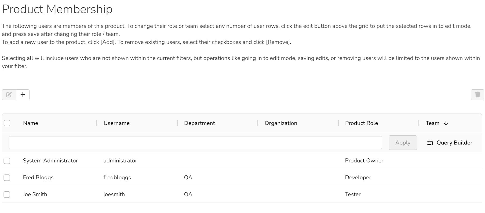
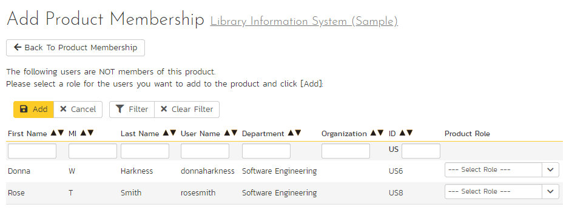

# Product: Users
!!! abstract "Available in SpiraTest, SpiraTeam, SpiraPlan"

## Product Membership
The following page is displayed when you choose the "Product Membership" link from the Administration menu. If you have teams features enabled then the page will be called "Team / Product Membership"

This page displays a row for each member of the current product, with the following columns:

- Name of the user(firstname and lastname)
- Username 
- Department
- Organization
- Product Role
- Team (if enabled)
    {: .edition-spiraplan}
- Email (not shown by default)
- Active (not shown by default)

### Organizing and filtering
By interacting with the header row of the grid you can:

- Move columns around by dragging and dropping them
- Change the sorting of the grid by clicking on a header
- Resize columns by dragging the handle between two columns
- Manage columns by clicking the "hamburger" menu seen when hovering a header: click the grid tab in the popup to choose which columns to show.

Below the header row is the **Query Builder**. You can either type or paste in a plain text search query to the input box (and then click "Apply"), or click the "Query Builder" button to bring up an interactive popup. Using the query builder you can create complex queries that you let filter the list of users to exactly what you need, including by columns not visible. To reset the query, blank out anything in the input box and click "Apply". Note that by default the list is not filtered at all. This means it will show inactive and active users.

### Editing Users
To edit the product or team of users, check the checkbox for all relevant rows (to select all rows in the current filter, check the checkbox in the header row). Then click the Edit button. The selected rows will change to edit mode, with dropdowns for the Product Role and Team fields. Select the correct values for each row. To update all rows being edited to the same value, right click on the cell with the correct new value, and click the menu entry in the context menu called "Paste cell value to rows being edited". Once you are finished editing, click the Save button, or the Cancel button to cancel.

### Removing Users
To remove user from the product, check the relevant checkboxes and click the "Delete" button from the toolbar at the far right. Note that this only removes them from the product, not the entire system. See the [product roles documentation](System-Users.md/#view-edit-product-roles) for more information.

### Add users to a product
To add users to the product, so that they can access its information, click the Plus button. You will now see a list of all active users in the system that are not a member of the current product.

Filter the rows as required then select the rows for users you want to add to the product. Click the Edit (pencil) button from the toolbar to edit the chosen users. For each user select a product role and (if relevant) a team. To update all rows being edited to the same value, right click on the cell with the correct new value, and click the menu entry in the context menu called "Paste cell value to rows being edited". Once you are finished editing, click the Save button, or the Cancel button to cancel.

Note that you cannot add a user with just a team, to be added to the product the user must be given a product role.

## Team Membership
!!! abstract "Available in SpiraPlan only"

Spira lets product admins take teams that have been created at the system level, and assign product members to any active team on a product by product basis. You can use these teams in different ways in different products, but the most common way is to group people together based on your organizational or functional structure.

Team membership is managed by the combined Team and Product Membership page described above.

