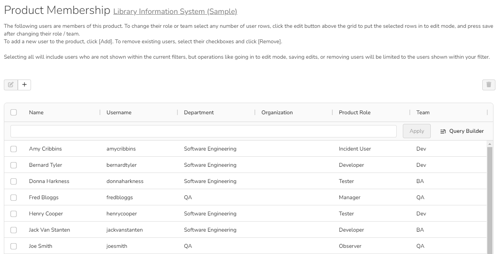
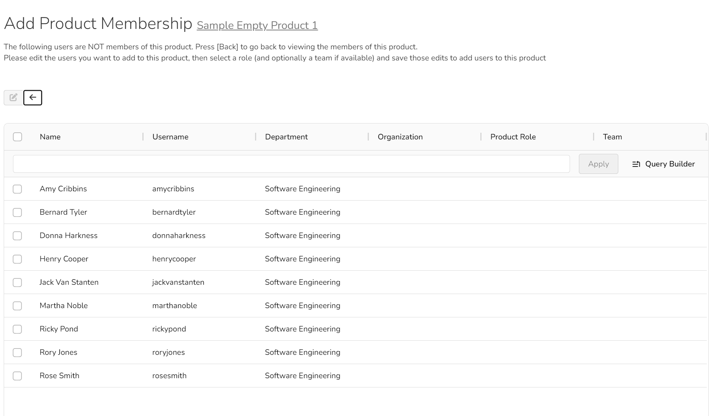

# Product: Users

## Product Membership
XXX

The following page is displayed when you choose the "Product Membership" link from the Administration menu:

This page displays the name of the current product together with a list of all the users who are currently members of the product along with their currently assigned product role. If you want to modify the membership for a different product, click the "Change Product" button to be taken back to View/Edit Products screen where you can select a different product.

To modify the role of a user assigned to the product, change the role for that user's entry in the drop-down menu and click the "Save" button. 

To remove a user from the product, check the box to the left of the user's name and click the "Delete" button. Note that this only removes them from the product, not the entire system. See the [product roles documentation](System-Users.md#view-edit-roles) for more information.

### Add a user to a product
To add a user to the product, so that they can access its information, click the "Add" button and you will be taken to the following screen that lists all the users in the system that are not currently members of the product:

You now should narrow down the list of users by entering filter criteria and clicking \[Filter\]; you can also sort the results to make viewing easier. Once you have located the appropriate user(s), just select a product role for them from the drop-down list and click \[Add\] to add them to the product in the specified role.

## Team Membership
!!! info "In beta, available in SpiraPlan only"
    System admins [can enable](../Spira-Administration-Guide/System.md/#general-settings) beta functionality across the application for their users from the System Admin > General Settings page.

SpiraPlan lets product admins take teams that have been created at the system level, and assign product members to any active team on a product by product basis. You can use these teams in different ways in different products, but the most common way is to group people together based on your organizational or functional structure.

This page displays the name of the current product and a list of all the users who are currently members of the product (sorted alphabetically by full name). For each product member you can see their:

- Full name
- User name
- Department
- Organization
- Team

To change a user's current team, change the selected value in the dropdown. Once all changes to teams are made click "Save" to commit the changes.

Only currently active teams are shown. If a user is not in any team (for this product), or in an inactive or deleted team, their team will show as "-- None --".

