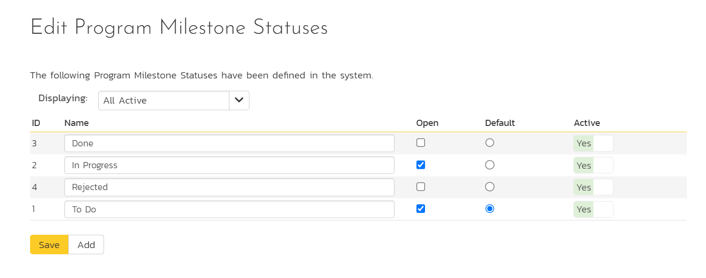
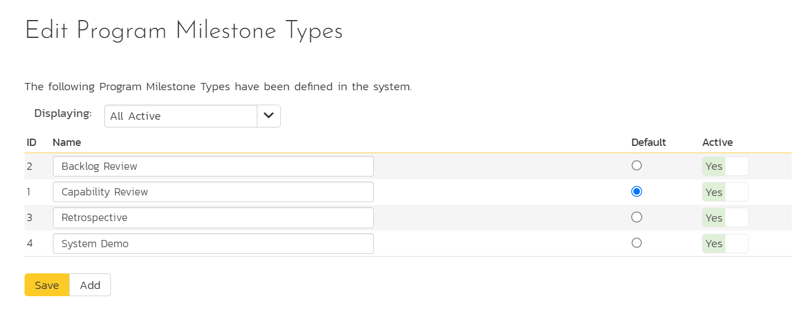

# Program Milestones

!!! info "These features are only available in SpiraPlan"

## Statuses
The following screen is displayed when you choose the "Statuses" link from the Program Milestones section of the system administration menu:

The screen displays a list of all the defined statuses in the system. By default, it displays only the active statuses. Display all statuses (active and inactive) by selecting "All" from the "Displaying" dropdown.

To edit an existing status: change the name, open check-box, set a default status, a position, and/or change the active flag then click "Save". Note that:

- The open flag is used to set whether a program milestone is open or closed
- The position field determines the order of the statuses
- You can't delete an existing status, but to prevent it appearing in the application, change its active flag to "No" and click "Save"
- To add a new status, click the "Add" button and a new row will be added to the list which you can now edit.
- The default radio button allows you to specify which type should be the default for newly created items 
- You must have at least one active status, and you cannot set an inactive status as the default.

## Types
The following screen is displayed when you choose the "Types" link from the Program Milestones section of the system administration menu:

The screen displays a list of all the defined types in the system. By default, it displays only the active types. Display all types (active and inactive) by selecting "All" from the "Displaying" dropdown.

To edit an existing type: change the name, set a default type, and/or change the active flag then click "Save". Note that:

- You can't delete an existing type, but to prevent it appearing in the application, change its active flag to "No" and click "Save"
- To add a new type, click the "Add" button and a new row will be added to the list which you can now edit
- The default radio button allows you to specify which type should be the default for newly created items 
- You must have at least one active type, and you cannot set an inactive type as the default

## Custom properties
Clicking this link from the Program Milestones section of the system administration menu will open the [system custom properties](../System-Custom-Properties) page for program milestones.