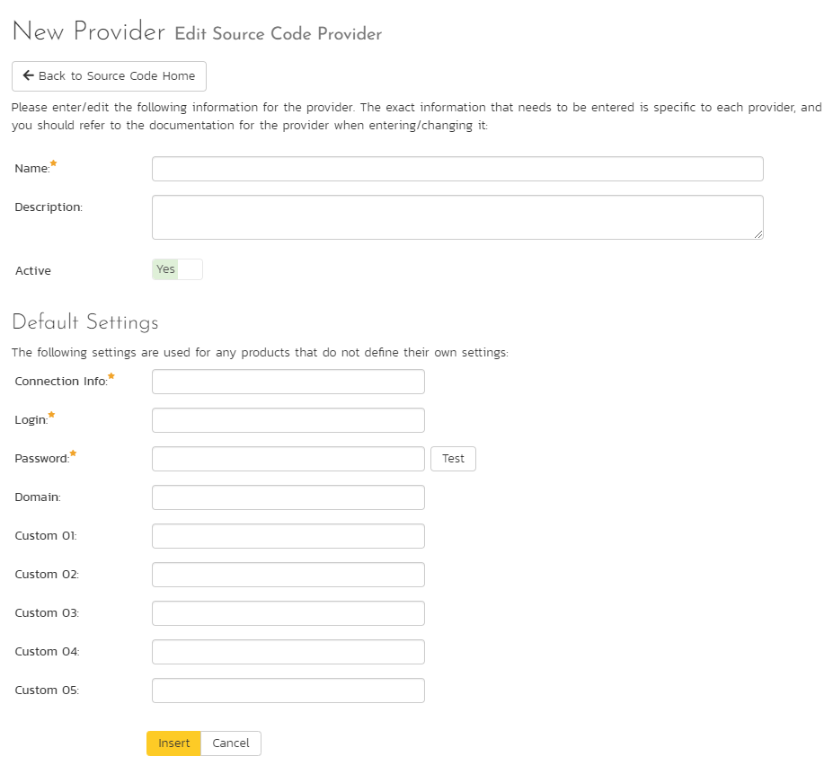
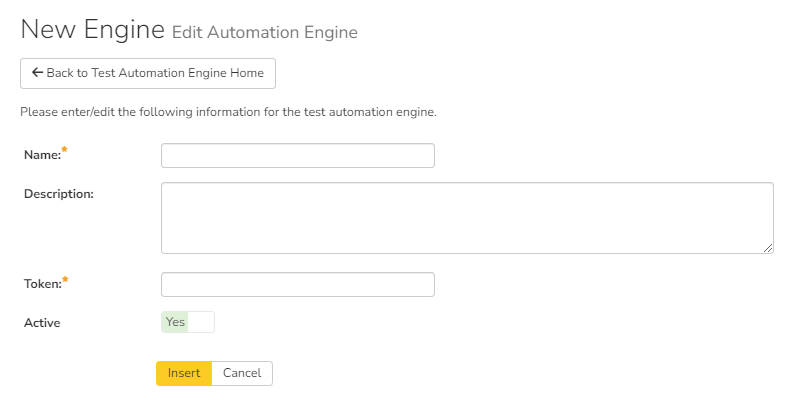

# System: Integration

## Data Synchronization

SpiraPlan® is capable of synchronizing its data with a variety of other
systems, including but not limited to requirements management systems
and standalone bug-tracking tools. The various integration plug-ins for
SpiraPlan® and the steps for configuring the data-synchronization
settings are described in the *SpiraTest External Bug-Tracking
Integration Guide*.

If you are synchronizing data between SpiraPlan® and one of these other
systems, you can click on the 'Data Synchronization' administration page
at any time and view a list of all the data-synchronizations taking
place, together with the status and date/time of last synchronization:

In the example above, we have four plug-ins active, with incidents being
exported into JIRA, Bugzilla, FogBugz and Microsoft Team Foundation
Server. The data of last sync and the status indicate if there are
problems with the plug-in.

The 'Refresh' button allows you to refresh the status of the page to
ensure that you are seeing the most up to date information. In certain
circumstances you may want to reset the date of last sync and force a
particular plug-in to examine all the records in the system to see if
any were not synchronized - clicking on the 'Force Complete Re-Sync'
button will achieve this. The recommended procedure for forcing a
re-sync is to temporarily stop the SpiraPlan Data-Sync background
Windows service, click the button to reset the last-sync date, and then
start the service. This will ensure that the resetting doesn't happen
mid-sync.

## Version Control Integration (On-Premise Customers Only)

*This section refers to the functionality available to on-premise
customers of SpiraPlan. If you are using the cloud / hosted version of
SpiraPlan, please refer to [TaraVault Configuration](../System/#taravault)
instead.*

SpiraPlan® is capable of integrating with a variety of Version Control
(VC) / Software Configuration Management (SCM) tools such as Git,
Subversion, CVS and TFS. This allows you to browse the source code
repositories using the SpiraPlan web interface, and more importantly
link revisions in these tools to artifacts in SpiraPlan. This provides
the end-to-end traceability from code commits/check-ins to the tasks,
incidents and requirements that necessitated the code change.

The information on using the various version control providers for
SpiraPlan® and the steps for configuring the provider-specific settings
are described in the *SpiraPlan/Team Version Control Integration Guide*.

To configure a version control provider, you need to click on the
Administration \> Integration \> Version Control link in the
Administration navigation to bring up the list of configured version
control providers:

By default the only provider listed will be the
TestVersionControlProvider which is used for demonstration purposes
only, and can be deleted from a production system by clicking on the
"Delete" button to the right of it.

To add a new version control provider, click the "Add" button to enter
the Plug-in details page. The fields required are as follows:

-   **Name**: The name of the version control provider that you're
adding. This needs to match the name of the Plug-in DLL file that
you're using (see the *SpiraPlan/Team Version Control Integration
Guide* for more details on your specific tool)

-   **Description**: The description is for your use only, and does not
affect operation of the plug-in.

-   **Active**: If checked, the plug-in is active and able to be used
for any product.

-   **Connection Info**: This field holds the root of the repository for
any product accessing the plug-in, unless overridden in the Product
Settings. Use the syntax that is described for your tool in the
*SpiraPlan/Team Version Control Integration Guide)*

-   **Login / Password**: The user id and the password of the user to
use while accessing and retrieving information from the version
control system.

-   **Other Fields**: The other fields (Domain, Custom1 -- Custom5) are
provider-specific and will be described in the appropriate section
of the *SpiraPlan/Team Version Control Integration Guide.*

When finished, click the "Insert" button and you will be taken back to
the Version Control integration list page, with new provider listed as
an available plug-in:

To edit the settings for an existing version control provider, click on
the "Edit" button next to the name of the provider and you will be able
to edit the same settings that were shown above when you first created
it.

Now, you may want to change some of the settings on a per-product basis.
For example you may have different repositories that you want to link to
each product. You still enter the base settings for the provider as
illustrated above, but then you can override specific settings for each
product.

To do this, click on the "Product Settings" button next to the provider
in question, which will take you to the screen discussed in 3.6.4.
below.

## Test Automation

SpiraPlan® can be used to manage the development, scheduling and
execution of automated unit, functional and load tests written using a
variety of test automation engines (e.g. HP QuickTest Pro, SmarteScript,
TestComplete, etc.). This section allows you to configure the different
engines that are available in your environment so that the testers know
which tools they can use to schedule tests with.

The information on using the various test automation engines for
SpiraPlan® and the steps for configuring the engine-specific settings
are described in the *SpiraTest/Team RemoteLaunch Automated Testing
Integration Guide*.

To configure a test automation engine, you need to click on the
Administration \> Integration \> Test Automation link in the
Administration navigation to bring up the list of configured test
automation engines:

To add a new test automation engine, click the "Add" button to enter the
Automation Engine details page. The fields required are as follows:

-   **Name**: The name of the test automation engine that you're adding.
This can be set to any name of your choice that would make sense to
your users.

-   **Description**: The description is used for any comments or
additional information that you need to use to describe the
automation engine.

-   **Active**: If checked, the automation engine is active and able to
be used in any product.

-   **Token:** This needs to match the name of the Automation Engine DLL
file that you're using (see the *SpiraTest/Team Automated Testing
Integration Guide* for more details on your specific tool) for the
specific automation engine.

When finished, click the "Insert" button and you will be taken back to
the test automation engine list page, with new automation engine listed.

To edit the settings for an existing test automation engine, just click
on the "Edit" link next to the name of the engine and you will be able
to edit the same settings that were shown above when you first created
it.

Once you have made the appropriate changes, click the \[Save\] button to
commit them.

You are now ready to use SpiraPlan® in conjunction with the test
automation engine you added. For details on how to use the test
automation features of SpiraPlan, please refer to the *SpiraPlan® User
Manual*.

