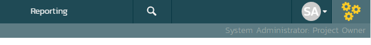

# System Administration
## Introduction
Now that you have successfully installed SpiraPlan®, this section of the guide outlines how to perform the typical administrative tasks necessary for setting up products and programs in the system, managing users and verifying the license information.

## Types of administrator
To perform these tasks, you need to login to the system with a user that has some level of "administration" permissions within the system. There are four different sections to administration, and each has its own permission. These sections and their permissions are:

1.  **System Administration**: tasks like approving new users, creating new products, changing security settings, or viewing the logs all happen at the system-wide level of administration. There is a special "System Administrator" flag that can be assigned to any user (by an existing system admin only). Any user that has this flag can perform any system administrator task. *Please note that a special "administrator" user is created by the installer. You should initially login to SpiraPlan® with the username `administrator`, and the password `PleaseChange`. Change this password as soon as possible to something that is secure yet memorable by clicking on the "User Profile" link.*

2.  **Product Administration:** a product admin can make changes specific to that product and that product only. For instance, they can add or remove users from a product. Once a user is made a product admin, they can perform all the actions in the product administration section. *Each individual product has a defined set of users who are members of that product. Each member is assigned a specific role (many users can share the same role), and a role can be set to be a product admin.* *Please note, that when a system admin creates a product, they are automatically added as "Product Owner*".

3.  **Program Administration:** just like with products, some aspects of a program are managed in the program section of administration. Anyone who is assigned the role of "Program Owner" on a program can perform these administrative functions.

4.  **Template Administration:** end users of the application will work with products and sometimes programs. However, behind the scenes of every product is a template. This template controls the bulk of how that product is configured and will work for the end users. Each product is controlled by one template, though each template can control many products at once. Making a change to a template in template administration will immediately affect all products controlled by that template. Such changes to a template include changing the name of incident types, changing the colors used to indicate requirement priorities, or changing custom properties.
*Please note that template admin permissions are managed by the same roles that manage product admin permissions and that apply to members of each product. You can read more about how template admin permissions work [here](../System-Users/#view-edit-roles).*

5.  **Report Administration:** a report admin can administer custom reports and graphs (create, edit, delete). They can also access custom report data in 3rd party tools via OData and the API. These functions are also available to system admins under System Administration. However report admins can **only** access the reporting functions and pages - they have no access to any other admin functions. There is a special "Report Administrator" flag that can be assigned to any user (by an existing system admin only). Any user that has this flag can perform any report administrator task.

## Administration Menu
Once you have logged in as an administrator, you can click the "Administration" link which can be found on the right-hand side of the global navigation at the top of any page:

This will display the context aware administration menu popup. This menu will show different sections depending on where you are in the application and your administrative privileges. For example, only system administrators see the "System: Admin Home" section shown at the bottom of the screenshot below.

In the screenshot below you can see that administration links are being shown for three different sections:

1.  Library Information System -- which is a product

2.  The template called Sample Template: Agile (this is the template the controls the above product)

3.  System wide administration

This menu only shows the links to one product, one template, or one program at a time (and System Admin all the time to system administrators). Because this user is currently viewing a page in the product 'Library Information System', admin items for that product and its template are visible.

You can see that the "Requirements" sub section is highlighted. This is because the user is currently on a requirements page of the 'Library Information System' product (either in the main application or in template administration). The highlighting serves no function other than to guide the user to where they may wish to focus.

Below is an example of an administration menu where a user is a Program Owner but with no other access to administration. This menu is much barer than the one above, because the administrative options this user has are that much more limited. This user only has admin access to Sample Program One. If they navigate to a different program page or to a product page in the application, they would not see the admin menu at all.

If a user wants to see what, if any, parts of the system they have administrative access to, they can do so at any time. Clicking on the workspace dropdown on the global navigation will show them the list of workspaces they have access to. Below, you can see that products are grouped into programs, and there is a dedicated Templates section at the bottom. Any workspace the user has administrative access to has a superscript gray cog to the right of that workspace's name.

If this user wants to access the admin menu for "Sample Barebones Product", first that cog tells them they can do so. By clicking on that workspace's name, they will be switched to that workspace and then they can click on the admin button to get the right menu.

In the screenshot above at the top there is a "System Administration" workspace. This is visible because this user is a system administrator. Clicking this will take the user directly to the System Administration home page.

The Administration home page, like all admin pages, is divided into two areas:

1.  the skinny left-hand bar. Clicking this will show the context-aware administration menu discussed above

2.  the main pane that displays the available options for the selected page.

This home page shows a number of useful widgets with information about the system. You can edit these widgets, their position, and what is shown, using the two buttons in the top right (the cog and the plus).

Product and Template administration home pages also show useful data and links relevant to them. On most admin pages for products and templates the name of the current product or template is shown at the top of the page in a heading. These names are hyperlinks that will open the product or template administration home page.

When you first install the system, we suggest **three main tasks** to perform as the system administrator to get familiar with the basics and to help colleagues start to use the application:

1.  [Create a new product](System-Workspaces.md#viewedit-products)
2.  [Create the users that will be accessing the system](System-Users.md#view-edit-users)
3.  [Add users as members to a product](Product-Users.md)

These tasks typically need to be performed before any other users can use the system, since there will be no logins or products available other than the sample ones provided during the installation.

Below is the admin menu for a user who is a report administrator but has no other active admin roles. The only menu options available are for custom reports and graphs.

The rest of this guide explores each area of administration in order, grouped by administration section.

## How user permissions are set
As described above there are 4 different types of administrator. There are also different permission models for accessing the application itself (ie not the administration pages). How do you set each of these permissions so that a user can only see / use what they are supposed to?

- **We start with a user**: without a user, your colleague can not even log in to the application
- **Then add a user to a product**: a brand new user cannot do anything or see anything in the application. The most common way of granting a user access to the system is to add them as a member to specific products
- **Give the user the correct role for a product**: when you add a user to a product, you have to set the specific product role they should have. This grants them specific permissions to view certain data, edit other data, maybe the ability to delete some data too. Each user has to be actively given a particular role for each product. In other words, you cannot make a user a member of a product without giving them a specific role. Likewise, you cannot make a user a "Tester" for any products they are or will be a member of. Multiple users can be assigned the same product role.

Product roles have two special flags. Changing these flags immediately affect anyone with that particular role:

- **Any product role can grant the user product administrator access**. One of the special product role flags is product administrator. Any person with a role that has product administrator set to "Yes" can carry out all administrative tasks on that product.
- **Any role that grants product ownership access can also grant template admin access**. The second special flag on a product role is that of Template Admin. If a role grants product administrator access it can optionally also grant template admin access.

Permissions for programs are more simple and managed on a per program basis:

- **Access to view / edit a program**: to view a program dashboard or its pages, a user has to have access, with a particular role, to that specific program. Program roles are either Executive or Owner. Program Owners can carry out any administration tasks on the program. NOTE: a user with a program role is given view-only permissions to all products within that program. This view-only access is superceded by any specific product roles they have on the individual products themselves.

Each user profile has two special flags about permissions, which affect the entire system, but only for one user at a time (they are completely separate to product and program permissions):

- **Users can be granted portfolio viewer access (SpiraPlan only)**: The first special flag on the user profile is Portfolio Viewer access. This allows a user access to all portfolio pages and enterprise pages in the application. In other words, you do not control which portfolio a user can see, but only if they can access all portfolios or none of them. Only a system administrator can set this on a user.
- **Users can be granted system administrator status**: this is the second special flag on a user profile and makes the user a system administrator. Only a system administrator can set this on a user.

!!! info "System administrators and product roles"
    Note: if a user is a System Administrator, it will force that user to always have the 'Product Owner' role on all their assigned products, regardless of the chosen role. If you disable this option, they will then revert back to their true role.*