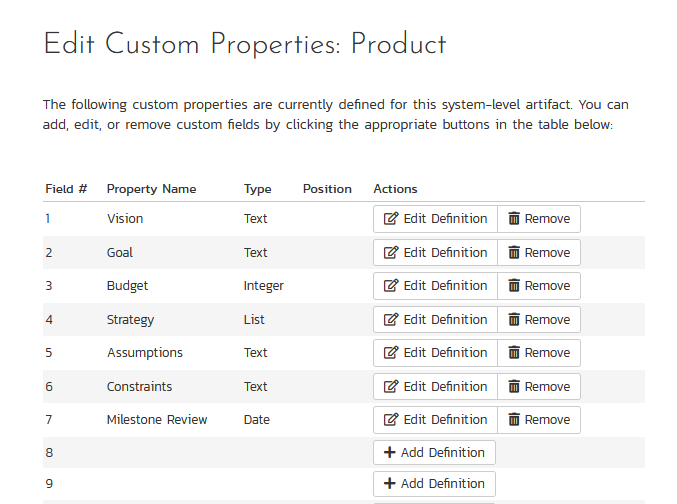
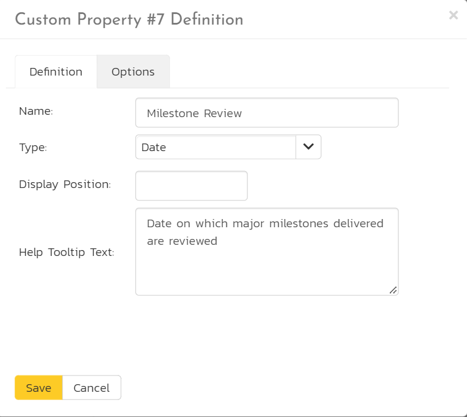
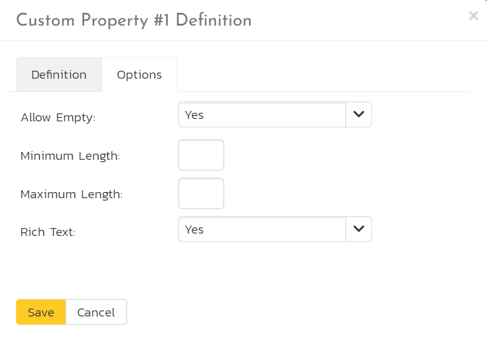
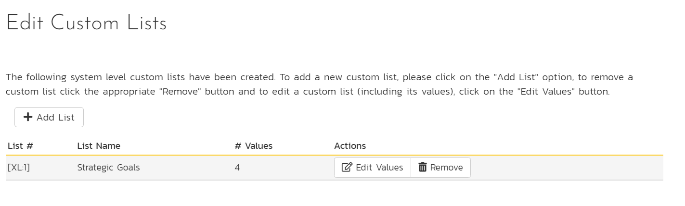
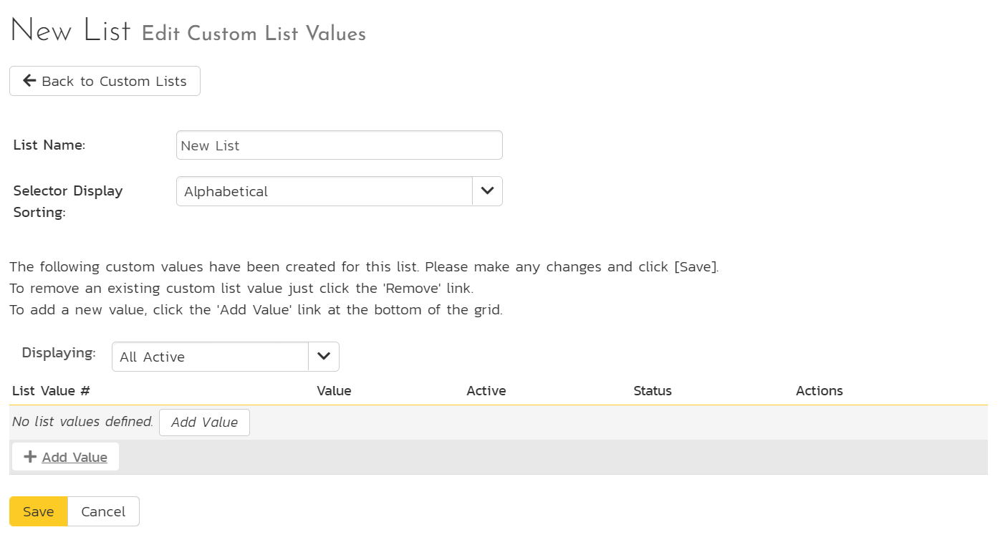
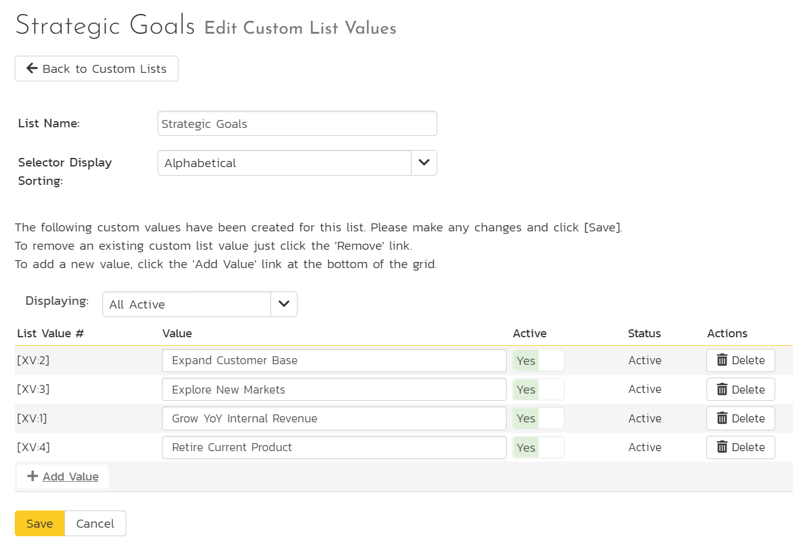

# System Custom Properties

!!! info "These features are only available in SpiraPlan"

SpiraPlan allows you to customize the product workspace by adding up to 30 system-level custom properties in addition to the built-in fields. Product custom properties are shared across every product in the system. The properties are visible in the following places:

- **Product list page** available when viewing a program: you can choose to show or hide them the same as standard fields
- **Product details page**: each custom property is shown in the section on the page with other fields of that type - all rich text fields are shown together, all date fields together etc. In each section, custom properties are shown after standard fields. By default, custom properties are ordered based off of their number (the row number they are at on the custom property admin page), but you can change this by setting the properties' display positions (see below). Custom properties with position numbers are shown after those that do not. All custom properties with position numbers are shown in the order of their position numbers.
- **Custom Reports**

You can create a variety of different types of custom properties. You can create as many custom lists as you need with each having as many values as you need. Custom lists are shared at the system level and available for any product custom property to use. This page describes how to setup different custom lists and custom properties for products.

## Edit Custom Properties
To access the product custom properties definitions, you must be a system administrator. Open the system admin menu and click the "Product Defintions" link from the "Custom Properties" sub-section. This opens the product custom properties page where you can quickly see the name, field number, type, and actions (edit and delete) for each custom property.

In the example below we see 7 custom properties defined. The custom properties page has rows for each available custom property.

To edit an existing custom property definition click the "Edit Definition" button for that specific property. To add a new definition click the "Add Definition" button. In either case the following dialog will be displayed:

For each custom property you set the following fields on the main definition tab:

- **Name:** the name of the custom property as it will be displayed to users
- **Type:** select one of the available types (defaults to text)
- **Display Position:** a unique number between 1 and 30 to help in sorting custom properties on the details page (optional)
- **Help Tooltip Text:** this extra information is shown on the details pages to help users understand what the custom property should be used for (optional - up to 512 characters)
- **Custom List**: the defined Custom List that the property uses (visible for lists and multi-lists only, where it is required)

Different types of custom properties supported:

- **Text**: normal or rich-text
- **Integer**: whole numbers
- **Decimal**: decimal numbers
- **Boolean**: simple yes/no (on/off) checkbox
- **Date**: date selector
- **Date & Time**: date and time selector
- **List**: custom list selector
- **Multi-List**: custom list selector that allows multiple values to be selected at the same time
- **Password**: for storing sensitive information. This data is securely encrypted at rest and the actual value can only be viewed or changed on the details page. Passwords cannot be seen on list pages or in reports. 

Each custom property can have optional settings applied to it to further control the custom property. Note: not all settings are available for all property types. These settings are on the Options tab of the dialog:

- **Allow Empty**: whether or not an empty value is allowed
- **Precision**: how many decimal places to allow (decimals only)
- **Minimum Value**: the minimum value allowed (numbers only)
- **Maximum Value**: the maximum value allowed (numbers only)
- **Minimum Length**: the minimum length of the data required in the field (text only)
- **Maximum Length**: the maximum length of the data allowed in the field (text only)
- **Rich Text**: whether or not the text field is an HTML / rich text field or not (text only)

When finished, click the `Save` button.

!!! danger "Renaming or Removing Custom Properties"
    When changing a custom property's type or removing a custom property, the data is not actually removed from the product. Therefore, if you change a custom property from a date type to a text custom property, the field may display the old date value until it is changed by the user.

## Edit Custom Lists
If you are planning on having any list based custom properties at the system level, you need to create and populate the system custom lists that the user will be able to select from. These lists are stored separately from the individual product custom property definitions so that you can have one set of values (e.g. list of operating systems under test) be reused by multiple custom properties.

The following screen is displayed when you choose the "Custom Lists" link from the Administration menu:

The screen displays all the system level custom lists currently defined, together with the number of values associated with each list. By default the screen will initially be empty so the first thing you need to do is click "Add List" to create a new custom list:

After changing the name of the list, and specifying whether the values will be ordered by their name or the order in which they were entered (called by ID), you can either click "Save" to commit the change, or click the "Add Value" option to add some list values:

This is the set of values that the user will select from the drop-down list when the custom property is displayed. You can change the display to include:

-   **All Active** -- displays only custom list values that are active
-   **All But Deleted** -- displays all custom list values that are active or inactive but have not been deleted
-   **All** -- displays all custom list values, including those that have been deleted

To add a new custom list value, click the "Add Value" button and a new row will be added to the list which you can now edit. To edit an existing custom list value, change the name in the textbox and click "Save". To delete a custom list value, click on the "Delete" hyperlink. If you want to remove an item from the list temporarily, you can set its Active dropdown list to 'No', if you want to remove an item permanently, just click the 'Delete' button.

To edit an existing custom list, click the "Edit Values" button to display the custom list name and list of associated values (which is the same screen as the one displayed for a new list). To remove a custom list from the template, just click on the "Remove" button next to the custom list and the list and all its associated values will be deleted from the template.

!!! info "Recovering deleted list values"
    If you delete a custom list value, there is an option to undelete by changing the display selection to "All" and clicking the 'Undelete' button next to a deleted value.