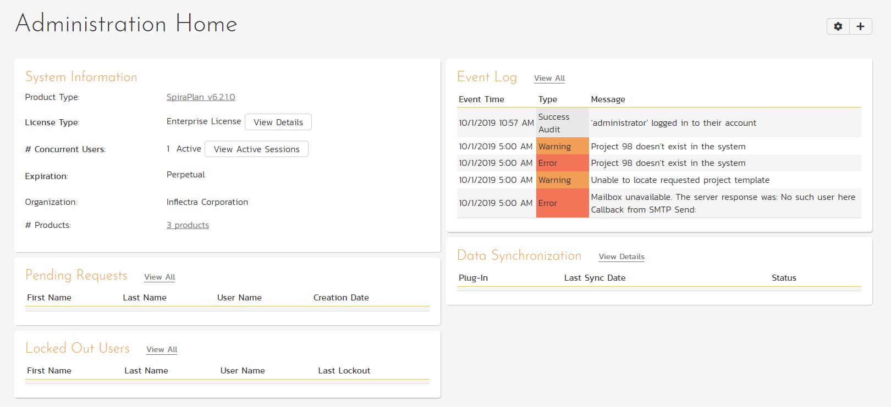

# System: Home Page
The System Administration Home page is only accessible to users with the special "System Administrator" flag on their profile. There are multiple ways to navigate to it: 

- Click the "Administration" link in the upper right. This will display the context aware administration menu popup. Then click on the "System: Admin Home" section heading.
- In the main workspace dropdown, select “System Administration”.

It provides system administrators with quick access to important information.

As with other dashboards, you can edit these widgets, their position, and what is shown, using the two buttons in the top right (the cog and the plus).

## System Information
The system information widget displays an overview of your Spira instance, including license information and the number of currently-active users, as well as links to detailed information.

### Delete Sample Data
On fresh installations that include the sample data that ships with the application there is a button on this widget to delete this sample data. This can be helpful if want to start with a clean slate following a trial and not have the sample data cluttering your system. 

If you click the "Delete" button, a popup will show a warning. If you decide to proceed the system will attempt to delete all sample data, including users, products, artifact information, programs, and portfolios. This method will not delete:

- the default program
- the root administrator (with username "adminstrator" and an ID of "1")
- any sample user, product, program, or portfolio whose name has been changed 
- any sample user who has been used to create, comment or has been assigned any artifacts in non-sample data products

!!! tip 
    If you do not users to see the sample data but also do not want to delete it all you, there is a way. You can make all sample portfolios (SpiraPlan only), programs, products, and users inactive. These inactive items will still be visible on the relevant administration pages, but not in the main application. 

## Event Log
This widget shows the latest events from the system event log. By default, 5 events are shown, but this number can be changed. To view the complete event log, click View All.

## Pending User Requests
If you have enabled the ability for users to register for new SpiraPlan accounts themselves, any pending requests will be listed here. To accept or deny the requests, click View All. By default the list is limited to 5. This number can be adjusted.

## Data Synchronization
This widget shows a list of active data-synchronization services, together with the status and date/time of the last synchronization.
