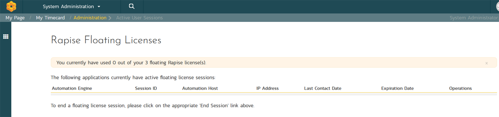

# System: Integration

## Data Synchronization

SpiraPlan® is capable of synchronizing its data with a variety of other systems, including but not limited to requirements management systems and standalone bug-tracking tools. The various integration plug-ins for SpiraPlan® and the steps for configuring the data-synchronization settings are described in the *[SpiraTest External Bug-Tracking Integration Guide](../External-Bug-Tracking-Integration/Setting-up-Data-Synchronization.md)*. Each individual tool has its own separate guide that builds on this setup guide.

If you are synchronizing data between SpiraPlan and one of these other systems, the 'Data Synchronization' administration page will show a list of available data-synchronizations services:

In the example above, we have six plug-ins available, with only Azure DevOps (ADO) active. For ADO, the data sync is active for a single product: Library Information System (Sample).

This table shows the following information about each data sync plug-in:

- icon and name
- a dropdown list of active products. Products with an empty hexagon icon do not use this data sync, and products with a full hexagon icon actively use this data sync. Select a product and click the arrow to its right to go to the detailed [product data synchronization page](Product-General-Settings.md#data-synchronization) for that plugin and product
- the data and time of the last data sync
- whether the data sync is active (system wide)
- the status (N/A, Not Run, Error, or Success)
- operations you can perform on each data sync. 
    
    - Reset sync. You should not routinely use the **Reset Sync**. This resets the date of last sync for that plug-in. This forces the plug-in to re-examine all records in the system to see if any were not synchronized - this can take a long time. The recommended procedure for forcing a re-sync is to temporarily stop the SpiraPlan Data-Sync background Windows service, click the button to reset the last-sync date, and then start the service. This will ensure that the resetting doesn't happen mid-sync.
    - Edit: this will open the data sync plug-in settings page. For many plug-ins this settings page will guide you in how to set up that specific data sync. Each data sync plug-in has detailed documentation about how to set it up (see the Integrations > Bug Tracking/DataSync section of the main SpiraDoc menu)
    - Delete
    - View data sync errors in the event log, 

Above the table you can add a new data sync or refresh the status of the page to ensure that you are seeing the most up to date information. 

## Source Code Integration

*This section refers to the functionality available to on-premise customers of SpiraPlan or those customers that have disabled TaraVault. If you are using the cloud / hosted version of SpiraPlan and have not disabled TaraVault, please refer to [TaraVault Configuration](../System/#taravault) instead.*

SpiraPlan® is capable of integrating with a variety of source code / Software Configuration Management (SCM) tools such as Git, Subversion, CVS and TFS. This allows you to browse the source code repositories using the SpiraPlan web interface, and more importantly link commits in these tools to artifacts in SpiraPlan. This provides the end-to-end traceability from code commits/check-ins to the tasks, incidents and requirements that necessitated the code change.

The information on using the various source code providers for SpiraPlan® and the steps for configuring the provider-specific settings are described elsewhere - for example for [Git](../../Version-Control-Integration/Integrating-with-Git/).

To configure a source code provider, you need to click on the System Administration \> Integration \> Source Code link in the Administration navigation to bring up the list of configured source code providers:

By default the only provider listed will be the TestVersionControlProvider which is used for demonstration purposes only, and can be deleted from a production system by clicking on the "Delete" button to the right of it.

To edit the system wide settings for an existing source code provider, click on the "Edit" button on the far right of the row for that provider. You can edit the same settings that were shown above when you first created that provider.

If you want to change the settings for a particular product (including to turn that provider on or off for the product):

- make sure the product dropdown in that row has the correct product selected (the dropdown shows products that are either already using that provider, or that have no source code provider at all)
- click the arrow to the right of the product name to manage [that provider for that Product](../Product-General-Settings/#source-code).

To add a new source code provider, click the "Add" button at the bottom to go to the Plug-in details page:

-   **Name**: The name of the source code provider that you're adding. This needs to match the name of the Plug-in DLL file that you're using (see the specific page for that provider in this documentation - eg [Git](../../Version-Control-Integration/Integrating-with-Git/)).
-   **Description**: The description is for your use only, and does not affect operation of the plug-in.
-   **Active**: If checked, the plug-in is active and able to be used for any product.
-   **Connection Info**: This field holds the root of the repository for any product accessing the plug-in, unless overridden in the Product Settings. Use the syntax that is described for your tool on the relevant docs page for that provider. 
-   **Login / Password**: The user id and the password of the user to use while accessing and retrieving information from the source code system.
-   **Other Fields**: The other fields (Domain, Custom1 -- Custom5) are provider-specific and will be described on the relevant docs page for that provider.

When finished, click the "Insert" button and you will be taken back to the Source Code integration list page, with new provider listed as an available plug-in:

## Test Automation

SpiraPlan® can be used to manage the development, scheduling and execution of automated unit, functional and load tests written using a variety of test automation engines (e.g. HP QuickTest Pro, SmarteScript, TestComplete, etc.). This section allows you to configure the different engines that are available in your environment so that the testers know which tools they can use to schedule tests with.

The information on using the various test automation engines for SpiraPlan® and the steps for configuring the engine-specific settings are described in the *SpiraTest/Team RemoteLaunch Automated Testing Integration Guide*.

To configure a test automation engine, you need to click on the Administration \> Integration \> Test Automation link in the Administration navigation to bring up the list of configured test automation engines:

To add a new test automation engine, click the "Add" button to enter the Automation Engine details page. The fields required are as follows:

-   **Name**: The name of the test automation engine that you're adding. This can be set to any name of your choice that would make sense to your users.

-   **Description**: The description is used for any comments or additional information that you need to use to describe the automation engine.

-   **Active**: If checked, the automation engine is active and able to be used in any product.

-   **Token:** This needs to match the name of the Automation Engine DLL file that you're using (see the *SpiraTest/Team Automated Testing Integration Guide* for more details on your specific tool) for the specific automation engine.

When finished, click the "Insert" button and you will be taken back to the test automation engine list page, with new automation engine listed.

To edit the settings for an existing test automation engine, just click on the "Edit" link next to the name of the engine and you will be able to edit the same settings that were shown above when you first created it.

Once you have made the appropriate changes, click the \[Save\] button to commit them.

You are now ready to use SpiraPlan® in conjunction with the test automation engine you added. For details on how to use the test automation features of SpiraPlan, please refer to the *SpiraPlan® User Manual*.

## Floating Licenses
Cloud users of SpiraPlan who have a floating license subscription addon to your SpiraPlan will see a "Floating Licenses" section in the Integrations section of the system administration menu. For example, if you have [Rapise](https://www.inflectra.com/Rapise/) floating licenses, you will see this menu item and page.

Read more about how to purchase and use [Rapise floating licenses](https://rapisedoc.inflectra.com/Manuals/Rapise_Installation_Guide/#floating-license).

When you go to the Floating Licenses page you will see how many floating licenses are available as well as how many are currently in use (initially the list will be empty):

Once you have floating licenses available, when you connect, for example, Rapise to Spira, Rapise automatically requests a floating license from Spira. The application will use that license until Rapise is closed or a SpiraPlan administrator clicks the End Session button in SpiraPlan.

The floating licenses page will show how many licenses are available and information about each currently active session. A system admin can end a session at any time by clicking the "End Session" button on a specific session.

