# System: Reporting

SpiraPlan has a powerful set of reports and charts available out of the
box that cover most product's needs. However, there is often a need to
be able to generate custom reports and graphs that are specific to your
organization. In this section, you can create custom graphs and reports
for your users to use.

## Edit Reports

The "Edit Reports" administration page lets you create custom reports in
the system that your users can run in the various products they have
access to. Note that the report definitions themselves are global to the
system and therefore available in all products.


The list of report definitions contains both the standard (default)
reports that ship with the system and any custom reports that you have
defined. However, any of the reports listed with the "Default" option
checked will not be editable. So, if you want to modify one of the
built-in reports to make it better suit your needs, you should instead
click on the "Clone" button next to the report and make a copy of the
report that you can then modify. You can view any of the default reports
by clicking on the associated "View" button.

To edit an existing non-default report, click on the "Edit" button. To
add a new report from scratch, click on the "Add New Report" option at
the bottom of the list. Either of these will take you to the Report
editing screen:

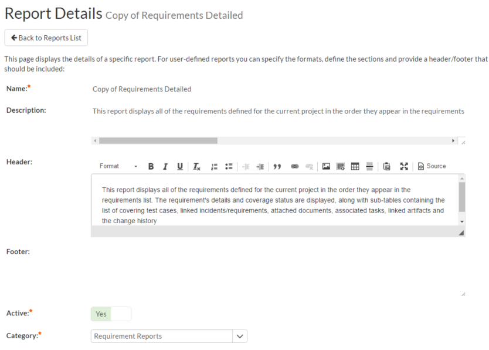


The top-half of this screen (illustrated above) lets you specify the
name of the report, the long description (displayed in tooltips but not
in the report itself) and a rich-text footer and header. The header and
footer will be displayed at the top and bottom of the generated report.

In addition, you can specify whether the report is active (and therefore
can be used in the SpiraPlan reports center) and which report category
heading the report will appear in. This is also used to determine which
role(s) are able to run the report (e.g. a user that has permissions to
view requirements will be able to run all reports listed under the
"Requirement Reports" category).

The lower-half of the screen displays the list of formats, standard
sections and custom sections that make up the report:


The list of formats is fixed in the system, you can simply choose which
formats this specific report will be available in. The reporting engine
will take care of converting your report into the target format, you
just need to specify which type(s) are applicable.

a) Standard Sections

The list of **standard sections** contains a list of the various
pre-defined report sections that are to be included in the report. A
standard section consists of a set of nested queries and embedded
elements that will return back data. For example, the "Requirements
Details" section consists of a list of all the requirements in a
product, together with the associated test cases, tasks, custom
properties, attachments, discussions, change history, source code
commits, and other related items.

With a standard section, you cannot change the underlying data query,
but you can change the header, footer and XSLT template used to format
the results:

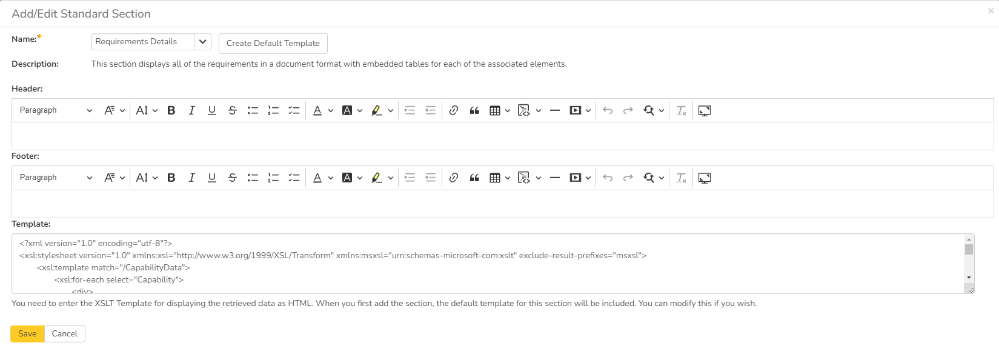


When you either click on "Add New Standard Section" or the "Customize"
link next to an existing standard section, the popup dialog illustrated
above will be displayed. On this page you can change the following
fields:

-   **Name --** Choose the name of the standard report section you want
to use from the dropdown list. Changing the name of the section will
automatically update the Description field below.

-   **Description** -- This is the description of the report section, it
is not displayed in the final report.

-   **Header** -- This is the header that will be displayed *before* the
dynamic data retrieved as part of the report section. You can enter
in formatted rich text in this field.

-   **Footer** -- This is the footer that will be displayed *after* the
dynamic data retrieved as part of the report section. You can enter
in formatted rich text in this field.

-   **Template** -- This is the eXtensible Markup Language Stylesheet
Transform (XSLT) used to transform the raw XML data from the report
query into the final HTML display format. When you choose/change the
name dropdown list, clicking on the "Create Default Template" will
populate this field with the default template used to render the
data.

When you first create a new standard report section, we recommend using
the option to "Create Default Template". This will then allow you to run
the report in the main reports center and have all the available data
fields displayed in the standard format. If you would like to customize
the content of the section, you have several options:

-   **Customize Header/Footer** -- if you want to keep the data and
layout as-is, you can simply add a custom header and footer to add
organization specific information into the report.

-   **Customize the Data/Layout** -- if you want to customize how the
data is displayed and formatted, you will need to edit the XSLT
Template. You can learn more about XSLT at the W3Schools website
(<http://www.w3schools.com/xsl>). However, the recommended approach
is to first run the "Raw XML" format report from the main SpiraPlan
reports center. An example XML report is partially shown below:

```xml
“?xml version="1.0" encoding="UTF-8" standalone="yes"?”
“Report”
  “Title”
    Requirements Detailed Report
  “/Title”
  “ProductData”
    “Product”
      “ProjectId”1”/ProjectId”
      “ProjectGroupId”2”/ProjectGroupId”
      “Name”Library Information System”/Name”
      “Description”Sample application that allows users to manage books, authors and lending records for a typical branch library”/Description”
      “Website”www.libraryinformationsystem.org”/Website”
      “CreationDate”2005-11-30T19:00:00”/CreationDate”
      “ActiveYn”Y”/ActiveYn”
      “WorkingHours”8”/WorkingHours”
      “WorkingDays”5”/WorkingDays”
      “NonWorkingHours”0”/NonWorkingHours”
      “TimeTrackIncidentsYn”Y”/TimeTrackIncidentsYn”
      “TimeTrackTasksYn”Y”/TimeTrackTasksYn”
      “EffortIncidentsYn”Y”/EffortIncidentsYn”
      “EffortTasksYn”Y”/EffortTasksYn”
      “TasksAutoCreateYn”Y”/TasksAutoCreateYn”
      “ReqDefaultEffort”480”/ReqDefaultEffort”
      “TaskDefaultEffort”360”/TaskDefaultEffort”
      “ProductGroupName”Internal Products”/ProductGroupName”
    “/Product”
  “/ProductData”
  “RequirementData”
    “Requirement”
      “RequirementId”1”/RequirementId”
      “ProjectId”1”/ProjectId”
      “ScopeLevelId”3”/ScopeLevelId”
      “AuthorId”2”/AuthorId”
      “Name”Functional System Requirements”/Name”
      “CreationDate”2003-11-30T19:00:00”/CreationDate”
      “LastUpdateDate”2003-11-30T19:00:00”/LastUpdateDate”
      “IndentLevel”AAA”/IndentLevel”
      “ExpandedYn”Y”/ExpandedYn”
      “VisibleYn”Y”/VisibleYn”
      “SummaryYn”Y”/SummaryYn”
      “AttachmentsYn”N”/AttachmentsYn”
      “CoverageCountTotal”21”/CoverageCountTotal”
      “CoverageCountPassed”10”/CoverageCountPassed”
      “CoverageCountFailed”3”/CoverageCountFailed”
      “CoverageCountCaution”1”/CoverageCountCaution”
      “CoverageCountBlocked”1”/CoverageCountBlocked”
      “PlannedEffort”8700”/PlannedEffort”
      “TaskEstimatedEffort”11400”/TaskEstimatedEffort”
      “TaskActualEffort”7570”/TaskActualEffort”
      “TaskProjectedEffort”3855”/TaskProjectedEffort”
      “TaskRemainingEffort”11485”/TaskRemainingEffort”
      “TaskCount”42”/TaskCount”
      “TaskPercentOnTime”59”/TaskPercentOnTime”
      “TaskPercentLateFinish”6”/TaskPercentLateFinish”
      “TaskPercentNotStart”7”/TaskPercentNotStart”
      “TaskPercentLateStart”28”/TaskPercentLateStart”
      “ScopeLevelName”In Progress”/ScopeLevelName”
      “AuthorName”Fred Bloggs”/AuthorName”
      “HasDiscussionChanged”false”/HasDiscussionChanged”
      “IsDeleted”false”/IsDeleted”
      “CustomProperties”
        “CustomProperty”
          “Alias”URL”/Alias”
          “Name”Custom_01”/Name”
          “Type”Text”/Type”
        “/CustomProperty”
        “CustomProperty”
          “Alias”Difficulty”/Alias”
          “Name”Custom_02”/Name”
          “Type”List”/Type”
        “/CustomProperty”
        “CustomProperty”
          “Alias”Requirement Type”/Alias”
          “Name”Custom_03”/Name”
          “Type”List”/Type”
        “/CustomProperty”
        “CustomProperty”
          “Alias”Notes”/Alias”
          “Name”Custom_04”/Name”
          “Type”Text”/Type”
        “/CustomProperty”
        “CustomProperty”
          “Alias”Review Date”/Alias”
          “Name”Custom_05”/Name”
          “Type”Date”/Type”
        “/CustomProperty”
        “CustomProperty”
          “Alias”Decimal”/Alias”
          “Name”Custom_06”/Name”
          “Type”Decimal”/Type”
        “/CustomProperty”
      “/CustomProperties”
      “Discussions /”
      “TestCases /”
      “Tasks /”
      “Attachments /”
      “History”
        “HistoryChangeSetType”
          “ChangeTypeId”1”/ChangeTypeId”
          “ChangeTypeName”Modified”/ChangeTypeName”
        “/HistoryChangeSetType”
        “HistoryChangeSetType”
          “ChangeTypeId”2”/ChangeTypeId”
          “ChangeTypeName”Deleted”/ChangeTypeName”
        “/HistoryChangeSetType”
        “HistoryChangeSetType”
          “ChangeTypeId”3”/ChangeTypeId”
          “ChangeTypeName”Added”/ChangeTypeName”
        “/HistoryChangeSetType”
        “HistoryChangeSetType”
          “ChangeTypeId”4”/ChangeTypeId”
          “ChangeTypeName”Purged”/ChangeTypeName”
        “/HistoryChangeSetType”
        “HistoryChangeSetType”
          “ChangeTypeId”5”/ChangeTypeId”
          “ChangeTypeName”Rollback”/ChangeTypeName”
        “/HistoryChangeSetType”
        “HistoryChangeSetType”
          “ChangeTypeId”6”/ChangeTypeId”
          “ChangeTypeName”Undelete”/ChangeTypeName”
        “/HistoryChangeSetType”
        “HistoryChangeSetType”
          “ChangeTypeId”7”/ChangeTypeId”
          “ChangeTypeName”Imported”/ChangeTypeName”
        “/HistoryChangeSetType”
        “HistoryChangeSetType”
          “ChangeTypeId”8”/ChangeTypeId”
          “ChangeTypeName”Exported”/ChangeTypeName”
        “/HistoryChangeSetType”
      “/History”
      “Requirements /”
      “Incidents /”
      “SourceCodeRevisions /”
    “/Requirement”
  “/RequirementData”
“/Report”
```

This XML data is then converted by the XSLT template into HTML format so
that it can be included into the final generated report. An example
fragment of the XSLT template looks like:

```xml
“?xml version="1.0" encoding="utf-8"?”
“xsl:stylesheet version="1.0" xmlns:xsl="http://www.w3.org/1999/XSL/Transform" xmlns:msxsl="urn:schemas-microsoft-com:xslt" exclude-result-prefixes="msxsl"“
  “xsl:template match="/RequirementData"“
    “xsl:for-each select="Requirement"“
      “div”
        “xsl:attribute name="style"“
          padding-left: “xsl:value-of select="string-length(IndentLevel)*2"/”px;
        “/xsl:attribute”
        “xsl:if test="SummaryYn='Y'"“
          “div class="Title2"“
            RQ:”xsl:value-of select="RequirementId"/” - “xsl:value-of select="Name"/”
          “/div”
          “div class="Description"“
            “xsl:value-of select="Description" disable-output-escaping="yes"/”
          “/div”
          “br /”
        “/xsl:if”
        “xsl:if test="SummaryYn='N'"“
          “xsl:attribute name="style"“
            padding-left: “xsl:value-of select="string-length(IndentLevel)*2"/”px;
          “/xsl:attribute”
          “div class="Title3"“
            RQ:”xsl:value-of select="RequirementId"/” - “xsl:value-of select="Name"/”
          “/div”
          “p”
            “xsl:value-of select="Description" disable-output-escaping="yes"/”
          “/p”
        “/xsl:if”
      “/div”
    “/xsl:for-each”
  “/xsl:template”
```

So using a combination of XSLT and the Raw XML report format, you can
generate a customized view of the standard report section that will be
included in the final report.

Sometimes, however you want to be able to create a completely custom
report that includes customized data as well as a custom format. In
which case you need to use a **custom report section** instead.

b) Custom Section

Back on the main report details page, if you click on "Add New Custom
Section", the following dialog box will be displayed:

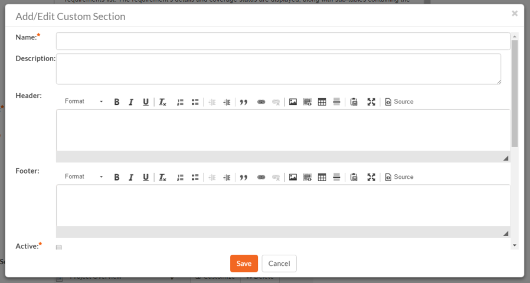


On this page you can enter / change the following fields:

-   **Name --** Enter the name of the new custom report section that you
will be adding to the report. This is not displayed in the final
report

-   **Description** -- This is the description of the custom section, it
is not displayed in the final report.

-   **Header** -- This is the header that will be displayed *before* the
dynamic data retrieved as part of the report section. You can enter
in formatted rich text in this field.

-   **Footer** -- This is the footer that will be displayed *after* the
dynamic data retrieved as part of the report section. You can enter
in formatted rich text in this field.

-   **Active** -- You should make sure this checkbox is checked if you
want the custom section to appear in the final report.

Further down on the page you can actually enter the custom query and
associated XSLT template:

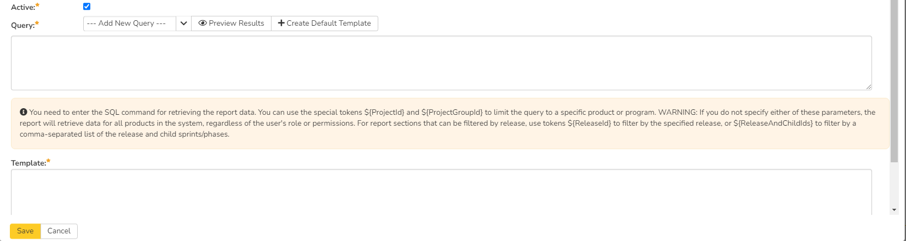


On this page you need to first choose the appropriate **reportable
entity** from the dropdown list. In the example illustrated above, we
have selected the "Requirements" reportable entity. This will
automatically populate the following query in the **Query** editor:

select value R from SpiraTestEntities.R\_Requirements as R where
R.PROJECT\_ID = ${ProjectId}

This query tells SpiraPlan to select all of the rows in the
R\_Requirements collection that are in the current product and include
all of the columns in the final report. This generally will result in
more columns than is desirable, so you should click on the "Preview
Results" option to view a list of the various columns and the sample
data. That will help you decide which columns are important for your
report. You can then adjust the query to only include those columns:

select R.REQUIREMENT\_ID, R.NAME from SpiraTestEntities.R\_Requirements
as R where R.PROJECT\_ID = ${ProjectId}

In this modified query, we have replaced the keyword **value** with the
specific column names. When you use the "Preview Results" option on this
query, you will only see the two desired columns:

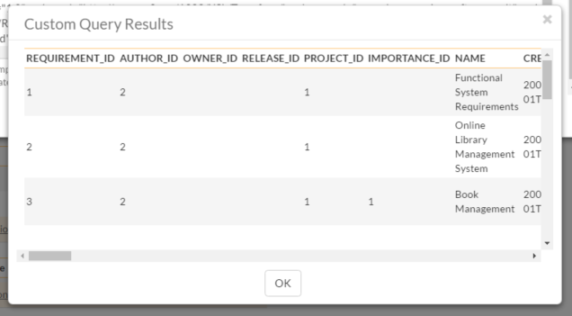


Once you have verified that the data being returned matches your
requirements, click on the "Create Default Template" option and
SpiraPlan will automatically generate a new XSLT template that displays
just these columns in a nice table format:


You can now click the \[Save\] button to save your changes to the
report.

You may have noticed that we had a special token in the query
**${ProjectId}**, this token will be evaluated during the generation of
the report and ensures that only items in the current product are
included. If you want to include all the items in a specific Program,
you should instead use the token **${ProjectGroupId}**. If you don't
use either token, the report will include all the items in the entire
system, across all products and groups.

For example:

-   select value R from SpiraTestEntities.R\_Requirements as R where
R.PROJECT\_ID = ${ProjectId}
**will display all the requirements in the specific product**

-   select value R from SpiraTestEntities.R\_Requirements as R where
R.PROJECT\_GROUP\_ID = ${ProjectGroupId}
**will display all the requirements in the specific program**

-   select value R from SpiraTestEntities.R\_Requirements as R
**will display all the requirements in the entire system**

For more information on creating custom report queries, please refer to
the knowledge base articles on the Inflectra customer support website:
<http://www.inflectra.com/Support>.

*Warning: If you create a report that doesn't have either ${ProjectId}
or ${ProjectGroupId} in the WHERE clause you could end up displaying
data to a user that shouldn't have permission to see that data.*

## Edit Graphs

The "Edit Graphs" administration page lets you create custom graphs and
charts in the system that your users can run in the various products
they have access to. Note that the graph definitions themselves are
global to the system and therefore available in all products.

When you click on the 'Edit Graphs' menu option, the system will display
a list of any existing custom graphs that have been already defined (it
will not list the standard graphs that come with the system):

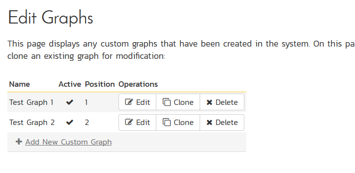


To add a new graph, click on the '**Add New Custom Graph**' option in
the bottom of the table:


This is the same screen you will see if you click on the **Edit** button
for an existing graph. In addition, the graph list page has the
following additional operations:

-   **Clone** -- this will make a copy of the graph with '- Copy'
appended to the name

-   **Delete** -- this will permanently delete the selected custom
graph.

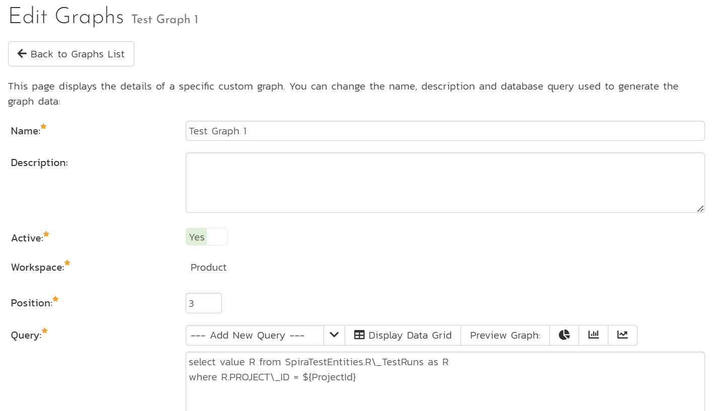


On the graph editing page, you can enter the following fields:

-   **Name** -- This is the short name of the graph that will be
displayed to users when they choose to display a custom graph.

-   **Description** -- This is the longer description of the graph, and
should be used to explain what the data in the graph shows, what the
purpose of the graph is and how the data should be interpreted. This
is what the user will see when they click on the help link on the
graph.

-   **Active** -- If you set this to "No", the graph will not be
accessible by end users

-   **Position** -- use this to specify the relative position of the
graph in the list of custom graphs.

-   **Query** -- this is where you enter the actual query used to
generate the graph data. We shall discuss this below.

Entering the Query

We recommend that you first choose the appropriate **reportable entity**
from the dropdown list. In the example illustrated above, we have
selected the "Test Runs" reportable entity.

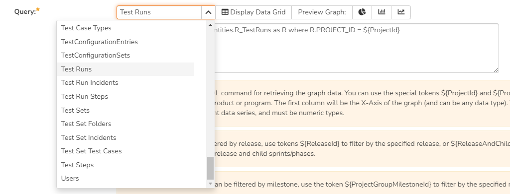


This will automatically populate the following query in the **Query**
editor:

select value R from SpiraTestEntities.R\_TestRuns as R where
R.PROJECT\_ID = ${ProjectId}

This query tells SpiraPlan to select all of the rows in the R\_TestRuns
collection that are in the current product and include all of the
columns in the final report. You cannot graph non-numeric columns, so
usually we'd recommend clicking **Display Data Grid** to see all of the
columns that you can use in the graph:

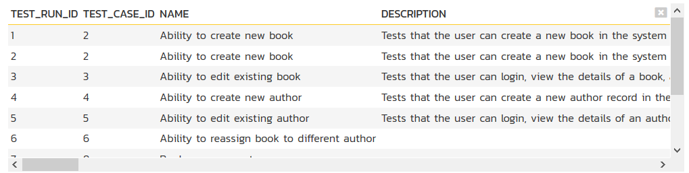


This will help you decide which columns are important for your graph.
You can then adjust the query to only include those columns:

select R.EXECUTION\_STATUS\_NAME, COUNT (R.TEST\_RUN\_ID) as COUNT

from SpiraTestEntities.R\_TestRuns as R

where R.PROJECT\_ID = ${ProjectId}

group by R.EXECUTION\_STATUS\_NAME

In this modified query, we have replaced the keyword **value** with the
specific column names. We have also added an aggregation function called
**COUNT** to count the number of test runs and group by the execution
status name column. SpiraPlan uses a modified SQL language called Entity
SQL. For more information on creating custom graph queries, please refer
to the knowledge base articles on the Inflectra customer support
website: <http://www.inflectra.com/Support>.

When you click **Display Data Grid**, you will now see:

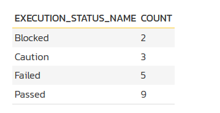


The graphing module requires that the first column be the list of
categories to display on the x-axis of the graph. It can be any format
(text, numeric, dates, etc.). The remaining columns have to be numeric
and will be used to display the different data ranges. The column name
will be used to display the data range. For donut graphs, only one data
range is supported, for line/bar charts, you can have multiple ranges.

You can see how the graph looks in the three different styles (donuts,
bar, line):

a) Donut Graph

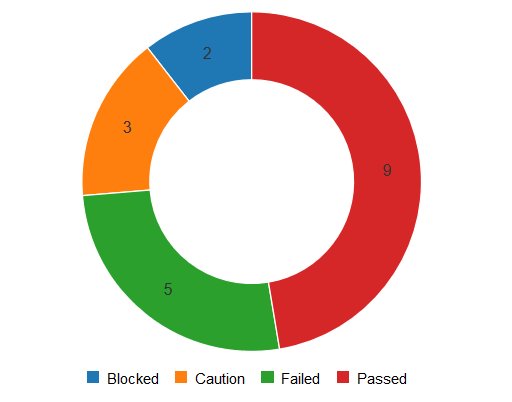


b) Bar Graph

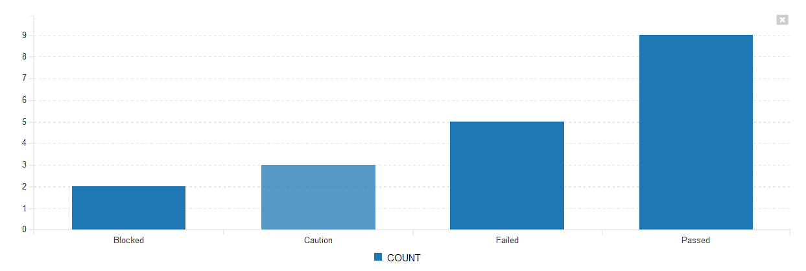


c) Line Graph


Once you are happy with your custom graph, click the **Save** button to
commit the changes. If the Active flag is set to "Yes" then the graph
will be available for end users to use.

*Warning: If you create a graph that doesn't have either ${ProjectId}
or ${ProjectGroupId} in the WHERE clause you could end up displaying
data to a user that shouldn't have permission to see that data.*

