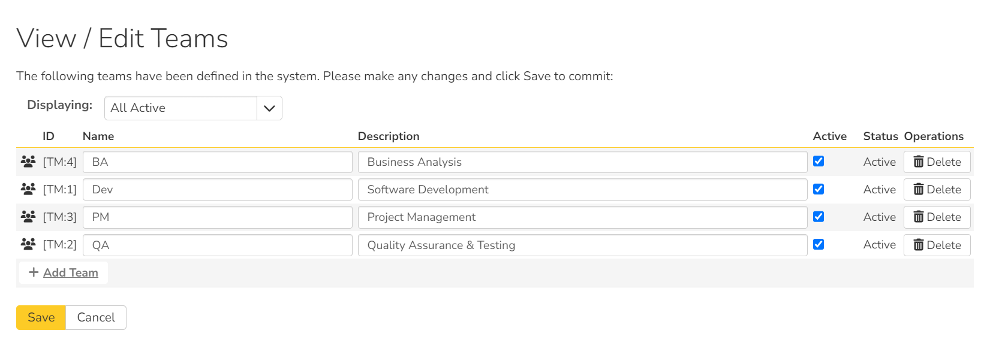
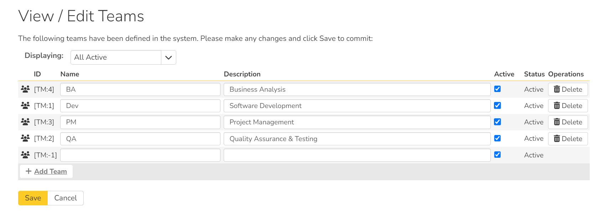

# System: Users

## View / Edit Users

The following screen is displayed when you choose the "View/Edit Users" link from the Administration menu:

This screen displays the list of all approved users in the system (by default it only shows active users, but you can use the dropdown at the top to view inactive or all users). It shows the following fields:

- First Name
- Last  Name
- Username (login)
- administrative permission status
- Department
- Organization
- 2-step authentication status
- Which, if any, external login provider they are using (LDAP, or a login provider like Google or Okta)
- active status

You can filter the list using the filter row above. When you click the "Filter" button, the list of users will be filtered by the criteria you entered. You can clear the filter selection by clicking the "Clear Filters" button. To sort the list of users, click on the appropriate arrow icon located in the header row of each field (one each for ascending / descending). In addition, the list of users is paginated into groups of fifteen (15). You can step through the different pages by clicking the page numbers at the bottom of the user list.

!!! tip "Why can't I find a user?"
    The user list shows all approved users. So if you are looking for a user that you think should exist but they are not in this list, then they are not approved. Check the list of [pending user requests](#pending-requests) to see if the user is there waiting to be approved.

### Add a new user
To add a new user to the system, click the "Add" button at the bottom of the user list, and a new screen will be displayed that allows you to enter the new user information:

On this screen, you can:

- enter information about the user, such as their name, email address, and department
- make the user a system administrator
- make the user a report administrator (this allows the user to administer custom reports and graphs. The can create, edit, and delete reports and graphs, and can also access custom report data in 3rd party tools via OData)
- make the user a portfolio viewer. This controls who can access both the homepages of all portfolios and the enterprise homepage
    {: .edition-spiraplan}
- create their password, password reset question and answer. 
- if you want the user to be able to subscribe to items in the system as RSS feeds, you can check the "Enable RSS Feeds" checkbox (this will display a GUID token in the text-box)

!!! info "System administrators and product roles"
    Note: if a user is a System Administrator, that user will always have the 'Product Owner' role on all their assigned products, regardless of the chosen role. If they stop being a system admin, they will then revert back to their true role.
When creating a new user, you can also set their role for products. A user can be assigned a role to multiple products at once, by checking the required checkboxes in the dropdown list of products. The same role will be applied across all products.

!!! tip "Notifying Newly Created Users"
    The new user created as above will get an email with the subject "New Spira Account". The email contains the new user's assigned username and password, along with the login URL.

### Edit an existing user
In a similar way, to edit the details of an existing user, click the "Edit" hyperlink in the user list box, and you will be taken to the following screen that allows you modify the user details:

On this screen you can edit key information and security about the user:

- first name
- middle initial
- last name
- username
- email address
- RSS token
- portfolio viewer status (SpiraPlan only - this setting also controls the enterprise homepage access)
- timesheet manager (SpiraPlan only - this setting gives access to the enterprise timesheet page and the ability to approve or reject any user's submitted timesheet)
- system administration status
- report administrator status
- active status
- password (if the user is managed by SpiraPlan)
- secret question and answer (if the user is managed by SpiraPlan)
- LDAP connection (if managed by LDAP - see below)
- 2-step authentication (if active for a user, admins can click the "Deactivate" button to deactivate this feature for the specific user)

If your Spira accounts are managed by an external LDAP directory server, you can edit a user's LDAP information on this page. In LDAP-Managed mode you enter the fully Distinguished Name (DN) for that user in your corporate LDAP server and provide no password. SpiraPlan® will then query your corporate LDAP server for the password information, reducing the number of passwords that a user needs to remember. Please see the sections on [Importing LDAP Users](#importing-ldap-users) and [LDAP Configuration](System.md/#ldap-configuration) for more details.

If a user's account uses an external provider for authentication (like LDAP or Okta) you can unlink the user from that authentication provider on this page. Click the `Unlink Account` button to display a popup that requires you to add the new security information for that user.

Once you have made the necessary changes, click the "Save" button to commit them. If you decide that you want to ignore the changes, click the "Cancel" button and the changes will be discarded.

At the top of the page you can also see information relating to the activity of the user on the system, such as when they last logged in.

In addition, there are up to four tabs at the bottom of the page called "Membership and Mapping" that allow you to:

- add/remove the user from products
- view the user's program membership
- update the data-mapping used when synchronizing artifacts that are assigned or created by the current user

If you click on the "Product Membership" tab you will be shown a list of products that the user is currently a member of:

You can change the role that the user has on the various products, by choosing the appropriate role from the drop-down list and then clicking \[Save\]. To remove the user from a product, select its checkbox and then click \[Delete\]. To add a user to a new product, click on the \[Add\] button and then choose the product and associated role from the list of products on the screen that is displayed:

Then click \[Add\] to add the selected product(s) to the user's product membership.

The program membership tab shows a list of all programs that the user is a member of. It shows the following information for each program:

- program name
- if the program is active or not
- the program ID
- the user's role in that program

To view/change the list of usernames that a user has in an external bug-tracking system, click on the "Data Mapping" tab. This section is used by the SpiraPlan data-synchronization service to map incidents from SpiraPlan to other bug-tracking systems.

Please see the documentation for the relevant data sync for more details on using the data-mapping tab.

## Importing LDAP Users
If your organization already has an LDAP compatible user management system in place (e.g. Windows Active Directory, Novell eDirectory, OpenLDAP, IBM Tivoli, etc.), then instead of having to manually enter users one by one into SpiraPlan®, you can simply import them from your LDAP Server. Before doing this however, you need to first setup the [LDAP Configuration](System.md/#ldap-configuration).

Once you have setup your LDAP server configuration in SpiraPlan®, clicking on the "Import Users From and LDAP Server" will bring up the following screen:

This screen lists all the users available in the LDAP server that have not been already imported into SpiraPlan®. The users are listed by name along with their login, email address and fully distinguished LDAP name (DN). You can narrow down the list by entering partial name matches in any of the fields displayed and clicking
\[Filter\] and/or you can sort the results by clicking on the directional arrows in the field headings.

Select the checkbox of any users you want to import and click "Import" to complete the operation. These users can now login to SpiraPlan® and use their existing LDAP login and password information.

## Login Providers

You can connect your organization's identity provider for Single Sign On (SSO) authentication with Spira. This works for both on premise and cloud versions of the application. We currently support integration with:

- [Azure AD](../HowTo-Guides/Login-providers.md/#azure-ad)
- [Github](../HowTo-Guides/Login-providers.md/#github)
- [Gitlab](../HowTo-Guides/Login-providers.md/#gitlab)
- [Google](../HowTo-Guides/Login-providers.md/#google)
- [Microsoft ADFS](../HowTo-Guides/Login-providers.md/#microsoft-adfs)
- [Okta](../HowTo-Guides/Login-providers.md/#okta)
- [OneLogin](../HowTo-Guides/Login-providers.md/#onelogin)
- [OpenId Connect](../HowTo-Guides/Login-providers.md/#openid-connect)

On the Provider List page you can see a list of all available providers, their status (active or inactive), and how many, if any, users are logging in to the application using that provider.  To configure a particular provide, click the "Edit" button for that row.

On the provider details page you can set a provider to active or inactive. Different providers have different required fields. For your provider, make sure to fill in the required fields with the specific information that the provider generates for you. Every provider needs at least a `client id` and `client secret`. For users to be able to login using the provider make sure to set the provider to active and hit `Save`. This will make sure that the right button shows up on the login screen. 

Note that you can only deactivate a provider that does not have any users linked to it.

Once you have setup a login provider, users will see a button for that provider on the Spira login page:

### How to set up a provider to integrate with Spira
Below is a general set of instructions about how to set up the provider and Spira to work together. However, the providers may have changed their process or documentation, so please consult the provider about configuring their system.

1. Go to the provider details page for the provider in question. 
2. Take note of the "Return URL" at the bottom of the form. You will need to enter this **exactly as it appears here** into your provider (it is case sensitive)
3. Login with your admin account to the provider
4. Create a new application / OAuth access with the provider
    - You will need to provide the homepage / originating URL: this is your main spira domain, e.g. `https://inflectra.spiraservice.net`
    - Use the "Return URL" from above in the field called something like return URL, callback URL, redirect URL
    - A guide to set up each provider, and the specific permissions they each need are available here: 

        - [Azure AD](../HowTo-Guides/Login-providers.md/#azure-ad)
        - [Github](../HowTo-Guides/Login-providers.md/#github)
        - [Gitlab](../HowTo-Guides/Login-providers.md/#gitlab)
        - [Google](../HowTo-Guides/Login-providers.md/#google)
        - [Microsoft ADFS](../HowTo-Guides/Login-providers.md/#microsoft-adfs)
        - [Okta](../HowTo-Guides/Login-providers.md/#okta)
        - [OneLogin](../HowTo-Guides/Login-providers.md/#onelogin)
        - [OpenId Connect](../HowTo-Guides/Login-providers.md/#openid-connect)

7. Go back to Spira and enter the information for the required fields into the provider page and hit save.
8. Test that you can login to Spira using the provider. This can be done in two ways: linking an existing account, or creating a new account. User will only be able to create a new account if users can register for a new account
9. Start rolling out to your users - in other words encourage / suggest that they hook up their provider account to Spira (each user has to do this individually, it cannot be managed centrally)

Before rolling out the provider to your users be aware that the provider likely communicates to your Spira application over the internet so your users may not be able to log in to Spira if that provider service goes down. Because of this, the root admin is not able to connect to Spira using a provider in this way. 

!!! warning "Client Secret"
    The "Client Secret" field is very sensitive so do not share it. Once you enter it in Spira you will not be able to access it again. Store it somewhere safely, like a password manager, if required.

## Active Sessions

Sometimes a system administrator will want to know who is logged into the system right now, and how many total users are logged in. The 'Active User Sessions' page display a list of all the users who currently have active sessions in the system. Each user is displayed along with their user ID, whether they're connected through the application or via a third-party add-on, and the date they last logged-in.

Administrators can end a session that is in use to make it available for others. This is useful when you at your maximum number of concurrent sessions allowed by your license. This blocks anyone else from logging in - so if they really need to login, someone else has to logout. Clicking the ‘End Session’ button to the right of the user’s name will end their session, making it available for another user. 

**Ending a session is not the same as logging out**: ending a session does not fully logout the user - it only provides a window for someone to login. If no one logs in and that user keeps using the app, their session will be restarted. 

**If a user's session is replaced by another user**: the first user will now be logged out. They will now be unable to access the system and any unsaved data will be lost.

## Pending Requests

If you have enabled the ability for users to [register for new SpiraPlan accounts themselves](System.md/#security-settings), clicking on the "Pending Requests" administration option allows you to view a list of all the outstanding requests for new user accounts:

For each pending user request you can choose to either Approve or Deny the request:

**Approve** -- clicking this option will approve the user. They will get an email letting them know that they have been approved and can now log into the system.

**Delete** -- clicking this option will delete the pending user request from the system.

## View / Edit Product Roles
Read an [overview](System-Administration.md/#how-user-permissions-are-set) of how permissions work across the application and all its workspaces.

### Default Product Roles
There are six (6) default product roles that a user may be assigned to a product with:

- **Product Owner** -- the same rights as a Manager, but in addition can access the product administration tools
- **Manager** -- can see all screens and add/edit all artifacts, but cannot access product administration tools
- **Developer** -- can see all screens, but can only add/edit incidents, tasks and tests and change requirement coverage
- **Tester** -- can see all screens, but can only add/edit incidents and execute tests. Note: cannot delete incidents, only a Manager can do that.
- **Observer** -- can see all screens, but cannot perform any write operations (insert / update / delete)
- **Incident User** -- can only view and edit incidents. This user cannot even see the product's requirements, tasks, test cases or releases.

!!! info "The Special case of user administrator"
    The System Administrator (with a user id of 1) is automatically added to every product as a Product Owner, and can never be removed as Product Owner, made inactive or made a different role on the product.

### Role wide customizations
You can make changes to the permissions associated with each of these default roles, and also create as many additional roles as you like. To customize the roles in your installation of SpiraPlan®, click on the "View / Edit Roles" link in the Administration menu:

The screen lists all of the roles currently configured in the system (both active and inactive) together with the name, description, and an active flag. You can create new roles by clicking the "Add" button which will create a new default role entry in the list. You can edit the name, description and associated permissions of a role by clicking on the appropriate "Edit" button. You can delete an existing role, by clicking the "Delete" button. Note that you cannot delete any of the default roles, but can instead make them inactive.

Clicking on the edit button will take you to the following screen:

On the top of the screen, you can edit the name, description, product admin, limited view and active flags:

- **Product Admin**: this flag denotes whether this role has administration-level access to the product (for example the product owner role has this set by default)
- **Template Admin**: this flag denotes whether this role has administration-level access to the template that controls this product. You can be a product admin, without also being a template admin. However, you cannot be a template admin, without also being a product admin.
- **Limited View**: this flag denotes that the role has a restricted view of the product, with the user only allowed to see the artifacts that they have either *created* or been *assigned*
- **Active**: This flag denotes if the role is active in the system

### Artifact specific permissions
Underneath the role wide customizations, you can specify the various artifact-specific permissions for the role:

These permission options allow you to specify if a user can view, create, delete, or modify (in three different ways) each type of artifact in the product:

- **View**: lets a user view all items of that artifact. If the product role does not let a user view an artifact, that artifact will not appear in their navigation menu
- **Create**: lets user create a new item of that artifact
- **Delete**: lets a user delete any artifact item in the product, or folders of artifacts with folders
- **Modify Owned**: lets a user modify only those items in an artifact that they created or have been assigned (e.g. the user can edit only the requirements they created or have been assigned). This is the most restrictive type of modify permission and can only be carried out on the artifact details page, subject to any workflow
- **Modify All**: lets a user modify any items for an artifacts on the artifact details page, subject to any workflow (e.g. the user can edit all test cases)
- **Bulk Edit**: lets users modify items outside of the scope of any workflow in a number of places. This means users can bypass workflow restrictions, allowing them to make status changes (including without electronic signatures) and not enter fields required by workflows. This permission should be applied carefully. Note that you can deny status changes in this with the "Status bulk edit" flag on the [edit template page](System-Workspaces.md/#viewedit-templates). Bulk edit works in the following places:

    - editing artifacts on artifact list pages
    - creating and editing folders of artifacts with folders
    - moving requirements and releases around the hierarchy on their hierarchical list pages
    - moving cards around on all planning and kanban boards
    - edit cards on planning and kanban boards (this editing *does* enforce workflow required fields and does *not* allow status transitions) 

*Note: The permission needed to execute a test case is the "Create + Test Run" permission since that initiates the creation of a new test run.*

### Cross artifact permissions
In addition, there are some permissions that can be specified for each role, that apply across all relevant artifacts:

This section lets you specify if the role allows users to add new documents to the product, edit existing documents, delete documents, edit the document folders, and view/edit source code commits.

## View / Edit Teams
!!! info "Available in SpiraPlan only"

SpiraPlan lets you define a list of Teams. These teams are created system wide, and product members can then be assigned any active team on a product by product basis. You can use these teams in different ways in different products, but the most common way is to group people together based on your organizational or functional structure.

This page lets you display the list of teams sorted alphabetically by name, based on three predefined filters:

-   **All Active** -- This displays only the teams that are listed as Active = Yes. Only active teams will be displayed inside the main application.
-   **All But Deleted** -- This displays all the teams (active and inactive) except those that have been deleted.
-   **All** -- This displays all the teams (active, inactive, and deleted).

Click the 'Add Team' button at the bottom of the list to add a new team:

After entering the name of the new team, optionally entering a description, and choosing its Active status (active by default), click 'Save' to commit the new item. To edit an existing team, change its name, description, or active status and click 'Save'. To delete a team, click the 'Delete' option for that row. Once deleted, an item can be undeleted by changing the display to 'All' and then clicking 'Undelete'.

[Learn about how to manage team membership at the product level](Product-Users.md/#team-membership). 