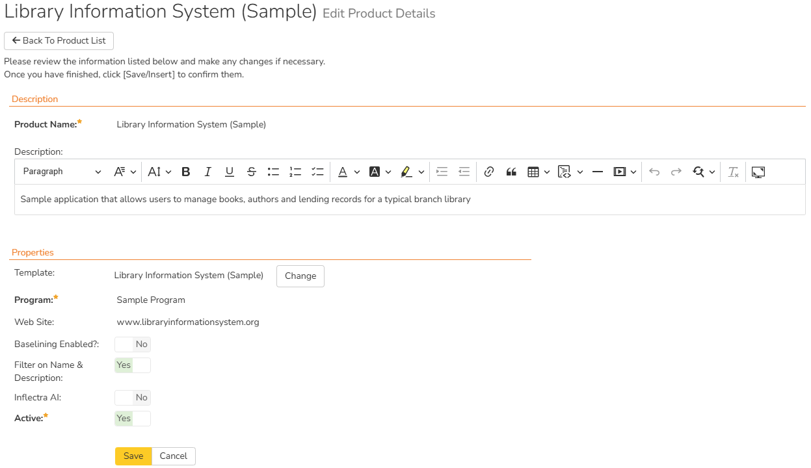

# System: Workspaces
There are up to 3 levels of workspaces that you can use to organize all of your data within Spira. Products are where all your tests, requirements, and bugs live. These are grouped inside of Programs. In SpiraPlan you can group programs inside of Portfolios. Each of these workspaces is discussed below, as are Templates - a special type of workspace for controlling parts of how products and programs work.

All workspaces share certain ways of working: they all have a name and description, then can all be made active or inactive. An inactive workspace is completely inaccessible to any user.

- if you make a product inactive, no member of that product will see it in the app. Only a system administrator can make that product active again. 
- if you make a program inactive, no member of that program can access it in the app. Additionally, none of the products inside that program will be accessible.
- if you make a portfolio inactive, it will not be accessible in the app. And, like with programs, none of its programs, and also none of their products will be accessible.

## View/Edit Products

The following screen is displayed when you choose the "View/Edit Products" link from the administration menu:

This screen displays the list of products in the system (both inactive and active) together with their program, template, date of creation, and active status. Clicking on either the "View" link in the right-hand column or the name of the product will change the currently selected product to one clicked.

By default the table shows you only the active products, but you can select a different option from the dropdown above the table. You can filter the list of products by either choosing an active status, program, or entering a portion of the name or date into the appropriate text box. When you click the "Filter" button, the list of products will be filtered by the criteria you entered. You can clear the filter selection by clicking the "Clear Filters" button. To sort the list of products, just click on the appropriate arrow icon located in the header row of each field (one each for ascending / descending) In addition, the list of products is paginated into groups of fifteen (15). You can step through the different pages by clicking the page numbers at the bottom of the product list.

To permanently delete a product, click the "Delete" button to the right of the product details. Doing so will show a popup where the admin will be required to correctly type the name of the selected product. Product deletion is irreversible and will delete all the artifacts associated with the product. If you want to temporarily delete a product, set its Active flag to 'No' instead. To make a copy of a product to reuse its test cases, releases, test sets and requirements, click the "Copy" link to the right of the product. *NOTE: this will not make a copy of any historical information, test runs or incidents.*

### Product cloning
To **clone a product**, select a product and click the "Clone" button. 

The popup dialog gives you the following options:

- either create a full clone of the product
- or create a reset copy of the product
- and optionally clone the template for whichever of the above options you choose 

Whichever copy / clone option you choose, product settings (planning options and testing settings), components, product membership, and saved filters[^saved-filters] (shared and not shared) will all be copied over to the new product.

**Full clone of the product**: this option (the default) creates a new product that is effectively a clone of the original. The original product is not updated in any way. The new product will have copies of every artifact (including custom properties), along with all attachments, comments, and associations. This is very useful if you want to create an archived copy of a product, or want to split a product out into multiple products. Cloning creates the raw data but it does not also calculate test coverage or task progress for the new product. This final process can take a long time, and may not always be necessary. You can calculate this information at any time from the product admin [Data Tools page](Product-General-Settings.md/#product-data-tools), and after this coverage and traceability should look identical between the original and new product.

While we attempt to create as perfect a clone as possible using this method, there are some limitations to this process:

- only the currently active version of each document is cloned to the new product to save on disk space
- history is, in general, not copied over to the new product
- certain date fields like creation dates may reflect the date of the clone itself, not the original creation date
- cross product associations are not cloned

**Reset copy of the product**: this option creates a partial clone of the original product and then resets certain key fields. This provides a new product that can be used as a base for new work taking the original as a starting point. 

All artifacts are cloned in the same way as the full clone option (e.g. comments and associations are copied) except for the following artifacts which are not copied over at all:

- incidents
- risk mitigations
- test runs

For those artifacts that are copied, the following fields are reset to be either blank or to their default value:

- task dates
- requirement statuses
- release statuses
- document statuses
- test case statuses
- test set statuses
- incident statuses
- task statuses
- risk statuses
- execution statuses for test cases, test steps, and test sets (all set to Not Run)

The same limitations listed above for a full clone also apply to this reset copy option.

!!! info "Product Association"
    When cloning data from a product that is associated with another product(s) in Spira (i.e. when the product being cloned shares artifacts with other products), for security reasons, the association(s) won't be replicated in the new cloned product. This means that artifacts that were associated with different products in the original product will be cloned, but their external associations won't. Examples:
    
    - Cloned Test Cases that were originally part of a Test Set in a different product won't be associated with the external Test Set
    - Cloned TestRuns that were originally created within a Test Set in a different product won't be associated with the external Test Set

**Cloning the template**: this will create a clone of the original product's template and make sure that the new cloned/copied product uses this cloned template. This can be really useful if you want to create a new independent product and template compared to the original. 

[^saved-filters]: Saved filters are only cloned if you use the same template as the original product. If you clone the template, the filters are not cloned. Cloned saved filters have some limitations: any filters by a specific ID (eg incident ID) will still be there and will not work as they reference an ID in the original product. Additionally, custom properties of types automation host and release are not updated for the new product.  

### Add a new product
To add a new product to the system, click the "Add" button at the bottom of the product list, and a new screen will be displayed that allows you to enter the new product information:

You need to:

- enter a name for the product (which cannot be the same as any already in use);
- select which program it belongs to and optionally enter a detailed description and/or web-site URL;
- decide what to base the product on. It can either be a new empty product, or be based on another product already in the system. Doing the latter will copy across its membership, settings, data mappings, components and customizations;
- select a template that will control the product. If you are creating an empty product (not based on an existing one) you can select any template in the system to use for this product, or you can start with a brand new template. If you are creating a product based on an existing one, then by default the template will be the same as the one the existing product uses. You can still create a new template in this case, which will effectively be a clone of the template the existing product uses.
- decide whether the product should have baselining enabled or not. Read more about baselining [here](../Spira-User-Manual/Release-Management.md/#baselining) SpiraTeam SpiraPlan
- you should initially make sure that the product is marked as "Active";
- if available, you can disable Inflectra.ai for this product (it is enabled by default). Note that Inflectra.ai also needs to be [enabled system wide](./System.md/#general-settings) for users to access it in the product. Inflectra.ai

Once you are satisfied with the information, click the "Insert" button to actually create the new product.

### Edit a product
In a similar way, to edit the details of an existing product, click the "Edit" button in the right hand column of the product list box, and you will be taken to the following screen that allows you modify the product details:

On this screen you can:

- edit the name
- edit the description
- edit the website URL
- change the program
- view the current template for the product. Next to the template name is a "Change" button. Clicking this will let you [change the product to use a different template](Product-Changing-Template.md)
- enable/disable [baselining](../Spira-User-Manual/Release-Management.md/#baselining) SpiraTeam SpiraPlan
- toggle if searching on a list page should filter on both name and description fields, or just the name field (default is name and description). For very large lists of products, searching by description may result in slower performance. If that is the case, toggle this option to reduce the search range and potentially improve performance. 
- toggle the active status
- toggle Inflectra.ai. Note that Inflectra.ai also needs to be [enabled system wide](./System.md/#general-settings) for users to access it in the product. Inflectra.ai

Once you have made the necessary changes, click the "Save" button to commit them. If you decide that you want to ignore the changes, click the "Cancel" button and the changes will be discarded.

!!! question "What happens when you make a product inactive"
    If you set a product's active flag to "No" then it will be hidden from the global navigation for all users. This is the recommended alternative to deleting a product (because deletion is permanent).

## View/Edit Programs

The following screen is displayed when you choose the "View/Edit Programs" link from the Administration menu:

This screen displays the list of programs in the system (both inactive and active) together with their portfolio SpiraPlan, template, web site URL, date of creation and active status. Programs are used to relate products that are in the same department/division/organization or are for a common customer, client, etc. When products are in the same program, a user that is a member of the program can see the special Program Dashboard that displays key metrics from all the products in the program combined. Also, such users will have observer-level access to the contained products without needing to be explicitly added to each product.

You can filter the list of programs by either choosing an active status, or entering a portion of the name, web-site or date into the appropriate text box. When you click the "Filter" button, the list of programs will be filtered by the criteria you entered. You can clear the filter selection by clicking the "Clear Filters" button. To sort the list of programs, just click on the appropriate arrow icon located in the header row of each field (one each for ascending / descending) In addition, the list of programs is paginated into groups of fifteen (15). You can step through the different pages by clicking the page numbers at the bottom of the list.

To permanently delete a program, you should click the "Delete" button to the right of the program details. Any products contained in the program will not be deleted, but instead just moved to the default program. There has to be at least one program in the system at all times, so the program designated as the 'default' one will not be available for deletion.

### Add a new program
To add a new program to the system, click the "Add" button at the bottom of the program list, and a new screen will be displayed that allows you to enter the new program information:

You need to enter:

- a name for the program
- optionally enter a detailed description and/or web-site URL
- SpiraPlan optionally select a portfolio for the program to belong to, by default "none" is selected 
- you should initially make sure that the program is marked as "Active": this mean the program and its products will be accessible to users  
- you can choose to make this program the default one (meaning that it cannot be deleted and products get added to it when their programs are deleted)
- in addition you can optionally choose to associate the program with a product template. The template only controls the products that use it. It does not control the program, but it can affect what data is visible from some of the program pages

Once you are satisfied with the information, click the "Insert" button to actually create the new program.

### Edit a program

In a similar way, to edit the details of an existing program, click the "Edit" button in the right-hand column of the program list box, and you will be taken to the following screen that allows you modify the program details. **Please note that this is the only administrative page in the program administration section.**

On the top part of this screen you can edit the name, description, website URL, portfolio SpiraPlan, active flag and default flag. Once you have made the necessary changes, click the "Save" button to commit them. If you decide that you want to ignore the changes, click the "Cancel" button and the changes will be discarded.

!!! question "What happens when you make a program inactive"
    If you set a programs's active flag to "No" then it will be hidden from the global navigation for all users. All products in that program will also be hidden from the global navigation for all users.

In addition, the lower part of the screen allows you to view/edit the users that are members of the program and also see which products are in the program:

#### Program User Membership

This tab allows you to see which users are members of the program and which program role they have:

The two program roles are "Executive" and "Program Owner":

**Executive** -- This role allows the user to see this [program's homepage](../Spira-User-Manual/Program-Homepage.md), which contains all the key metrics for the contained products displayed in an aggregated manner. In addition, the user is automatically granted 'observer' permissions for all the products in the program (this excludes source code).

**Program Owner** -- This role consists of all the permissions granted to the "Executive" role above, but in addition allows the user to make changes to the Program itself in the Administration section.

To change the role of an existing program member, just change the role in the drop-down list and click \[Save\]. To remove a member from the program, just select the appropriate checkboxes and click \[Delete\]. Finally, to add a new user to the program, click on the \[Add\] button:

You now should narrow down the list of users by entering filter criteria and clicking \[Filter\]. Once you have located the appropriate user(s), just select a program role for them from the drop-down list and click
\[Add\] to add them to the program in the specified role.

#### Program Product List

This tab allows you to see the list of products that are contained within the current program. Clicking on the name of the product will take you to the details page for that product:

## View/Edit Portfolios

!!! info ""
    Please note that portfolios are only available in SpiraPlan

The following screen is displayed when you choose the "View/Edit Portfolios" link from the Administration menu:

This screen displays the list of portfolios in the system (both inactive and active) together with their description, ID, and active status. Portfolios are used to relate programs together.

You can filter the list of portfolios by either choosing an active status, or entering a portion of the name. When you click the "Filter" button, the list of portfolios will be filtered by the criteria you entered. You can clear the filter selection by clicking the "Clear Filters" button. To sort the list of portfolios, click on the appropriate arrow icon located in the header row of each field (one each for ascending / descending) In addition, the list of portfolios is paginated into groups of fifteen (15). You can step through the different pages by clicking the page numbers at the bottom of the list.

To permanently delete a portfolio, click the "Delete" button to the right of the portfolio details. No programs (or their products) in the portfolio will be deleted - the programs' portfolios will instead be reset to "none".

### Add a new portfolio
To add a new portfolio to the system, click the "Add" button at the bottom of the portfolio list, and a new screen will be displayed that allows you to enter the new portfolio information:

You need to enter:

- a name for the portfolio
- optionally enter a detailed description
- you should initially make sure that the portfolio is marked as "Active": this mean the portfolio and its programs (and their products) will be accessible to users  

Once you are satisfied with the information, click the "Insert" button to actually create the new portfolio.

### Edit a portfolio

In a similar way, to edit the details of an existing portfolio, click the "Edit" button in the right-hand column of the portfolio list box, and you will be taken to the following screen that allows you modify the portfolio details.

On the top part of this screen you can edit the name, description, and active flag. Once you have made the necessary changes, click the "Save" button to commit them. If you decide that you want to ignore the changes, click the "Cancel" button and the changes will be discarded.

At the bottom of the screen you can see all the programs that belong to this portfolio.

!!! question "What happens when you make a portfolio inactive"
    If you set a portfolio's active flag to "No" then it will be hidden from the global navigation for all users. Any programs in the portfolio and all products in those programs will also be hidden from the global navigation for all users.

## View/Edit Templates

The following screen is displayed when you choose the "View/Edit Templates" link from the administration menu:

This screen displays the list of templates in the system (both inactive and active) with their active status.

You can filter the list of products by either choosing an active status, ID, or entering a portion of the name into the appropriate text box. When you click the "Filter" button, the list of templates will be filtered by the criteria you entered. You can clear the filter selection by clicking the "Clear Filter" button. To sort the list of templates, click on the appropriate arrow icon located in the header row of each field (one each for ascending / descending).

To permanently delete a template, click the "Delete" button to the right of the template details. This is irreversible. If you want to temporarily delete a template, set its Active flag to 'No' instead. Neither of these actions will be possible if any product (active or inactive) is controlled by the template.

To add a new template to the system, you need to create a new template when creating a new product (as described in [View/Edit Products](#viewedit-products)). To edit the details of an existing template, click the "Edit" button in the right hand column of the template list box, and you will be taken to the following screen that allows you modify the template details:

On this screen you can edit the template's:

- Name (click on the name to open the template's [home page](Template-Home.md))
- Description
- Program
- Active status
- Status Bulk Edit: this defaults to enabled / yes. When this option is enabled, users with "Bulk Edit" permissions can make bulk changes (on list pages and planning boards) to the status of artifacts they have bulk edit permissions for, outside of workflow controls. If you do not want any user of any product in the template to be able to change the status except on the details page of that artifact (where workflows are enforced) set this to disabled / no.

Once you have made the necessary changes, click the "Save" button to commit them. If you decide that you want to ignore the changes, click the "Cancel" button and the changes will be discarded.

### Included Templates
SpiraPlan ships with four different templates. Together these will cover most of your needs. You can easily clone and customize one of these templates to meet your exact needs. Or you can start from scratch. Below is a brief description of each of the includes templates:

- **Default**: This basic default template matches the one the system automatically generates when you create a completely new template. It is a good basis for customizing your template if no other template fit your needs
- **Library Information System (Sample)**: This template is designed to work with the sample product Library Information System. The template showcases a number of different parts of the system, through that product. It is not designed to be used for real life products.
- **Regulated Industries**: This template is designed specifically for products that are developed in a regulated environment. For example life sciences. The workflows have been configured to help you meet requirements in your work, such as those arising from FDA 21 CFR Part 11. Workflows include the use of electronic signatures for key stages of sign-off; limit who can transition an artifact between statuses, and manages which fields are disabled or required at each workflow step.
- **Flexible**: This template is designed to allow users to be as unconstrained from workflow requirements as possible. All relevant fields are available and editable (and not required) at all times. Active statuses are streamlined. This template should be used only for times when process controls are not required or are very lightweight.

## Manage Sample Data
!!! info 
    This page is accessible under the Workspace subsection of the system admin menu. It is visible when you first get a new application. But as soon as the application gets updated to a new version, the page is no longer accessible and you will not see the entry in the admin menu.

    

The application includes different types of sample data, some about specific industries, to help you understand how the application works. For example, how products fit inside a program, or how different artifacts work together. There are six sample data sets available in the application. A system administrator can change which of these are available at any one time. The admin can make all available, none available, or anywhere in between.

When you load this page the sample data sets currently active will have the checkbox next to them checked. By default the "Basic Samples" are the only ones enabled. To change which sample data sets are active, check the relevant checkboxes and click save.

Please note that for users to be able to see these samples they can either login with a user who is already a member of the data or they can be added as a member by a system admin. The users with username "administrator" and "fredbloggs" have access to all of the sample data by default.

### Delete Sample Data
If you click the "Delete" button, a popup will show a warning. If you decide to proceed the system will attempt to delete all sample data, including users, products, artifact information, programs, and portfolios. This method will not delete:

- the default program
- the root administrator (with username "administrator" and an ID of "1")
- any sample user, product, program, or portfolio whose name has been changed 
- any sample user who has been used to create, comment or has been assigned any artifacts in non-sample data products

!!! tip 
    If you do not want users to see the sample data but do not want to permanently delete that data: 
    
    - uncheck all the sample data sets and save the page
    - mark each user as inactive
    
    These inactive items will still be visible on the relevant administration pages, but no one will see them in the main application. 

