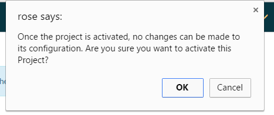
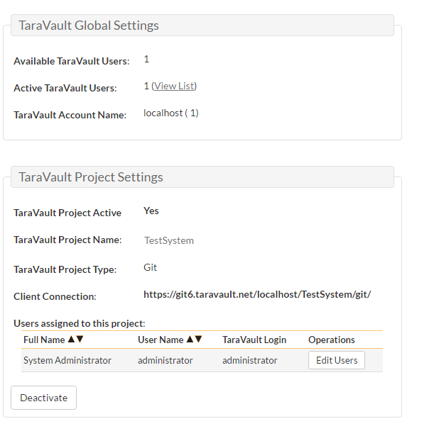

# System

## General Settings

The general settings page allows you to configure SpiraPlan® to better match your environment and setup. In the current version, you can specify the default language, or configure the folder used to store document attachments:

The available settings include:

- **Default Culture**: SpiraPlan can display information in a variety of different languages (assuming that the appropriate language packs have been installed) and number formats. By default, SpiraPlan will use the regional settings (language and number formats) of the operating system it has been installed on. However, you can override this default by choosing the appropriate culture from the list of options displayed in the drop-down list. *Note: The list of culture options does not reflect the available language packs, so in some cases, the setting will only change the number formats.*
- **Default Timezone**: SpiraPlan stores all dates and times internally in Universal Coordinated Time (UTC) and can therefore display dates/times adjusted for different timezones. By default, SpiraPlan will display dates in the timezone specified in the operating system it has been installed on. However, you can override this default by choosing the appropriate display timezone from the list of options displayed in the drop-down list.
- **Web Server URL**: This is the URL that your users use to access the system. Do not put the /Login.aspx or any other page here, as this URL is used to generate links to pages in the application.
- **Attachments Folder**: By default when SpiraPlan® is installed, the document attachments uploaded in the system get stored inside
    the `C:\Program Files\SpiraPlan\Attachments` folder located inside the main SpiraPlan® installation root. However you may want to have the documents stored on a remotely mounted drive or on a different hard disk partition. In which case you can simply change the folder pointed to in the text-box illustrated above and then click \[Update\] to commit the change.
- **Cache Folder**: By default when SpiraPlan needs to store temporary data (generated reports, the version control cache, etc.) it will store them in the C:\\ProgramData\\Inflectra\\Spira folder. Sometimes this folder is not appropriate (e.g. you want them on a different drive that has more space). You can enter in a different folder for temporary storage and SpiraPlan will use that instead.
- **Cache Refresh**: you can adjust the default number of minutes after which the source code cache should be refreshed.
- **Login Notice**: this can be used system wide to set a message to permanently display at the bottom of the login screen for all users (for example, a company disclaimer).
- **Administration Message**: this can be used by the administrator to display a temporary notice displayed on the login screen for all users. For example it could be used to remind all users that the server will be down for upgrading over the weekend. The administrator should delete the message once it is no longer needed.
- **Instant Messenger**: SpiraPlan and SpiraTeam come with a built-in instant messenger that allows users to communicate with each other in real-time. This can result in higher levels of network traffic and some system administrators may wish to disable this feature. This option lets you disable the integrated instant messenger. In addition, you can specify how long (in days) instant messages are retained in the system.
- **Event Log Retention**: As described in  [Event Log](#event-log), SpiraPlan comes with a built-in diagnostic event log. By default the system will only retain the last 30-days of events to avoid wasting storage space. You can adjust the retention period in this section to match your organization's policies.
- **Enable Free Text Indexes**: This tells SpiraPlan to use SQL Server Free Text Indexing to speed up keyword searches in the Global Search box. You should only have this set to "Yes" if you have the Free Text Indexing featured enabled in SQL Server, otherwise you will cause SpiraPlan to display error messages when users try and use the global search.
- **Disable Rollup Calculations**: (default = no) Setting this to Yes will prevent the system from calculating 'rollup' metrics when data is entered for any product in the system. This should not be done unless you have been told by the Inflectra Support team to do so. To disable rollup calculations for a specific product instead use the product admin level [equivalent setting](Product-Planning.md/#testing-settings). 
- **Enable Beta Features**: (default = yes) Enabling this will allow all users to preview any currently live beta features in the product. If you wish to try out the latest features please enable this setting. Any administration changes that are part of the current betas will be marked as such on the administration menu.

### TaraVault for Source code
The below toggle is only available in cloud hosted versions of SpiraTeam and SpiraPlan.

- **Use TaraVault for source code**: When enabled (the default), every Spira product will use [TaraVault](../TaraVault-User-Manual/Activating-TaraVault.md) for source code management. If disabled (set the toggle to no) each product can either use TaraVault or an external (and cloud accessible) Git or Subversion provider of your choice, such as BitBucket, GitLab or Azure DevOps. **Note**: You can enable/disable this setting at anytime, but doing so may impact your ability to access your source code settings.

!!! question "Not exclusively using TaraVault"
    If you set/leave the "Use TaraVault for source code" toggle discussed above to Yes, then you will only have access to the TaraVault admin pages at both the system and product level administration.

    If you set the "Use TaraVault for source code" toggle to No, the administration menu will work a little differently for you. The system admin menu will always show two links for source code management in the Integration sub-section. This allows to easily access and configure TaraVault and any third party providers at any time. Meanwhile, the product admin menu will adapt to how you have setup source code for that particular product:

    - If TaraVault is already enabled, the product admin "Source Code" link will open the product TaraVault page
    - If instead a third party source code provide provider is configured for the product, the product admin "Source Code" link will open the admin page for that provider
    - If no source code provider has been set up (neither TaraVault nor a third party) then the product admin menu will show two links, one for configuring TaraVault, and the other for configuring a third party provider (see below)

    

## File Type Icons

The "File Types List" administration page allows you to view all the different filetypes that are recognized by SpiraPlan and add or edit the associated icon, name, description and MIME type:

If you click on the "Edit" button next to a filetype, or click on the "Add" button at the bottom of the screen, the system will display the page that lets you add or edit a filetype entry:

On this page you can enter/edit the file extension that's used to recognize the type of file uploaded, the description of the file type (displayed in popup tooltips), the MIME type (used to determine how the browser handles the file type) and the path to the icon image. Once you are satisfied with the values, you can click on the "Save" button to confirm the changes.

## License Details
!!! info 
    This page is accessible under the System subsection of the sytem admin menu. It is only visible if you have Spira installed on premise.

    

The license details page displays the information about the installed license for the particular instance of SpiraPlan® being used. This will display less information for hosted customers. The information displayed for self-hosted customers includes: the product name (e.g. SpiraPlan), the license version (e.g. v6.0.0.0), type of license in effect (x-user fixed, x-user concurrent, demonstration, enterprise, etc.), the expiration date (if any) of the license, the organization that the license belongs to, and the number of users concurrently logged-in right now. This last piece of information is useful as it helps administrators track down how many licenses are currently in use.

A sample page is illustrated below:

To change the license key used by the system (for example, if to upgrade from Trial edition to Standard edition), you do **not**
need to reinstall SpiraPlan®. All you need to do is change the
**organization** and **license key** text-boxes to match the license key and organization name found in the customer area of our website (<http://www.inflectra.com/CustomerArea>) and click the "Save" button.

If there is an issue with the license key (e.g. a trial version that is passed its expiration date, or where the license key doesn't match the organization name) an error will be displayed describing the specific issue with the information you entered. If you are unable to get the system to work with the license key information, please contact Inflectra® customer support at: <support@inflectra.com>.

## LDAP Configuration

As described previously, you can configure SpiraPlan® to use an external LDAP server for importing new user profiles into the system, and for authenticating users -- instead of having to store separate passwords inside SpiraPlan®. However, you need to first configure the LDAP server settings. To do this, click on the "LDAP Configuration" link the Administration navigation:

You need to fill out the various configuration settings for your LDAP server, each of which is explained in more detail below:

- **LDAP Host**: This should contain the name of the LDAP server that you want SpiraPlan to connect to together with the port number if it's not the default of 389.
- **Use Secure Sockets Layer (SSL)**: You should select this check-box if your LDAP server requires use of the LDAPS secure protocol. Leave unchecked for unencrypted LDAP communication.
- **Base DN**: This should be the distinguished name of the object inside your LDAP server that contains the list of user accounts. This varies by the type of LDAP server, please consult your LDAP server documentation for more details.
- **Bind DN**: This should be the distinguished name of the user inside your LDAP server that will be used to authenticate against when importing users. If not provided, SpiraPlan® will try and authenticate with the LDAP server anonymously.
- **Bind Password**: The is the password of the user specified in the Bind DN field above.
- **Login Attribute**: When SpiraPlan® imports users from the LDAP server it needs to know the user attribute inside the LDAP server that it should use to generate the SpiraPlan® user-name. For most LDAP servers the appropriate attribute would be "uid". However for Windows ActiveDirectory, the attribute "sAMAccountName" should be used instead.
- **First Name Attribute**: Providing this optional attribute will allow SpiraPlan® to automatically populate the first name field of the imported user instead of simply using the username as a placeholder.
- **Last Name Attribute**: Providing this optional attribute will allow SpiraPlan® to automatically populate the last name field of the imported user instead of simply using the username as a placeholder.
- **Middle Initial Attribute**: Providing this optional attribute will allow SpiraPlan® to automatically populate the middle initial field of the imported user instead of simply leaving it blank.
- **Email Address Attribute**: Providing this optional attribute will allow SpiraPlan® to automatically populate the email address field of the imported user instead of simply using the username@spiratest.com as a placeholder.
- **Sample User**: You can optionally enter a sample user and password to test that the user is correctly authenticated against the server. You can update the LDAP configuration without setting this, but if you do provide a sample user/password, it will not save the configuration unless the authentication succeeds. If you choose to enter it, the user's name should be the fully-distinguished name of the user (e.g. CN=Sample User, CN=Users, OU=Headquarters, DC=MyCompany, DC=Com).

## Security Settings

The "Security Settings" administration page lets you specify the various security settings within SpiraPlan to match your organization's policies and processes:

The following settings can be changed within the system, once you are satisfied, click the "Save" button to commit the changes:

- **Allow User Registration**: Set this to "Yes" if you want to allow users to self-register for SpiraPlan accounts (that you can subsequently approve). If you set this to "No", a system administrator will need to create all user accounts. Also set this to "No" if you plan on using LDAP-based authentication.
- **HTTPS Only**: Set this to Yes if the application will only be running on HTTPS. This enables tighter security that is only available on HTTPS.
- **Minimum Required Password Length**: Set this to the minimum length of passwords in the system. Choosing a longer password will make it harder for an unauthorized user to crack a password and gain entry into the system.
- **Minimum Required Special Characters** - Set this to the minimum number of non-alphanumeric characters that will be required for passwords in the system. Choosing more required special characters will make it harder for an unauthorized user to crack a password and gain entry into the system.
- **Maximum # Invalid Password Attempts**: Set this to the number of times a user can enter an incorrect password (during the time window specified in the setting below) before their account is temporarily locked out. This is important in preventing 'brute force' password hacking attempts.
- **Max Login Attempts Window**: Set this to the number of minutes over which invalid login attempts are evaluated before locking the user's account.
- **Account Lockout Period**: Set this to the duration (in minutes) to keep an account locked after too many invalid login attempts.
- **Password Change Interval**: If set to a value, it will require all password to be changed after the specified number of days.
- **Require Password Change on First Login**: Enabling this requires all new users to change their password on first login.
- **Disallow Names in Passwords**: If enabled, passwords cannot contain the user's real name and/or username.
- **Enable [2-Step](#enable-2-step-authentication) Authentication**: If enabled (the default), users can add a one-time password to their profile in addition to their primary password for added security. This feature is available to users who authenticate using the application's username and password system, or with LDAP. Users who authenticate with an external provider can not use SpiraPlan's 2-step authentication. Users can manage their one-time passwords on their [User Profile](../Spira-User-Manual/User-Product-Management.md/#2-step-authentication). Administrators can remove a one-time password for a user from [Edit User](System-Users.md/#edit-an-existing-user) page. 
{: #enable-2-step-authentication}

!!! hint "2-Step Authentication tips"   
    - Once enabled, users with a one-time password must enter it on each login to access the system.
    - If the global security setting is ever disabled, user with a one-time password will immediately not need to provide that password to login.
    - If installing on-premise, the web server must have the correct time. Any minor deviation from the correct time will mean users' one-time passwords will not be in sync with the server and they will not be able to login. 

- **[Enforce](#enforce-provider-login) Provider Login**: If enabled (default is disabled), users cannot connect an existing user to a Provider account, and cannot unlink an account for a Provider. Users must register new accounts using a Provider account 
{: #enforce-provider-login}

!!! hint "How does enforcing Provider login work?"
    This setting is useful for organizations who have at least one [login provider](System-Users.md/#login-providers) configured (where users can login with an SSO provider like Google or Microsoft). It limits the way that users can manage their account and that new users can register. We recommend it for organization looking to make sure all their users only login using a provider.
    
    With this setting enabled the following changes are made to the system:

    - the option to register a new account is removed from the login page
    - To create a Spira account, users must click the button for the relevant provider on the login page to add that provider account as a new SSO user in Spira
    - users who login with a provider can no longer go to their [My Profile](../Spira-User-Manual/User-Product-Management.md/#my-profile) and disconnect from that provider
    
    The following functionality is not affected by this change:

    - Users who already login with a username and password can continue to login as normal (note that the username and password fields remain visible on the login page but are de-emphasized)
    - LDAP users can continue to login as normal
    - System administrators can create new users with standard username and password credentials
    - System administrators can unlink an existing user from a provider

    Before enabling this setting, consider the following points:

    - Make sure you have at least one login provider configured, active, and working correctly
    - If you have existing users, check if any of them are logging in with LDAP or a standard username and password. If you want them to login with a provider, migrate them before enabling this setting (as they will not be able to do with the setting enabled)

- **Authentication Expiration**: This specifies the amount of time (in minutes - minimum of 2) after which a user will be logged out due to inactivity when they login without choosing the 'Keep Me Logged-In' option.
- **Keep Me Logged-In Expiration**: This specifies the amount of time (in minutes - minimum of 2) after which a user will be logged out due to inactivity if they have chosen to login with the 'Keep Me Logged-In' option. This should normally be longer than the previous setting.
- **Allowed Domains**: This should contain the list of other web domains that are allowed to make CORS (cross-origin) REST API calls to this instance. You can specify a comma separated list of base URLs (e.g. https://www.domain1.com, http://www.domain2.com) or an asterisk (\*) to denote all domains are allowed (not recommended).

## TaraVault®

*This section refers to the functionality available to hosted/cloud customers of SpiraPlan. If you are using the on-premise version of SpiraPlan, please refer to [Version Control Integration](System-Integration.md/#version-control-integration-on-premise-customers-only) instead.*

TaraVault® is the hosted source code repository and software configuration management (SCM) system provided by Inflectra. When you signed-up or purchased a subscription to either SpiraPlan or SpiraTeam, it will have come with an entry-level subscription to TaraVault.

When you first click on the Administration \> TaraVault administration page, you will see the following screen:

This lets you know that you have not yet activated your TaraVault account with Inflectra. When you click on the \[Activate TaraVault\]
button you will see the following:

This will let you see how many TaraVault SCM users your subscription allows and also the name of the TaraVault instance that your SpiraPlan instance is associated with.

Each product in SpiraPlan has its own corresponding TaraVault product, and each TaraVault product can be configured to use one of the two different SCM providers:

-   **Subversion (SVN)** -- This is a simple, centralized version control system (VCS) that works best for teams that want to have a centralized SCM environment with only one central instance of the SCM repository. Subversion only allows a single branch to be managed and is generally easier to understand conceptually.

-   **Git** -- This is a more powerful, distributed version control system (DVCS) that works best for teams that want to have multiple distributed instances of their source code repository. Git offers superior merging and branching functionality to Subversion but is generally more complicated to understand conceptually.

For the current SpiraPlan product you can choose the type of provider you wish to use, enter the name of the TaraVault product and click Activate:

Since you cannot change the type or name of the TaraVault product once activated, please review your entries and click \[OK\] to confirm the new product activation.

Once the product activation has been completed, the screen will display the following:

The screen will display the name of the linked TaraVault product as well as the list of TaraVault SCM users that are configured to use this TaraVault product -- this list will not necessarily be all of the users in the SpiraPlan product, just those that need to connect to TaraVault to commit source code into the repository.

If you want to deactivate this TaraVault product, click the
\[Deactivate\] button and the product will be removed from TaraVault.

To improve performance, SpiraPlan will cache some of the data it receives from TaraVault. Normally SpiraPlan will know when to update the cached data based on changes made in TaraVault automatically. However sometimes you may wish to flush the cached data completed, to do this, click on the \[Clear Cache\] button.

To add new SCM users to the TaraVault product, click on the 'Add Users'
link to add new SCM users to the product.

## Event Log

The "System Event Log" administration page lets you view all of the errors, warning and other diagnostic messages that have been logged in the system:

Each event entry is displayed along with the date-time it occurred, the type of event (error, warning, information, success audit, failure audit), category (application, source code provider, data-synchronization) and the short name. To view the full message, click on the "View Item" hyperlink:

The popup dialog box will display the full error message log and stack trace in a moveable dialog box. This information should be provided to Inflectra customer support if you log a help desk ticket.

## Email Configuration

The Email Configuration page is split into two sections. The first section covers email notification details, and the second section configures how email from the application is sent.

- **Email Notifications Active?**: Defaults to Yes. If changed to No, the system will not send out any emails, regardless of other settings. Note that this means that new user requests will not get sent either.
- **From Email Address:** This is the email address specified in the 'From:' field of email notifications sent from the application.
- **Reply-To Email Address:** This is the address specified in the 'ReplyTo:' field for notification emails sent from the application.
- **Send HTML Emails?**: Defaults to Yes. This option specifies whether HTML or Plain-Text emails are sent from the system.
- **Allow Users Control of Receiving Emails?**: Defaults to Yes. This specifies whether or not a user can modify their profile to not receive any emails from the system. If set to no, users' preference will be enabled and locked out.
- **Hide passwords in new user emails?**: Default to No. If enabled, the automated email sent to new users when an account is created by a system admin will not include the user's password.

To use the internal IIS's default virtual SMTP server, leave all fields blank. The virtual server must then be configured to use proper SMTP server and network configuration. If you want the application to contact an SMTP server directly, use the following fields:

- **Host Name**: This is the SMTP server to connect to.
- **Port Number**: This is the port number to use, blank uses the default port 25.
- **SSL Connection**: Whether or not to use an SSL connection with the server. Be sure that the SMTP server's SSL certificate is trusted on the application server.
- **User Name**: When using an authentication method, this is the username to log in as.
- **Password**: When using an authentication method, this is the password to use.

Example settings for connecting to Gmail/Google Mail for sending notifications:

-   **Host Name:** smtp.gmail.com
-   **Port Number:** 587
-   **SSL Connection:** Yes
-   **User Name:** "account"@gmail.com
-   **Password:** "account password"

## SpiraApps
The SpiraApps page shows system administrators every SpiraApp currently installed, sorted alphabetically[^app-compatibility].

[^app-compatibility]: SpiraApps are shown even if they will not fully function in your application. For instance, the FMEA SpiraApp is only compatible with SpiraPlan but will still show in the list if you are using SpiraTest or SpiraTeam. 

For each SpiraApp in the list you see:

- Its icon and name
- The author organization (e.g. Inflectra Corporation)
- A short summary description of what the SpiraApp does
- If the SpiraApp has been activated for the system (in the screenshot above 4 of the7  SpiraApps are Active)
- Available operations

    - Settings: opens the [settings page](#spiraapp-settings) for the particular SpiraApp
    - Activate/Deactivate: click the button to toggle if the SpiraApp is active or not

## SpiraApp Settings
The SpiraApp Settings page shows any system wide settings available for the particular SpiraApp. For more detailed information about each SpiraApp, what they do, and how to work with them refer to the [dedicated SpiraApp documentation](../SpiraApps/index.md) 

If the SpiraApp has no settings you can still access the page but there will be no settings to edit.

If the SpiraApp has system level settings you will see:

- Some instructions about how edit the settings on the page (at the top of the page)
- One or more grouping of settings
- Within each group a list of available settings:

    - the setting name
    - a tooltip about how to fill in the setting by hovering over the setting name
    - the field to edit (when empty this may show some placeholder text).

Click the "Save" button to commit any edits.

## System History Changes
This page displays a list of relevant changes made to system level artifacts. **Currently, only changes to product custom properties are recorded**.
 

The system history list page shows system administrators all the currently recorded changes made at the system level. By default, items are shown in chronological order with the most recent at the top. The list can be filtered. Each history entry shows:

- **Change ID**: unique identified. Clicking this will open the history details page for that change (see below)
- **Change date**: when the change was made
- **Change by**: who is recorded as having made the change (the user's name and ID)
- **Artifact Type**: the system level artifact (e.g. product)
- **Artifact ID**: the unique identifier of the artifact
- **Artifact Name**: the name field of the artifact
- **Change Type**: what sort of change was made:

    -   **Modified**: when one or more fields in the system artifact were changed.
    -   **Added**: when a new system artifact is created.
    -   **Deleted**: when the system artifact is deleted from the system.

- **Workspace**: the workspace type of that artifact (product, program, portfolio, or system)
- **Workspace ID**: the unique identifier of the workspace 

The system history details screen will show basic information as well as fields that were changed in this change set. 

The top part of the page shows relevant **properties**: change date, changed by, change type, workspace, artifact type, artifact (name).

Below this, the **change actions** are shown. This shows one row for each field that was changed in this change set. It shows:

- **Field Category**: the type of field changed (for example, standard field or custom property)
- **Field Name**: the name of the field that was changed 
- **Old Value**: the value of the field before the change
- **New Value**:  the value the field was changed to
