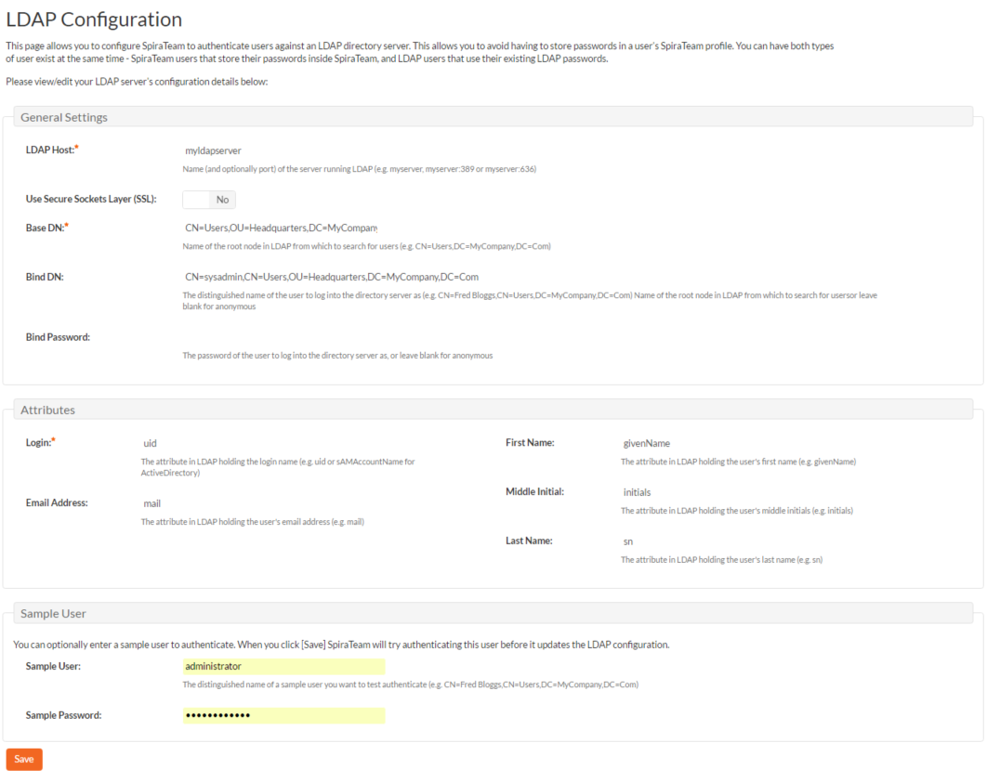

# System

## General Settings

The general settings page allows you to configure SpiraPlan® to better match your environment and setup. In the current version, you can specify the default language, or configure the folder used to store document attachments:

The available settings include:

-   **Default Culture** -- SpiraPlan can display information in a variety of different languages (assuming that the appropriate language packs have been installed) and number formats. By default, SpiraPlan will use the regional settings (language and number formats) of the operating system it has been installed on. However, you can override this default by choosing the appropriate culture from the list of options displayed in the drop-down list. *Note: The list of culture options does not reflect the available language packs, so in some cases, the setting will only change the number formats.*

-   **Default Timezone --** SpiraPlan stores all dates and times internally in Universal Coordinated Time (UTC) and can therefore display dates/times adjusted for different timezones. By default, SpiraPlan will display dates in the timezone specified in the operating system it has been installed on. However, you can override this default by choosing the appropriate display timezone from the list of options displayed in the drop-down list.

-   **Web Server URL --** This is the URL that your users use to access the system. Do not put the /Login.aspx or any other page here, as this URL is used to generate links to pages in the application.

-   **Attachments Folder** - By default when SpiraPlan® is installed, the document attachments uploaded in the system get stored inside
    the `C:\Program Files\SpiraPlan\Attachments` folder located inside the main SpiraPlan® installation root. However you may want to have the documents stored on a remotely mounted drive or on a different hard disk partition. In which case you can simply change the folder pointed to in the text-box illustrated above and then click \[Update\] to commit the change.

-   **Cache Folder** -- By default when SpiraPlan needs to store temporary data (generated reports, the version control cache, etc.) it will store them in the C:\\ProgramData\\Inflectra\\Spira folder. Sometimes this folder is not appropriate (e.g. you want them on a different drive that has more space). You can enter in a different folder for temporary storage and SpiraPlan will use that instead.

-   **Login Notice** -- this can be used system wide to set a message to permanently display at the bottom of the login screen for all users (for example, a company disclaimer).

-   **Administration Message** -- this can be used by the administrator to display a temporary notice displayed on the login screen for all users. For example it could be used to remind all users that the server will be down for upgrading over the weekend. The administrator should delete the message once it is no longer needed.

-   **Instant Messenger** -- SpiraPlan and SpiraTeam come with a built-in instant messenger that allows users to communicate with each other in real-time. This can result in higher levels of network traffic and some system administrators may wish to disable this feature. This option lets you disable the integrated instant messenger. In addition, you can specify how long (in days) instant messages are retained in the system.

-   **Event Log Retention** -- As described in  [Event Log](#event-log), SpiraPlan comes with a built-in diagnostic event log. By default the system will only retain the last 30-days of events to avoid wasting storage space. You can adjust the retention period in this section to match your organization's policies.

-   **Enable Free Text Indexes** -- This tells SpiraPlan to use SQL Server Free Text Indexing to speed up keyword searches in the Global Search box. You should only have this set to "Yes" if you have the Free Text Indexing featured enabled in SQL Server, otherwise you will cause SpiraPlan to display error messages when users try and use the global search.

-   **Use TaraVault for source code** -- This toggle is only available to cloud hosted versions of SpiraTeam and SpiraPlan. Cloud hosted applications will, by default, use [TaraVault](../TaraVault-User-Manual/Activating-TaraVault.md) for source code management. Administrators can turn off TaraVault and then connect directly to any third party source code provider they choose.

## File Type Icons

The "File Types List" administration page allows you to view all the different filetypes that are recognized by SpiraPlan and add or edit the associated icon, name, description and MIME type:

If you click on the "Edit" button next to a filetype, or click on the "Add" button at the bottom of the screen, the system will display the page that lets you add or edit a filetype entry:

On this page you can enter/edit the file extension that's used to recognize the type of file uploaded, the description of the file type (displayed in popup tooltips), the MIME type (used to determine how the browser handles the file type) and the path to the icon image. Once you are satisfied with the values, you can click on the "Save" button to confirm the changes.

## License Details

The license details page displays the information about the installed license for the particular instance of SpiraPlan® being used. This will display less information for hosted customers. The information displayed for self-hosted customers includes: the product name (e.g. SpiraPlan), the license version (e.g. v6.0.0.0), type of license in effect (x-user fixed, x-user concurrent, demonstration, enterprise, etc.), the expiration date (if any) of the license, the organization that the license belongs to, and the number of users concurrently logged-in right now. This last piece of information is useful as it helps administrators track down how many licenses are currently in use.

A sample page is illustrated below:

To change the license key used by the system (for example, if to upgrade from Trial edition to Standard edition), you do **not**
need to reinstall SpiraPlan®. All you need to do is change the
**organization** and **license key** text-boxes to match the license key and organization name found in the customer area of our website (<http://www.inflectra.com/CustomerArea>) and click the "Save" button.

If there is an issue with the license key (e.g. a trial version that is passed its expiration date, or where the license key doesn't match the organization name) an error will be displayed describing the specific issue with the information you entered. If you are unable to get the system to work with the license key information, please contact Inflectra® customer support at: <support@inflectra.com>.

## LDAP Configuration

As described previously, you can configure SpiraPlan® to use an external LDAP server for importing new user profiles into the system, and for authenticating users -- instead of having to store separate passwords inside SpiraPlan®. However, you need to first configure the LDAP server settings. To do this, click on the "LDAP Configuration" link the Administration navigation:

You need to fill out the various configuration settings for your LDAP server, each of which is explained in more detail below:

**LDAP Host
**This should contain the name of the LDAP server that you want SpiraPlan to connect to together with the port number if it's not the default of 389.

**Use Secure Sockets Layer (SSL)
**You should select this check-box if your LDAP server requires use of the LDAPS secure protocol. Leave unchecked for unencrypted LDAP communication.

**Base DN
**This should be the distinguished name of the object inside your LDAP server that contains the list of user accounts. This varies by the type of LDAP server, please consult your LDAP server documentation for more details.

**Bind DN
**This should be the distinguished name of the user inside your LDAP server that will be used to authenticate against when importing users. If not provided, SpiraPlan® will try and authenticate with the LDAP server anonymously.

**Bind Password
**The is the password of the user specified in the Bind DN field above.

**Login Attribute
**When SpiraPlan® imports users from the LDAP server it needs to know the user attribute inside the LDAP server that it should use to generate the SpiraPlan® user-name. For most LDAP servers the appropriate attribute would be "uid". However for Windows ActiveDirectory, the attribute "sAMAccountName" should be used instead.

**First Name Attribute
**Providing this optional attribute will allow SpiraPlan® to automatically populate the first name field of the imported user instead of simply using the username as a placeholder.

**Last Name Attribute
**Providing this optional attribute will allow SpiraPlan® to automatically populate the last name field of the imported user instead of simply using the username as a placeholder.

**Middle Initial Attribute
**Providing this optional attribute will allow SpiraPlan® to automatically populate the middle initial field of the imported user instead of simply leaving it blank.

**Email Address Attribute
**Providing this optional attribute will allow SpiraPlan® to automatically populate the email address field of the imported user instead of simply using the username@spiratest.com as a placeholder.

**Sample User
**You can optionally enter a sample user and password to test that the user is correctly authenticated against the server. You can update the LDAP configuration without setting this, but if you do provide a sample user/password, it will not save the configuration unless the authentication succeeds. If you choose to enter it, the user's name should be the fully-distinguished name of the user (e.g. CN=Sample User, CN=Users, OU=Headquarters, DC=MyCompany, DC=Com).

## Security Settings

The "Security Settings" administration page lets you specify the various security settings within SpiraPlan to match your organization's policies and processes:

The following settings can be changed within the system, once you are satisfied, click the "Save" button to commit the changes:

**Allow User Registration** -- Set this to "Yes" if you want to allow users to self-register for SpiraPlan accounts (that you can subsequently approve). If you set this to "No", a system administrator will need to create all user accounts. Also set this to "No" if you plan on using LDAP-based authentication.

**Maximum \# Invalid Password Attempts** -- Set this to the number of times a user can enter an incorrect password before their account is temporarily locked out. This is important in preventing 'brute force'
password hacking attempts.

**Minimum Required Password Length** -- Set this to the minimum length of passwords in the system. Choosing a longer password will make it harder for an unauthorized user to crack a password and gain entry into the system.

**Minimum Required Special Characters** - Set this to the minimum number of non-alphanumeric characters that will be required for passwords in the system. Choosing more required special characters will make it harder for an unauthorized user to crack a password and gain entry into the system.

**Password Attempt Time Window** -- Set this to the duration (in minutes) after which a user's account will be automatically unlocked (due to repeated incorrect password attempts).

**Password Change Interval --** If set to a value, it will require all password to be changed after the specified number of days.

**Require Password Change on First Login --** Enabling this requires all new users to change their password on first login.

**Disallow Names in Passwords --** If enabled, passwords cannot contain the user's real name and/or username.

**Authentication Expiration** -- This specifies the amount of time (in minutes) after which a user will be logged out due to inactivity when they login without choosing the 'Keep Me Logged-In' option.

**Keep Me Logged-In Expiration** - This specifies the amount of time (in minutes) after which a user will be logged out due to inactivity if they have chosen to login with the 'Keep Me Logged-In' option. This should normally be longer than the previous setting.

**Allowed Domains -** This should contain the list of other web domains that are allowed to make CORS (cross-origin) REST API calls to this instance. You can specify a comma separated list of base URLs (e.g. https://www.domain1.com, http://www.domain2.com) or an asterisk (\*) to denote all domains are allowed (not recommended).

## TaraVault®

*This section refers to the functionality available to hosted/cloud customers of SpiraPlan. If you are using the on-premise version of SpiraPlan, please refer to [Version Control Integration](../System-Integration/#version-control-integration-on-premise-customers-only) instead.*

TaraVault® is the hosted source code repository and software configuration management (SCM) system provided by Inflectra. When you signed-up or purchased a subscription to either SpiraPlan or SpiraTeam, it will have come with an entry-level subscription to TaraVault.

When you first click on the Administration \> TaraVault administration page, you will see the following screen:

This lets you know that you have not yet activated your TaraVault account with Inflectra. When you click on the \[Activate TaraVault\]
button you will see the following:

This will let you see how many TaraVault SCM users your subscription allows and also the name of the TaraVault instance that your SpiraPlan instance is associated with.

Each product in SpiraPlan has its own corresponding TaraVault product, and each TaraVault product can be configured to use one of the two different SCM providers:

-   **Subversion (SVN)** -- This is a simple, centralized version control system (VCS) that works best for teams that want to have a centralized SCM environment with only one central instance of the SCM repository. Subversion only allows a single branch to be managed and is generally easier to understand conceptually.

-   **Git** -- This is a more powerful, distributed version control system (DVCS) that works best for teams that want to have multiple distributed instances of their source code repository. Git offers superior merging and branching functionality to Subversion but is generally more complicated to understand conceptually.

For the current SpiraPlan product you can choose the type of provider you wish to use, enter the name of the TaraVault product and click Activate:

Since you cannot change the type or name of the TaraVault product once activated, please review your entries and click \[OK\] to confirm the new product activation.

Once the product activation has been completed, the screen will display the following:

The screen will display the name of the linked TaraVault product as well as the list of TaraVault SCM users that are configured to use this TaraVault product -- this list will not necessarily be all of the users in the SpiraPlan product, just those that need to connect to TaraVault to commit source code into the repository.

If you want to deactivate this TaraVault product, click the
\[Deactivate\] button and the product will be removed from TaraVault.

To improve performance, SpiraPlan will cache some of the data it receives from TaraVault. Normally SpiraPlan will know when to update the cached data based on changes made in TaraVault automatically. However sometimes you may wish to flush the cached data completed, to do this, click on the \[Clear Cache\] button.

To add new SCM users to the TaraVault product, click on the 'Add Users'
link to add new SCM users to the product.

## Event Log

The "System Event Log" administration page lets you view all of the errors, warning and other diagnostic messages that have been logged in the system:

Each event entry is displayed along with the date-time it occurred, the type of event (error, warning, information, success audit, failure audit), category (application, source code provider, data-synchronization) and the short name. To view the full message, click on the "View Item" hyperlink:

The popup dialog box will display the full error message log and stack trace in a moveable dialog box. This information should be provided to Inflectra customer support if you log a help desk ticket.

## Testing Settings

Clicking on the "Testing Settings" link brings up a list of options that the administrator can configure regarding testing. Select from the options displayed (as illustrated below) and click "Save" to commit the changes.

You can enable or disable the following settings:

-   **Display Build During Test Execution** -- During test execution the system can display a drop-down list of builds associated with the selected release. If you are using SpiraPlan in conjunction with a build server such as Jenkins/Hudson, you should choose "Yes", otherwise we recommend hiding the list of builds (to avoid confusing your testers) by choosing "No".

-   **Auto Unassign Tests** -- When a tester passes an assigned test case or all the test cases in an assigned test set the system by default will automatically un-assign the test case / test set from the user. To prevent this from happening, change either setting to "No".

-   **Auto create a test step** - Automatically creating a default test step on the creation of any test case

-   **Worx Integration** -- Integrating with the Worx desktop application

## Email Configuration

The Email Configuration page is split into two sections. The first section covers email notification details, and the second section configures how email from the application is sent.

-   **Email Notifications Active?** -- Defaults to Yes. If changed to No, the system will not send out any emails, regardless of other settings. Note that this means that new user requests will not get sent either.

-   **From Email Address --** This is the email address specified in the
'From:' field of email notifications sent from the application.

-   **Reply-To Email Address --** This is the address specified in the
'ReplyTo:' field for notification emails sent from the application.

-   **Send HTML Emails?** -- Defaults to Yes. This option specifies whether HTML or Plain-Text emails are sent from the system.

-   **Allow Users Control of Receiving Emails?** -- Defaults to Yes. This specifies whether or not a user can modify their profile to not receive any emails from the system. If set to no, users' preference will be enabled and locked out.

To use the internal IIS's default virtual SMTP server, leave all fields blank. The virtual server must then be configured to use proper SMTP server and network configuration. If you want the application to contact an SMTP server directly, use the following fields:

-   **Host Name --** This is the SMTP server to connect to.

-   **Port Number --** This is the port number to use, blank uses the default port 25.

-   **SSL Connection --** Whether or not to use an SSL connection with the server. Be sure that the SMTP server's SSL certificate is trusted on the application server.

-   **User Name --** When using an authentication method, this is the username to log in as.

-   **Password --** When using an authentication method, this is the password to use.

Example settings for connecting to Gmail/Google Mail for sending notifications:

-   **Host Name:** smtp.gmail.com

-   **Port Number:** 587

-   **SSL Connection:** Yes

-   **User Name:** "account"@gmail.com

-   **Password:** "account password"

