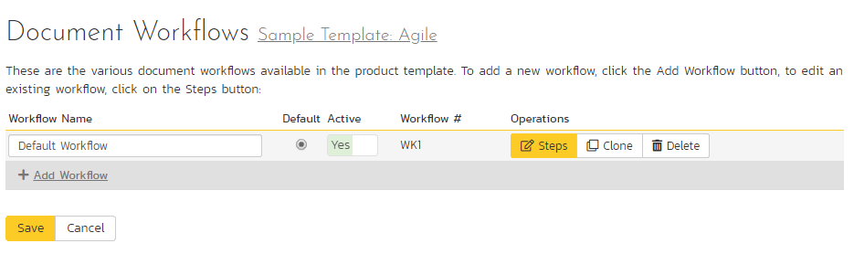
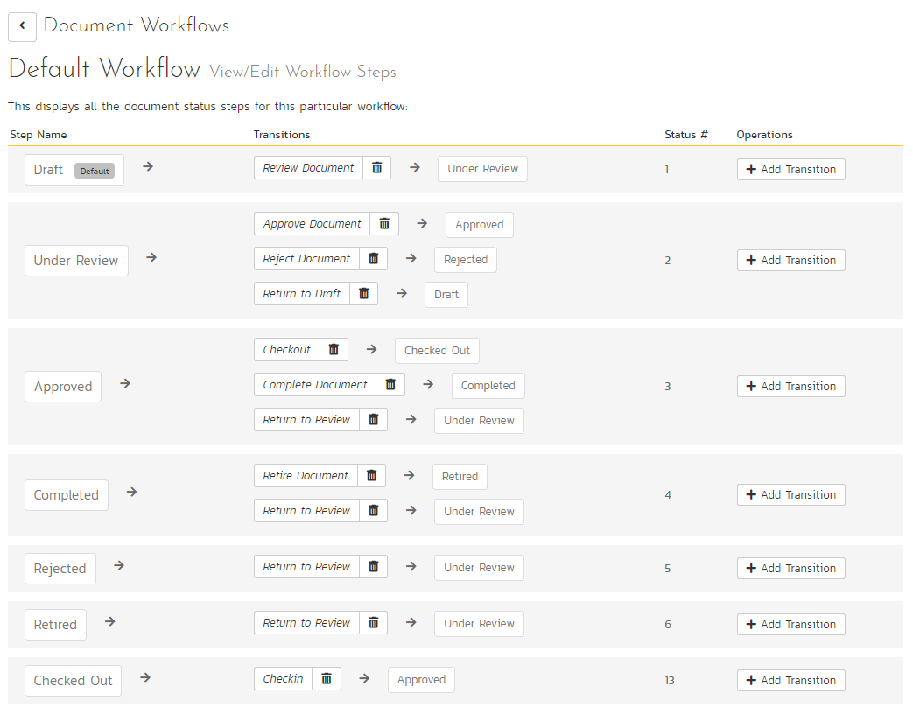
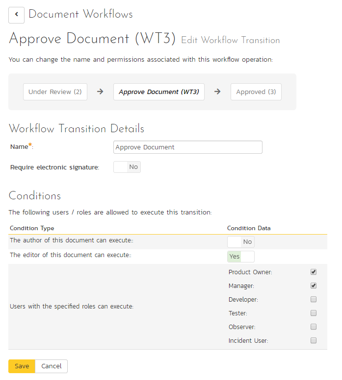

# Template: Documents

SpiraPlan® includes a built-in web-based document management system that allows you to upload and share documents between product team members. These documents are stored in folders, categorized by a series of user-defined meta-tags and can also be associated with other artifacts in the system (e.g. requirements, incidents, etc.).

The set of administrative options located under the "Documents" heading allow the Template Owner to configure how the documents are organized in their particular template.

## Document Types

When users upload documents into a SpiraPlan product, they are required to specify the type of document that is being uploaded. The list of document types is configurable by the Template Owner for each individual template.

When you click on Documents "Types", you can edit the list of types available:

By default, each template will be created with a single document type called 'Default'. You can add additional document types and/or change the name of the ones already created. If you decide that you no longer want to use a specific document type, you can set its active flag to "No".

The only requirement is that each template needs to have at least one active document type available, and that there is one active type designated as the default type. The default type is the option that will be initially selected when a user uploads a file / URL to the template's product(s).

## Document Statuses

The following screen is displayed when you choose the "Statuses" link from the Documents section of the administration menu:

The screen displays a list of all the defined document statuses for the current template. By default, the screen will be populated with the standard SpiraPlan® document statuses. To edit an existing document status, change the name, open check-box, set it as the default status and/or change the active flag then click "Save".

You can't delete an existing document status, but to prevent it appearing in any drop-down-lists, change its active flag to "No" and click "Save". To add a new document status, click the "Add" button and a new row will be added to the list which you can now edit.

The open check-box allow you to specify if the document status should be considered open or not, which means it is would be eligible for display in the various sections of the user's home page and the product home page that list open document. The default radio button allows you to specify which document status should be the default for newly created documents. This is the status that a new document will be set to when first created, and acts as the first step in the document workflow. Note that you must have at least one active incident status, and you cannot set a document status as the default.

## Document Workflows

Clicking on the "Workflows" link in the Administration menu Documents section brings up the list of defined document workflows for the current template. A workflow is a predefined sequence of document statuses linked together by "workflow transitions" to enable a newly created document to be reviewed, prioritized, assigned, resolved and closed, as well as to checking documents in and out of the system. The workflow list screen for a sample template is illustrated below:

To modify the name, default status, notify and/or active flags, change the values in the appropriate text-box, radio-button, check-box or drop-down list and click the "Save" button. To add a new workflow, click the "Add" button and a new workflow will be created with the standard SpiraPlan® steps and transitions.

You can have as many document workflows as you like in a template, but only one can be marked as the default. Each document type is assigned to a workflow; this allows you to have different document types follow different paths from creation of closure. However, when a new document type is created, it will be initially associated with the template's default workflow.

Note: You can only assign an active workflow to a document type, and similarly you cannot make a workflow inactive that is currently linked to a document type. This is important as all document types need to be linked to an active workflow at all times.

### Workflow Details

Clicking on the "Steps" button of a workflow brings up the following screen that lists all the workflow steps and workflow transitions that comprise the workflow:

This page lists in the left-most column all the various document statuses defined for the template. The next column lists all the possible transitions that can occur *from that status*. In addition, to the right of each transition is the name of the resulting *destination status* that the transition leads to. E.g. from the Under Review status, depending on your role (see later) you can move the document to either Approved, Rejected or Draft depending on which transition the user takes.

Clicking on the name of a step or transition takes you to the appropriate details page (see below) where you can set the properties of the step or transition respectively. To delete an existing transition, click the "x" button after the transition name, and to add a new transition, click the "Add Transition" button in the Operations column.

### Edit Workflow Transition

When you click on the transition name link from the previous screen, you are taken to the workflow transition details screen:

The top part of the screen is the "workflow browser" which illustrates how the transition relates to the workflow as a whole. It displays the current transition in the middle, with the originating and destination steps listed to either side. Clicking on either document status name will take you to the appropriate workflow step details page. This allows you to click through the whole workflow from start to finish without having to return to the workflow details page.

If a digital signature from the user is required to authorize and record the transition, set the toggle to yes for "Require Electronic Signature".

Each transition has a series of conditions which need to be satisfied for a user to actually execute the transition (i.e. move the document from the originating status to the destination status).

### Edit Workflow Step

When you click on the document status name link from either of the previous screens, you are taken to the workflow step details screen:

The top part of the screen is the "workflow browser" which illustrates how the step relates to the workflow as a whole. It displays the current document status in the middle, with the possible originating and destination transitions listed to either side. Clicking on either workflow transition name will take you to the appropriate workflow transition details page. This allows you to click through the whole workflow from start to finish without having to return to the workflow details page.

This page allows you to define the behavior of the various document fields (i.e. those that are a standard part of SpiraPlan® such as Type):

This page also allows you to define the behavior of the various document custom properties for this particular step in the workflow:

You can set each of the fields/custom properties as being:

- **Default**: the field or custom property will be displayed as normal (it can be edited and also be left empty)
- **Hidden**: the field or custom property will not be completely hidden
- **Disabled**: the field or custom property will be displayed but read-only (and grayed-out)
- **Required**: the field or custom property is required and cannot be empty

After you have made the desired changes, click "Save".

Note that **the "Versions" field has a special meaning**. It related to the Versions tab on the Document details page. When hidden, users are not able to see any version information (the whole tab is hidden). When disabled, users cannot upload a new version. When required, a new version must have been recently uploaded by the current user for the document to be saved, and no changes made to the document between the version being uploaded and now.  

## Example Workflow
Below is a diagram that shows an example workflow (the one used by the sample product "Library Information System") for documents.

