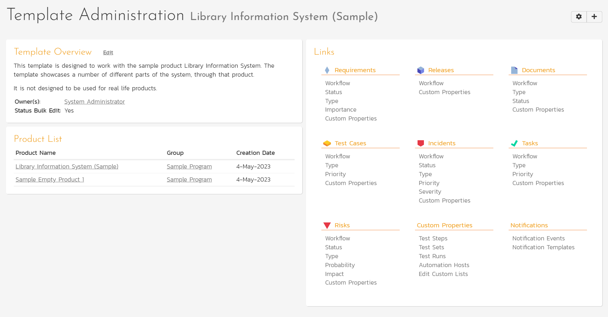

# Template: Home Page
The Template Administration Home page is accessible to users whose product role includes template admin permission. It provides template administrators with quick access to important information. There are multiple ways to navigate to it: 

- In the main workspace dropdown, in the dedicated Templates section at the bottom, click on the template name.
- First select a product. Then click the "Administration" link in the upper right. This will display the context aware administration menu popup. Then click on the Template section heading. 
- From the product admin home page, within the Product Overview widget, click on the template link.

## Template Overview
This widget shows a list of its owners. Click the Edit link to go to the [template editing page](../System-Workspaces/#view-edit-templates). From here you can edit a number of properties about the template, including its name.

## Product List
This widget shows a list of the products which use this template.

## Links
This widget provides an alternate way to access the template-specific configuration pages.

