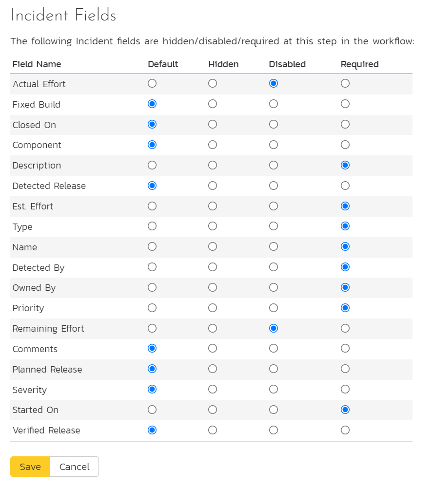

# Template: Incidents

In addition to being able to create custom properties and values for incidents (same as for all artifacts in SpiraPlan®), you can also change the values populated in many of the standard fields used in the incident tracker -- types, statuses, priorities and severities. The process for changing each of these is described below:

## Edit Types

The following screen is displayed when you choose the "Types" link from the Incidents section of the administration menu:

The screen displays a list of all the defined incident types for the current template. By default the screen will be populated with the standard SpiraPlan® incident types. To edit an existing incident type, change the name, associated workflow, issue check-box, risk check-box, set a default type and/or change the active flag then click "Save".

You can't delete an existing incident type, but to prevent it appearing in any drop-down-lists, all you need to do is change its active flag to "No" and click "Save". To add a new incident type, click the "Add" button and a new row will be added to the list which you can now edit.

The associated workflow drop-down list allows you to specify which workflow the incident type will follow. This is a very powerful feature since it allows you to configure different workflows for different incident types; i.e. a bug may follow a workflow geared to identification and resolution, whereas a risk may only need a much simpler set of steps and actions.

The issue check-boxes allow you to specify if the incident type is an issue, which means it would be eligible for display in the issue section of the product home page. The default radio button allows you to specify which incident type should be the default for newly created incidents. This is the type that a new incident will be set to unless changed by the creator of the incident. Note that you must have at least one active incident type, and you cannot set an inactive type as the default.

## Edit Statuses

The following screen is displayed when you choose the "Statuses" link from the Incidents section of the administration menu:

The screen displays a list of all the defined incident statuses for the current template. By default, the screen will be populated with the standard SpiraPlan® incident statuses. To edit an existing incident status, change the name, open check-box, set it as the default status and/or change the active flag then click "Save".

You can't delete an existing incident status, but to prevent it appearing in any drop-down-lists, all you need to do is change its active flag to "No" and click "Save". To add a new incident status, click the "Add" button and a new row will be added to the list which you can now edit.

The open check-box allow you to specify if the incident status should be considered open or not, which means it is would be eligible for display in the various sections of the user's home page and the product home page that list open incidents. The default radio button allows you to specify which incident status should be the default for newly created incidents. This is the status that a new incident will be set to when first created, and acts as the first step in the incident workflow. Note that you must have at least one active incident status, and you cannot set an inactive status as the default.

## Priorities

The following screen is displayed when you choose the "Priorities" link from the Incidents section of the administration menu:

The screen displays a list of all the defined incident priorities for the current template. By default, the screen will be populated with the standard SpiraPlan® incident priorities. To edit an existing incident priority, change the name, color and/or change the active flag then click "Save". Note that you can either enter the hexadecimal RRGGBB code for the color or use the pop-up color picker.

You can't delete an existing incident priority, but to prevent it appearing in any drop-down-lists, all you need to do is change its active flag to "No" and click "Save". To add a new incident priority, click the "Add" button and a new row will be added to the list which you can now edit.

## Severities

The following screen is displayed when you choose the "Severities" link from the Incidents section of the administration menu:

The screen displays a list of all the defined incident severities for the current template. By default, the screen will be populated with the standard SpiraPlan® incident severities. To edit an existing incident severity, change the name, color and/or change the active flag then click "Save". Note that you can either enter the hexadecimal RRGGBB code for the color or use the pop-up color picker.

You can't delete an existing incident severity, but to prevent it appearing in any drop-down-lists, all you need to do is change its active flag to "No" and click "Save". To add a new incident severity, click the "Add" button and a new row will be added to the list which you can now edit.

## Incident Workflows

Clicking on the "Workflows" link in the Administration menu brings up the list of defined incident workflows for the current template. A workflow is a predefined sequence of incident statuses linked together by "workflow transitions" to enable a newly created incident to be reviewed, prioritized, assigned, resolved and closed, as well as to handle exception cases such as the case of a duplicate or non-reproducible incident. The workflow list screen for a sample template is illustrated below:

To modify the name, default status, notify and/or active flags, change the values in the appropriate text-box, radio-button, check-box or drop-down list and click the "Save" button. To add a new workflow, click the "Add" button and a new workflow will be created with the standard SpiraPlan® steps and transitions.

You can have as many workflows as you like in a template, but only one can be marked as the default. Each incident type is assigned to a workflow; this allows you to have different incident types follow different paths from creation of closure. However when a new incident type is created, it will be initially associated with the template's default workflow. The steps and transitions that make up the default workflow are illustrated in the diagram below:

The notify flag is used to tell SpiraPlan® whether that particular workflow should have email notifications turned on or off. You define what transitions and which recipients should receive the emails in the workflow transition editor (see below), but you can globally turn on/off notifications here as well. This is useful if you find that the notifications are becoming an annoyance, or if the email server is unavailable for a period of time.

Note: You can only assign an active workflow to an incident type, and similarly you cannot make a workflow inactive that is currently linked to an incident type. This is important as all incident types need to be linked to an active workflow at all times.

### Edit Workflow Details

Clicking on the "Steps" button of a workflow brings up the following screen that lists all the workflow steps and workflow transitions that comprise the workflow:

This page lists in the left-most column all the various incident statuses defined for the template. The next column lists all the possible transitions that can occur *from that status*. In addition, with each transition is listed the name of the resulting *destination status* that the transition leads to. E.g. from the assigned status, depending on your role (see later) you can move the incident to either duplicate, resolves or not-reproducible depending on which transition the user takes.

Clicking on the name of a step or transition takes you to the appropriate details page (see below) where you can set the properties of the step or transition respectively. To delete an existing transition, click the "x" button after the transition name, and to add a new transition, click the "Add Transition" button in the Operations column.

### Edit Workflow Transition

When you click on the transition name link from the previous screen, you are taken to the workflow transition details screen:

The top part of the screen is the "workflow browser" which illustrates how the transition relates to the workflow as a whole. It displays the current transition in the middle, with the originating and destination steps listed to either side. Clicking on either incident status name will take you to the appropriate workflow step details page. This allows you to click through the whole workflow from start to finish without having to return to the workflow details page.

This part of the screen lets you change the name of the transition and specify the subject line of any email notifications sent as part of this transition. To view the list of special tokens that can be used in the email subject, click on the "Display Email Subject Special Tokens" hyperlink:

If a digital signature from the user is required to authorize and record the transition, set the toggle to yes for "Require Electronic Signature".

Each transition has a series of conditions which need to be satisfied for a user to actually execute the transition (i.e. move the incident from the originating status to the destination status):

Each transition also has a set of notification rules that allow you to specify who should get an email notification if the transition is executed.

Both the conditions and notifications allow you to set three types of user role:

The detector of the incident can be allowed to execute the transition, and/or be notified when the transition occurs. For example, when an incident is marked as Resolved, the detector should be the only one who's allowed to move it to Closed. Similarly when an incident is moved from Assigned to Resolved, the detector should probably be notified so that he knows to log in and verify that it has been resolved satisfactorily.

The owner of the incident can be allowed to execute the transition, and/or be notified when the transition occurs. For example, when an incident is marked as Assigned, the assigned owner should be the only one who's allowed to move it to Resolved. Similarly when an incident is moved from Open to Assigned, the owner should probably be notified so that he knows to log in and begin resolving the incident.

A user with a specified role can be allowed to execute the transition, and/or be notified when the transition occurs regardless of whether they are the detector or owner. For example a user with role "Manager" might want the power to close all incidents regardless of ownership status, and might also want to be notified when any incident is marked as Not-Reproducible.

> You can set any of these conditions by changing the drop-down list > and/or check-boxes and clicking the appropriate "Save" button.

### Edit Workflow Step

When you click on the incident status name link from either of the previous screens, you are taken to the workflow step details screen:

The top part of the screen is the "workflow browser" which illustrates how the step relates to the workflow as a whole. It displays the current incident status in the middle, with the possible originating and destination transitions listed to either side. Clicking on either workflow transition name will take you to the appropriate workflow transition details page. This allows you to click through the whole workflow from start to finish without having to return to the workflow details page.

This page allows you to define the behavior of the various incident fields (i.e. those that are a standard part of SpiraPlan® such as Priority):

This page also allows you to define the behavior of the various incident custom properties for this particular step in the workflow:

You can set each of the fields/custom properties as being:

**Hidden** -- The field / custom property will not be displayed when the incident is in this status

**Disabled** -- The field / custom property will be displayed, but will be greyed-out and read-only

**Required** -- The field / custom property will be required when the incident is in this status

Note that you cannot set a field/property as being required and either disabled or hidden since this would prevent a user from ever updating the incident. For example, when an incident is in the New status, you might make the owner field hidden (since a detector shouldn't need to know who will ultimately own it), when it gets to the Open status, you might make the field active, and when it gets to the Assigned status, you might make it active and required. This allows you to tailor the information gathered to the appropriate place in the workflow.

To actually make these changes, all you need to do is select the appropriate checkboxes in the list of fields and custom properties and click the corresponding "Save" button.

## Example Workflow
Below is a diagram that shows an example workflow (the one used by the sample product "Library Information System") for incidents.

