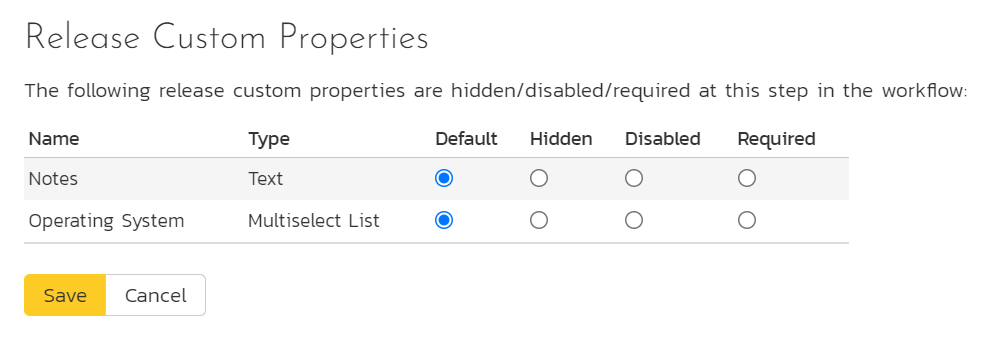

# Template: Releases

## Release Workflows

Clicking on the "Release Workflows" link under the Planning heading, brings up the list of defined release workflows for the current template. A workflow is a predefined sequence of release statuses linked together by "workflow transitions" to enable a newly created release to be reviewed, prioritized, assigned, developed and tested, as well as to handle exception cases such as the case of a cancelled or deferred release. The workflow list screen for the sample template is illustrated below:

The screen displays a list of all the standard release types in the system. The associated workflow drop-down list allows you to specify which workflow the release type will follow. This is a very powerful feature since it allows you to configure different workflows for different release types; i.e. a Major release may follow a different process than an iteration.

You can have as many workflows as you like in a template, but only one can be marked as the default. Each release type must be assigned to a workflow. To modify the name, default flag, and/or active flag of an existing workflow, change the values in the appropriate text-box, radio-button, or drop-down list and click the "Save" button. To add a new workflow, click the 'Add Workflow' link and a new workflow will be created with the standard SpiraPlan® steps and transitions.

Note: You can only assign an active workflow to a release type, and similarly you cannot make a workflow inactive that is currently linked to a release type. This is important as all release types need to be linked to an active workflow at all times.

### Edit Workflow Details

Clicking on the 'Steps' hyperlink of a workflow brings up the following screen that lists all the workflow steps and workflow transitions that comprise the workflow:

This page lists in the left-most column all the various release statuses defined in the system. The next column lists all the possible transitions that can occur *from that status*. In addition, with each transition is listed the name of the resulting *destination status* that the transition leads to. E.g. from the Planned status, depending on your role (see later) the user can move the release to either Cancelled, Deferred, or In Progress, depending on which transition the user takes.

Clicking on the name of a step or transition takes you to the appropriate details page (see below) where you can set the properties of the step or transition respectively. To delete an existing transition, click the 'x button after the transition name, and to add a new transition, click the 'Add Transition' button in the Operations column.

### Edit Workflow Transition

When you click on the transition name link from the previous screen, you are taken to the workflow transition details screen:

The top part of the screen is the "workflow browser" which illustrates how the transition relates to the workflow as a whole. It displays the current transition in the middle, with the originating and destination steps listed to either side. Clicking on either task status name will take you to the appropriate workflow step details page. This allows you to click through the whole workflow from start to finish without having to return to the workflow details page.

This part of the screen lets you change the name of the transition. If a digital signature from the user is required to authorize and record the transition, set the toggle to yes for "Require Electronic Signature".

In addition, each transition has a series of conditions which need to be satisfied for a user to actually execute the transition (i.e. move the release from the originating status to the destination status):

The conditions section allows you to set three types of user role:

The author of the release can be allowed to execute the transition. For example, when a release is marked as Completed, the author might be allowed to move it to In Progress if there is still work remaining.

The owner of the release can be allowed to execute the transition. For example, when a release is marked as In Progress, the assigned owner should be the only one who's allowed to move it to Competed.

A user with a specified role can be allowed to execute the transition regardless of whether they are the author or owner. For example a user with role "Manager" might want the power to defer all releases regardless of ownership status.

> You can set any of these conditions by changing the drop-down list > and/or check-boxes and clicking the appropriate "Save" button.

### Edit Workflow Step

When you click on the release status name link from either of the previous screens, you are taken to the workflow step details screen:

The top part of the screen is the "workflow browser" which illustrates how the step relates to the workflow as a whole. It displays the current release status in the middle, with the possible originating and destination transitions listed to either side. Clicking on either workflow transition name will take you to the appropriate workflow transition details page. This allows you to click through the whole workflow from start to finish without having to return to the workflow details page.

This page allows you to define the behavior of the various release fields (i.e. those that are a standard part of SpiraPlan® such as Priority):

This page also allows you to define the behavior of the various release custom properties for this particular step in the workflow:

You can set each of the fields/custom properties as being:

- **Default**: the field or custom property will be displayed as normal (it can be edited and also be left empty)
- **Hidden**: the field or custom property will not be completely hidden
- **Disabled**: the field or custom property will be displayed but read-only (and grayed-out)
- **Required**: the field or custom property is required and cannot be empty

For example, when a release is in the Planned status, you might make the owner field hidden (since the author shouldn't need to know who will ultimately own it), when it gets to the In Progress status, you might make the field enabled and required, and when it gets to the Completed status, you might make it disabled. This allows you to tailor the information gathered to the appropriate place in the workflow.

Set the fields as desired and click "Save".

## Example Workflow
Below is a diagram that shows an example workflow (the one used by the sample product "Library Information System") for releases.

