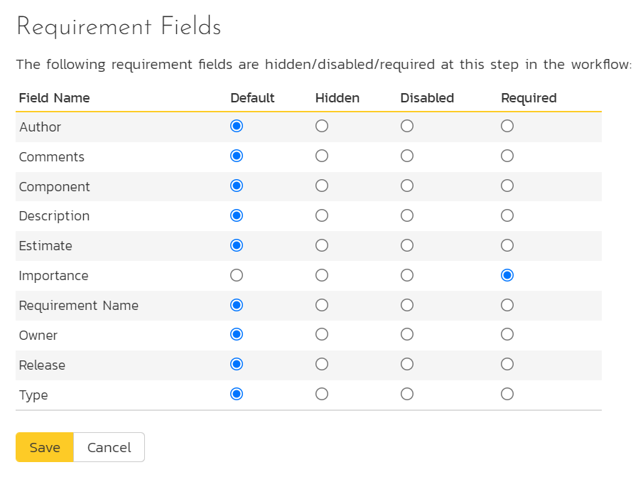
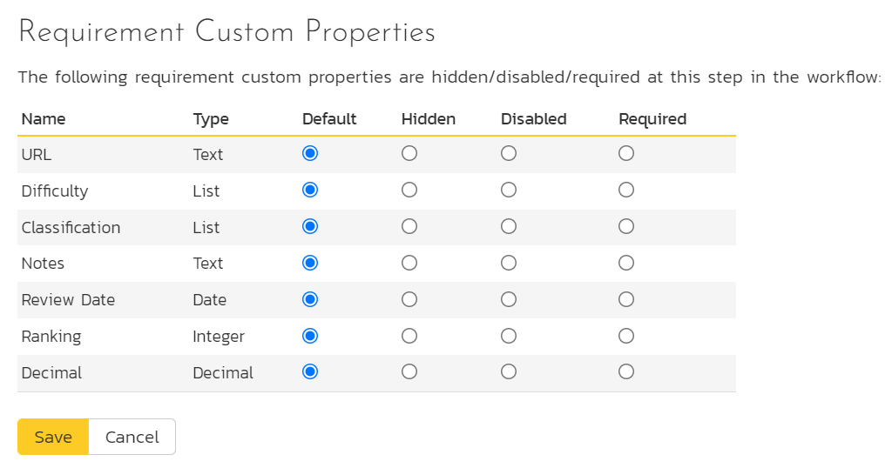

# Template: Requirements

This section contains administrative options that are specific to the requirements functionality in the system.

## Importance

The following screen is displayed when you choose the "Importance" link from the Requirements section of the administration menu:

The screen displays a list of all the defined requirement importances for the current template. By default the screen will be populated with the standard SpiraPlan® requirement importances. To edit an existing requirement importance, change the name, color, score (this is used for ranking the different items -- the item with the lowest score will appear at the top of dropdown lists in the application), and/or change the active flag then click "Save".

Note that you can either enter the hexadecimal RRGGBB code for the color or use the pop-up color picker.

You can't delete an existing requirement importance, but to prevent it appearing in any drop-down-lists, change its active flag to "No" and click "Save". To add a new requirement importance, click the "Add" button and a new row will be added to the list which you can now edit.

## Types

The following screen is displayed when you choose the "Types" link from the Requirements section of the administration menu:

The screen displays a list of all the defined requirement types for the current template. By default the screen will be populated with the standard SpiraPlan® requirement types. To edit an existing requirement type, change the name, associated workflow, issue check-box, risk check-box, set a default type and/or change the active flag then click "Save".

You can't delete an existing requirement type, but to prevent it appearing in any drop-down-lists, change its active flag to "No" and click "Save". To add a new requirement type, click the "Add" button and a new row will be added to the list which you can now edit.

The associated workflow drop-down list allows you to specify which workflow the requirement type will follow. This is a very powerful feature since it allows you to configure different workflows for different requirement types; i.e. a User Story may follow a simpler review process than a Feature or Use Case requirement.

The Has Steps check-box allows you to specify if the requirement type should be able to contain scenario steps (as is typical with use cases).

The default radio button allows you to specify which requirement type should be the default for newly created requirements. This is the type that a new requirement will be set to unless changed by the creator of the requirement. Note that you must have at least one active requirement type, and you cannot set an inactive type as the default.

## Workflows

Clicking on the "Workflow" link under the Requirements heading, brings up the list of defined requirement workflows for the current template. A workflow is a predefined sequence of requirement statuses linked together by "workflow transitions" to enable a newly created requirement to be reviewed, prioritized, assigned, developed and tested, as well as to handle exception cases such as the case of a rejected or obsolete requirement. The workflow list screen for the sample template is illustrated below:

You can have as many workflows as you like in a template, but only one can be marked as the default. Each requirement type must be assigned to a workflow. To modify the name, default flag, and/or active flag of an existing workflow, change the values in the appropriate text-box, radio-button, or drop-down list and click the "Save" button. To add a new workflow, click the 'Add Workflow' link and a new workflow will be created with the standard SpiraPlan® steps and transitions.

Note: You cannot make a workflow inactive that is currently linked to a requirement type. This is important as all requirement types need to be linked to an active workflow at all times.

### Edit Workflow Details

Clicking on the 'Steps' button of a workflow brings up the following screen that lists all the workflow steps and workflow transitions that comprise the workflow:

This page lists in the left-most column all the various requirement statuses defined in the system. The next column lists all the possible transitions that can occur *from that status*. In addition, with each transition is listed the name of the resulting *destination status* that the transition leads to. E.g. from the Requested status, depending on your role (see later) the user can move the requirement to either Accepted or Under Review, depending on which transition the user takes.

Clicking on the name of a step or transition takes you to the appropriate details page (see below) where you can set the properties of the step or transition respectively. To delete an existing transition, click the 'x button after the transition name, and to add a new transition, click the 'Add Transition' button in the Operations column.

### Edit Workflow Transition

When you click on the transition name link from the previous screen, you are taken to the workflow transition details screen:

The top part of the screen is the "workflow browser" which illustrates how the transition relates to the workflow as a whole. It displays the current transition in the middle, with the originating and destination steps listed to either side. Clicking on either requirement status name will take you to the appropriate workflow step details page. This allows you to click through the whole workflow from start to finish without having to return to the workflow details page.

This part of the screen lets you change the name of the transition. If a digital signature from the user is required to authorize and record the transition, set the toggle to yes for "Require Electronic Signature".

In addition, each transition has a series of conditions which need to be satisfied for a user to actually execute the transition (i.e. move the requirement from the originating status to the destination status):

The conditions section allows you to set three types of user role:

The author of the requirement can be allowed to execute the transition. For example, when a requirement is marked as Completed, the author might be allowed to move it to Obsolete when it's no longer applicable.

The owner of the requirement can be allowed to execute the transition. For example, when a requirement is marked as Under Review, the assigned owner should be the only one who's allowed to move it to Accepted.

A user with a specified role can be allowed to execute the transition regardless of whether they are the author or owner. For example a user with role "Manager" might want the power to close all requirements regardless of ownership status.

> You can set any of these conditions by changing the drop-down list > and/or check-boxes and clicking the appropriate "Save" button.

### Edit Workflow Step

When you click on the requirement status name link from either of the previous screens, you are taken to the workflow step details screen:

The top part of the screen is the "workflow browser" which illustrates how the step relates to the workflow as a whole. It displays the current requirement status in the middle, with the possible originating and destination transitions listed to either side. Clicking on either workflow transition name will take you to the appropriate workflow transition details page. This allows you to click through the whole workflow from start to finish without having to return to the workflow details page.

This page allows you to define the behavior of the various requirement fields (i.e. those that are a standard part of SpiraPlan® such as Importance):

This page also allows you to define the behavior of the various requirement custom properties for this particular step in the workflow:

You can set each of the fields/custom properties as being:

- **Default**: the field or custom property will be displayed as normal (it can be edited and also be left empty)
- **Hidden**: the field or custom property will not be completely hidden
- **Disabled**: the field or custom property will be displayed but read-only (and grayed-out)
- **Required**: the field or custom property is required and cannot be empty

For example, when a requirement is in the Requested status, you might make the owner field hidden (since the author shouldn't need to know who will ultimately own it), when it gets to the Accepted status, you might make the field enabled, and when it gets to the In Progress status, you might make it enabled and required. This allows you to tailor the information gathered to the appropriate place in the workflow.

After you have made the desired changes, click "Save".

## Example Workflow
Below is a diagram that shows an example workflow (the one used by the sample product "Library Information System") for requirements.

