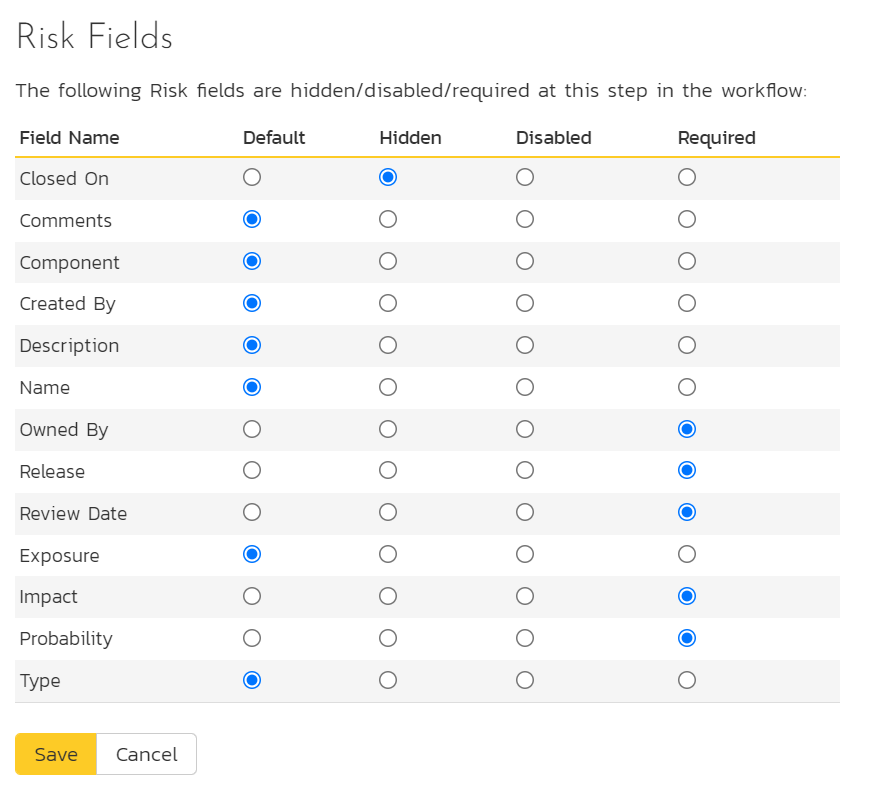

# Template: Risks

This section contains administrative options that are specific to the risk functionality in the system.

## Edit Types

The following screen is displayed when you choose the "Types" link from the Incidents section of the administration menu:

The screen displays a list of all the defined risk types for the current template. By default, the screen will be populated with the standard risk types. To edit an existing type, change the name, associated workflow, set a default type and/or change the active flag then click "Save".

You can't delete an existing risk type, but to prevent it appearing in any drop-down-lists, change its active flag to "No" and click "Save". To add a new type, click the "Add" button and a new row will be added to the list which you can now edit.

The associated workflow drop-down list allows you to specify which workflow the type will follow. This is a very powerful feature since it allows you to configure different workflows for different risk types.

The default radio button allows you to specify which type should be the default for newly created risks. This is the type that a new risk will be set to unless changed by the creator of the risk. Note that you must have at least one active risk type, and you cannot set an inactive type as the default.

## Edit Statuses

The following screen is displayed when you choose the "Statuses" link from the Risks section of the administration menu:

The screen displays a list of all the defined risk statuses for the current template. By default, the screen will be populated with the standard risks statuses. To edit an existing status, change the name, open check-box, set it as the default status and/or change the active flag then click "Save".

You can't delete an existing risk status, but to prevent it appearing in any drop-down-lists, change its active flag to "No" and click "Save". To add a new risk status, click the "Add" button and a new row will be added to the list which you can now edit.

The open check-box allow you to specify if the risk status should be considered open or not, which means it is would be eligible for display in the various sections of the user's home page and the product home page that list open risks. The default radio button allows you to specify which risk status should be the default for newly created risks. This is the status that a new risk will be set to when first created, and acts as the first step in the risk workflow. Note that you must have at least one active status, and you cannot set an inactive status as the default.

## Impact

The following screen is displayed when you choose the "Impact" link from the Risks section of the administration menu. The impact of a risk specifies how serious it will be if the risk happens.

The screen displays a list of all the defined risk impacts for the current template. By default, the screen will be populated with the standard risk impacts. To edit an existing impact: change the name, color, score (which is used, together with a risks probability to calculate its exposure), position, or change the active flag then click "Save". Note that you can either enter the hexadecimal RRGGBB code for the color or use the pop-up color picker.

You can't delete an existing impact, but to prevent it appearing in any drop-down-lists, change its active flag to "No" and click "Save". To add a new impact, click the "Add" button and a new row will be added to the list which you can now edit.

## Probability

The following screen is displayed when you choose the "Probability" link from the Risks section of the administration menu:

The screen displays a list of all the defined risk probabilities for the current template. By default, the screen will be populated with the standard risk probabilities. To edit an existing probability:
change the name, color, score (which is used, together with a risks impact to calculate its exposure), position, or change the active flag then click "Save". Note that you can either enter the hexadecimal RRGGBB code for the color or use the pop-up color picker.

You can't delete an existing risk probability, but to prevent it appearing in any drop-down-lists, change its active flag to "No" and click "Save". To add a new risk probability, click the "Add" button and a new row will be added to the list which you can now edit.

## Risk Workflows

Clicking on the "Workflows" link in the Administration menu brings up the list of defined risk workflows for the current template. A workflow is a predefined sequence of risk statuses linked together by "workflow transitions" to enable a newly created risk to be reviewed, prioritized, assigned, resolved and closed. The workflow list screen for a sample template is illustrated below:

To modify the name, default status, notify and/or active flags, change the values in the appropriate text-box, radio-button, check-box or drop-down list and click the "Save" button. To add a new workflow, click the "Add" button and a new workflow will be created with the standard steps and transitions.

You can have as many workflows as you like in a template, but only one can be marked as the default. Each risk type is assigned to a workflow;
this allows you to have different risk types follow different paths from creation of closure. However, when a new risk type is created, it will be initially associated with the template's default workflow.

Note: You can only assign an active workflow to a risk type, and similarly you cannot make a workflow inactive that is currently linked to a risk type. This is important as all risk types need to be linked to an active workflow at all times.

### Edit Workflow Details

Clicking on the "Steps" button of a workflow brings up the following screen that lists all the workflow steps and workflow transitions that comprise the workflow:

This page lists in the left-most column all the various risk statuses defined for the template. The next column lists all the possible transitions that can occur *from that status*. In addition, with each transition is listed the name of the resulting *destination status* that the transition leads to. E.g. from the evaluated status, depending on your role (see elsewhere in this manual) you can move the risk to either rejected, or open depending on which transition the user takes.

Clicking on the name of a step or transition takes you to the appropriate details page (see below) where you can set the properties of the step or transition respectively. To delete an existing transition, click the "x" button after the transition name, and to add a new transition, click the "Add Transition" button in the Operations column.

### Edit Workflow Transition

When you click on the transition name link from the previous screen, you are taken to the workflow transition details screen:

The top part of the screen is the "workflow browser" which illustrates how the transition relates to the workflow as a whole. It displays the current transition in the middle, with the originating and destination steps listed to either side. Clicking on either risk status name will take you to the appropriate workflow step details page. This allows you to click through the whole workflow from start to finish without having to return to the workflow details page.

If a digital signature from the user is required to authorize and record the transition, set the toggle to yes for "Require Electronic Signature".

Each transition has a series of conditions which need to be satisfied for a user to actually execute the transition (i.e. move the incident from the originating status to the destination status).

### Edit Workflow Step

When you click on the incident status name link from either of the previous screens, you are taken to the workflow step details screen:

The top part of the screen is the "workflow browser" which illustrates how the step relates to the workflow as a whole. It displays the current risk status in the middle, with the possible originating and destination transitions listed to either side. Clicking on either workflow transition name will take you to the appropriate workflow transition details page. This allows you to click through the whole workflow from start to finish without having to return to the workflow details page.

This page allows you to define the behavior of the various risk fields:

This page also allows you to define the behavior of the various risk custom properties for this particular step in the workflow:

You can set each of the fields/custom properties as being:

- **Default**: the field or custom property will be displayed as normal (it can be edited and also be left empty)
- **Hidden**: the field or custom property will not be completely hidden
- **Disabled**: the field or custom property will be displayed but read-only (and grayed-out)
- **Required**: the field or custom property is required and cannot be empty

After you have made the desired changes, click "Save".

## Example Workflow
Below is a diagram that shows an example workflow (the one used by the sample product "Library Information System") for risks.

