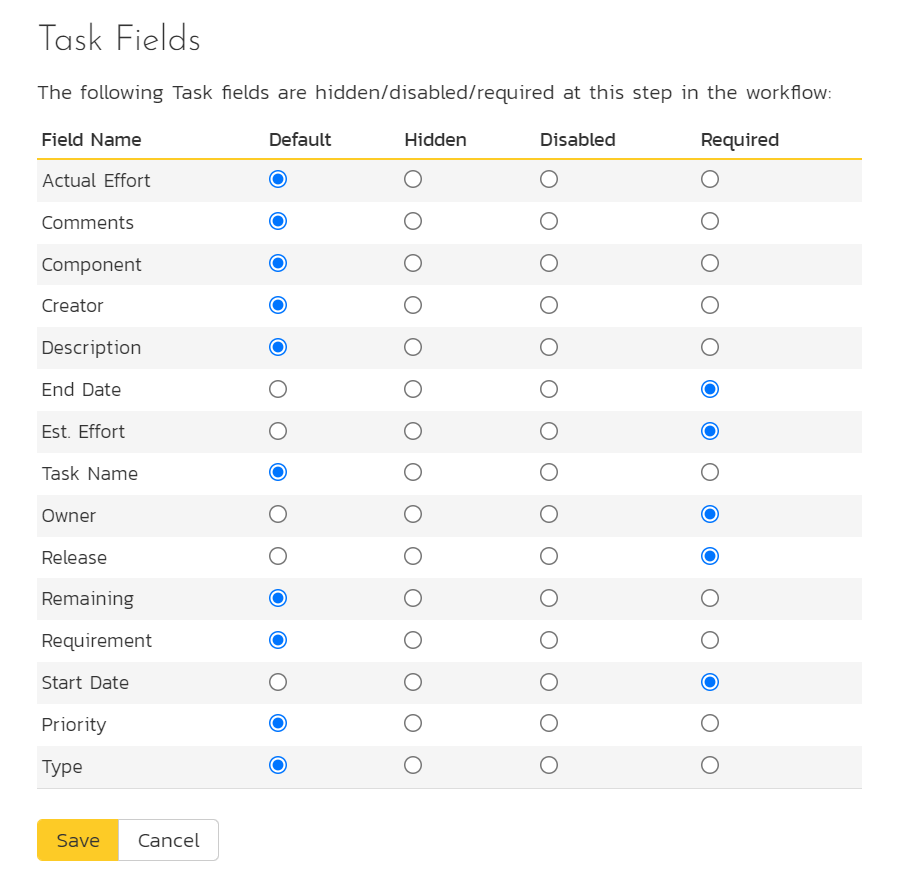
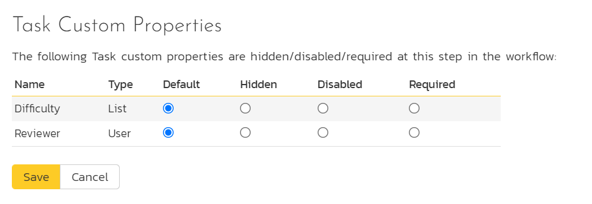

# Template: Tasks

This section contains administrative options that are specific to the
task functionality in the system.

## Priority

The following screen is displayed when you choose the "Priority" link
from the Tasks section of the administration menu:

The screen displays a list of all the defined task priorities for the
current template. By default, the screen will be populated with the
standard SpiraPlan® task priorities. To edit an existing task priority,
change the name, color, score (this is used for ranking the different
items -- the item with the lowest score will appear at the top of
dropdown lists in the application), and/or change the active flag then
click "Save".

Note that you can either enter the hexadecimal RRGGBB code for the color
or use the pop-up color picker.

You can't delete an existing task priority, but to prevent it appearing
in any drop-down-lists, change its active flag to "No" and click "Save".
To add a new task priority, click the "Add" button and a new row will be
added to the list which you can now edit.

## Types

The following screen is displayed when you choose the "Types" link from
the Tasks section of the administration menu:

The screen displays a list of all the defined task types for the current
template. By default, the screen will be populated with the standard
SpiraPlan® task types. To edit an existing task type, change the name,
associated workflow, set a default type, and/or change the active flag
then click "Save".

You can't delete an existing task type, but to prevent it appearing in
any drop-down-lists, change its active flag to "No" and click "Save". To
add a new type, click the "Add" button and a new row will be added to
the list which you can now edit.

The associated workflow drop-down list allows you to specify which
workflow the type will follow. This is a very powerful feature since it
allows you to configure different workflows for different types.

The default radio button allows you to specify which type should be the
default for newly created tasks. This is the type that a new task will
be set to unless changed by the creator of the task. Note that you must
have at least one active type, and you cannot set an inactive type as
the default.

## Task Workflows

Clicking on the "Task Workflows" link under the Planning heading, brings
up the list of defined task workflows for the current template. A
workflow is a predefined sequence of task statuses linked together by
"workflow transitions" to enable a newly created task to be reviewed,
prioritized, assigned, developed and tested, as well as to handle
exception cases such as the case of a blocked or deferred task. The
workflow list screen for the sample template is illustrated below:

You can have as many workflows as you like in a template, but only one
can be marked as the default. Each task type must be assigned to a
workflow. To modify the name, default flag, and/or active flag of an
existing workflow, change the values in the appropriate text-box,
radio-button, or drop-down list and click the "Save" button. To add a
new workflow, click the 'Add Workflow' link and a new workflow will be
created with the standard SpiraPlan® steps and transitions.

Note: You can only assign an active workflow to a task type, and
similarly you cannot make a workflow inactive that is currently linked
to a task type. This is important as all task types need to be linked to
an active workflow at all times.

### Edit Workflow Details

Clicking on the 'Steps' hyperlink of a workflow brings up the following
screen that lists all the workflow steps and workflow transitions that
comprise the workflow:

This page lists in the left-most column all the various task statuses
defined in the system. The next column lists all the possible
transitions that can occur *from that status*. In addition, with each
transition is listed the name of the resulting *destination status* that
the transition leads to. E.g. from the Not Started status, depending on
your role (see later) the user can move the task to either Deferred or
In Progress, depending on which transition the user takes.

Clicking on the name of a step or transition takes you to the
appropriate details page (see below) where you can set the properties of
the step or transition respectively. To delete an existing transition,
click the 'x button after the transition name, and to add a new
transition, click the 'Add Transition' button in the Operations column.

### Edit Workflow Transition

When you click on the transition name link from the previous screen, you
are taken to the workflow transition details screen:

The top part of the screen is the "workflow browser" which illustrates
how the transition relates to the workflow as a whole. It displays the
current transition in the middle, with the originating and destination
steps listed to either side. Clicking on either task status name will
take you to the appropriate workflow step details page. This allows you
to click through the whole workflow from start to finish without having
to return to the workflow details page.

This part of the screen lets you change the name of the transition. If a
digital signature from the user is required to authorize and record the
transition, set the toggle to yes for "Require Electronic Signature".

In addition, each transition has a series of conditions which need to be
satisfied for a user to actually execute the transition (i.e. move the
task from the originating status to the destination status):

The conditions section allows you to set three types of user role:

The author of the task can be allowed to execute the transition. For
example, when a task is marked as Completed, the author might be allowed
to move it to In Progress if there is still work remaining.

The owner of the task can be allowed to execute the transition. For
example, when a task is marked as In Progress, the assigned owner should
be the only one who's allowed to move it to Competed.

A user with a specified role can be allowed to execute the transition
regardless of whether they are the author or owner. For example a user
with role "Manager" might want the power to defer all tasks regardless
of ownership status.

> You can set any of these conditions by changing the drop-down list
> and/or check-boxes and clicking the appropriate "Save" button.

### Edit Workflow Step

When you click on the task status name link from either of the previous
screens, you are taken to the workflow step details screen:

The top part of the screen is the "workflow browser" which illustrates
how the step relates to the workflow as a whole. It displays the current
task status in the middle, with the possible originating and destination
transitions listed to either side. Clicking on either workflow
transition name will take you to the appropriate workflow transition
details page. This allows you to click through the whole workflow from
start to finish without having to return to the workflow details page.

This page allows you to define the behavior of the various task fields
(i.e. those that are a standard part of SpiraPlan® such as Priority):

This page also allows you to define the behavior of the various task
custom properties for this particular step in the workflow:

You can set each of the fields/custom properties as being:

**Hidden** -- The field / custom property will not be displayed when the
task is in this status

**Disabled** -- The field / custom property will be displayed, but will
be greyed-out and read-only

**Required** -- The field / custom property will be required when the
task is in this status

Note that you cannot set a field/property as being required and either
disabled or hidden since this would prevent a user from ever updating
the task. For example, when a task is in the Not Started status, you
might make the owner field hidden (since the author shouldn't need to
know who will ultimately own it), when it gets to the In Progress
status, you might make the field enabled and required, and when it gets
to the Completed status, you might make it disabled. This allows you to
tailor the information gathered to the appropriate place in the
workflow.

To actually make these changes, all you need to do is select the
appropriate checkboxes in the list of fields and custom properties and
click the corresponding "Save" button.

