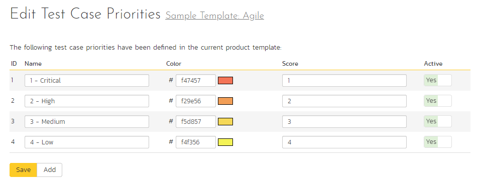
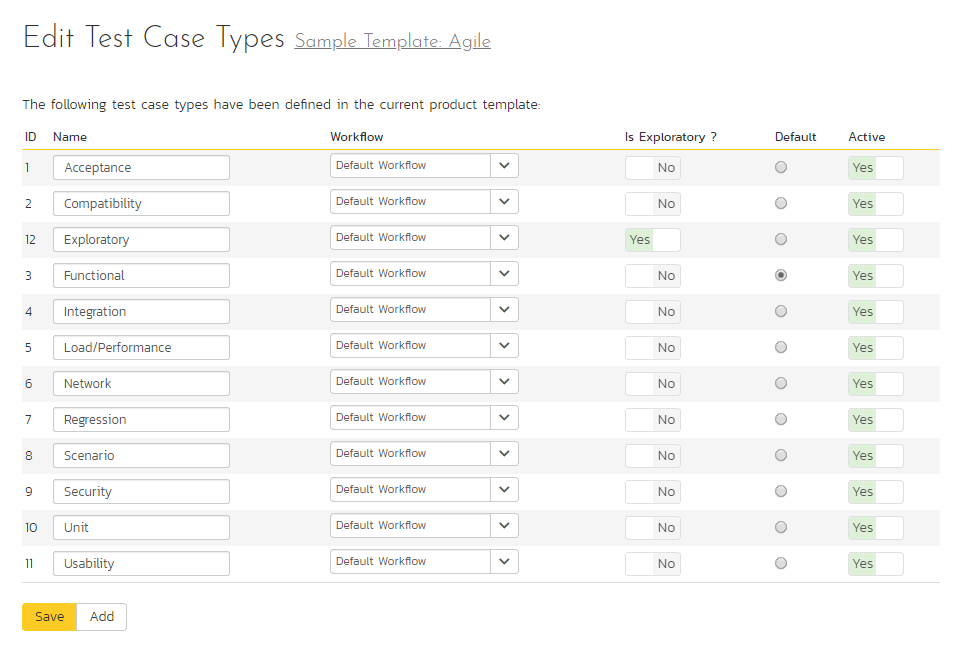
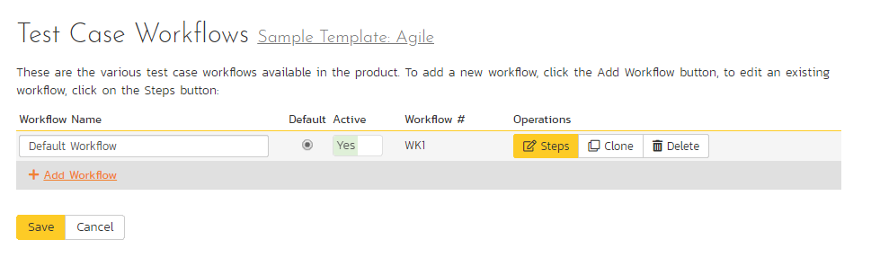
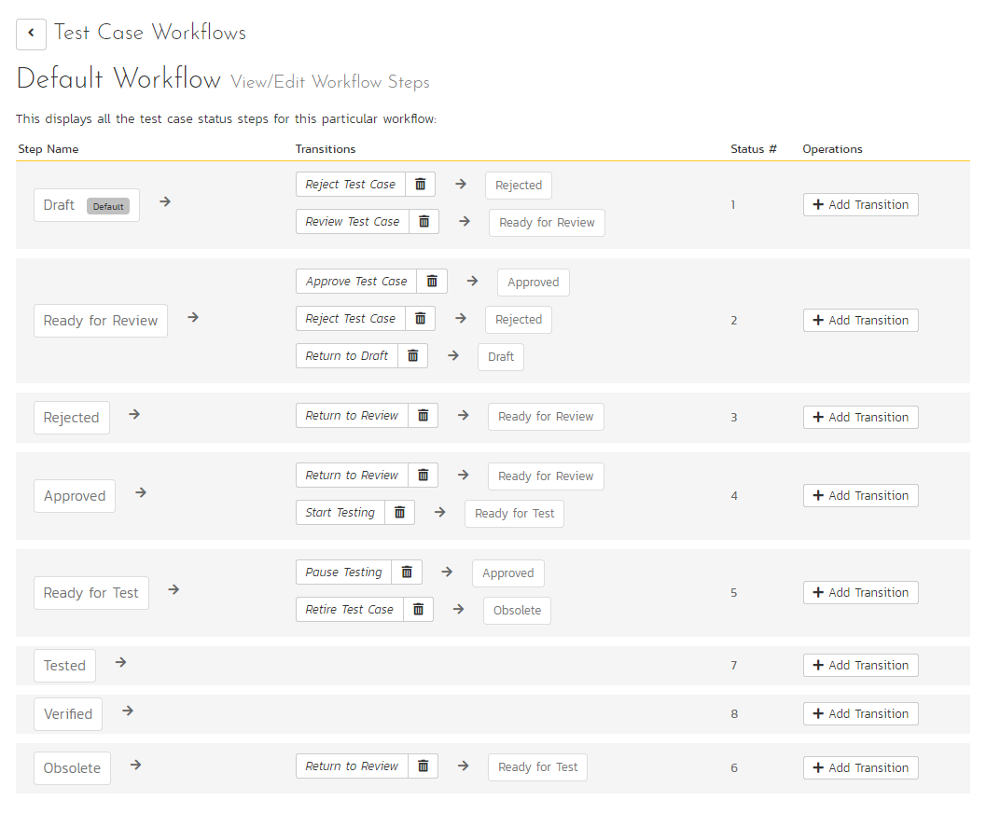
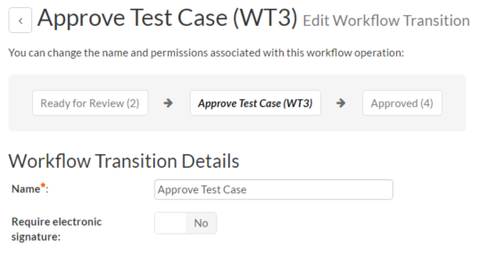
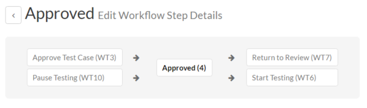
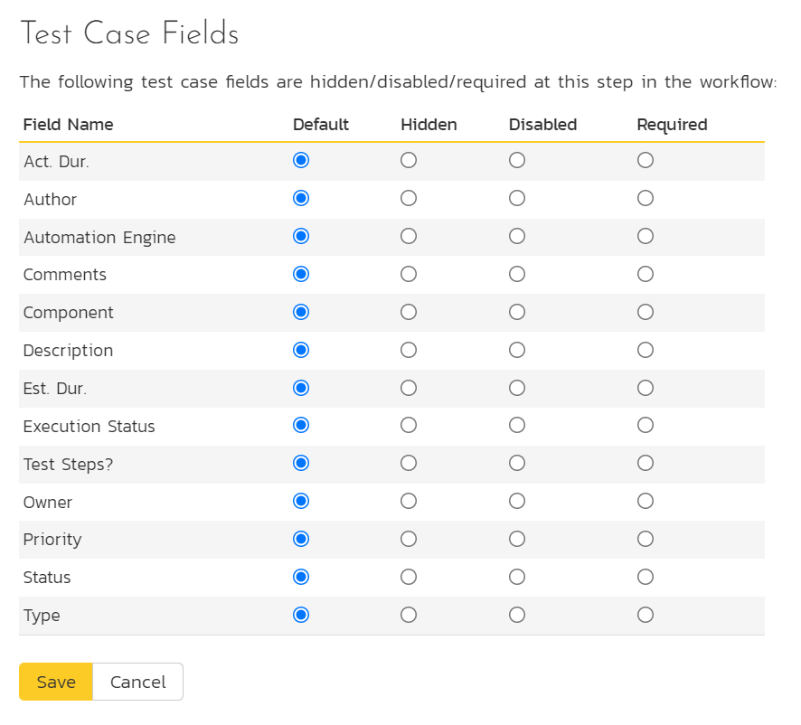
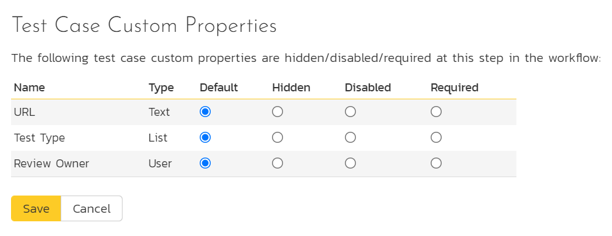
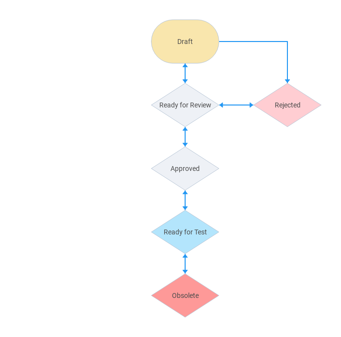

# Template: Test Cases

This section contains administrative options that are specific to the testing functionality in the system.

## Priority

The following screen is displayed when you choose the "Priority" link from the Test Cases section of the administration menu:

The screen displays a list of all the defined test case priorities for the current template. By default, the screen will be populated with the standard SpiraPlan® test case priorities. To edit an existing test case priority, change the name, color, score (this is used for ranking the different items -- the item with the lowest score will appear at the top of dropdown lists in the application), and/or change the active flag then click "Save".

Note that you can either enter the hexadecimal RRGGBB code for the color or use the pop-up color picker.

You can't delete an existing test case priority, but to prevent it appearing in any drop-down-lists, change its active flag to "No" and click "Save". To add a new test case priority, click the "Add" button and a new row will be added to the list which you can now edit.

## Types

The following screen is displayed when you choose the "Types" link from the Test Cases section of the administration menu:

The screen displays a list of all the defined test case types for the current template. By default, the screen will be populated with the standard SpiraPlan® test case types. To edit an existing test case type, change the name, associated workflow, issue check-box, risk check-box, set a default type and/or change the active flag then click "Save".

You can't delete an existing test case type, but to prevent it appearing in any drop-down-lists, change its active flag to "No" and click "Save". To add a new test case type, click the "Add" button and a new row will be added to the list which you can now edit.

The associated workflow drop-down list allows you to specify which workflow the test case type will follow. This is a very powerful feature since it allows you to configure different workflows for different test case types; i.e. a User Story may follow a simpler review process than a Feature or Use Case test case.

The Is Exploratory check-box allows you to specify if the test case type should be able to be executed in exploratory mode (which allows more editing of the test case and its steps during execution). Note that this mode is only available to users with a certain permission level and when executing an individual test case.

The default radio button allows you to specify which test case type should be the default for newly created test cases. This is the type that a new test case will be set to unless changed by the creator of the test case. Note that you must have at least one active test case type, and you cannot set an inactive type as the default.

## Test Case Workflows

Clicking on the "Workflows" link under the Test Cases section, brings up the list of defined test case workflows for the current template. A workflow is a predefined sequence of test cases statuses linked together by "workflow transitions" to enable a newly created test case to be reviewed, prioritized, assigned, and tested, as well as to handle exception cases such as the case of a rejected or obsolete test case. The workflow list screen for the sample template is illustrated below:

You can have as many workflows as you like in a template, but only one can be marked as the default. Each test case type must be assigned to a workflow. To modify the name, default flag, and/or active flag of an existing workflow, change the values in the appropriate text-box, radio-button, or drop-down list and click the "Save" button. To add a new workflow, click the 'Add Workflow' link and a new workflow will be created with the standard SpiraPlan® steps and transitions.

Note: You can only assign an active workflow to a test case type, and similarly you cannot make a workflow inactive that is currently linked to a test case type. This is important as all test case types need to be linked to an active workflow at all times.

### Edit Workflow Details

Clicking on the 'Steps' button of a workflow brings up the following screen that lists all the workflow steps and workflow transitions that comprise the workflow:

This page lists in the left-most column all the various test case statuses defined in the system. The next column lists all the possible transitions that can occur *from that status*. In addition, with each transition is listed the name of the resulting *destination status* that the transition leads to. E.g. from the Draft status, depending on your role (see elsewhere in this manual) the user can move the test case to either Rejected, or Ready for Review, depending on which transition the user takes.

Clicking on the name of a step or transition takes you to the appropriate details page (see below) where you can set the properties of the step or transition respectively. To delete an existing transition, click the 'x button after the transition name, and to add a new transition, click the 'Add Transition' button in the Operations column.

### Edit Workflow Transition

When you click on the transition name link from the previous screen, you are taken to the workflow transition details screen:

The top part of the screen is the "workflow browser" which illustrates how the transition relates to the workflow as a whole. It displays the current transition in the middle, with the originating and destination steps listed to either side. Clicking on either task status name will take you to the appropriate workflow step details page. This allows you to click through the whole workflow from start to finish without having to return to the workflow details page.

This part of the screen lets you change the name of the transition. If a digital signature from the user is required to authorize and record the transition, set the toggle to yes for "Require Electronic Signature".

In addition, each transition has a series of conditions which need to be satisfied for a user to actually execute the transition (i.e. move the test case ease from the originating status to the destination status):

The conditions section allows you to set three types of user role:

The author of the test case can be allowed to execute the transition. For example, when a test case is marked as Ready for Review, the author might be allowed to move it to Ready to Test.

The owner of the test case can be allowed to execute the transition. For example, when a test case is marked as Approved, the assigned owner should be the only one who's allowed to move it to Ready for Test.

A user with a specified role can be allowed to execute the transition regardless of whether they are the author or owner. For example a user with role "Manager" might want the power to approve all test cases regardless of ownership status.

> You can set any of these conditions by changing the drop-down list > and/or check-boxes and clicking the appropriate "Save" button.

### Edit Workflow Step

When you click on the test case status name link from either of the previous screens, you are taken to the workflow step details screen:

The top part of the screen is the "workflow browser" which illustrates how the step relates to the workflow as a whole. It displays the current test case status in the middle, with the possible originating and destination transitions listed to either side. Clicking on either workflow transition name will take you to the appropriate workflow transition details page. This allows you to click through the whole workflow from start to finish without having to return to the workflow details page.

This page allows you to define the behavior of the various test case fields (i.e. those that are a standard part of SpiraPlan® such as Priority):

This page also allows you to define the behavior of the various test case custom properties for this particular step in the workflow:

You can set each of the fields/custom properties as being:

- **Hidden**: The field / custom property will not be displayed when the test case is in this status
- **Disabled**: The field / custom property will be displayed, but will be greyed-out and read-only
- **Required**: The field / custom property will be required when the test case is in this status

Note that you cannot set a field/property as being required and either disabled or hidden since this would prevent a user from ever updating the test case. For example, when a test case is in the Draft status, you might make the owner field hidden (since the author shouldn't need to know who will ultimately own it), when it gets to the Ready for Review status, you might make the field enabled and required, and when it gets to the Approve status, you might make it disabled. This allows you to tailor the information gathered to the appropriate place in the workflow.

To actually make these changes, all you need to do is select the appropriate checkboxes in the list of fields and custom properties and click the corresponding "Save" button.

Note that two test case fields have special meanings:

-   **Test Steps?** - when this field is marked as Disabled = True, you will not be able to edit the test steps
-   **Execution Status** - when this field is marked as Disabled = True, you will not be able to execute the test case in this status.

## Example Workflow
Below is a diagram that shows an example workflow (the one used by the sample product "Library Information System") for test cases.

