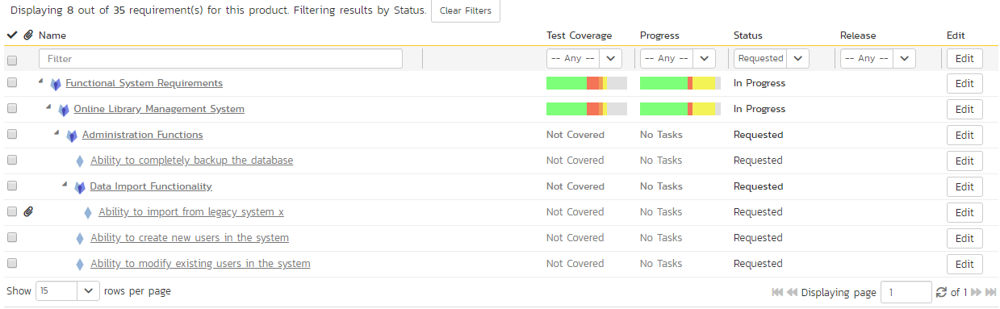
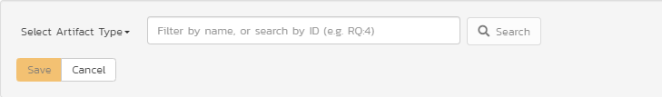

# Common Elements Across the Application

There are lots of different artifacts in the application (described [here](Functionality-Overview.md)). This means each artifact has its own settings, uses, and logical links to other artifacts, and reporting. Each artifact is different but they also share many similarities. These are explained below. 

## Artifact List Pages

When you first visit an artifact section in the app (by clicking on the relevant link in the global navigation bar), you will be taken to the artifact list page. This may look something like below (this image is of the requirements list page) with a grid of data - each row representing a single artifact, and often a sidebar on the left with charts or links:

### Filtering

You can easily filter artifact lists as you can see in the screen-shot below. Here, we are filtering Requirements by the status "Requested":

To filter the list:

- make sure the columns you want to filter on are visible (you can hide them later if you want)
- use the dropdowns or free-text search fields immediately beneath the column names
- click the `Filter` icon or press the `ENTER` key to apply the filters

Note that the NAME field is searched using a "like" comparison, so that searching for "database" would match "Database is ready", "There is a database", "The data in the database is correct", and so on. All other freetext fields need to be exact matches (e.g. dates or numbers).

To **clear the current filter** (whether it is saved or not), either click the `Clear Filters` button above the table (as you can see in the screenshot above), or go to `Filter` > `Clear Filter` from the operations toolbar.

#### Managing Filters
You can do a number of things with filters. First let's talk about using the `Filters` button on the operations toolbar (at the top of the page just below the main navigation bar).

To **reuse a filter**, save it by going to `Filter` > `Save Filter` from the operations toolbar. Give your new filter a name and click `Save`.

By default, when you save a filter it will also save your **column selection** information. Uncheck the box next to "Save the column selection with the filter" if you do not want to save this information. 

When you apply a saved filter with column selection information, the system will show the specific columns visible (including their relative ordering and width) to match those in the filter. This means that you can Show/Hide different columns, filter on them, and save the entire combination as a saved view. When you switch between saved views, the system will show/hide and reposition the columns associated with the view automatically.

To **share the filter** with other members of the product, in the Save Filter dialog, check the box next to "Share with other members of the product". 

To **update an existing filter**, go to `Filter` > `Save Filter` and click on `Update Existing`. You will see a dropdown of all your saved filters. Pick one, and then click `Save`. This will update the filter itself, any sort applied, whether it is shared or not, or if it should save the column selection with the filter.

To **see your saved filters** for this artifact, go to `Filter` > `Retrieve Filter`. Apply the filter by selecting it.

From your "My Page" you can **see all your save filters** across all artifacts and products. You can also delete any filter from there. This is all through the [My Saved Searches](User-Product-Management.md#my-saved-searches) widget.

#### Quick Filter Side Panel
As a shortcut, the left hand panel on artifact list pages includes a set of **Quick Filters**. Click the name of the filter in this panel to apply it. This panel is NOT visible for list pages that do not have a side panel at all - i.e. Releases, Automation Hosts, Test Configurations, and Resources.

The quick filter panel shows a list of **all saved filters** created by you (with an icon of a person) or shared by others (with an icon of a group of people)  for the current artifact.

For Requirements, Test Cases, Incidents, Risks, and Tasks the quick filter panel also shows a list of **Components** for the current product. Picking a component will filter the list to only show those associated with that component.

For Requirements and Test Runs the quick filter panel additionally shows a dropdown for **Releases**. Picking a release will filter the list to only show items that are set for that particular release.

#### Sorting

Many artifact lists let you sort by a specific column (either ascending or descending). To change the column being sorted, click on the up or down arrow icon next to the title of that column. Click the other icon will reverse the sort order. The currently sorted column is indicated by the darker arrow. When you save a filter it will always save the selected sort.

### Show / Hide Columns

This drop-down list allows you to change the fields that are displayed in the artifact list as columns for the current product. To show a column that is not already displayed, simply select that column from the list of "Show..." column names and to hide an existing column, simply select that column from the list of "Hide..." column names. This is stored on a per-product basis, so you can have different display settings for each product that you are a member of. The fields can be any of the built-in fields or any of the custom properties set up by the product owner.

### Right-Click Context Menu

SpiraPlan® provides a shortcut -- called the *context menu* - for accessing some of the most commonly used functions, so that you don't need to move your mouse up to the toolbar each time. To access the context menu, right-click on any of the rows in the artifacts list and the following menu will be displayed (the one below is specific to requirements - different artifacts have different options in the *context menu*):

### Export to Another Product

You can export the following artifacts from the current product to any other product that you have access to:

- incidents
- releases
- requirements
- risks
- tasks
- test cases

The artifacts will be exported from the current product to the destination product. Any file attachments will also be copied to the destination product. If the destination product uses the same product template then standard and custom fields will be copied over in full - but this will not necessarily be possible if the destination product uses a different product (the system will try and match up fields as best it can).

*Note: when exporting a requirement that has children, the requirement itself and all of its children are exported to the destination product.*

To export one or more of a particular artifact:

1. go to the list page for that artifact in the right product. 
2. check the check-boxes of the artifact(s) you want to export
3. click `Tools` > `Export to Product` from the toolbar
4. this will then bring up a list of possible destination products (below is an example for exporting incidents)
5. select the destination product and click `Export`

## Artifact Details Pages

To view details about a specific artifact, you need to go to the artifact's detail page. Clicking on an item on the artifact list page will open the corresponding detail page.

Most of these details pages are made up of *three* areas;

1.  the left pane with artifact list navigation options and information

2.  the right pane's header, which displays: the operations toolbar; the editable name of the selected artifact; and the info bar (with a shaded background), which also contains the workflow status transitions

3.  the right pane's tabbed interface with rich information related to the artifact

Please note that on smaller screen sizes the left navigation pane is not displayed. While the navigation pane has a link to take you back to the artifact list, on mobile devices a 'back' button is shown on the left of the operations toolbar.

The navigation pane can be collapsed by clicking on the "-" button, or expanded by clicking anywhere on the gray title area. On desktops the user can also control the exact width of the navigation pane by dragging and dropping a red handle that appears on hovering at the rightmost edge of the navigation pane.

The navigation pane often shows a list of the peer artifacts to the one selected. This list is useful as a navigation shortcut.

### Breadcrumbs 

For folders and hierarchical / tree view artifacts at the top of the details page right hand side you will see the breadcrumb trail, where relevant. 

If the artifact you are looking at is in a folder, above its name you will see a breadcrumb trail for the full folder path. It will be in the form of `Grandparent Folder / Parent Folder`. You can click on any part of this breadcrumb / path to navigate to that folder. 

Artifacts that have folders are: documents, test cases, test sets, and tasks.

Requirements and releases exist in a hierarchy with other requirements and releases. For these you will also see a breadcrumb, but instead of showing folders it will show the hierarchy to the container requirements or releases. Clicking on the breadcrumb link will take you to the specific requirement or release clicked on.

**Tip**: when navigating to folders (for all artifacts that support them), the URL in your browser's address bar will change. Each folder has a unique, sharable URL that you can give to someone to display the list of artifacts with the appropriate folder selected. You can also open up multiple folders in different browser tabs and easily toggle between them from the same browser.

### Workflows

A number of artifacts can be controlled using workflows (these include requirements, releases, test cases, documents, risks, incidents, and tasks). Depending on the user's role and whether they are listed as the owner or author of the artifact, displayed in the info bar beneath the artifact name is the current workflow status and an `Operations` button. When you click this button you will see a set of allowed workflow operations - called transitions (below we are looking at that for a requirement):

These workflow transitions specify, given a starting status, which statuses you can move the artifact to. After changing the status of the artifact by clicking on a transition, the form on the overview tab may change. Different fields may be visible, enabled, or required. 

For example, a requested requirement has its "Release" field hidden, but once the requirement is planned, that release field is visible and required. The types of change allowed and the fields that are enabled/visible/required will depend on how your product administrator has set up the workflow. Administrators should refer to the *Administration Guide* for details on configuring workflows. 

Once you've made the changes to the appropriate artifact fields, you can either click "***Save***", "***Save and Close***", or "***Save and New***" to commit the changes or "***Refresh***" to discard the changes and reload the artifact from the database. In addition you can print the current artifact by clicking "***Print***", which will display a printable version of the page in a separate window.

Workflows are managed by the product's template. Read more about workflow administration for:

- [Requirements](../../Spira-Administration-Guide/Template-Requirements/#workflows)
- [Releases](../../Spira-Administration-Guide/Template-Releases/#release-workflows)
- [Documents](../../Spira-Administration-Guide/Template-Documents/#document-workflows)
- [Test Cases](../../Spira-Administration-Guide/Template-Test-Cases/#test-case-workflows)
- [Incidents](../../Spira-Administration-Guide/Template-Incidents/#incident-workflows)
- [Tasks](../../Spira-Administration-Guide/Template-Tasks/#task-workflows)
- [Risks](../../Spira-Administration-Guide/Template-Risks/#risk-workflows)

### Electronic Signatures
Any workflow transition (moving from one status to another) can be set to require an electronic signature. If enabled for a particular workflow operation an electronic signature is required to confirm the status change. Confirmation requires entering the users password, and a message explaining the meaning of this operation.

Workflow operations requiring a digital signature are marked with a padlock icon:

On attempting to save changes made after clicking a workflow operation that requires a digital signature you will be presented with a popup like the one below:

!!! info  "How to digitally sign if using OAuth"
    If you login to Spira using an OAuth / Single Sign On provider like Google or Okta, instead of entering your password use your RSS Key. This is visible on your [My Profile](../User-Product-Management/#my-profile) page.

### Emailing

Using the "***Email***" button on the toolbar, you can send an email containing details of the artifact to an email address or another user on the system:

You can specify the subject line for the email, and either a list of email addresses, separated by semicolons, or an existing product user. The content of the email is specified in the product template's [Notification Templates](../../Spira-Administration-Guide/Template-Notifications/#notification-templates). [Notification events](../../Spira-Administration-Guide/Template-Notifications/#notification-events) can also be set up to automatically email users meeting specific conditions whenever a certain event happens (eg a particular field changes).

### Followers
To be notified of any changes made to the current artifact via email, click the "***Subscribe***" button. If you already subscribed, the button will instead let you "***Unsubscribe***" to stop receiving emails about that particular artifact. Depending on your role, you may also see a dropdown arrow to the right of this button. This will let you subscribe others in the product to this artifact.

You can also quickly see who is following an artifact under the "People" section in the Overview tab.

To view information about the follower, or to unfollow them from the item, hover over their avatar to display a user profile card.

### Overview

The Overview tab is divided into a number of different sections. Each of these can be collapsed or expanded by clicking on the title of that section. This tab displays information about all the main fields of the artifact, as well as descriptions, comments, and other information.

Many artifacts have a comments section that allows you to add and view discussions relating to the artifact:

Existing comments are displayed in order underneath the textbox in date order (either newest first or oldest first). To add a new comment, enter it into the textbox, and click the "***Add Comment***" button.

### Comments
The Comments section of an artifact lets you add and view comments related to that artifact:

There are two parts to comments:

**Viewing existing comments**: 

- at the top of the comments section is a list of all comments previously made on the artifact
- comments are shown in date order (you can pick either newest-first or oldest-first)
- you can control whether comments are visible or not using the workflow controls for all artifacts that support workflows
- existing comments are *not* shown on popup forms (like those for editing an artifact on the Planning Board)

**Adding a new comment**:

- There is a special permission on each product role that allows users with that role to add comments. Users who have this permission can add comments to all relevant artifacts. Users without this permission on their role can never add comments in that product.
- To add a comment to the artifact, enter your text into the rich text box, then click the "***Add Comment***" button to save.

**Deleting comments**:
Users can delete comments that were made in error or that are no longer relevant. Who can delete what comments?

- any user can always delete their own comments
- product administrators can delete any comment

Note that certain system created comments "permanent" and cannot be deleted, even by system administrators. For example, comments are added when you create a test case from a use case and are marked as "permanent" behind the scenes.

### Attachments

The attachment tab displays the list of documents, screenshots or web-links (URLs) that have been "attached" to the artifact. The documents can be in any format, though SpiraPlan® will only display icons for certain known types.

The attachment list includes the filename/URL that was originally uploaded together with the file-size (in KB), name of the person who attached it and the date uploaded. In addition, if you position the pointer over the filename and hold it there for a few seconds, a detailed description is displayed as a tooltip.

To actually view the document, click on the filename hyperlink and a new web browser window will open. Depending on the type of file, this window will either display the document / web-page or prompt you for a place to save it on your local computer. To remove an existing attachment from an artifact, click the "***Remove***" button and the attachment will be removed from the list. Using the standard filter/sort options you can also sort and filter the list of attachments to make it more manageable.

If you are using SpiraPlan or SpiraTeam (but not SpiraTest) you can also choose to include file attachments stored in a linked version control system (e.g. Git, Subversion, CVS, Perforce, etc.) by selecting the "Include Source Code Documents" option.

To attach a new document to the artifact, you need to first click the "***Add New***" button to display the new attachment dialog box:

There are three different types of item that can be attached to an artifact:

To upload a file, choose "File" as the type and then click the Browse button and select the file from your local computer, optionally enter a detailed description then click the "***Upload***" button. The document will be copied from your computer and attached to the artifact.

To attach a web-link (URL) to the artifact, you need to choose "URL" as the type and then enter the fully qualified URL (e.g.
[http://mywebsite.com?Document=1](http://mywebsite.com/?Document=1)), an optional description and then click the "***Upload***" button to attach the web-link.

To attach a screenshot to the artifact, you need to choose "Screenshot" as the type and then copy the image to your computer's clipboard (e.g. on Windows computers, the PRINT SCREEN button captures the current page and adds to the clipboard). Once the image is in the clipboard, paste it into the editor using CTRL+V (or the equivalent keystroke for your operating system) and the item will appear in the preview window. You can then fill in the other fields and click "***Upload***" to attach the image.

Note: If you are using a non-Windows® computer (e.g. Macintosh®) that doesn't put file extensions on filenames (e.g. .xls for an Excel sheet) automatically, then you will need to manually add the file extension to the filename before uploading if you want it to be displayed with the correct icon in the attachment list.

You can also associate an existing document (that's already stored in SpiraPlan) with the artifact. To do that, click on the "***Add Existing***" button to bring up the add file association dialog box:

You can then choose to either associate a document stored in the SpiraPlan Documents repository or (in the case of SpiraPlan/SpiraTeam but not SpiraTest) from the linked source code repository. In either case you first select the appropriate folder, and then pick the document(s) from the file list on the right. In the case of a source code file association you can also add a comment.

### History

This tab displays the list of changes that have been performed on the artifact since its creation. An example change history for a requirement is shown below:

The change history displays the date that each change was made, together with the fields that were changed, the old and new values and the person
who made the change. This allows a complete audit trail to be maintained of all changes in the system. In addition, if you are logged in as a product administrator you can also click on the "Admin View" hyperlink to revert any unwanted changes.

### Associations

You can associate artifacts to one another. For instance, you can associate (or link) one requirement to another requirement, or a test case to a risk. The following artifacts have association tabs:

- Documents
- Incidents
- Releases
- Requirements
- Risks
- Source code commits
- Source code files
- Tasks
- Test cases (in SpiraTeam and SpiraPlan only)
- Program Capabilities (SpiraPlan only)
- Program Milestones (SpiraPlan only)

From the associations tab you can see and manage the list of artifacts associated with the specific artifact you are looking at. You can even make links between artifacts across different products (if the admin has set this up). The image below shows the association tab for a requirement.

The requirements and risks in this list are those a user has decided are relevant to the current artifact. They therefore created a direct link between them.

Each association is for product level associations displayed with the:

- type of association (related-to, dependency, etc)
- name of the artifact being linked-to
- type of artifact (requirement, incident, etc.)
- name of the person who created the association
- a comment that describes why the association was made. In the case of an indirect association (eg when a link to an incident is added to a requirement during a test run), the comment will contain the name of the specific artifact that created that indirect association.

In addition, when using SpiraPlan or SpiraTeam, the system automatically scans the source code repository for any commits, across all branches, that are linked to this artifact.

You can perform the following actions on the list of associations:

1. **Delete**: removes the selected association to the other artifact. This will only delete the association, not the linked artifact itself. Not all associations can be removed in this way because they are managed by the application (for example, the association between a commit with artifact tokens in it and those artifacts)
2. **Refresh**: updates the list of associations from the server, useful if other people are adding associations to this requirement at the same time.
3. **Filter / Apply Filter**: Applies the entries in the filter boxes to the list of associations
4. **Clear Filters**: Clears the current filter, so that all associations for the current requirement are shown.
5. **Edit**: Clicking the "***Edit***" button to the right of the associations allows you to edit the association type and comment fields inline directly on this screen. Note that this is not available in all cases (for example, on program level artifact association tabs)

To create a new association, click the "***Add***" button to display the add association panel (below is an example from requirements):

If you know the ID of the artifact you want to associate, you can enter its ID prefixed by the appropriate token (eg "RQ" for requirement):

Otherwise choose the Artifact Type (and Product if making a cross-product association) from the dropdowns:

You can narrow down your search by entering a keyword:

Artifacts that have folders let you choose a folder to narrow your search. When attempting to add an association to a requirement, you can choose a parent requirement from the list to narrow down the results:

Once you have a list of artifacts, select the checkboxes of the items you want to associate with the current artifact and click the 'Save' button.

You can add a comment that explains the rationale for the association and choose the type of association being created:

-   **Related-to:** this is used to specify that the two artifacts are simply related
-   **Depends-on:** this is used to specify that the current artifact has a dependency on the one being linked to.

!!! info "What can you associate to what?"

    | Association Tab Of                               | Available artifacts                                                                                             |
    | ------------------------------------------------ | --------------------------------------------------------------------------------------------------------------- |
    | **Documents**                                    | Requirements, Releases, Test Cases, Test Sets, Test Runs, Test Steps, Automation Hosts, Tasks, Incidents, Risks |
    | **Incidents**                                    | Requirements, Test Steps, Tasks, Incidents, Risks                                                               |
    | **Releases**                                     | Releases, Requirements                                                                                          |
    | **Requirements**                                 | Releases, Requirements, Incidents, Risks                                                                        |
    | **Risks**                                        | Requirements, Incidents, Risks, Test Cases                                                                      |
    | **Source code commits**                          | Requirements, Releases, Test Cases, Test Sets, Test Runs, Test Steps, Automation Hosts, Tasks, Incidents, Risks |
    | **Source code files**                            | Requirements, Releases, Test Cases, Test Sets, Test Runs, Test Steps, Automation Hosts, Tasks, Incidents, Risks |
    | **Tasks**                                        | Tasks, Incidents                                                                                                |
    | **Test cases** (in SpiraTeam and SpiraPlan only) | Tasks, Risks                                                                                                    |
    | **Program Capabilities** (SpiraPlan only)        | Requirements (the tab is called requirements, comments and association type not supported)                      |
    | **Program Milestones** (SpiraPlan only)          | Releases (the tab is called releases, comments and association type not supported)                              |

### Rich Text Editor
There are two ways to enter and edit text in SpiraPlan: plain text or rich text. Plain text is used for short and simple text - like artifact names, instant messages, or short notes in custom properties. When users need to enter more text and style it in a particular way, they use the built-in rich text editor. This is used for artifact descriptions and comments, as well dedicated [rich text documents in the Documents Repository](../Document-Management/#add-new-inline-documents). Rich text fields can be as long as you need, and can replace traditional documents entirely.

SpiraPlan's rich text editor is responsive, fully featured, and intuitive to use. As such, it does not require special instruction. For information, below is a list of supported features in the rich text editor.

**Formatting options**:

- heading type
- font
- text size
- bold
- italic
- underline
- strikethrough
- numbered lists
- bulleted lists
- task lists
- text color
- background color
- text highlighting
- indent
- outdent
- quotes
- remove all formatting

**Inserting content**:

- links to other sites or urls
- Images and screenshots
    
    - paste them straight into the editor
    - click the button to upload an image
    - click the image button's down arrow to add an image via a url (for security, only image on the same domain as SpiraPlan will display)
    - format an inserted image by: adding or hiding a caption; align the image left, center, or right; have text only above and below the image or make text wrap on its left or right
    - set alternate text on the image
    - attach a url link to the image

- Tables using the powerful table editor. After table creation you can:

    - insert rows and columns
    - edit the table's border, background, dimensions, or alignment in the editor (left, right, or center)
    - edit any  cell's border, background, dimensions, or text alignment (left, right, center, justified, top, middle, bottom)

- code blocks
    
    - click the button to insert a plain text code block
    - click the code button's down arrow to add a code block for specific syntax, or edit the syntax of a selected code block

- separator lines
- media from third parties (including YouTube and Vimeo)
- Text from MS Word and Google Docs (paste it directly in - note that not all formatting is retained)

**Editing content**: use the magnifying glass button on the toolbar to access find and replace functionality.

In many places the editor can also be made full screen to help editing of larger documents. To enter full screen mode, click on the computer monitor icon at the far right of the toolbar. Are you using dark mode? No problem - the editor works great in dark mode.

### Mentions
You can quickly mention anyone in the product using the "@ mentions" feature of the rich text editor.

From any rich text editor for a product artifact (including custom properties and comments) you can type the `@` symbol and start typing the name of member of the product. This will give you a list of possible name matches, that gets more precise the more you type. To mention someone click on their name (or press the enter key with it selected). This will insert the person as a mention token into the rich text editor.

In addition, where possible and relevant, when you @ mention someone, that person will be added as a [follower](#followers) of the current artifact. Please note that removing a mention will not remove that person as a follower of the artifact.

## Boards
### Page Structure
The beta boards are designed to provide a consistent user interface across its different views and:

- supports multiple boards in a product
- provides a wide range of intuitive customization options
- lets you see both horizontal and vertical swim lanes in a single view

The board pages are structured like this (in this example we are looking at the Planning Board but the high level features and layout is consistent across all boards):

1. **Top toolbar**: this is where you configure the board itself (and all of the features below)
2. **View controls**: this part of the toolbar lets you select the planning view (product backlog, release backlog, or sprint backlog), and choose, where relevant, a release or sprint
3. **Grouping**: divide up the list of items into a major grouping. Each grouping is its own independent board on the page
4. **Rows**: within each board / group create rows (swim-lanes) to divide up the data
5. **Columns**: within each board / group, you must choose a field to show across the columns
6. **Cells**: A cell is the intersection of a row and column to give a single reference point (like on a spreadsheet)
7. **Cards**: All items that match the settings of a cell (its group, row, and column) are shown as cards in that cell. You can customize what information to show on cards

### Board Grouping
Boards have the option to have multiple, separate boards displayed. This is used when you want to display a complete board for each item in a selection (for example each release). Inside each group, the rows and columns will show based on your selections. For example, when you are displaying the Release Backlog on the Planning Board, you may want to group by release. In the screenshot below of the Planning Board we have columns set to status, and rows to component

There are buttons in the header area of each group that let you:

- expand/collapse the group itself
- expand/collapse the group and all of its rows at once (if rows are set)

Additionally, at the top of all the groups, there are buttons to expand/collapse all groups at once.

### Board Columns
Inside each of the boards you can choose to organize the cards by column. Unlike groups and rows, this selection is required. For example, in the screenshot below we are displaying the Planning Board's product backlog with columns set to "priority".

There are no expand/collapse buttons for columns.

### Board Rows
Inside each of the boards you can organize the cards into rows. This is optional. For example, in the screenshot below we are displaying the Planning Board' product backlog with rows set to "parent". In the example, the grouping is by component and the board is smart enough to know that it should only show you those parents in rows that are tagged with that component (so different component groups will show different parent requirements as their rows).

Note that when rows is set to parent / parent requirement, rows are also included for parents with no unplanned children.

There are buttons by the title of each row that let you expand/collapse that row.

### Board Viewing by release or sprint
When organizing by release or sprint there are a number of special features available in the header row (where you see the release/sprint name).

- Clicking on the release or sprint name will open that release/sprint's details page
- At the end of the release or sprint name is a little "display for" icon (a pair of glasses). Clicking this will set the release dropdown to that release/sprint and reload the board with information just for that chosen release/sprint
- The group title will show additional information about the release or sprint on the right hand side of the group header. Hover on the group header to see this information in full. This shows:

    - Requirement completion: hover on the indicator to see a tooltip of the exact percentage complete
    - Available effort: the number of available hours of work for tasks in the release based off the planning settings, the release dates and sources (this field is called "Planned Effort" on the release pages)
    - Utilized effort: the number of hours assigned to tasks in this release (this field is called "Estimated Effort" on the release pages)
    - Remaining effort: the hours left for tasks in the release - i.e. available effort minus utilized effort (this field is called "Available Effort" on the release pages). The system will allow you to assign more backlog items to an sprint than it is possible to complete. In this case remaining effort will be negative and will be displayed in red. This alerts you that you need to move cards or change settings for the release.

When you move a card between releases or sprints, the fields described above may be recalculated. For effort fields, all child tasks of requirements in that release/sprint are used for calculations. For example, moving a requirement on a board into a sprint will increase the sprint's utilized effort by the hours of the relevant tasks in that requirement, and decrease the sprint's remaining effort by the same amount.

### Board Viewing by Person
When organizing by person there are a number of special features available in the header row (where you see the person's name).

- Clicking on the person's name will open the details page for that individual
- Under the name is a small indicator bar showing the percentage of resource allocation. This lets you see how much capacity the person has. Hover on the indicator to see a tooltip with more information
- Moving cards into a person's cells will, as relevant, automatically update their resource allocation

!!! info "Grouping by team and rows by person"
    When grouping by team, there is one group for every team. If rows is set to "by person", then within each team, all members of that team are shown. So if Amy is a member of the dev team, they will have a row in the dev team group and not in any other group.

### Board what cards show when
What cards show on the board depends on how the viewing controls are set. In additional the following broad principles apply:

- when grouping by team, only cards that have owners who are members of that team are displayed in the cells for that group
- when viewing by status (e.g. when column is set to status), only cards that match one of the displayed statuses will show
- requirement cards:
    
    - requirements of all types are included on the board
    - parent requirements do not show as cards
    - requirements with a status of rejected or obsolete never show

### Board Moving and ordering cards
Cards can be moved between any cell on the board a card is currently in. You can also move cards between groups, if you are grouping by a particular field. Moving a card updates all relevant fields about that item. For instance, moving a card to a different row and column will change that cards values for both fields at once.

You can also move cards within a cell to change their order. When you drop a card, it will be inserted between the relevant cards in the cell, or at the top or bottom of the list. Moving a card between cells and dropping the card within a list of cards will place the card in that exact position.

Click on a card to select it. Click on more cards to add them to your selection. Then click and drag on any selected to move them together.

!!! info "Things to be aware of"

    - The purpose of a planning board or Kanban board, is to make it straightforward for users to move cards around. Therefore we do not enforce workflow restrictions on the planning board when moving cards.
    - Only users with permissions to bulk edit the relevant artifact can move cards
    - Cards are disabled (cannot be moved) if any of the following are true:

        - the user does not have bulk edit permissions for the relevant artifact
        - columns is set to status and bulk editing of statuses has been disabled at the template level
        - a requirement card has a status of completed
        - requirements that have tasks attached, and the product is set to use task status to control requirement status (in this case the card does not *look* disabled but its status cannot be changed - if you try to change its status the card will appear in its original column)

### Board Editing and viewing cards
**Viewing cards**: to view more information about the card you can click on the card's name to open a popup with much more detail; or ctrl/cmd+click on the card's name to open the full details page for that artifact. Information shown in the popup includes all standard and custom fields with fields being shown or hidden based on the workflow step that applies to that specific card. Users who cannot bulk edit the artifact but who can add comments can add comments when viewing the card.

**Editing cards**: users with bulk edit permissions can edit a planning board card at any time by clicking on the card's name (this includes letting you add a new comment). This opens a popup with full information about that card. At all times, which fields are shown, required, or hidden is based on the workflow step that applies to that specific card. To save any changes you must fill in all required fields. Please note: you cannot change the status in this edit mode, to do so open the artifact's detail page (you can do this from the popup by clicking the button next to the artifact's id at the top).
    
**Add new cards**: if you are able to create the primary artifact for a board (e.g. requirements on the Planning Board) then you will see plus (add) symbols at the top of each cell of the board. Clicking any of these will open a popup screen with all relevant fields available. Some of these fields may be pre-populated based on what cell you click the add button for. For instance, if your cell is for a specific status and release, both of those fields will preselected. The fields visible and required is driven based on what workflow step will apply to that new card.  