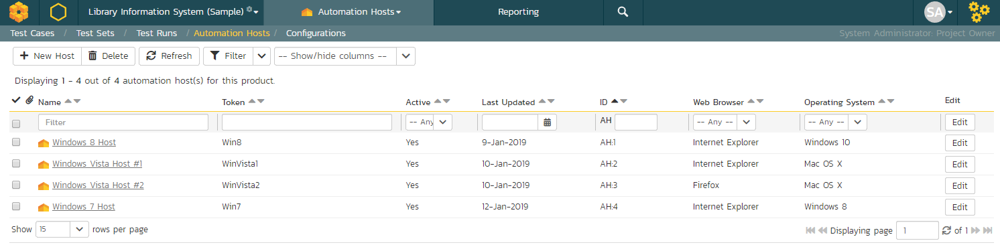
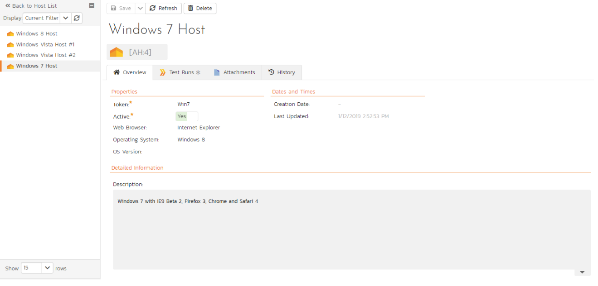
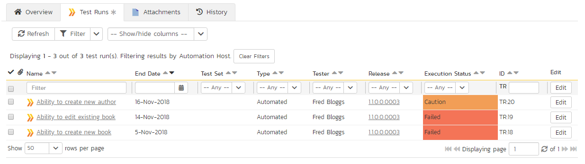

# Automation Host Management

## Automation Host List

This section outlines how to use the Automation Host Management features of SpiraPlan® to manage the different host systems that will be running automated tests in your environment. Typically when scheduling automated tests you will want to execute the same tests on multiple computers running different environments.

SpiraPlan allows you to build a master list of automation hosts in each product, which can be used to [schedule test sets](Test-Set-Management.md/#scheduling-test-sets) containing automated test cases against. 

When you click on the Testing \> Automation Hosts global navigation link, you will open the automation host list page:

The automation host list screen displays all the automation hosts entered for the current product, in a filterable, sortable grid. The grid displays the automation host ID together with fields such as name, description, last updated date, token, and any custom properties. The choice of columns displayed is configurable per-user, per-product, giving extensive flexibility when it comes to viewing and searching automation hosts.

In addition, you can view a more detailed description of the automation host by positioning the mouse pointer over the host name hyperlink and waiting for the popup "tooltip" to appear. If you click on the host name hyperlink, you will be taken to the [automation host details page](#automation-host-details). Clicking on any of the pagination links at the bottom of the page will advance you to the next set of hosts in the list according to the applied filter and sort-order. There is also a drop-down-list at the bottom of the page which allows you to specify how many rows should be displayed in each page, helping accommodate different user preferences.

One special column that is unique to automation hosts is the "Token" field. This needs to contain a short textual identifier that uniquely identifies each automation host in the product. This will be used by each host computer to identify itself to SpiraPlan.

In addition to the features described below, the toolbar also lets you:

- [download the list to a CSV file](Application-Wide.md/#download-as-csv)

### Filtering & Sorting
Read about [how to create and manage filters, and how to sort the artifact list](Application-Wide.md#filtering).

### New Host
Clicking on the "***New Host***" button adds a new automation host to the bottom of the automation host list with a default name and token.

### Delete
Clicking on the "***Delete***" button deletes the automation hosts whose check-boxes have been selected in the host list.

### Refresh
Clicking on the "***Refresh***" button reloads the list of automation hosts; this is useful when new hosts are being added by other users, and you want to make sure you have the most up-to-date list displayed.

### Show / Hide Columns
This drop-down list allows you to change the fields that are displayed in the host list as columns for the current product. To show a column that is not already displayed, simply select that column from the list of "Show..." column names and to hide an existing column, simply select that column from the list of "Hide..." column names. This is stored on a per-product basis, so you can have different display settings for each product that you are a member of. The fields can be any of the built-in fields or any of the custom properties set up by the product owner.

### Edit
Each automation host in the list has an "***Edit***" button in its right-most column. When you click this button or just
*double-click* on any of the cells in the row, you change the item from "View" mode to "Edit" mode. The various columns are made editable, and "***Save***" buttons are displayed in the last column.

If you click "***Edit***" on more than one row, the "***Save***" buttons are only displayed on the first row, and you can make changes to all the editable rows and then update the changes by clicking the one "***Save***" button. Also, if you want to make the same change to multiple rows (e.g. to change five automation hosts from Active = No to Active = Yes), you can click on the "fill" icon to the right of the editable item, which will propagate the new value to all editable items in the same column.

If you want to edit lots of items, first select their checkboxes and then click the "***Edit***" button on the same row as the Filters and it will switch all the selected items into edit mode.

When you have made your updates, you can either click "***Save***"to commit the changes, or "***Cancel***" to revert back to the original information. Alternatively, pressing the <ENTER\> key will commit the changes and pressing the <ESCAPE\> key will cancel the changes.

## Automation Host Details
When you click on an automation host entry in the host list, you are taken to the automation host details page illustrated below:

This page is made up of three areas; the left pane is the navigation window, the upper part of the right pane contains the automation host name and ID, and the bottom part of the right pane displays different information associated with the automation host.

The navigation pane consists of a link that will take you back to the host list, as well as a list of the peer automation hosts to the one selected. This latter list is useful as a navigation shortcut; you can quickly view the peer hosts by clicking on the navigation links without having to first return to the host list page. The navigation list can be switched between two different modes:

-   The list of hosts matching the current filter

-   The list of all hosts, irrespective of the current filter

The top part of the right pane allows you to view and/or edit the details of the particular automation host. You can edit the various fields (name, description, token, etc.) and custom properties. Once you are satisfied with the changes, click either the "***Save***" button or the alternative options from the "***Save***" dropdown list. In addition you can delete the current automation host by clicking "***Delete***", or discard any changes made by clicking "***Refresh***".

### Overview

This tab shows the fields and description associated with the automation host. Standard and custom fields are grouped by type (eg all date and time fields are grouped together).

### Test Runs

This tab displays the list of all the test runs executed against the automation host. Each test run is listed together with the date of execution, the name of the test case, the name of the tester, the release/version of the system that the test was executed against, the name of the test set (if applicable), the overall execution status for the test case in that run and a link to the actual [test run details](#test-run-details). In addition, you can choose to display any of the custom properties associated with the test run.

The "Show/hide columns" drop-down list allows you to change the fields that are displayed in the test run list as columns. To show a column that is not already displayed, simply select that column from the list of "Show..." column names and to hide an existing column, simply select that column from the list of "Hide..." column names. The displayed columns can be any standard field or custom property.

You can also filter the results by choosing items from the filter options displayed in the sub-header row of each field and clicking the "***Filter***" button. In addition, you can quickly sort the list by clicking on one of the directional arrow icons displayed in the header row of the appropriate field.

### Attachments

Read about [how the attachments tab works](Application-Wide.md#attachments)

### History

Read about [how the history tab works](Application-Wide.md#history)