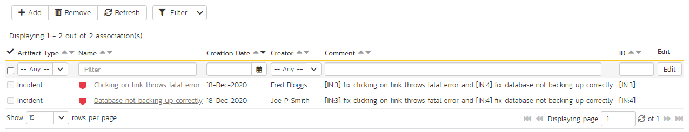

# Commits

## Commit List

If you click on the "***View Commit Log***" button on the main Source Code page, it will take you to the Commit List page that displays all the commits made to the product in a sortable, filterable list:

Each commit in the list is displayed with its name, a description of what changed in the commit, the name of the person who committed the commit, and whether the commit was a change of the actual content, or just a change of the properties of the content. Clicking on the hyperlink for the commit name will take you to the [Commit Details page](#commit-details)  for that commit.

Above the main right-hand pane, there is the **branch selector**. This lets you choose which branch in the source code repository is being viewed.

## Commit Details

When you click on a commit hyperlink in either the product commit log or the file commits tab described above, you are taken to the commit details page illustrated below:

This page is made up of three areas; the left pane is for navigation, the upper part of the main pane contains the details of the commit, and the bottom part of the right pane contains the list of files that were changed in this commit and the list of artifacts that the commit is associated with.

The navigation pane consists of a link that will take you back to the source code commit list, as well as a list of other commits associated with the current file. This latter list is useful as a navigation shortcut; you can quickly view the detailed information of all the peer commits by clicking on the navigation links without having to first return to the main commit list page.

The top part of the main pane allows you to view the details of this commit in the version control system, including the description of what was changed, the date that the change was made, and the name of the person who made the change.

The lower part of the main pane can be switched between two different views by clicking the appropriate tab. Initially the pane will be in "Files" mode, but it can be switched to "Associations" as well. The functionality in each of these two views is described below:

### Files

This view displays the list of files that were changed in the current commit:

Each file in the list is displayed with its name, the file-size, who made changes to the file, what action was performed on the file (added, deleted, replaced, updated, etc.) and the most recent commit that exists for that file. Clicking on the filename will take you to the appropriate [file details page](../Source-Code#source-code-file-details), and clicking on the commit hyperlink will take you the appropriate commit.

### Associations

This view displays a list of the SpiraPlan artifacts in the current product that are associated with the current commit. This allows you to see which requirements, incidents or tasks were affected by this specific change to the source code:

Clicking on the hyperlink for the artifact will take you to the appropriate artifact page inside the product (assuming your user has permissions to access that information).

In addition to the associations that are created from within the source code management system, you can add associations between source code commits and SpiraPlan artifacts from within SpiraPlan interface itself. To do this, you simply need to click on the '***Add Association***' button:

To add the association, you just need to select the type of artifact being associated (requirement, test case, incident, etc.) and the numeric ID of the artifact and then click the "***Add Association***" button.

For example to add an association to Requirement RQ00005 you would choose Artifact Type = Requirement and Artifact ID = 5.

## Commit File Details