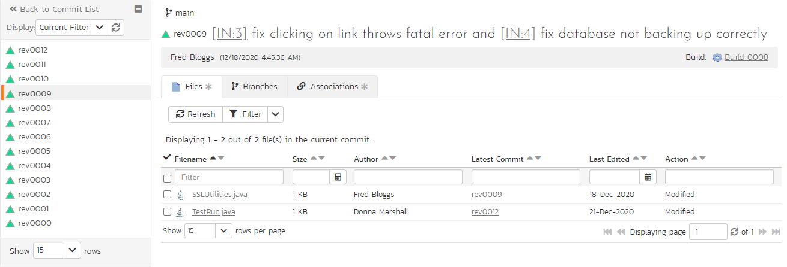
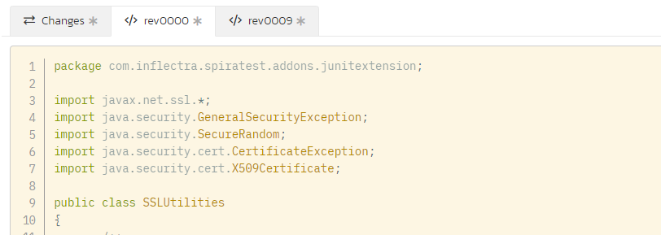

# Commits
Go [here](../Source-Code/#getting-started-with-source-code) to read about how to connec your source code to your SpiraPlan product.

## Linking To Artifacts In Commit Messages
When developers are working on source code, it is often to fix a bug, create a feature described in a user story, or deal with a task. SpiraPlan let you trace what commits (and therefore file changes) contributed to a bug fix. To do this SpiraPlan reads commit messages for special tokens that it turns into links between the commit and those artifacts. If SpiraPlan finds any links in the commit message it automatically creates the association between the commit and the artifact(s). You can view these associations from the [commit details](#commit-details) page, or from the associations tab of any artifact.

How does this work? The commit message has to contain one or more artifact token. For example [TK:123], or [IN:456], or [RQ:789]. These tokens are short and do not get in the way of the rest of the commit message.Artifact tokens are in the following format: `[{artifact identifier}:{artifact id}]`

The first half of the token, is a two-letter code, used throughout SpiraPlan and visible on almost every page in the application. For example, a requirement's identifier is "**RQ**". Incidents are "**IN**", and test cases are "**TC**". The artifact ID is the number of the artifact. If you go to the details page for an artifact, you will always see this artifact token near the top of the page. Clicking on it copies it to your clipboard. Then you can paste it into your commit message.

**Note:** If you forget to add the association during the commit, go to the [details page](#commit-details) for that commit in SpiraPlan, and click 'Add Association' to add the association at any time.

## Commit List
When you click on Developing \> Commits on the global navigation bar, you will be taken to the commits list screen. This shows you all commits in the current branch. You can change the branch, sort and filter this list, or browse the different pages of commits (up to 500 commits can be displayed on the page at any one time).

Above the list of commits is the action toolbar. This lets you perform the following functions:

- Refresh the list of commits to see any recent updates
- The **branch selector** lets you choose which branch[^old-scm] in the source code repository to view. This is stored for your user across the whole product, which means that you will see information for this same branch in other relevant places - eg when viewing files, when viewing commits, or on Product Home Page widgets. An example of the branch selector is shown below.
- Filter buttons to apply or clear the current filter
- Clone or Checkout information so you can see, if permitted, the url of the source code remote along with potentially other connection information
- The type of source code provider active for this product

For each commit you can see the following information (you can sort or filter on all of these):

- Name - click on this to view the details for this commit, and hover to see a tooltip with extra information
- Commit Date - hover over the date to see a tooltip showing the date and time
- Summary - the commit message (any artifact tokens in the summary are links: clicking them will open the relevant artifact details page)
- Author - this is the person who made the commit

[^old-scm]: Some older source code management systems (e.g. CVS, Visual SourceSafe) do not have the formal concept of branches, so the dropdown list will simply list the one main branch (usually called "Trunk").

## Commit Details
When you click on a commit link (for example, from the commit list), you open the commit details page for that commit. This page shows you information about the commit, the files it includes, the branches it appears in, and other artifacts it is associated with.

The page is made up of two areas:

1. the left-hand pane has a link back to the list page and shows a list of commits in the current branch - either only those that match the filter set on the list page, or all commits
2. the right-hand pane shows detailed information about the commit. This pane is discussed more below

The detailed information available at the top of the page is the:

- currently selected branch
- commit name
- commit summary message (artifacts tokens are links that will open that artifact)
- author of the commit
- date and time the commit was made
- associated build, if there is one (clicking on the build will open the [build details](../Release-Management/#build-details) page for that build)

There are 3 tabs on this page that each show additional information about the commit. These are discussed below.

### Files

This shows the list of files changed in this commit. You can sort or filter the list by any of its columns:

- Name: click to view the details for this [file at this commit](#commit-file-details), and hover over the name to see a tooltip of the full filename and filepath
- Size
- Author (this is the *most recent* author - the person who made the most recent commit that changed this file in the current branch)
- Latest Commit: click to view that commit (this is the most recent commit that changed this file in the current branch)
- Last edited date: this is the date of the latest commit and if you hover over the date you will see a tooltip showing the date and time
- Action: what happened to the file in this commit - for example, was it added or modified

### Branches

This shows the list of all branches that the commit appears in, listed in alphabetical order. Clicking on a branch changes your selected branch to that branch.

A commit exists in any branch that was made from the branch the commit was originally committed in, and that was made after this commit. There is no single "original" or "main" branch for a commit, because all the different git branches are considered equal. Deleted branches are not shown.

### Associations

This shows all current associations between this commit and any artifacts in SpiraPlan. This lets you to see which requirements, test cases, incidents, tasks, etc. are linked to the commit. Clicking on the artifact name will take you to the appropriate artifact page (assuming your user has permissions to access that information).

You can also add artifact associations to many other artifacts in the system from this panel. Read more about [how to manage and add associations to this artifact](Application-Wide.md#associations).

## Commit File Details
Files are change as source code develops. Each commit adds or changes or removes files. This pages allows you to see exactly how a file was changed between one commit and the next. For example, you could see that one function was added, and that another line of code was deleted. Or you can see how an image file looked before and after the commit.

SpiraPlan supports showing before and after previews of all file types that it can show previews for elsewhere in the application (for example, text files and images). For text files (things like code, markdown, and plain text), SpiraPlan will also show a line by line comparison of both file versions. 

This page is made up of three areas: 

1. 
2. 
3. 

The detailed information available at the top of the page is the:

### Changes

### Previous Commit

### Current Commit
