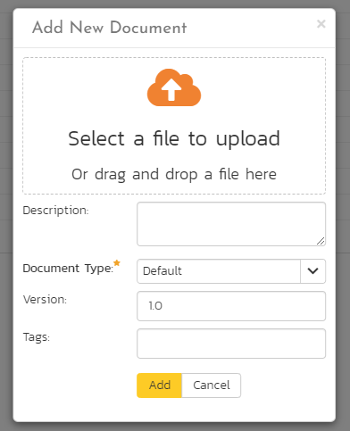

# Document Management

This section outlines the document management features of SpiraPlan®
that can be used to upload, manage and share documents between the different members of the product. This module includes support for uploading files and URLs, versioning of documents, the ability to organize into folders and categorize and search using meta-tags.

In addition the document management features are fully integrated into the rest of the system, so that documents attached to other artifacts (e.g. requirements, test cases, etc.) are automatically connected to the product documentation repository.

## Document List

When you click Product Home \> Documents on the global navigation bar, you will initially be taken to the product documents list screen illustrated below:

This screen consists of three main sections:

The top left-hand pane displays a hierarchical list of the various folders that have been setup for the current product. Clicking on the triangle icon will expand the child folders and clicking on the name of the folder will display the list of documents in the folder in the main pane to the right.

The main right-hand pane displays a list of all the documents contained within the currently selected folder. This list can be filtered and sorted, and you can choose how many rows of documents to display on the page at one time.

The bottom left-hand pane contains the "Tag Cloud". This is a list of all the tag names associated with documents in the product. The size of the font is proportional to the number of documents associated with the tag. Clicking on a tag name will automatically filter the list of documents to find items that contain the selected tag.

The main toolbar contains icons for all the operations that can be performed on the document list. You can add documents to the current folder, delete existing documents from the product, refresh the list of documents, export documents to another product, apply a filter, and clear the current filter. In addition there is the option to either display just the documents in the current folder or all documents in all folders. The latter is useful when you want to search for a specific document by keyword or tag name.

### Add New Document

To attach a new document to the incident, you need to first click the "***Add New***" button to display the new attachment dialog box:

There are three different types of item that can be attached to an incident:

To upload a file, choose "File" as the type and then click the Browse button and select the file from your local computer, optionally enter a detailed description then click the "***Upload***" button. The document will be copied from your computer and attached to the artifact.

To attach a web-link (URL) to the artifact, you need to choose "URL" as the type and then enter the fully qualified URL (e.g.
[http://mywebsite.com?Document=1](http://mywebsite.com/?Document=1)), an optional description and then click the "***Upload***" button to attach the web-link.

To attach a screenshot to the artifact, you need to choose "Screenshot" as the type and then copy the image to your computer's clipboard (e.g. on Windows computers, the PRINT SCREEN button captures the current page and adds to the clipboard). Once the image is in the clipboard, paste it into the editor using CTRL+V (or the equivalent keystroke for your operating system) and the item will appear in the preview window. You can then fill in the other fields and click "***Upload***" to attach the image.

Note: If you are using a non-Windows® computer (e.g. Macintosh®) that doesn't put file extensions on filenames (e.g. .xls for an Excel sheet) automatically, then you will need to manually add the file extension to the filename before uploading if you want it to be displayed with the correct icon in the attachment list.

### View Document Information

When you hover the mouse pointer over any of the documents displayed in the document list, an information panel will be displayed that contains the name, description, version, document type and meta-tags of the document.

You can click on the document URL to actually open the document itself in a new window, click on the meta-tag links to find related documents that contain the same meta-tag, or click on "***View Details***" to see more information regarding the document, including an ability to edit its meta-information and see the different versions of the document.

### Edit Document Folders

If you are a product administrator, you will see the "Edit" and "Add" buttons beneath the folder tree:

This lets you add, edit and delete task folders in the product. To add a new folder, click the "***Add***" button:

Choose the parent folder that you want to add the new folder under (or None if you are adding a new top-level folder) from the dropdown list and then enter the name of the new folder. Then click 'Add' save the new folder.

To edit or delete an existing folder, click the 'Edit' button to switch the folder tree to edit mode:

To edit or delete a specific folder, click on the 'Edit' button next to the folder:

You can change the parent folder and/or name of the folder and click "***Update***" to commit the change or click "***Delete***" to delete the folder entirely (including its contents).[^folder-url]

## Document Details

When you click on an item in the document list described above, you are taken to the document details page illustrated below:

This page is made up of *three* areas;

1.  the left pane displays the documents list navigation;

2.  the right pane's header, which displays: the operations toolbar; the editable name of the selected document; and the info bar (with a shaded background), which also contains the workflow status transitions (see below); and

3.  the right pane's tabbed interface with rich information related to the document, including, where available, the [folder the document is in](Application-Wide.md#breadcrumbs), a preview of the document, the list of document versions, the list of artifacts that the document is associated with, and history of changes made to the document).

Please note that on smaller screen sizes the navigation pane is not displayed. While the navigation pane has a link to take you back to the documents list, on mobile devices a 'back' button is shown on the left of the operations toolbar.

The navigation pane can be collapsed by clicking on the "-" button, or expanded by clicking anywhere on the gray title area. On desktops the user can also control the exact width of the navigation pane by dragging and dropping a red handle that appears on hovering at the rightmost edge of the navigation pane.

The navigation pane consists of a link that will take you back to the product document list, as well as a list of other documents in the current folder. This latter list is useful as a navigation shortcut; you can quickly view the detailed information of all the peer documents by clicking on the navigation links without having to first return to the main document list page.

### Emailing

Read about [emailing a document to colleagues using Spira](Application-Wide.md#emailing).

### Followers

Read about [how to add and manage followers to an artifact](Application-Wide.md#followers).

### Workflows

Read about [using workflows to change the status of your document](Application-Wide.md#workflows).

For documents, you can, depending on how the product administrator has set this up, use workflows to control who can add a new version to a document when. This can be useful for "checking-out" a document, during which time it is locked. When the document is checked back in the workflow can require that the person checking in the document upload a new version (make sure you upload the version before changing the status).

### Overview - details

The top part of the main pane allows you to view and/or edit the details of the particular document. You can edit the various fields (name, description, etc.) and once you are satisfied with them, click one of the "***Save***" buttons to commit the changes. In addition, you can delete the current document by choosing "***Delete***", or discard any changes made by clicking "***Refresh***".

The lower part of the main pane can be switched between four different views by clicking the appropriate tab. Initially the pane will be in "Versions" mode. The functionality in each of these views is described below.

### Preview

This tab displays a preview of the currently active version of the document. Previews are shown for a number of file types, notably plain text or code files, and images.

If a format cannot be previewed (for example a PDF or Microsoft Word document), the following message is displayed:

### Document Versions

This view displays the list of different versions that exist for the current document. When you initially create a new document there will be only a single version (e.g. v1.0), however as revisions are made to the document, rather than having to create a whole new document, you can just upload the new revision as a new version (e.g. v1.1) and it will be added to the list of versions.

Each version in the list is displayed with its name, a description of what changed in the version, the version number assigned to the revision, the file-size, who uploaded the new version and a link to actually open the new version:

On this page, you have the option to delete an existing version, make a different version the active one (the one that users see when they view the document list and click on the link) and upload a new revision. To upload a new version, click on the 'Upload New Version' hyperlink:

In the popup dialog, you need to drag the file to be uploaded onto the upload icon (or click on the icon to browse to the file), enter a description of the changes made, a new version number and whether the new version should be made the active one, then click the \[Upload\]
button to confirm the changes.

Note: This option is only available for File attachments. To change a URL attachment, you can simply edit the Filename field directly.

### Associations

You can associate a document to many other artifacts in the system from this tab. If you originally uploaded the document as an attachment to an artifact, then the initial association will be already listed. Read more about [how to manage and add associations to this artifact](Application-Wide.md#associations)

### History

Read about [how the history tab works](Application-Wide.md#history)

[^folder-url]: when navigating to folders (for all artifacts that support them), the URL in your browser's address bar will change. Each folder has a unique, sharable URL that you can give to someone to display the list of artifacts with the appropriate folder selected. You can also open up multiple folders in different browser tabs and easily toggle between them from the same browser.