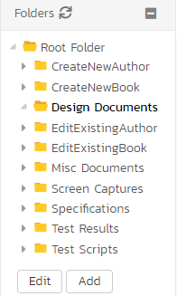

# Document Management

This section outlines the document management features of SpiraPlan® that can be used to upload, manage, edit, and share documents between product members. This module includes support for:

- uploading files and URLs
- creating certain document types (eg text files) from within the app
- editing (with versioning) certain document types (eg text files) from the app itself
- versioning of documents
- managing metadata on each document (description, author, custom fields, and more)
- managing documents using workflows
- organizing documents into folders
- categorizing and searching using tags

Document management is fully integrated into the rest of the system: you can attach documents to other artifacts (e.g. requirements, test cases, etc.) and any ones you add on an artifact (including screenshots) are automatically connected to the product documentation repository.

## Document List

When you choose the Documents artifact from the global navigation bar, you open the product documents list screen illustrated below:

This screen is made up of three sections:

1. The top left displays a hierarchical list of the document folders. You can expand or collapse a folder to see its subfolders. Click on a folder to show its contents in the main part of the screen.
2. The bottom left shows the "Tag Cloud". This lists all the tags associated with documents in the product. The size of the font is proportional to the number of documents associated with the tag. Clicking on a tag filters the list of documents to show items that contain the selected tag.
3. The main right-hand section displays a list of all the documents contained within the currently selected folder. This list can be filtered and sorted, and you can choose how many rows of documents to display on the page at one time.

The main toolbar has operations you can perform on the document list or selected documents. You can:

- [add documents](#add-new-document) to the current folder
- delete selected documents
- refresh the list of documents
- export selected documents to another product
- apply, update, clear, and save [filters](Application-Wide.md#filtering)
- toggle whether to show documents in the current folder only or a flat list of all documents across all folders
- show or hide specific fields on the main grid

### Filtering

Read about [how to create and manage filters, and how to sort the artifact list](Application-Wide.md#filtering).

### Add New Document

To create a new document, click the `Add New` button. This opens the "Add New Document" dialog box for uploading a single file (not multiple). Drag and drop a file onto the upload box, or click to browse for a file on your device. Each type of "Add New Document" dialog (see below) will let you:

- add a description (optional and can be edited later)
- add tags (optional and can be edited later)
- set a document type (the default is selected by default)
- set a version number (1.0 is entered by default)
- Click "Add" to add the document, or "Cancel" to cancel

#### Add New Files
The `Add New` button has a dropdown with more options - each option shows you a slightly different dialog box (the bottom part is the same but the top part differs).

- **Upload** (default - the same as clicking the `Add New` button itself): for uploading a file
- **URL**: for saving a url / web link as a new document (make sure you enter the full url - including http:// or https:// at the start)
- **Screenshot**: for pasting in a screenshot from the clipboard (eg using Ctrl + V) - make sure to also enter a file name

Note: If you are using a non-Windows® computer (e.g. Macintosh®) that doesn't put file extensions on filenames (e.g. .xls for an Excel sheet) automatically, then you will need to manually add the file extension to the filename before uploading if you want it to be displayed with the correct icon in the attachment list.

#### Add New Inline Documents
The `Add New` dropdown has options for creating several files that are not uploaded at all. Instead you choose a file name (and enter description and tag and type information), then when you click "Add" you are taken straight to the blank document, so you can start editing it live inside SpiraPlan itself from the [document details](#edit) page.

- **Markdown**: for creating a new markdown file
- **Rich Text**: for creating a new rich text document file
- **Feature**: for creating a new feature / BDD file
- **Diagram**: for creating a new drag and drop diagram file
- **Mindmap**: for creating a new drag and drop mindmap file
- **Orgchart**: for creating a new drag and drop organization chart

### View Document Information

When you hover the mouse pointer over any of the documents displayed in the document list, an information panel will be displayed that contains the name, description, version, document type and meta-tags of the document.

You can click on the document URL to actually open the document itself in a new window, click on the meta-tag links to find related documents that contain the same meta-tag, or click on "***View Details***" to see more information regarding the document, including an ability to edit its meta-information and see the different versions of the document.

### Edit Document Folders

If you are a product administrator, you will see the "Edit" and "Add" buttons beneath the folder tree:

This lets you add, edit and delete task folders in the product. To add a new folder, click the "***Add***" button:

Choose the parent folder that you want to add the new folder under (or None if you are adding a new top-level folder) from the dropdown list and then enter the name of the new folder. Then click 'Add' save the new folder.

To edit or delete an existing folder, click the 'Edit' button to switch the folder tree to edit mode:

To edit or delete a specific folder, click on the 'Edit' button next to the folder:

You can change the parent folder and/or name of the folder and click "***Update***" to commit the change or click "***Delete***" to delete the folder entirely (including its contents).[^folder-url]

## Document Details

When you click on an item in the document list described above, you are taken to the document details page illustrated below:

This page is made up of *three* areas;

1.  the left pane displays the documents list navigation
2.  the right pane's header, which displays: the operations toolbar; the name of the selected document; and the info bar (with a shaded background), which also contains the workflow status transitions (see below)
3.  the right pane's tabbed interface shows all the information about the document including, where available, the [folder the document is in](Application-Wide.md#breadcrumbs), a preview of the document, the list of document versions, the list of artifacts that the document is associated with, and history of changes made to the document). From the toolbar at the top you can save or delete the document, or undo any unsaved changes made by clicking `Refresh`.

Please note that on smaller screen sizes the navigation pane is not displayed. While the navigation pane has a link to take you back to the documents list, on mobile devices a 'back' button is shown on the left of the operations toolbar.

The navigation pane can be collapsed by clicking on the "-" button, or expanded by clicking anywhere on the gray title area. On desktops the user can also control the exact width of the navigation pane by dragging and dropping a red handle that appears on hovering at the rightmost edge of the navigation pane.

The navigation pane consists of a link that will take you back to the product document list, as well as a list of other documents in the current folder. This latter list is useful as a navigation shortcut; you can quickly view the detailed information of all the peer documents by clicking on the navigation links without having to first return to the main document list page.

### Emailing

Read about [emailing a document to colleagues using Spira](Application-Wide.md#emailing).

### Followers

Read about [how to add and manage followers to an artifact](Application-Wide.md#followers).

### Workflows

Read about [using workflows to change the status of your document](Application-Wide.md#workflows).

For documents, you can, depending on how the product administrator has set this up, use workflows to control who can add a new version to a document when. This can be useful for "checking-out" a document, during which time it is locked. When the document is checked back in the workflow can require that the person checking in the document upload a new version (make sure you upload the version before changing the status).

### View {: #preview }
<!-- id above set manually to preserve original link -->

This tab shows the currently active version of the document. You can view the document contents here for many different file types (notably plain text files, code files, feature/BDD files, rich text html documents, diagram files (including mindmaps and org charts), and images).

If a format cannot be previewed (for example a PDF or Microsoft Word document), the following message is displayed:

When viewing diagrams, mindmaps, or orgcharts there are two buttons above the diagram that you let you directly download a PNG or PDF formatted version of the diagram (you can download the diagram from the [Versions](#document-versions) tab but this downloads the raw data, not a formatted diagram).

### Edit

When you [create a new inline document](#add-new-inline-documents) the document opens to this tab, showing you the blank document. Make your changes by either:

- editing the text (for text documents)
- formatting the text (for rich text documents)
- creating and manipulating the diagram (for diagrams, mindmaps, or org charts) as described [below](#editing-diagrams)

Click `Save` to save the document and automatically create a new version (this version becomes the new active version). You can change the document from the Edit tab at any time (if allowed by the workflow and permissions).

You can only create inline documents from the list page for a few file formats, but there are many other file types that, once uploaded, can be edited inline. These include plain text file, including code files.

The Edit tab will show the text, but it is not fully formatted. Go to the [view](#preview) tab to see the formatted view with syntax highlighting applied.

#### Editing Diagrams
SpiraPlan supports three types of diagrams:

- **Diagrams**: the most versatile diagram type that let's you fully customize the diagram. You can add many different shapes, control whether or how each shape is linked to others with connectors, and fully control the layout
- **Mindmaps**: mindmaps let you add pill-shaped nodes to a core idea, and easily branch off any node to add new ideas. Groups of nodes can be collapsed  (click the plus icon on a node with children) to help you concentrate on only some nodes at a time
- **Org Charts**: this special type of chart is perfect for showing hierarchical relationships, adding boxes as children of parents. Org charts provide options of how to show sibling boxes (eg the direct reports to a manager) and the ability to collapse part of the hierarchy to make using the org chart easier (click the plus on a box with children). 

When editing any diagram, you will see a simple toolbar above the editing area. This toolbar lets:

- reset all changes performed since the last save
- undo changes
- redo changes
- change zoom level
- toggle the formatting palette on the right of the editor area and, for the "diagram" type, also hide the left hand shape picker

The **picker** (diagrams only) shows all available objects available that you can add to your diagram. To add a new object, click on it from the picker, or drag it from the picker into the editor area. There are three types of object:

- **shapes**
- **groups**, that you let you group shapes inside of them. Groups without a header are a simple box outline to help organize diagrams. Groups with a header can be collapsed. All objects fully inside that collapsed group will be hidden.
- **swimlanes** come in a few varieties to let you create rich kanban and swimlane like diagrams with ease. You can collapse a swimlane. All objects fully inside that collapsed swimlane will be hidden.

The **editor area** shows the diagram with all its nodes or shapes and connections. The diagram will be effectively identical to how it looks on the View tab. The main different being the dot grid background pattern in the editor area. The editor area lets you:

- expand or collapse children of a shape (mindmaps and org charts only)
- delete a shape by clicking on it to bring up a mini menu and then clicking the trash icon
- add a child shape (mindmaps and org charts only) by clicking on it to bring up a mini menu and then clicking the plus icon
- duplicate a shape (diagrams only) by clicking on it to bring up a mini menu and then clicking the duplicate icon
- adding connectors from a shape (diagrams only) by clicking on it to bring up a mini menu and then clicking the connector icon
- move a shape by dragging and dropping it anywhere in the editor area
- select a shape for more detailed customization using the formatting palette

The **formatting palette** shows you all ways you can format a selected shape. The options available will vary based on which diagram type is being edited. In general you can edit a shape's:

- Position (x and y)
- Size (width and height)
- Rotation [not for org charts]
- Fill color
- Stroke color, thickness, and style [not for org charts]
- Text (i.e. what is written inside the shape)
- Text formatting (size, color, bold, italic, and alignment) [not for org charts]

When editing a diagram type you can also select a specific connector and edit its:

- Stroke color, thickness, and style
- Termination style (arrow or straight)
- Path (straight or angled)
- Rounded corners (for angled path connectors)

### Properties {: #overview-details }
<!-- id above set manually to preserve original link -->

This tab allows you to view and/or edit the document's details (thinks like the description, author, tags, any custom fields). Make any changes and then click `Save` to commit the changes.

#### Comments

The Comments section allows users to add and view discussions related to the Document. Existing comments are displayed by date (either newest-first or oldest-first) above the text box. To add a comment, enter your text into the textbox, then click the "***Add Comment***" button. Clicking "Save" when there is text in the comment box will save any changes and add the new comment at the same time.

### Document Versions

This tab displays the list all the different versions that exist for the current document. When you first create a new document there will be only a single version (e.g. v1.0). As you change and update the document you do not need to create a whole new document. Instead, upload new versions or [edit the document inline](#edit) (if possible). This will create new versions of the file - you can have as many versions as you need and should give each a unique version number to help track them.

Each version in the list is displayed with its:

- filename (which is a link to open or download that specific version - note for diagrams this is the raw data and not the formatted diagram)
- any description added when uploading the file (useful for capturing what changed)
- version number
- file-size

One version will have a checkmark in the Active column. This is the currently active version - this is the version users see when they open the document (including the preview on the [view](#preview) tab). All other versions will have two buttons in the Operations column: "Delete" (to completely remove that version) and "Make Active" (to switch the active version to this version). 

To upload a new version click the 'Upload New Version' hyperlink:

In the popup dialog, you need to drag the file to be uploaded onto the upload icon (or click on the icon to browse to the file), enter a description of the changes made, a new version number and whether the new version should be made the active one, then click the `Upload` button to confirm the changes.

Note: This option is only available for files. You cannot add a new URL version or change the URL.

### Associations
You can associate a document to many other artifacts in the system from this tab. If you originally uploaded the document as an attachment to an artifact, then the initial association will be already listed. Read more about [how to manage and add associations to this artifact](Application-Wide.md#associations)

### Attachments
Read about [how the attachment tab works](Application-Wide.md#attachments)

### History
Read about [how the history tab works](Application-Wide.md#history)

[^folder-url]: when navigating to folders (for all artifacts that support them), the URL in your browser's address bar will change. Each folder has a unique, sharable URL that you can give to someone to display the list of artifacts with the appropriate folder selected. You can also open up multiple folders in different browser tabs and easily toggle between them from the same browser.