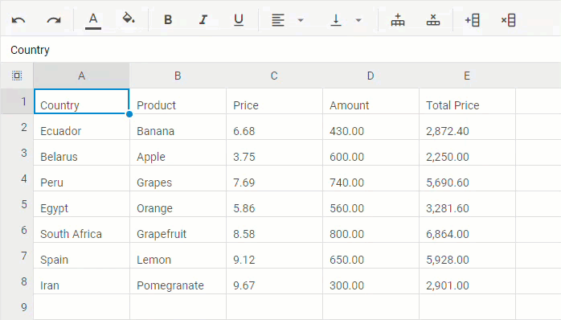

# Document Management

This section outlines the document management features of SpiraPlan® that can be used to upload, manage, edit, and share documents between product members. This module includes support for:

- uploading files and URLs
- creating certain document types (eg text files) from within the app
- editing (with versioning) certain document types (eg text files) from the app itself
- versioning of documents
- managing metadata on each document (description, author, custom fields, and more)
- managing documents using workflows
- organizing documents into folders
- categorizing and searching using tags

Document management is fully integrated into the rest of the system: you can attach documents to other artifacts (e.g. requirements, test cases, etc.) and any ones you add on an artifact (including screenshots) are automatically connected to the product documentation repository.

## Document List

When you choose the Documents artifact from the global navigation bar, you open the product documents list screen illustrated below:

This screen is made up of two sections:

1. The left displays a hierarchical list of the document folders. You can expand or collapse a folder to see its subfolders. Click on a folder to show its contents in the main part of the screen.
2. The main right-hand section displays a list of all the documents contained within the currently selected folder. This list can be filtered and sorted, and you can choose how many rows of documents to display on the page at one time.

The main toolbar has operations you can perform on the document list or selected documents. You can:

- [add documents](#add-new-document) to the current folder
- delete selected documents
- refresh the list of documents
- [add associations](#add-associations-in-bulk) to other artifacts in the same product
- export selected documents to another product
- apply, update, clear, and save [filters](Application-Wide.md#filtering)
- [download the list to a CSV file](Application-Wide.md/#download-as-csv)
- toggle whether to show documents in the current folder only or a flat list of all documents across all folders
- show or hide specific fields on the main grid

### Filtering
Read about [how to create and manage filters, and how to sort the artifact list](Application-Wide.md#filtering).

### Add New Document
To create a new document, click the `Add New` button. This opens the "Add New Document" dialog box for uploading a single file (not multiple). Drag and drop a file onto the upload box, or click to browse for a file on your device. Each type of "Add New Document" dialog (see below) will let you:

- add a description (optional and can be edited later)
- add tags (optional and can be edited later)
- set a document type (the default is selected by default)
- set a version number (1.0 is entered by default)
- Click "Add" to add the document, or "Cancel" to cancel

#### Add New Files
The `Add New` button has a dropdown with more options - each option shows you a slightly different dialog box (the bottom part is the same but the top part differs).

- **Upload** (default - the same as clicking the `Add New` button itself): for uploading a file
- **URL**: for saving a url / web link as a new document (make sure you enter the full url - including http:// or https:// at the start)
- **Screenshot**: for pasting in a screenshot from the clipboard (eg using Ctrl + V) - make sure to also enter a file name

Note: If you are using a non-Windows® computer (e.g. Macintosh®) that doesn't put file extensions on filenames (e.g. .xls for an Excel sheet) automatically, then you will need to manually add the file extension to the filename before uploading if you want it to be displayed with the correct icon in the attachment list.

#### Add New Inline Documents
The `Add New` dropdown has options for creating several files that are not uploaded at all. Instead you choose a file name (and enter description and tag and type information), then when you click "Add" you are taken straight to the blank document, so you can start editing it live inside SpiraPlan itself from the [document details](#edit) page.

- **Markdown**: for creating a new markdown file
- **Rich Text**: for creating a new rich text document file
- **Feature**: for creating a new feature / BDD file
- **Spreadsheet**: for creating a simple spreadsheet
- **Diagram**: for creating a new drag and drop diagram file
- **Mindmap**: for creating a new drag and drop mindmap file
- **Orgchart**: for creating a new drag and drop organization chart

### View Document Information
When you hover the mouse pointer over any of the documents displayed in the document list, an information panel will be displayed that contains the name, description, version, document type and meta-tags of the document.

You can click on the document URL to actually open the document itself in a new window, click on the meta-tag links to find related documents that contain the same meta-tag, or click on "***View Details***" to see more information regarding the document, including an ability to edit its meta-information and see the different versions of the document.

### Edit Document Folders
If you are a product administrator, you will see the "Edit" and "Add" buttons beneath the folder tree:

This lets you add, edit and delete task folders in the product. To add a new folder, click the "***Add***" button:

Choose the parent folder that you want to add the new folder under (or None if you are adding a new top-level folder) from the dropdown list and then enter the name of the new folder. Then click 'Add' save the new folder.

To edit or delete an existing folder, click the 'Edit' button to switch the folder tree to edit mode:

To edit or delete a specific folder, click on the 'Edit' button next to the folder:

You can change the parent folder and/or name of the folder and click "***Update***" to commit the change or click "***Delete***" to delete the folder entirely (including its contents).[^folder-url]

### Add Associations in Bulk 
From the tools button sub menu, if you click the "Add association" button you will be able to quickly add any currently selected documents to a single artifact. To do so follow these steps:

- Prepare your document list to show those you want
- Select all relevant documents (at least one and note that you cannot select folders)
- Click Tools > Add Association. This will display the popup dialog box shown below

- Enter the token of a specific artifact in the same product as the documents. This should be in the form of "[RQ:1]", ""[RQ1]", or "RQ1" (case insensitive)
- Click the "Search" button on the dialog box
- The dialog will validate the artifact and show its name and a plain text extract of its description so you can verify it is the correct artifact

- Click the "Add" button to associate that artifact to each of the selected documents

**Note**: if you enter an invalid token or a token to an artifact in a different product, or that is not supported, you will see an error message. You can see the full list of supported artifacts in the box called "What can you associate to what?" [here](Application-Wide.md/#associations). In addition, you can associate documents to a specific document - in this case the document will show on the attachments tab of the document(s), not the association tab.

## Document Details

When you click on an item in the document list described above, you are taken to the document details page illustrated below:

This page is made up of *three* areas;

1.  the left pane displays the documents list navigation
2.  the right pane's header, which displays: the operations toolbar; the name of the selected document; and the info bar (with a shaded background), which also contains the workflow status transitions (see below)
3.  the right pane's tabbed interface shows all the information about the document including, where available, the [folder the document is in](Application-Wide.md#breadcrumbs), a preview of the document, the list of document versions, the list of artifacts that the document is associated with, and history of changes made to the document). From the toolbar at the top you can save or delete the document, or undo any unsaved changes made by clicking `Refresh`.

Please note that on smaller screen sizes the navigation pane is not displayed. While the navigation pane has a link to take you back to the documents list, on mobile devices a 'back' button is shown on the left of the operations toolbar.

The navigation pane can be collapsed by clicking on the "-" button, or expanded by clicking anywhere on the gray title area. On desktops the user can also control the exact width of the navigation pane by dragging and dropping a red handle that appears on hovering at the rightmost edge of the navigation pane.

The navigation pane consists of a link that will take you back to the product document list, as well as a list of other documents in the current folder. This latter list is useful as a navigation shortcut; you can quickly view the detailed information of all the peer documents by clicking on the navigation links without having to first return to the main document list page.

### Emailing

Read about [emailing a document to colleagues using Spira](Application-Wide.md#emailing).

### Followers

Read about [how to add and manage followers to an artifact](Application-Wide.md#followers).

### Workflows

Read about [using workflows to change the status of your document](Application-Wide.md#workflows).

For documents, you can, depending on how the product administrator has set this up, use workflows to control who can add a new version to a document when. This can be useful for "checking-out" a document, during which time it is locked. When the document is checked back in the workflow can require that the person checking in the document upload a new version (make sure you upload the version before changing the status).

### View {: #preview }
<!-- id above set manually to preserve original link -->

This tab shows the currently active version of the document. You can view the document contents here for many different file types (notably plain text files, code files, feature/BDD files, rich text html documents, spreadsheets, diagrams (including mindmaps and org charts), and images).

If a format cannot be previewed (for example a PDF or Microsoft Word document), the following message is displayed:

When viewing diagrams, mindmaps, or orgcharts there is a button above the diagram that you let you directly download an SVG of the diagram (you can download the diagram from the [Versions](#document-versions) tab but this downloads the raw data, not a formatted diagram).

### Edit

When you [create a new inline document](#add-new-inline-documents) the document opens to this tab, showing you the blank document. Make your changes by either:

- editing the text (for text documents)
- formatting the text (for rich text documents)
- creating and manipulating the diagram (for diagrams, mindmaps, or org charts) as described [below](#editing-diagrams)

Click `Save` to save the document and automatically create a new version (this version becomes the new active version). You can change the document from the Edit tab at any time (if allowed by the workflow and permissions).

You can only create inline documents from the list page for a few file formats, but there are many other file types that, once uploaded, can be edited inline. These include plain text file, including code files.

The Edit tab will show the text, but it is not fully formatted. Go to the [view](#preview) tab to see the formatted view with syntax highlighting applied.

#### Editing Diagrams
SpiraPlan supports three types of diagrams:

- **Diagrams**: the most versatile diagram type that let's you fully customize the diagram. You can add many different shapes, control whether or how each shape is linked to others with connectors, and fully control the layout
- **Mindmaps**: mindmaps let you add pill-shaped nodes to a core idea, and easily branch off any node to add new ideas. Groups of nodes can be collapsed  (click the plus icon on a node with children) to help you concentrate on only some nodes at a time
- **Org Charts**: this special type of chart is perfect for showing hierarchical relationships, adding boxes as children of parents. Org charts provide options of how to show sibling boxes (eg the direct reports to a manager) and the ability to collapse part of the hierarchy to make using the org chart easier (click the plus on a box with children). 

When editing any diagram, you will see a simple toolbar above the editing area. This toolbar lets:

- reset all changes performed since the last save
- undo changes
- redo changes
- change zoom level
- toggle the formatting palette on the right of the editor area and, for the "diagram" type, also hide the left hand shape picker

The **picker** (diagrams only) shows all available objects available that you can add to your diagram. To add a new object, click on it from the picker, or drag it from the picker into the editor area. There are three types of object:

- **shapes**
- **groups**, that you let you group shapes inside of them. Groups without a header are a simple box outline to help organize diagrams. Groups with a header can be collapsed. All objects fully inside that collapsed group will be hidden.
- **swimlanes** come in a few varieties to let you create rich kanban and swimlane like diagrams with ease. You can collapse a swimlane. All objects fully inside that collapsed swimlane will be hidden.

The **editor area** shows the diagram with all its nodes or shapes and connections. The diagram will be effectively identical to how it looks on the View tab. The main different being the dot grid background pattern in the editor area. The editor area lets you:

- expand or collapse children of a shape (mindmaps and org charts only)
- delete a shape by clicking on it to bring up a mini menu and then clicking the trash icon
- add a child shape (mindmaps and org charts only) by clicking on it to bring up a mini menu and then clicking the plus icon
- duplicate a shape (diagrams only) by clicking on it to bring up a mini menu and then clicking the duplicate icon
- adding connectors from a shape (diagrams only) by clicking on it to bring up a mini menu and then clicking the connector icon
- move a shape by dragging and dropping it anywhere in the editor area
- select a shape for more detailed customization using the formatting palette

The **formatting palette** shows you all ways you can format a selected shape. The options available will vary based on which diagram type is being edited. In general you can edit a shape's:

- Position (x and y)
- Size (width and height)
- Rotation [not for org charts]
- Fill color
- Stroke color, thickness, and style [not for org charts]
- Text (i.e. what is written inside the shape)
- Text formatting (size, color, bold, italic, and alignment) [not for org charts]

When editing a diagram type you can also select a specific connector and edit its:

- Stroke color, thickness, and style
- Termination style (arrow or straight)
- Path (straight or angled)
- Rounded corners (for angled path connectors)

#### Editing Spreadsheets
The SpiraPlan spreadsheet is a feature rich spreadsheet application that supports many common spreadsheet features. It is intuitive and easy to use, and should feel immediately familiar. It can work as a full spreadsheet replacement for a wide variety of use cases, with the benefit of all the data and versioning living directly inside Spira. Please note that the spreadsheet is not as powerful as desktop or dedicated web apps and will not be the best solution for handling things like very large data sets, or complex models.

**Spreadsheet features**:

- **Multiple sheets**: rename, add, and remove sheets by clicking or right clicking on the sheets bar at the bottom of the spreadsheet
- **Importing from and exporting to Excel**: Go to 
    - File -> Import As... -> Microsoft Excel (.xlsx) in the menu or 
    - File -> Download As... -> Microsoft Excel (.xlsx)
    - 

- **Formulas** (including across sheets): work as in other spreadsheet applications. Here is a simple example to sum three cells: `=sum(A1:A3)`. See [our full guide to all supported functions](#annex-of-spreadsheet-functions) below.

- **Formatting**: use the menu to change
    - styles (bold, italic, underline)
    - alignment (horizontal and vertical)
    - colors (text and background)
    - content type (numbers, percentage, dates, currency, or text)
    - 

- **Rows and columns**: add, remove, and resize
    - 

- **Locking cells**: Right-click a cell/a range of cells you want to lock/unlock. Choose the Lock/Unlock cell option in the appeared context menu.
- Data sorting
- **Data validation** (to create a drop-down list): 
    - Select a cell or a range of cells where you want to create the list
    - Go to: Data -> Data validation in the menu
    - Choose the List of items criteria
    - Type the items you want to appear in the drop-down list
    - Press the Save button
    - 

- Common keyboard shortcuts for things like undo, redo, copy, paste
- Access features with a context menu and also menu bar

### Properties {: #overview-details }
<!-- id above set manually to preserve original link -->

This tab allows you to view and/or edit the document's details (thinks like the description, author, tags, any custom fields). Make any changes and then click `Save` to commit the changes.

#### Comments
Read about [how the comments works](Application-Wide.md#comments)

### Document Versions

This tab displays the list all the different versions that exist for the current document. When you first create a new document there will be only a single version (e.g. v1.0). As you change and update the document you do not need to create a whole new document. Instead, upload new versions or [edit the document inline](#edit) (if possible). This will create new versions of the file - you can have as many versions as you need and should give each a unique version number to help track them.

Each version in the list is displayed with its:

- filename (which is a link to open or download that specific version - note for diagrams this is the raw data and not the formatted diagram)
- any description added when uploading the file (useful for capturing what changed)
- version number
- file-size

One version will have a checkmark in the Active column. This is the currently active version - this is the version users see when they open the document (including the preview on the [view](#preview) tab). All other versions will have two buttons in the Operations column: "Delete" (to completely remove that version) and "Make Active" (to switch the active version to this version). 

To upload a new version click the 'Upload New Version' hyperlink:

In the popup dialog, you need to drag the file to be uploaded onto the upload icon (or click on the icon to browse to the file), enter a description of the changes made, a new version number and whether the new version should be made the active one, then click the `Upload` button to confirm the changes.

Note: This option is only available for files. You cannot add a new URL version or change the URL.

### Associations
You can associate a document to many other artifacts in the system from this tab. If you originally uploaded the document as an attachment to an artifact, then the initial association will be already listed. Read more about [how to manage and add associations to this artifact](Application-Wide.md#associations)

### Attachments
Read about [how the attachment tab works](Application-Wide.md#attachments)

### History
Read about [how the history tab works](Application-Wide.md#history)

### Annex of Spreadsheet Functions
#### Boolean operators 
You can compare two values via using logical expressions that in any given case will only return either TRUE or FALSE.

| Operator | Example | Description |
| --- | --- | --- |
| =   | =A1=B1 | Returns TRUE if the value in cell A1 is equal to the value in cell B1; otherwise, FALSE. |
| <>  | =A1<>B1 | Returns TRUE if the value in cell A1 is not equal to the value in cell B1; otherwise, FALSE. |
| >   | =A1>B1 | Returns TRUE if the value in cell A1 is greater than the value in cell B1; otherwise, FALSE. |
| <   | =A1<B1 | Returns TRUE if the value in cell A1 is less than the value in cell B1; otherwise, FALSE. |
| >=  | =A1>=B1 | Returns TRUE if the value in cell A1 is greater than or equal to the value in cell B1; otherwise, FALSE. |
| <=  | =A1<=B1 | Returns TRUE if the value in cell A1 is less than or equal to the value in cell B1; otherwise, FALSE. |

#### Date functions

| Function | Formula | Description |
| --- | --- | --- |
| **DATE** | =DATE(year,month,day) | Combines three separate values (year, month, and day) and returns a date. |
| **DATEDIF** | =DATEDIF(start\_date,end\_date,unit) | Returns the number of days, months, or years between two dates.   The [unit](https://support.microsoft.com/en-us/office/datedif-function-25dba1a4-2812-480b-84dd-8b32a451b35c) argument is used to define which type of information you want returned. |
| **DATEVALUE** | =DATEVALUE(date_text) | Converts a date that is stored as text to a serial number. |
| **DAY** | =DAY(date) | Returns the day of the month as a number between 1 to 31 from a specified date. |
| **DAYS** | =DAYS(end\_date, start\_date) | Returns the number of days between two dates. |
| **DAYS360** | =DAYS360(start\_date,end\_date,\[method\]\]) | Returns the number of days between 2 dates, based on a 360-day year (twelve 30-days months). |
| **EDATE** | =EDATE(start_date, months) | Returns the date on the same date of the month, n months in the past or future. |
| **EOMONTH** | =EOMONTH(start_date, months) | Returns the date for the last day of the month, n months before or after the specified start date. |
| **ISOWEEKNUM** | =ISOWEEKNUM(date) | Returns the number of the ISO week number of the year for the specified date. |
| **MONTH** | =MONTH(date) | Returns the month of the year of the specified date. |
| **NETWORKDAYS** | =NETWORKDAYS(start\_date, end\_date, \[holidays\]) | Returns the number of whole working days between two dates. Working days exclude weekends and any dates specified in _holidays_. |
| **NETWORKDAYSINTL** | =NETWORKDAYSINTL(start\_date, end\_date, \[weekend\], \[holidays\]) | Returns the number of whole working days between two dates.   The optional [weekend](https://support.microsoft.com/en-us/office/networkdays-intl-function-a9b26239-4f20-46a1-9ab8-4e925bfd5e28) parameter is used to specify which days of the week are considered weekends.   _Weekend days_ and _holidays_ are not considered as workdays. |
| **NOW** | =NOW() | Returns the current date. |
| **TIMEVALUE**   added in v4.3 | =TIMEVALUE(time_text) | Returns the decimal number of the time represented by a text string |
| **WEEKDAY** | =WEEKDAY(date,\[return_type\]) | Returns the day of the week for the specified date.   The [return_type](https://support.microsoft.com/en-us/office/weekday-function-60e44483-2ed1-439f-8bd0-e404c190949a) argument is used to define which day of the week is considered the first day. |
| **WEEKNUM** | =WEEKNUM(date,\[return_type\]) | Returns the week number for the specified date.   The [return_type](https://support.microsoft.com/en-us/office/weeknum-function-e5c43a03-b4ab-426c-b411-b18c13c75340) argument is used to define which day of the week is considered the first day. |
| **WORKDAY** | =WORKDAY(start_date, days, \[holidays\]) | Returns the date of the nearest working day n days in the future or past.   Working days exclude weekends and any dates specified in _holidays_. |
| **WORKDAYINTL** | =WORKDAYINTL(start_date, days, \[weekend\], \[holidays\]) | Returns the date of the nearest working day n days in the future or past.   The optional [weekend](https://support.microsoft.com/en-us/office/workday-intl-function-a378391c-9ba7-4678-8a39-39611a9bf81d) parameter is used to specify which days of the week are considered weekends.   _Weekend days_ and _holidays_ are not considered as workdays. |
| **YEAR** | =YEAR(date) | Returns the year of the specified date. |
| **YEARFRAC** | =YEARFRAC(start\_date, end\_date, \[basis\]) | Returns the year of the specified date.   The optional [basis](https://support.microsoft.com/en-us/office/yearfrac-function-3844141e-c76d-4143-82b6-208454ddc6a8) argument is used to define the type of day count basis. |

#### Financial functions

| Function | Formula | Description |
| --- | --- | --- |
| **ACCRINT** | =ACCRINT(issue, id, sd, rate, par, frequency, \[basis\], \[calc_method\]),      where:  * _issue_ \- the issue date of the security; * _id_ \- the security's first interest date; * _sd_ \- the security's settlement date; * _rate_ \- the security's annual coupon rate; * _par_ \- the security's par value, $1,000 by default; * _frequency_ \- the number of coupon payments per year (1 for annual payments); * _basis_ \- optional, the type of day count basis to use; * _calc_method_ \- optional, the way to calculate the total accrued interest when the date of settlement is later than the date of first interest ([0 or 1(default)](https://support.microsoft.com/en-us/office/accrint-function-fe45d089-6722-4fb3-9379-e1f911d8dc74)). | Returns the accrued interest for a security that pays periodic interest. |
| **BINOM.DIST**   added in v4.3 | =BINOM.DIST(number\_s, trials, probability\_s, cumulative),      where:  * _number_s_ \- the number of successes in trials; * _trials_ \- the number of independent trials; * _probability_s_ \- the probability of success on each trial; * _cumulative_ \- if TRUE, then BINOM.DIST returns the cumulative distribution function; if FALSE (use 0), it returns the probability mass function. | Returns the individual term binomial distribution probability. |
| **BINOM.DIST.RANGE**   added in v4.3 | =BINOM.DIST.RANGE(trials, probability\_s, number\_s, \[number_s2\]),      where:  * _trials_ \- the number of independent trials (must be ≥ 0); * _probability_s_ \- the probability of success in each trial (must be ≥ 0 and ≤ 1); * _number_s_ \- the number of successes in trials (must be ≥ 0 and ≤ _trials)_; * _number_s2_ \- optional. If provided, returns the probability that the number of successful trials will fall between _number_s_ and _number_s2_       (\[number_s2\] must be ≥ _number_s_ and ≤ _trials_). | Returns the probability of a trial result using a binomial distribution. |
| **BINOM.INV**   added in v4.3 | =BINOM.INV(trials, probability_s, alpha),      where:  * _trials_ \- the number of Bernoulli trials; * _probability_s_ \- the probability of success in each trial (must be ≥ 0 and ≤ 1); * _alpha_ \- the criterion value (must be ≥ 0 and ≤ _1)_; | Returns the smallest value for which the cumulative binomial distribution is greater than or equal to a criterion value. |
| **BITLSHIFT**   added in v4.3 | =BITLSHIFT(number, shift_amount),      where:  * _number_ \- the number to be shifted (must be an integer greater than or equal to 0) * _shift_amount_ \- the amount of bits to shift, if negative, shifts bits to the right instead | Returns a number shifted left by the specified number of bits. |
| **BITOR**   added in v4.3 | =BITOR(number1, number2),      where:  * _number1_ \- a decimal number (must be greater than or equal to 0 and no larger than 2^48 - 1); * _number2_ \- a decimal number (must be greater than or equal to 0 and no larger than 2^48 - 1); | Returns a decimal number representing the bitwise OR of two numbers. |
| **BITRSHIFT**   added in v4.3 | =BITRSHIFT(number, shift_amount),      where:  * _number_ \- the number to be shifted (must be an integer greater than or equal to 0); * _shift_amount_ \- the amount of bits to shift, if negative shifts bits to the left instead; | Returns a number shifted right by the specified number of bits. |
| **BITXOR**   added in v4.3 | =BITXOR(number1, number2),      where:  * _number1_ \- a decimal number (must be greater than or equal to 0 and no larger than 2^48 - 1); * _number2_ \- a decimal number (must be greater than or equal to 0 and no larger than 2^48 - 1); | Returns a decimal number representing the bitwise XOR of two numbers. |
| **COMPLEX**   added in v4.3 | =COMPLEX(real\_num, i\_num, \[suffix\]),      where:  * _real_num_ \- the real coefficient of the complex number; * _i_num_ \- the imaginary coefficient of the complex number; * _suffix_ \- optional ("i" by default) - the suffix for the imaginary component of the complex number;       (must be lowercase "i" or "j") . | Converts real and imaginary coefficients into a complex number of the form x + yi or x + yj. |
| **CORREL**   added in v4.3 | =CORREL(array1, array2),      where:  * _array1_ \- a range of cell values; * _array2_ \- a second range of cell values;    Text, logical values, or empty cells are ignored. Cells with zero values are included. The arrays must have equal number of data points. | Returns the correlation coefficient of two cell ranges. |
| **COVAR**   added in v4.3 | =COVAR(array1, array2),      where:  * _array1_ \- The first cell range of integers; * _array2_ \- The second cell range of integers;    Text, logical values, or empty cells are ignored. Cells with zero values are included. The arrays must have equal number of data points. | Returns covariance, the average of the products of deviations for each data point pair in two data sets. |
| **COVARIANCE.P**   added in v4.3 | =COVARIANCE.P(array1, array2),      where:  * _array1_ \- The first cell range of integers; * _array2_ \- The second cell range of integers;    Text, logical values, or empty cells are ignored. Cells with zero values are included. The arrays must have equal number of data points. | Returns population covariance, the average of the products of deviations for each data point pair in two data sets. |
| **COVARIANCE.S**   added in v4.3 | =COVARIANCE.S(array1, array2),      where:  * _array1_ \- The first cell range of integers; * _array2_ \- The second cell range of integers;    Text, logical values, or empty cells are ignored. Cells with zero values are included. The arrays must have equal number of data points. | Returns the sample covariance, the average of the products of deviations for each data point pair in two data sets. |
| **DB** | =DB(cost, salvage, life, period, \[month\]),      where:  * _cost_ \- the initial cost of the asset; * _salvage_ \- the value of the asset at the end of the depreciation; * _life_ \- the number of periods over which the asset is being depreciated; * _period_ \- the period to calculate depreciation for; * _month_ \- optional, the number of months in the first year, 12 by default. | Calculates the depreciation of an asset for a specified period using the fixed-declining balance method. |
| **DDB** | =DDB(cost, salvage, life, period, \[factor\]),      where:  * _cost_ \- the initial cost of the asset; * _salvage_ \- the value of the asset at the end of the depreciation; * _life_ \- the number of periods over which the asset is being depreciated; * _period_ \- the period to calculate depreciation for; * _factor_ \- optional, the rate at which the balance declines, 2 (the double-declining balance method) by default | Calculates the depreciation of an asset for a specified period using the double-declining balance method or another method you specify. |
| **DEC2BIN**   added in v4.3 | =DEC2BIN(number),      where:  * _number_ \- the decimal integer you want to convert (must be greater than -512 but less than 511); | Converts a decimal number to binary. |
| **DEC2HEX**   added in v4.3 | =DEC2HEX(number),      where:  * _number_ \- the decimal integer you want to convert (must be greater than -549755813888 but less than 549755813887); | Converts a decimal number to hexadecimal. |
| **DEC2OCT**   added in v4.3 | =DEC2OCT(number),      where:  * _number_ \- the decimal integer you want to convert (must be greater than -536870912 but less than 536870911); | Converts a decimal number to octal. |
| **DELTA**   added in v4.3 | =DELTA(number1, \[number2\]),      where:  * _number1_ \- the first number; * _number2_ \- optional, the second number. If omitted, number2 is assumed to be zero. | Tests two numbers for equality. Returns 1 if number1 = number2; returns 0 otherwise. |
| **DEVSQ**   added in v4.3 | =DEVSQ(number1, \[number2\], ...),      where:  * _number1, number2,..._ \- from 1 to 255 arguments for which you want to calculate the sum of squared deviations;    Text, logical values, or empty cells are ignored. Cells with zero values are included. | Returns the sum of squares of deviations of data points from their sample mean. |
| **DOLLARDE** | =DOLLARDE(fractional_dollar, fraction) | Converts a dollar price specified as an integer part and a fraction part into a dollar price displayed as a decimal number. |
| **DOLLARFR** | =DOLLARFR(decimal_dollar, fraction) | Converts a decimal number into fractional dollar number. |
| **EFFECT** | =EFFECT(nominal_rate, npery)      _nominal_rate_ must be >= 0, _npery_ must be > 1. | Returns the effective annual interest rate on the base of the nominal annual interest rate and the number of compounding periods per year you specify.   Works with numeric values. |
| **ERF**   added in v4.3 | =ERF(lower\_limit, \[upper\_limit\]),      where:  * _lower_limit_ \- the lower bound for integrating ERF; * _upper_limit_ \- the upper bound for integrating ERF. If omitted, ERF integrates between 0 and lower_limit. | Returns the error function integrated between lower\_limit and upper\_limit. |
| **ERFC**   added in v4.3 | =ERFC(x),      where:  * _x_ \- the lower bound for integrating ERFC | Returns the complementary ERF function integrated between x and infinity. |
| **EXP**   added in v4.3 | =EXP(number),      where:  * _number_ \- the power that e is raised to | Returns the result of the constant e (which equals 2.71828182845904) raised to the power of a number. |
| **FISHER**   added in v4.3 | =FISHER(x),      where:  * _x_ \- the value for which you want to calculate the transformation | Calculates the Fisher transformation for a supplied value. |
| **FISHERINV**   added in v4.3 | =FISHERINV(y),      where:  * _y_ \- the value for which you want to perform the inverse of the transformation | Calculates the inverse of the Fisher transformation and returns a value between -1 and +1. |
| **FV** | =FV(rate, nper, pmt, \[pv\], \[type\]),      where:  * _rate_ \- the interest rate per period. For monthly payments, _rate_ = rate/12; * _nper_ \- the total number of payment periods in an annuity. For monthly payments, _nper_=nper*12; * _pmt_ \- the payment made each period; * _pv_ \- optional, the present value, or the lump-sum amount that a series of future payments is worth right now, 0 by default; * _type_ \- optional, 0(default) - the payments are due at the end of the period, 1 - at the beginning of the period. | Calculates the future value of an investment. |
| **FVSCHEDULE** | =FVSCHEDULE(principal, schedule),      where:  * _principal_ \- the present value; * _schedule_ \- an array of interest rates to apply. The values in the array can be numbers or blank cells; any other value produces the error value. Blank cells are taken as zeros. | Returns the future value of an initial principal (=present value) after applying a series of compound interest rates. |
| **GAMMA**   added in v4.3 | =GAMMA(number)      If Number is a negative integer or 0, GAMMA returns the #Error value. | Returns the gamma function value. |
| **GEOMEAN**   added in v4.3 | =GEOMEAN(number1, \[number2\], ...)      where:  * _number1, number2,..._ \- from 1 to 255 arguments for which you want to calculate the mean;    Text, logical values, or empty cells are ignored. Cells with zero values are included. | Returns the geometric mean of an array or range of positive data. |
| **GESTEP**   added in v4.3 | =GESTEP(number, \[step\])      where:  * _number_ \- the value to test against step; * _step_ \- optional, the threshold value. If you omit a value for step, GESTEP uses zero; | Returns 1 if number ≥ step; returns 0 (zero) otherwise. |
| **HARMEAN**   added in v4.3 | =HARMEAN(number1, \[number2\], ...)      where:  * _number1, number2,..._ \- from 1 to 255 arguments for which you want to calculate the mean;    Text, logical values, or empty cells are ignored. Cells with zero values are included. | Returns the harmonic mean of a data set. |
| **HEX2BIN**   added in v4.3 | =HEX2BIN(number)      where:  * _number_ \- the hexadecimal number you want to convert. Number can't contain more than 10 characters; | Converts a hexadecimal number to binary. |
| **HEX2DEC**   added in v4.3 | =HEX2DEC(number)      where:  * _number_ \- the hexadecimal number you want to convert. Number can't contain more than 10 characters; | Converts a hexadecimal number to decimal. |
| **HEX2OCT**   added in v4.3 | =HEX2OCT(number)      where:  * _number_ \- the hexadecimal number you want to convert. Number can't contain more than 10 characters; | Converts a hexadecimal number to octal. |
| **IMABS**   added in v4.3 | =IMABS(inumber)      where:  * _inumber_ \- a complex number | Returns the absolute value of a complex number in the format x + yi or x + yj. |
| **IMAGINARY**   added in v4.3 | =IMAGINARY(inumber)      where:  * _inumber_ \- a complex number | Returns the imaginary coefficient of a complex number given in the format x + yi or x + yj. |
| **IMCONJUGATE**   added in v4.3 | =IMCONJUGATE(inumber)      where:  * _inumber_ \- a complex number | Returns the complex conjugate of a complex number given in the format x + yi or x + yj. |
| **IMCOS**   added in v4.3 | =IMCOS(inumber)      where:  * _inumber_ \- a complex number | Returns the cosine of a complex number given in the format x + yi or x + yj. |
| **IMCOSH**   added in v4.3 | =IMCOSH(inumber)      where:  * _inumber_ \- a complex number | Returns the hyperbolic cosine of a complex number given in the format x + yi or x + yj. |
| **IMCOT**   added in v4.3 | =IMCOT(inumber)      where:  * _inumber_ \- a complex number | Returns the cotangent of a complex number given in the format x + yi or x + yj. |
| **IMCSC**   added in v4.3 | =IMCSC(inumber)      where:  * _inumber_ \- a complex number | Returns the cosecant of a complex number given in the format x + yi or x + yj. |
| **IMCSCH**   added in v4.3 | =IMCSCH(inumber)      where:  * _inumber_ \- a complex number | Returns the hyperbolic cosecant of a complex number given in the format x + yi or x + yj. |
| **IMDIV**   added in v4.3 | =IMDIV(inumber1, inumber2)      where:  * _inumber1_ \- the complex numerator or dividend * _inumber2_ \- the complex denominator or divisor | Returns the quotient of two complex numbers given in the format x + yi or x + yj. |
| **IMEXP**   added in v4.3 | =IMEXP(inumber)      where:  * _inumber_ \- a complex number | Returns the exponential of a complex number given in the format x + yi or x + yj. |
| **IMLN**   added in v4.3 | =IMLN(inumber)      where:  * _inumber_ \- a complex number | Returns the natural logarithm of a complex number given in the format x + yi or x + yj. |
| **IMPOWER**   added in v4.3 | =IMPOWER(inumber, number)      where:  * _inumber_ \- a complex number * _number_ \- the power to which you want to raise the complex number | Returns a complex number in x + yi or x + yj text format raised to a power. |
| **IMPRODUCT**   added in v4.3 | =IMPRODUCT(inumber1, \[inumber2\], ...)      where:  * _inumber1, inumber2,..._ \- from 1 to 255 complex numbers to multiply | Returns the product of 1 to 255 complex numbers given in the format x + yi or x + yj. |
| **IMREAL**   added in v4.3 | =IMREAL(inumber)      where:  * _inumber_ \- a complex number | Returns the real coefficient of a complex number given in the format x + yi or x + yj. |
| **IMSEC**   added in v4.3 | =IMSEC(inumber)      where:  * _inumber_ \- a complex number | Returns the secant of a complex number given in the format x + yi or x + yj. |
| **IMSECH**   added in v4.3 | =IMSECH(inumber)      where:  * _inumber_ \- a complex number | Returns the hyperbolic secant of a complex number given in the format x + yi or x + yj. |
| **IMSIN**   added in v4.3 | =IMSIN(inumber)      where:  * _inumber_ \- a complex number | Returns the sine of a complex number given in the format x + yi or x + yj. |
| **IMSINH**   added in v4.3 | =IMSINH(inumber)      where:  * _inumber_ \- a complex number | Returns the hyperbolic sine of a complex number given in the format x + yi or x + yj. |
| **IMSQRT**   added in v4.3 | =IMSQRT(inumber)      where:  * _inumber_ \- a complex number | Returns the square root of a complex number given in the format x + yi or x + yj. |
| **IMSUB**   added in v4.3 | =IMSUB(inumber1, inumber2)      where:  * _inumber1_ \- a complex number from which to subtract inumber2; * _inumber2_ \- the complex number to subtract from inumber1 | Returns the difference of two complex numbers given in the format x + yi or x + yj. |
| **IMSUM**   added in v4.3 | =IMSUB(inumber1, \[inumber2\], ...)      where:  * _inumber1, inumber2,..._ \- from 1 to 255 complex numbers to add | Returns the sum of two or more complex numbers given in the format x + yi or x + yj. |
| **IMTAN**   added in v4.3 | =IMTAN(inumber)      where:  * _inumber_ \- a complex number | Returns the tangent of a complex number given in the format x + yi or x + yj. |
| **IPMT** | =IPMT(rate, per, nper, pv, \[fv\], \[type\]),      where:  * _rate_ \- the interest rate per period. For monthly payments, _rate_ = rate/12; * _per_ \- the period for which you want to find the interest and must be in the range between 1 and nper; * _nper_ \- the total number of payment periods in an annuity. For monthly payments, _nper_=nper*12; * _pv_ \- the present value, or the lump-sum amount that a series of future payments is worth right now; * _fv_ \- optional, the future value, 0 by default; * _type_ \- optional, 0(default) - the payments are due at the end of the period, 1 - at the beginning of the period. | Returns the interest payment for a given period for an investment based on periodic, constant payments and a constant interest rate. |
| **IRR** | =IRR(values, \[guess\]),      where:  * _values_ \- an array or reference to cells that contain values. The array must contain at least one positive value and one negative value; * _guess_ \- optional, an estimate for expected IRR, .1 (=10%) by default. | Returns the internal rate of return (IRR) for a series of cash flows that occur at regular intervals. |
| **ISPMT** | =ISPMT(rate, per, nper, pv),      where:  * _rate_ \- the interest rate for the investment. For monthly payments, _rate_ = rate/12; * _per_ \- the period for which you want to find the interest and must be in the range between 1 and nper; * _nper_ \- the total number of payment periods for the investment. For monthly payments, _nper_=nper*12; * _pv_ \- the present value of the investment. For a loan, pv is the loan amount. | Calculates the interest paid (or received) for the specified period of a loan (or investment) with even principal payments. |
| **LARGE**   added in v4.3 | =LARGE(array, k),      where:  * _array_ \- the array or range of data for which you want to determine the k-th largest value; * _k_ \- the position (from the largest) in the array or cell range of data to return. | Returns the k-th largest value in an array. |
| **MEDIAN**   added in v4.3 | =MEDIAN(number1, \[number2\], ...),      where:  * _number1, number2,..._ \- from 1 to 255 numbers for which you want to calculate the median; | Returns the median of the given numbers. |
| **NOMINAL** | =NOMINAL(effect_rate, npery),      _effect_rate_ must be >= 0, _npery_ must be > 1. | Returns the nominal annual interest rate on the base of the effective rate and the number of compounding periods per year you specify. |
| **NPER** | =NPER(rate,pmt,pv,\[fv\],\[type\]),      where:  * _rate_ \- the interest rate per period. For monthly payments, _rate_ = rate/12; * _pmt_ \- the payment made each period; * _pv_ \- the present value, or the lump-sum amount that a series of future payments is worth right now; * _fv_ \- optional, the future value, 0 by default; * _type_ \- optional, 0(default) - the payments are due at the end of the period, 1 - at the beginning of the period. | Returns the number of periods for an investment based on periodic, constant payments and a constant interest rate. |
| **NPV** | =NPV(rate,value1,\[value2\],...),      where:  * _rate_ \- the rate of discount over one year; * _value1, value2,..._ \- from 1 to 254 values representing cash flows (future payments and income).       Empty cells, logical values, text, or error values are ignored. | Calculates the net present value of an investment by using a discount rate and a series of future payments (negative values) and income (positive values). |
| **OCT2BIN**   added in v4.3 | =OCT2BIN(number),      where:  * _number_ \- the octal number you want to convert. It can't contain more than 10 characters; | Converts an octal number to binary. |
| **OCT2DEC**   added in v4.3 | =OCT2DEC(number),      where:  * _number_ \- the octal number you want to convert. Number may not contain more than 10 octal characters (30 bits) | Converts an octal number to decimal. |
| **OCT2HEX**   added in v4.3 | =OCT2HEX(number),      where:  * _number_ \- the octal number you want to convert. Number may not contain more than 10 octal characters (30 bits) | Converts an octal number to hexadecimal. |
| **PDURATION** | =PDURATION(rate, pv, fv),      where:  * _rate_ \- the interest rate per period. For monthly payments, _rate_ = rate/12; * _pv_ \- the present value of the investment; * _fv_ \- the desired future value of the investment.     All arguments must be positive values. | Returns the number of periods required by an investment to reach a specified value. |
| **PERCENTILE**   added in v4.3 | =PERCENTILE(array, k),      where:  * _array_ \- an array of data values; * _k_ \- the percentile value between 0 and 1, inclusive. | Returns the k-th percentile of values in a range. |
| **PERCENTILE.EXC**   added in v4.3 | =PERCENTILE.EXC(array, k),      where:  * _array_ \- an array of data values; * _k_ \- the percentile value between 0 and 1, exclusive. | Returns the k-th percentile of values in a range. |
| **PERCENTILE.INC**   added in v4.3 | =PERCENTILE.INC(array, k),      where:  * _array_ \- an array of data values; * _k_ \- the percentile value between 0 and 1, inclusive. | Returns the k-th percentile of values in a range. |
| **PERMUT**   added in v4.3 | =PERMUT(number, number_chosen),      where:  * _number_ \- the total number of items; * _number_chosen_ \- the number of items in each combination. | Returns the number of permutations for a given number of items. |
| **PMT** | =PMT(rate, nper, pv, \[fv\], \[type\]),      where:  * _rate_ \- the interest rate for the loan. For monthly payments, _rate_ = rate/12; * _nper_ \- the total number of months of payments for the loan. For monthly payments, _nper_=nper*12; * _pv_ \- the present value (or the current total amount of loan); * _fv_ \- optional, the future value, 0 by default; * _type_ \- optional, 0(default) - the payments are due at the end of the period, 1 - at the beginning of the period. | Calculates the monthly payment for a loan based on constant payments and a constant interest rate. |
| **PPMT** | =PPMT(rate, per, nper, pv, \[fv\], \[type\]),      where:  * _rate_ \- the interest rate per period. For monthly payments, _rate_ = rate/12; * _per_ \- the period for which you want to find the interest and must be in the range between 1 and nper; * _nper_ \- the total number of payment years in an annuity. For monthly payments, _nper_=nper*12; * _pv_ \- the present value - the total amount that a series of future payments is worth now; * _fv_ \- the desired future value or a cash balance. * _type_ \- optional, 0(default) - the payments are due at the end of the period, 1 - at the beginning of the period. | Returns the payment on the principal for a specified period for an investment based on periodic, constant payments and a constant interest rate. |
| **PV** | =PV(rate, nper, pmt, \[fv\], \[type\]),      where:  * _rate_ \- the interest rate per period. For monthly payments, _rate_ = rate/12; * _nper_ \- the total number of payment years in an annuity. For monthly payments, _nper_=nper*12; * _pmt_ \- the payment made each period. If _pmt_ is omitted, you must include the _fv_ argument; * _fv_ \- optional, the desired future value or a cash balance. * _type_ \- optional, 0(default) - the payments are due at the end of the period, 1 - at the beginning of the period. | Returns the present value of a loan or an investment, based on a constant interest rate. |
| **QUARTILE**   added in v4.3 | =QUARTILE(array, quart),      where:  * _array_ \- the array or cell range of numeric values; * _quart_ \- indicates which value to return ([0-4](https://support.microsoft.com/en-us/office/quartile-function-93cf8f62-60cd-4fdb-8a92-8451041e1a2a)). | Returns the quartile of a data set. |
| **QUARTILE.EXC**   added in v4.3 | =QUARTILE(array, quart),      where:  * _array_ \- the array or cell range of numeric values; * _quart_ \- indicates which value to return (1-3). | Returns the quartile of the data set, based on percentile values from 0..1, exclusive. |
| **QUARTILE.INC**   added in v4.3 | =QUARTILE.INC(array, quart),      where:  * _array_ \- the array or cell range of numeric values; * _quart_ \- indicates which value to return (0-4). | Returns the quartile of a data set, based on percentile values from 0..1, inclusive. |
| **SIGN**   added in v4.3 | =SIGN(number),      where:  * _number_ \- any real number | Defines the sign of a number. Returns 1 if the number is positive, zero (0) if the number is 0, and -1 if the number is negative. |
| **SMALL**   added in v4.3 | =SMALL(array, k),      where:  * _array_ \- an array or range of numeric values; * _k_ \- the position (from 1 - the smallest value) in the data set. | Returns the k-th smallest value based on its position in the data set. |
| **STEYX**   added in v4.3 | =STEYX(known\_y's, known\_x's),      where:  * _known_y's_ \- an array or range of dependent data points; * _known_x's_ \- an array or range of independent data points.     Text, logical values, or empty cells are ignored. Zero values are included. | Returns the standard error of the predicted y-value for each x in the regression. |
| **SYD**   added in v4.3 | =SYD(cost, salvage, life, per),      where:  * _cost_ \- the initial cost of the asset; * _salvage_ \- the asset value at the end of the depreciation; * _life_ \- the number of periods over which the asset is depreciated; * _per_ \- the period and must use the same units as life. | Returns the sum-of-years' digits depreciation of an asset for a specified period. |
| **TBILLPRICE**   added in v4.3 | =TBILLPRICE(settlement, maturity, discount),      where:  * _settlement_ \- the settlement date of the Treasury bill; * _maturity_ \- the maturity date of the Treasury bill; * _discount_ \- the Treasury bill's percentage discount rate. | Returns the price per $100 face value for a Treasury bill. |
| **TBILLYIELD**   added in v4.3 | =TBILLYIELD(settlement, maturity, pr),      where:  * _settlement_ \- the settlement date of the Treasury bill; * _maturity_ \- the maturity date of the Treasury bill; * _pr_ \- the Treasury bill's price per $100 face value. | Returns the yield for a Treasury bill. |
| **WEIBULL**   added in v4.3 | =WEIBULL(x, alpha, beta, cumulative),      where:  * _x_ \- the value at which the function must be calculated (must be ≥ 0); * _alpha_ \- the alpha parameter to the distribution (must be > 0); * _beta_ \- the beta parameter to the distribution (must be > 0); * _cumulative_ \- the logical (true/false) argument which defines the type of distribution to be used. If True - Weibull cumulative distribution function, if False - Weibull probability density function | Returns the Weibull distribution. |
| **WEIBULL.DIST**   added in v4.3 | =WEIBULL(x, alpha, beta, cumulative),      where:  * _x_ \- the value at which the function must be calculated (must be ≥ 0); * _alpha_ \- the alpha parameter to the distribution (must be > 0); * _beta_ \- the beta parameter to the distribution (must be > 0); * _cumulative_ \- the logical (true/false) argument which defines the type of distribution to be used. If True - Weibull cumulative distribution function, if False - Weibull probability density function | Returns the Weibull distribution. |

#### Information functions

| Function | Formula | Description |
| --- | --- | --- |
| **ISBINARY** | =ISBINARY(value) | Returns TRUE if the value is binary; otherwise, returns FALSE. |
| **ISBLANK** | =ISBLANK(A1) | Returns TRUE if a cell is empty; otherwise, returns FALSE. |
| **ISEVEN** | =ISEVEN(number) | Returns TRUE if a number is even, or FALSE if number is odd.   Works with integer numbers. |
| **ISNONTEXT** | =ISNONTEXT(value) | Returns TRUE if a cell contains any value except text; otherwise, returns FALSE. |
| **ISNUMBER** | =ISNUMBER(value) | Returns TRUE if a cell contains a number; otherwise, returns FALSE. |
| **ISODD** | =ISODD(number) | Returns TRUE if a number is odd, or FALSE if number is even.   Works with integer numbers. |
| **ISTEXT** | =ISTEXT(value) | Returns TRUE if a value is text; otherwise, returns FALSE. |
| **N** | =N(value) | Returns a value converted to a number. |

  
#### Lookup functions

| Function | Formula | Description |
| --- | --- | --- |
| **HLOOKUP**   added in v4.3 | =HLOOKUP(lookup\_value, table\_array, row\_index, \[range\_lookup\]),      where:  * _lookup_value_ \- the value to search for; * _table_array_ \- the table from which to retrieve a value; * _column\_index\_num_ \- the row number in the table from which to retrieve a value; * _range_lookup_ \- optional (1 by default):       0 - exact match, 1 - approximate match | Looks up a value in a horizontal table |
| **INDEX**   added in v4.3 | =INDEX(array, row\_num, \[column\_num\]),      where:  * _array_ \- a range of cells or an array constant; * _row_num_ \- the row position in the reference or array; * _column_num_ \- optional, the column position in the reference or array. | Returns the value at a given location in a range or array. |
| **LOOKUP**   added in v4.3 | =LOOKUP(lookup\_value, lookup\_vector, \[result_vector\]),      where:  * _lookup_value_ \- the value to search for; * _lookup_vector_ \- the one-row, or one-column range to search; * _result_vector_ \- optional, the one-row, or one-column range of results. | Looks up a value in a one-column or one-row range, and retrieves a value from the same position in another one-column or one-row range. |
| **MATCH**   added in v4.3 | =MATCH(lookup\_value, lookup\_array, \[match_type\]),      where:  * _lookup_value_ \- the value that you want to match in _lookup_array_; * _lookup_array_ \- the range of cells; * _match_type_ \- optional (1 by default):       1- finds the largest value that is less than or equal to _lookup_value_       0 - finds the value that is exactly equal to _lookup_value_       -1 - finds the smallest value that is greater than or equal to _lookup_value_ | Searches for a specified item in a range of cells, and then returns the relative position of that item in the range. |
| **VLOOKUP**   added in v4.3 | =VLOOKUP(lookup\_value, table\_array, column\_index\_num, \[range_lookup\]),      where:  * _lookup_value_ \- the value to search for in the first column of a table; * _table_array_ \- the table from which to retrieve a value; * _column\_index\_num_ \- the column number in the table from which to retrieve a value; * _range_lookup_ \- optional (1 by default):       0 - exact match, 1 - approximate match | Looks up a value in a vertical table by matching on the first column |
| **XLOOKUP**   added in v4.3 | =XLOOKUP(lookup\_value, lookup\_array, return\_array, \[if\_not\_found\], \[match\_mode\]),      where:  * _lookup_value_ \- the value to search for; * _lookup_array_ \- the array or range to search; * _return_array_ \- the array or range to return; * _if\_not\_found_ \- optional, if a valid match is not found, returns the \[if\_not\_found\] text you supply; * _match_mode_ \- optional (0 by default):       0 - Exact match       -1 - Exact match. If not found, returns the next smaller item       1 - Exact match. If not found, returns the next larger item | Searches a range or an array, and then returns the item corresponding to the first match it finds. If no match exists, then XLOOKUP can return the closest (approximate) match. |
| **XMATCH**   added in v4.3 | =XMATCH(lookup\_value, lookup\_array, \[match_mode\]),      where:  * _lookup_value_ \- the value that you want to match in _lookup_array_; * _lookup_array_ \- the range of cells; * _match_mode_ \- optional, 0 - exact match (default), -1 - exact match or next smallest, 1 - exact match or next larger | Performs a lookup and returns a position in vertical or horizontal ranges. |

  

#### Math functions

| Function | Description |
| --- | --- |
| **ABS** | Returns the absolute value of a number. The absolute value of a number is always positive. |
| **ACOS** | Returns the arccosine, or inverse cosine, of a number. The arccosine is the angle whose cosine is _number_. The number must be from -1 to 1, inclusive. The returned angle is given in radians in the range 0 (zero) to pi. |
| **ACOSH** | Returns the inverse hyperbolic cosine of a number. The number must be greater than or equal to 1. |
| **ACOT** | Returns the principal value of the arc-cotangent, or inverse cotangent, of a number. The returned angle is given in radians in the range 0 (zero) to pi. |
| **ACOTH** | Returns the inverse hyperbolic cotangent of a number. The absolute value of the number must be greater than 1. |
| **ADD** | Returns the sum of two values.   Empty cells, logical values like TRUE, or text are ignored. |
| **ARABIC** | Converts a Roman numeral to an Arabic numeral. |
| **ASIN** | Returns the arcsine, or inverse sine, of a number. The arcsine is the angle whose sine is _number_. The number must be from -1 to 1, inclusive. The returned angle is given in radians in the range -pi/2 to pi/2. |
| **ASINH** | Returns the inverse hyperbolic sine of a number. The inverse hyperbolic sine is the value whose hyperbolic sine is _number_. Works with real numbers. |
| **ATAN** | Returns the arctangent, or inverse tangent, of a number. The arctangent is the angle whose tangent is _number_. The returned angle is given in radians in the range -pi/2 to pi/2. Works with the tangent of the angle you want. |
| **ATAN2** | Returns the arctangent of (x,y) coordinates. The arctangent is returned in radians between -pi and pi, excluding -pi. |
| **ATANH** | Returns the inverse hyperbolic tangent of a number. Number must be between -1 and 1 (excluding -1 and 1). Works with real numbers. |
| **AVEDEV**   added in v4.3 | Returns the average of the absolute deviations of data points from their mean.   Empty cells, logical values, text, or error values in the array or reference are ignored. Cells with the value 0 are included. |
| **AVERAGE** | Calculates the average (arithmetic mean) of a group of numbers.   Logical values, empty cells and cells that contain text in the array or reference are ignored   However, cells with the value zero are included. |
| **AVERAGEA**   added in v4.3 | Calculates the average (arithmetic mean) of the values in the list of arguments.   Arguments can be the following: numbers; names, arrays, or references that contain numbers; text representations of numbers; or logical values, such as TRUE and FALSE, in a reference.   Empty cells and text values in the array or reference are ignored. |
| **BASE** | Converts a number into the supplied base (radix).   The number should be an integer and greater than or equal to 0 and less than 2^53.   The base radix is what we want to convert the number into. It must be an integer from 2 to 36, inclusive. |
| **BITAND**   added in v4.3 | Returns a bitwise 'AND' of two numbers.   The number must be an integer and greater than or equal to 0 and less than (2^48)-1. |
| **CEILING** | Returns a number rounded up to the nearest integer or to the nearest multiple of the specified significance. |
| **COMBIN** | Returns the number of combinations for two given integer numbers: the number of items (_number_) and the number of items in each combination (_number_chosen_):  * _number_ should be greater than or equal to zero; also, it should be greater than or equal to the number_chosen; * _number_chosen_ must be greater than or equal to zero. |
| **COMBINA** | Returns the number of combinations for two given integer numbers and includes repetitions. The numbers are: the number of items (_number_) and the number of items in each combination (_number_chosen_):  * _number_ should be greater than or equal to zero; also, it should be greater than or equal to the number_chosen; * _number_chosen_ must be greater than or equal to zero. |
| **COS** | Returns the cosine of an angle specified in radians. |
| **COSH** | Returns the hyperbolic cosine of a real number. |
| **CSC** | Returns the cosecant of an angle specified in radians. |
| **CSCH** | Return the hyperbolic cosecant of an angle specified in radians. |
| **COT** | Returns the cotangent of the an angle specified in radians. |
| **COTH** | Returns the hyperbolic cotangent of a hyperbolic angle. |
| **COUNT** | Counts the number of cells that contain numbers, and counts numbers within the list of arguments.   Empty cells, logical values, text, or error values in the array or reference are not counted. |
| **COUNTA** | Counts the number of cells that contain numbers, text, logical values, error values, and empty text (""); cells with zero values are excluded.   The function does not count empty cells. |
| **COUNTBLANK** | Returns the number of empty cells from a specified range.   Cells with zero values are not counted. |
| **DECIMAL** | Converts a text representation of a number in a given base (radix) into a decimal number.   The base radix must be an integer from 2 to 36, inclusive. |
| **DEGREES** | Converts radians into degrees. |
| **DIVIDE** | Returns the result of dividing one number by another. |
| **EQ** | Returns TRUE if the first argument is equal to the second; otherwise FALSE. |
| **EVEN** | Returns a number rounded up to the nearest even integer. |
| **FACT** | Returns the factorial of a number. The number must be from 1 to n. If number is not an integer, it is truncated. |
| **FACTDOUBLE** | Returns the double factorial of a number. The number must be from 1 to n. If number is not an integer, it is truncated. |
| **FLOOR** | Rounds number down, toward zero, to the nearest multiple of the specified significance. The significant must be from 1 to n.   If the sign of number is positive, a value is rounded down and adjusted toward zero. If the sign of number is negative, a value is rounded down and adjusted away from zero. |
| **GCD** | Returns the greatest common divisor of two or more integers. The function takes from 1 to 255 numeric values which are expected to be integers. If any value is not an integer, it is truncated. |
| **GT** | Returns TRUE if the first argument is greater than the second; otherwise FALSE. |
| **GTE** | Returns TRUE if the first argument is greater than or equal to the second; otherwise FALSE. |
| **INT** | Returns a number rounded down to the nearest integer. |
| **LN** | Returns the natural logarithm of a positive real number. |
| **LOG** | Returns the logarithm of a positive real number to the base you specify. If base is omitted, it is assumed to be 10. |
| **LOG10** | Returns the base-10 logarithm of a positive real number. |
| **LT** | Returns TRUE if the first argument is less than the second; otherwise FALSE. |
| **LTE** | Returns TRUE if the first argument is less than or equal to the second; otherwise FALSE. |
| **MAX** | Returns the largest value in a set of values.   The function ignores empty cells, the logical values TRUE and FALSE, and text values. If the arguments contain no numbers, MAX returns 0 (zero). |
| **MIN** | Returns the smallest number in a set of values.   Empty cells, logical values, or text in the array or reference are ignored. If the arguments contain no numbers, MIN returns 0 (zero). |
| **MINUS** | Returns the difference of two numbers. |
| **MOD** | Returns the remainder after number is divided by divisor. The result has the same sign as divisor. |
| **MROUND** | Returns a number rounded to the nearest multiple of the specified significance. The values of _number_ and _multiple_ must have the same sign. |
| **MULTINOMIAL** | Returns the ratio of the factorial of a sum of values to the product of factorials. The function takes from 1 to 255 numeric values which must be greater than or equal to 0. |
| **MULTIPLY** | Returns the result of multiplying two numbers. |
| **NE** | Returns TRUE if the first argument is not equal to the second; otherwise FALSE. |
| **ODD** | Returns a number rounded up to the nearest odd integer. |
| **PI** | Returns the number 3.14159265358979 (the mathematical constant pi, accurate to 15 digits). |
| **POW** | Returns the result of a number raised to a given power.   Works with real numbers. |
| **POWER** | Returns the result of a number raised to a given power.   Works with real numbers. |
| **PRODUCT** | Multiplies all the numbers given as arguments and returns the product.   Only numbers in the array or reference are multiplied. Empty cells, logical values, and text in the array or reference are ignored. |
| **QUOTIENT** | Returns the result of integer division without the remainder.   Works with real numbers. |
| **RADIANS** | Converts degrees to radians. |
| **RAND** | Returns a random number that is greater than or equal to 0 and less than 1.   Returns a new random number each time your spreadsheet recalculates. |
| **RANDBETWEEN** | Returns a random number between two specified numbers.   Returns a new random number each time your spreadsheet recalculates. |
| **ROMAN** | Converts an arabic numeral to roman. |
| **ROUND** | Returns a number rounded to a specified number of digits. |
| **ROUNDDOWN** | Returns a number rounded down to a specified number of digits. |
| **ROUNDUP** | Returns a number rounded up to a specified number of digits. |
| **SEC** | Returns the secant of an angle specified in radians.   Works with numeric values. |
| **SECH** | Returns the hyperbolic secant of an angle specified in radians.   Works with numeric values. |
| **SIN** | Returns the sine of an angle specified in radians. |
| **SINH** | Returns the hyperbolic sine of a real number. |
| **SQRT** | Returns a positive square root of a number. |
| **SQRTPI** | Returns the square root of a number multiplied by pi. The number must be greater than or equal to 0. |
| **STDEV** | Calculates standard deviation based on data that represents a sample of population.   The standard deviation is a measure of how widely values are dispersed from the average value (the mean).   Empty cells, logical values, text, or error values in the array or reference are ignored. |
| **STDEVA** | Calculates standard deviation based on a sample.   The standard deviation is a measure of how widely values are dispersed from the average value (the mean).   Empty cells and text values in the array or reference are ignored. |
| **STDEVP** | Calculates standard deviation based on the entire population of numbers.   The standard deviation is a measure of how widely values are dispersed from the average value (the mean).   Empty cells, logical values, text, or error values in the array or reference are ignored. |
| **STDEVPA** | Calculates standard deviation based on the entire population given as arguments, including text (evaluate as 0) and logical values (evaluate as 1 for TRUE, and as 0 for FALSE).   The standard deviation is a measure of how widely values are dispersed from the average value (the mean).   If an argument is an array or reference, only values in that array or reference are used. Empty cells and text values in the array or reference are ignored.   Error values cause errors. |
| **STDEV.S**   added in v4.3 | Estimates standard deviation based on a sample (ignores logical values and text in the sample).   The standard deviation is a measure of how widely values are dispersed from the average value (the mean).   If an argument is an array or reference, only values in that array or reference are used. Empty cells, logical values, text, or error values in the array or reference are ignored.   Error values cause errors. |
| **SUBTOTAL** | Returns a subtotal in a list or database. |
| **SUM** | Returns the sum of supplied values.   Empty cells, logical values like TRUE, or text are ignored. |
| **SUMPRODUCT** | Multiplies range of cells or arrays and returns the sum of products.   For valid products only numbers are multiplied.   Empty cells, logical values, and text are ignored.   Treats array entries that are not numeric as if they were zeros. |
| **SUMSQ** | Returns the sum of the squares of the arguments.   Empty cells, logical values, text, or error values in the array or reference are ignored. |
| **SUMX2MY2** | Returns the sum of the difference of squares of corresponding values in two arrays.   The arguments should be either numbers or names, arrays, or references that contain numbers.   Empty cells, logical values, text, or error values in the array or reference are ignored. Zero values are included. |
| **SUMX2PY2** | Returns the sum of the sum of squares of corresponding values in two arrays.   The arguments should be either numbers or names, arrays, or references that contain numbers.   Empty cells, logical values, text, or error values in the array or reference are ignored. Zero values are included. |
| **SUMXMY2** | Returns the sum of squares of differences of corresponding values in two arrays.   The arguments should be either numbers or names, arrays, or references that contain numbers.   Empty cells, logical values, text, or error values in the array or reference are ignored. Zero values are included. |
| **TAN** | Returns the tangent of an angle specified in radians. |
| **TANH** | Returns the hyperbolic tangent of a real number. |
| **TRUNC** | Truncates a number to an integer by removing the fractional part of the number. |
| **VAR** | Returns the variance based on a sample.   Empty cells, logical values, text, or error values in the array or reference are ignored. |
| **VARA** | Returns the variance based on a sample of the population, including text (evaluate as 0) and logical values (evaluate as 1 for TRUE, and as 0 for FALSE).   Empty cells and text values in the array or reference are ignored. |
| **VARP** | Returns the variance of a population based on an entire population of numbers.   Empty cells, logical values, text, or error values in the array or reference are ignored. |
| **VARPA** | Returns the variance of a population based on an entire population, including text (evaluate as 0) and logical values (evaluate as 1 for TRUE, and as 0 for FALSE).   Empty cells and text values in the array or reference are ignored. |
| **VAR.S**   added in v4.3 | Returns the variance based on a sample (ignores logical values and text in the sample).   Empty cells, logical values, text, or error values in the array or reference are ignored. |

  
#### Regex functions

| Function | Formula | Description |
| --- | --- | --- |
| **REGEXREPLACE** | =REGEXREPLACE(text, regular_expression, replacement) | Replaces a part of a text string with a different text string using regular expressions. |
| **REGEXMATCH** | =REGEXMATCH(text, regular_expression) | Returns TRUE if a text string matches the pattern in the regular expression and FALSE if it doesn't. |
| **REGEXEXTRACT** | =REGEXEXTRACT(text, regular_expression) | Returns the part of the string that matches the pattern in the regular expression. |

  
#### String functions

| Function | Formula | Description |
| --- | --- | --- |
| **ARRAYTOTEXT**   added in v4.3 | =ARRAYTOTEXT(array, \[format\]) | Returns an array of text values from any specified range, based on the format you specify (0 - concise (default) or 1 - strict format) |
| **CHAR** | =CHAR(number) | Returns the character (from the character set used by your computer) specified by a number. Number must be between 1 and 255. |
| **CLEAN** | =CLEAN(text) | Removes characters, which are not printed when you use the print option, from the text. |
| **CODE** | =CODE(text) | Returns a numeric code for the first character in a text string. |
| **CONCATENATE** | =CONCATENATE(A1,"",B2:C3) | Joins two or more text strings into one string. |
| **DOLLAR** | =DOLLAR(number, decimals) | Converts a number to text using the currency format, based on the number of digits to the right/left of the decimal point you specify (by default, 2). |
| **EXACT** | =EXACT(text1, text2) | Compares two strings and returns TRUE if they are exactly the same; otherwise, returns FALSE. |
| **FIND** | =FIND(find\_text, within\_text, \[start_num\]) | Returns the position (as a number) of one text string inside another, starting at the position you specify (by default, 1). |
| **FIXED** | =FIXED(number, \[decimals\], \[no_commas\]) | Rounds a number to the specified number of decimals, formats the number in decimal format using a period and commas, and converts the result to text. If _no_commas_ is set to 1, the returned text won't include commas. |
| **JOIN** | =JOIN(separator, value1, value2,...) | Concatenates values using a specified separator. |
| **LEFT** | =LEFT(text, count) | Returns the first character or characters in a text string,   based on the number of characters you specify. |
| **LEN** | =LEN(text) | Returns the length of the specified string. |
| **LOWER** | =LOWER(text) | Converts all letters in the specified string to lowercase. |
| **MID** | =MID(text, start, count) | Returns a specific number of characters from a text string,   starting at the position you specify, based on the number   of characters you specify. |
| **NUMBERVALUE** | =NUMBERVALUE (text, \[decimal\_separator\], \[group\_separator\]) | Converts a number in text format to numeric value, using specified decimal and group separators. |
| **PROPER** | =PROPER(text) | Sets the first character in each word to uppercase   and converts all other characters to lowercase. |
| **REPLACE**   added in v4.3 | =REPLACE(old\_text, start\_num, num\_chars, new\_text),      where:  * _old_text_ \- the text in which you want to replace some characters; * _start_num_ \- the position of the character in _old_text_ that you want to replace with new_text; * _num_chars_ \- the number of characters to be replaced in _old_text_; * _new_text_ \- the text that will replace characters in _old_text_. | Replaces part of a text string, based on the number of characters you specify, with a different text string. |
| **REPT** | =REPT(text, number_times) | Repeats text a specified number of times. |
| **RIGHT** | =RIGHT(text, count) | Returns the last character or characters (rightmost) in a text string,   based on the number of characters you specify. |
| **SEARCH** | =SEARCH(find\_text, within\_text, \[start_num\]) | Returns the position (as a number) of the first character of _find_text_ inside _within_text_, starting at the position you specify (by default, 1). |
| **SUBSTITUTE** | =SUBSTITUTE(text, old\_text, new\_text, \[instance_num\]) | Replaces old text with new text in a text string. If you specify _instance_num_, only that instance of _old_text_ is replaced; otherwise, all instances are replaced. |
| **T** | =T(value) | returns text when given a text value and an empty string ("") for numbers, dates, and the logical TRUE/FALSE values. |
| **TRIM** | =TRIM(text) | Removes all spaces from text except for single spaces between words. |
| **UPPER** | =UPPER(text) | Converts text to uppercase. |

#### Other functions

| Function | Formula | Description |
| --- | --- | --- |
| **AND** | =AND(logical1, \[logical2\], ...) | Returns either TRUE or FALSE depending on   whether multiple conditions are met or not. |
| **CHOOSE** | =CHOOSE(index_num, value1, \[value2\], ...) | Returns a value from the list of value arguments based on a position or index you specify. |
| **FALSE** | =FALSE() | Returns the logical value FALSE. |
| **IF** | =IF(condition, \[value\_if\_true\], \[value\_if\_false\]) | Returns one value if a condition is TRUE   and another value if it's FALSE. |
| **NOT** | =NOT(logical) | Returns the opposite of a given logical or Boolean value. |
| **OR** | =OR(logical1, \[logical2\], ...) | Returns TRUE if at least one of the logical expressions is TRUE; otherwise, FALSE. |
| **TRUE** | =TRUE() | Returns the logical value TRUE. |

  

[^folder-url]: when navigating to folders (for all artifacts that support them), the URL in your browser's address bar will change. Each folder has a unique, sharable URL that you can give to someone to display the list of artifacts with the appropriate folder selected. You can also open up multiple folders in different browser tabs and easily toggle between them from the same browser.