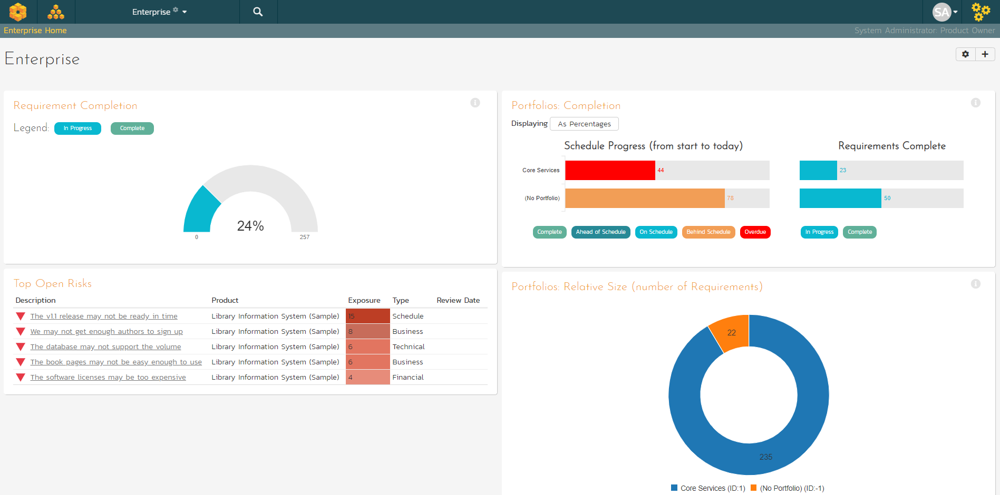

# Portfolio Homepage

## Overview
When you navigate to the Enterprise view from the global navigation bar you will be taken to the Enterprise homepage:

This page summarizes all of the information across the whole application (your whole enterprise) in a "one-stop-shop". You will see a small "i" in a circle at the top right of each widget. Hovering or clicking on this will show you information about that chart.

In a similar manner to other home pages in the application (like the 'My Page'), the Enterprise Home is loaded in 'view mode'. To switch the page to 'edit mode', click the button with the cog icon () on the right.

In 'edit mode', each widget can be:

- minimized by clicking on the arrow icon () at the top-left of the widget
- closed by clicking-on the cross icon () at the top-right of the widget
- move the widget around the page by clicking on its top bar and dragging it to where you want it to go
- in some cases, widgets allow you change their settings by clicking on the settings icon (). 

Together, these editing options let you change the page to suit your needs. If you close a widget and then later want to open it again click the "***+ Add***" button at the top of the page (next to the 'edit mode' button). This brings up a list of all the widgets you can add onto the page (including a list of 'Closed Widgets'). You can choose where on the page each widget should go.

!!! info "Please note"
    Any changes you make to this page (e.g. editing, moving, closing widgets) will only affect your user and on this particular home page. They do not affect any other user.

By default, the Enterprise home page shows the following widgets and are described in more details below:

- Requirement Completion
- Top Open Risks
- Portfolios: Completion
- Portfolios: Relative Size (number of Requirements)
- Schedule

## Requirement Completion
This chart shows the proportion of all active requirements that have been completed across all active portfolios in your enterprise. When 100% of the requirements are completed, the color changes so that it is easy to tell what is in progress vs completed.

## Top Open Risks
This widget lists the top risks logged against any of the active products in the application, ordered by exposure. Clicking on the risk name will open the [risk details](../Risks-Management/#risk-details) page for the risk in question. *Note: you can configure the widget settings to control the maximum number of risks to show.*

## Portfolios: Completion
This chart shows the progress of each portfolio in the enterprise. The left-hand chart shows progress from the start to end date of the portfolio. The bar's color indicates how on track the schedule is against requirement completion. The right-hand chart shows the proportion of requirements across active workspaces in the portfolio that have been completed.

Schedule Progress color definitions:

- **Complete**: All requirements included against the release / in releases in this workspace are complete
- **Ahead of Schedule**: The percentage of completed requirements is greater than the percentage of the schedule that has elapsed
- **On Schedule**: The percentage of completed requirements is broadly the same as the percentage of the schedule that has elapsed
- **Behind Schedule**: The percentage of completed requirements is less than the percentage of the schedule that has elapsed
- **Overdue**: The workspace or any of its children (if relevant) is running late. For a workspace itself to be late, its requirements are not yet all complete, but its end date has already passed

!!! note "Example"
    A portfolio started a week ago and will finish in a week. Therefore its schedule is 50% of the way through (1 week down, 1 week to go). 
    
    The Schedule Progress bar will show as 50% (if you click "Displaying" button to "As Numbers" it will show 7 days). 
    
    This portfolio has a total of 20 requirements (summed up from all its program, their products, and their active releases). Let's say that 15 of these are completed. That's 75% complete. So the Requirements Complete bar will show 75% (if you click "Displaying" button to "As Numbers" it will show 15 completed).

    So the schedule is half way through but we are three quarters done with the work (the requirements). So we are ahead of schedule (awesome!). The schedule bar will therefore have the "Ahead of Schedule" color.

    What if, instead of finishing next week, we were supposed to finish *last* week? Well, the schedule bar would be flagged as "Behind Schedule". This is because we are only 75% complete on the work, but the end date is in the past. 

    Tip: You can hover over a bar to get more information.

## Portfolios: Relative Size
This chart shows the number of active requirements in each active portfolio. Hovering over a segment will show its percentage of all requirements (this is visually represented by the size of the donut wedge). Please note, portfolios with no active requirements are not shown.

## Schedule
This Gantt chart shows all active portfolios, programs, products, releases, and sprints in the enterprise. Each bar spans from the item's start date to end date. The darker shaded portion of each bar tells you how complete its requirements are.

## Recent Builds
This widget displays a list of the most recent builds for each active release (organized alphabetically by portfolio, program, and product; in each product the builds are listed by date). For each build it shows: 

- the release name (which links to the specific [release](../Release-Management/#release-details))
- the build name (which links to the specific [build details](../Release-Management/#build-details))
- the build status (did it succeed or fail)
- the date of the build

You can change the number of builds the widget should show in the widget's settings (the default is 15).*