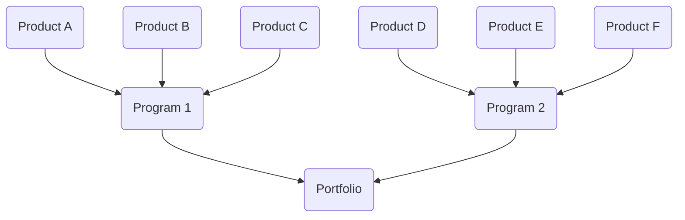

# Application Overview
Spira is an easy to use, quick to configure, application designed to work wherever you do (from big screens to tiny screens). It has powerful features to help you and your team collaborate to deliver high quality products to specification and on time. It is specifically focused on helping teams software and application development processes in a structured way.

This guide explains Spira's approach, what its different pieces are, how they fit together, and how you can use them together most effectively. This guide will explain the happy "good practice" paths to using it successfully. Most people work these ways and very successfully. Others take full use of Spira's flexibility and customization options to stretch the application to work outside the lines. These users are usually very successful too.  The opening tip to this guide is this: where possible, work with the application not against it to have the greatest and easiest success. 

This guide will hopefully be a useful learning resource, reference, and companion to the rest of the documentation. In particular, we recommend that brand new users, read this alongside the [quick start guide](../SpiraPlan-Quick-Start-Guide/index.md), which will give you practical hands-on steps to learn Spira.

!!! tip "You say SpiraTest, I say SpiraPlan"

    The Spira family of applications comes in 3 different editions:

    - SpiraTest
    - SpiraTeam, which is SpiraTest plus some extra features
    - SpiraPlan, which takes all the features of SpiraTeam and adds a few more

    Where a feature is not available in all editions, you will see a little tag next to it showing the editions support. They look like this: <span class="pill">SpiraPlan</span>

## Core concepts
Spira's features are grouped together into different places that match up with different ways of using the tool.

!!! tip "Tokens and IDs"
    Each item in Spira has a unique ID. This a globally unique number (1, 2, 3, and so on). Each type of item (a product, requirement, test case, etc) has a special two letter "token". Together with the ID this creates a shorthand unique reference to that item. Usually there is a colon between the token and the ID. For example, "RQ:7" represents the requirement with an ID of 7.

### Workspaces
Workspaces are the buckets where all the actual work lives. 

The most common and important workspace is the **product**. This is where you and your team will spend most of their time. Products are long running areas of work with tangible outputs or goals. This can be a software or hardware product that gets new regular new releases, patches, and features. A product can also be used like a project, where the focus may be a different kind of output or to manage a process.

Each product lives inside a specific **program**. One program can have many products. Programs are where you group similar areas of work, outputs, or processes together. A program is more than a folder to store things. Programs give you insights into what is happening across all the products inside of it. Programs can also be used to track and manage higher-level goals than the ones in products.

<span class="pill">SpiraPlan</span> Programs live inside a **portfolio**. Portfolios can have many programs, and are another way to store and organize your work, and see insights about a collection of programs.

You can have as many products, programs, and portfolios as you need or want. Below is an example diagram showing how these different workspace related to each other.



!!! info "Workspace glossary"
    | Workspace icon and name                    | Token | Description                                                           |
    | ------------------------------------------ | ----- | --------------------------------------------------------------------- |
    |  &nbsp; Product   | PR    | Long running areas of work and deliverables                           |
    |  &nbsp; Program   | PG    | Groups of products sharing similar overarching milestones             |
    |  &nbsp; Portfolio | PF    | Strategic collections of programs <span class="pill">SpiraPlan</span> |

### Artifacts
Artifacts are the building blocks of a product or program and contain all of their data. Each artifact holds different data and is used in different ways. For instance, requirements are one artifact, and releases are another. They work differently, and are not interchangeable. There are artifacts to help you test, plan, track bugs and tasks, and more.

You can use each artifact by itself and tag them in many different ways. An artifact can have sub types, a current status, priorities, components, owners, tags, and more. By linking one artifact to another, you unlock even more powerful features, letting you, for example, see which top priority user stories planned for the next sprint have failing tests still.

!!! info "Product artifact glossary"
    | Artifact icon and name                                                 | Token | Description                                                                                                                                            |
    | ---------------------------------------------------------------------- | ----- | ------------------------------------------------------------------------------------------------------------------------------------------------------ |
    |  &nbsp; Requirement                            | RQ    | Tracks large pieces of work or product features                                                                                                        |
    |  &nbsp; Requirement (parent)            | RQ    | Any requirement that has one or more child requirements                                                                                                |
    |  &nbsp; Requirement (has use cases)   | RQ    | Any requirement of a type that allows for use case steps                                                                                               |
    |  &nbsp; Requirement Step                       | RS    | Small steps or scenarios on a requirement that show how that feature works                                                                             |
    |  &nbsp; Release                                | RL    | A way to group work together to deliver by a certain deadline                                                                                          |
    |  &nbsp; Release (sprint)                | RL    | A mini release, popular in agile workflows                                                                                                             |
    |  &nbsp; Build                                  | BL    | Results of CI/CD processes recorded against a release                                                                                                  |
    |  &nbsp; Baseline                         |       | Take a snapshot of the entire product at a specific point in time <span class="pill">SpiraTeam</span> <span class="pill">SpiraPlan</span>              |
    |  &nbsp; Test Step                              | TS    | A single scenario or step to validate during a test                                                                                                    |
    |  &nbsp; Test Step (linked)              | TS    | A step in a test case that contains a whole other test case inside it                                                                                  |
    |  &nbsp; Test Case (with test steps)            | TC    | Stores how to test a feature or process, and tracks the results of each test                                                                           |
    |  &nbsp; Test Case (without test steps) | TC    | Like a normal test case, but usually used for automated tests where steps are not required                                                             |
    |  &nbsp; Test Set                               | TX    | Combine test cases together to create                                                                                                                  |
    |  &nbsp; Test Run                               | TR    | Immutable results of testing (from a test case or a test set)                                                                                          |
    |  &nbsp; Automation Host                        | AH    | A machine where you run automated tests, kicked off from Spira itself                                                                                  |
    |  &nbsp; Configuration                          | TG    | Create complex sets of parameters or sample data to use in dynamically generated test sets                                                             |
    |  &nbsp; Incident                               | IN    | Track bugs, enhancements, and more                                                                                                                     |
    |  &nbsp; Task                                   | TK    | Manage small pieces of work with tasks, especially useful against requirements <span class="pill">SpiraTeam</span> <span class="pill">SpiraPlan</span> |
    |  &nbsp; Task (pull request)                    | PR    | Review pull requests in Spira <span class="pill">SpiraTeam</span> <span class="pill">SpiraPlan</span>                                                  |
    |  &nbsp; Risk                                   | RK    | Assess and manage risks <span class="pill">SpiraPlan</span>                                                                                            |
    |  &nbsp; Risk Mitigation                        | RM    | Track individual mitigations against a risk <span class="pill">SpiraPlan</span>                                                                        |
    |  &nbsp; Source Code                          |       | Source code files (if connected to Spira) <span class="pill">SpiraTeam</span> <span class="pill">SpiraPlan</span>                                      |
    |  &nbsp; Commit                             |       | Source code files (if connected to Spira) <span class="pill">SpiraTeam</span> <span class="pill">SpiraPlan</span>                                      |
    |  &nbsp; Component                       | CP    | Used to represent common parts of your product that any artifact can be tagged with components.                                                        |

!!! info "Program artifact glossary"
    | Artifact icon and name                                     | Token | Description                                                                                                    |
    | ---------------------------------------------------------- | ----- | -------------------------------------------------------------------------------------------------------------- |
    |  &nbsp; Capability                 | CP    | Tracks program-scale features <span class="pill">SpiraPlan</span>                                              |
    |  &nbsp; Capability (parent) | CP    | Any capability that has one or more child capabilities <span class="pill">SpiraPlan</span>                     |
    |  &nbsp; Program Milestone          | GM    | A way to group large scale deliverables together to hit a certain deadline <span class="pill">SpiraPlan</span> |

## Guidance and Tips
Below are explanations and guidance about how to do different things in Spira, or use its different features and artifacts (or links for where to read more). This includes good practice tips, tricks, do's and don'ts, and how different artifacts link to others. These are designed to help you get the most of out of Spira, and to help you work with the design of the tool, and not against it.

In each section you will see a short explanation of the feature or artifact. This is followed by a set of "**Tips and Tricks**". Most artifacts have a second tab to the right of "Tips and Tricks" that explains the "**Key Artifact Links**" you can make to  others artifacts. The tab called "**Association Chart**" shows all the ways the artifact links to others

### Products

=== "Tips and Tricks"
    - Use all the artifacts that make sense for your needs
    - For every product try to always use requirements and releases
    - Link artifacts together to add meaning, improve tracking and traceability, and give you and your team greater insights

=== "Association Chart"
    ``` mermaid
    graph LR
    RQ(Requirements) --- RL(Release);
    TC(Test Cases) --- RQ;
    TC --- RL;
    TC --- TX(Test Sets);
    TX --- RL;
    TC --- IN(Incidents);
    TK(Tasks) --- RQ;
    RK(Risks) --- RQ;
    RK --- RL;
    RK --- TC;
    IN --- RL;
    ```

### Users
Each person using Spira should have a dedicated user. A user by itself has no permissions or access to anything in the system. Administrators give them permissions in a few ways: to the user itself, adding them to a program, giving them a specific product role for a product (someone can be a manager with high level permissions in one product, but an observer with very limited permissions in another product). Artifacts can be linked to users, so you know who is leading on a piece of work. Users have a dedicated profile and personalized home pages.

=== "Tips and Tricks"
    - Limit who has roles with "bulk edit" permissions in each product
    - Severely limit who has system administrator permissions
    - Create dedicated users for any automation functions you use, like data syncs or unit testing. This will make it a lot easier to debug issues if they arise
    - Limit your use of the root admin account "administrator" and never use it for things like data syncs, to avoid the account being locked out

=== "Key Artifact Links"
    - **Product Role**: controls product membership and what permissions are allowed in each product
    - **Program Role**: controls program membership and what permissions are allowed in each program
    - **Profile**: personal information and settings for that user

=== "Association Chart"
    ``` mermaid
    graph
    US{{"`**User**`"}} --> R(Product Role);
    R --> PR(Product);
    R --> PG(Programs);
    PR --> a1(Artifacts);
    PR --> a2(Artifacts);
    PR --> a3(Artifacts);
    ```

### Artifacts
See the links below to read specific information about each artifact.

- [Requirements](./Requirements-Management.md/#feature-overview-and-tips)
- **Releases** are also know as sprints. They help you divide up your product or project into smaller blocks of time or goals. By themselves releases are simple, but as you link up more and more artifacts to them, the more powerful they become. Like requirements, they can be organized in a hierarchical structure.

## Legacy artifact overviews
=== "Requirements"
    SpiraPlan® provides the ability to create, edit and delete product scope / requirements in a hierarchical organization that resembles a typical scope matrix. Each requirement is associated with a particular importance level and a status identifier that designates where the requirement is in the development lifecycle (requested, planned, in-progress and completed). The requirements can be organized according to which part of the system they relate to (called the Component) as well as being organized into different types (features, qualities, use cases, etc.). Certain types (such as use cases) allow you to define the scenario steps that help describe that requirement.

    In addition, each requirement can be mapped to one or more test cases that can be used to validate that the functionality works as expected. This mapping is called the "Requirement Test Coverage", since the test cases "cover" the requirement so that if all the tests can be executed successfully, then the requirement is validated.

    At the same time, from a development perspective, the team begins initial estimation of the lowest-level requirements in the requirements matrix to determine the complexity and associated resourcing. Once the high-level release schedule has been determined, the requirements can then be prioritized and scheduled against the appropriate release according to their business priority.

    Once the release is underway, the requirements are further decomposed into their constituent low-level product tasks that can be assigned to the product team. The system will track the progress and revised estimates for the tasks and display them against the requirements so that risks to the schedule can be quickly determined.

=== "Test Cases"
    SpiraPlan® provides the ability to create, edit and delete product test cases that are stored in a hierarchical folder structure that resembles Windows Explorer ®. Each test case consists of a set of test steps that represent the individual actions a user must take to complete the test. These test steps also contain a description of the expected result and any sample data elements that the tester should use when performing the action. When a user executes a test case, the results are stored in a test run that contains the success/failure status of each test step as well as the actual observed result that the tester experienced.

    In addition each test case is mapped to one or more requirements that the test is effectively validating, providing the test coverage for the requirement. During the execution of the test case, each failure can be optionally used to record a new incident, which can then be managed in the incident tracking module (see below). This provides complete traceability from a recorded incident to the underlying requirement that was not satisfied.

    To streamline the assignment and tracking of multiple test cases, SpiraPlan® allows users to select groups of test cases and arrange them into *test sets*. Each test set can contain test cases from a variety of different folders and can be associated with a specific release of the system being tested.

=== "Test Automation"
    As well as being able to store and manage manual test cases, SpiraPlan® can be used to manage the scheduling and execution of automated test scripts for a variety of third-party test automation engines. This allows you to centrally plan your automated testing and monitor the results of automated unit, functional and load testing remotely. For example, you could schedule a set of automated functional tests to run on five different machines (each with a different browser/OS combination) at 2:00 AM and have the results be ready for the next morning.

=== "Releases"
    SpiraPlan® provides the ability to track different versions / releases of the application being tested. Each product in the system can be decomposed into an unlimited number of specific product releases, denoted by name and version number. Requirements and Test Cases developed during the design phase can then be assigned to these different releases. When a tester executes a series of test cases, they are able to choose the version of the product being tested and the resulting test run information is then associated with that release.

    From a product planning perspective, the releases are the major milestones in the product, which are further sub-divided into sprints which are separate mini-products with associated product scope and tasks. The product's requirements are scheduled at a high-level against the releases and the detailed tasks are scheduled against specific sprint within the release.

    In addition, all incidents raised during the testing process are associated with this release, allowing the development team to easily determine which version of the product is affected. Finally as the incidents are resolved and verified during the testing phase, the appropriate release can be selected to indicate which release the incident was resolved and/or verified in.

=== "Sprints"
    As described in [Release Planning](#release-planning), in addition to high-level product releases, SpiraPlan® can also track the individual sprints that comprise a release, giving the product manager the option to manage agile methodology products within the SpiraPlan® environment. Unlike the release planning stage, where high-level requirements are estimated and scheduled, the sprint planning phase involves assigning each of the requirements, incidents and tasks in the product backlog against a specific sprint until the available effort in the sprint has been completely allocated.

    When you first create sprints, you specify the start and end-dates together with the notional number of product resources assigned to the sprint and any non-working days. SpiraPlan® uses this information to calculate the planned effort available to the sprint, from which it will subtract the estimated task and incident effort values to determine how much effort is available to schedule.

=== "Incidents"
    SpiraPlan® provides the ability to create, edit, assign, track, manage and close incidents that are raised during the testing of the software system under development. These incidents can be categorized into bugs, enhancements, issues, training items, limitations, change requests, and risks, and each type has its own specific workflow and business rules. Typically each incident is raised initially as a 'New' item of type 'Incident'. Following the review by the product manager and customer, they are changed to one of the other specific types, given a priority (critical, high, medium or low), and status changed to 'Open'. Once it is assigned to a developer for fixing, it is changed to status 'Assigned'.

    The developer now works to correct the incident, after which time its status changes to 'Fixed' or 'Not Reproducible' depending on the actions taken (or not taken). Finally the product manager and customer verify that it has indeed been fixed, and the status is changed to 'Closed'. SpiraPlan® provides robust sorting and filtering of all the incidents in the system, as well as the ability to view the incidents associated with particular test cases and test runs, enabling drill-down from the requirements coverage display, right through to the open incidents that are affecting the requirement in question.

=== "Tasks"
    As described above, in addition to storing the requirements for a product, SpiraPlan® includes the capability of drilling each lowest-level requirement down further into a series of work items called 'Tasks'. These tasks are the discrete activities that each member of the development team would need to carry out for the requirement to be fulfilled. Each task can be assigned to an individual user as well as associated with a particular release or sprint. The system can then be used by the product manager to track the completion of the different tasks to determine if the product is on schedule.

    The tasks can be organized into different folders as well as categorized by different types (development, testing, infrastructure, etc.), each of which can have its own *workflow* which defines the process by which the task changes status during the product lifecycle.

=== "Document Management"
    SpiraPlan® includes an integrated document management collaboration system that can be used to upload, manage and share documents between the different members of the product. This module includes support for uploading files and URLs, versioning of documents, the ability to organize into folders and categorize and search using meta-tags.


=== "Risk Management"
    SpiraPlan® (not available in SpiraTest or SpiraTeam) enables a complete risk management workflow. This module aids in the analyzing and categorizing of risks based on their Probability and their impact, which produces a calculated risk exposure. The tool tracks both risks and their mitigations, and provides dynamic risk reporting tools.

=== "Source Code"
    SpiraTeam® and SpiraPlan® let you browse your source code from within the main web application. This is an excellent way to browse all a product's code files, commits, and how a file changed in a commit (the 'diff'). There is no need to install version control software on your own computer or to clone the source code to your machine. All users can link source code commits with any SpiraPlan® artifact. This gives you traceability from requirements, incidents, tasks, and more to right code changes. This let you easily see what code was edited to implement a feature, or fix a bug. If the bug is reopened later, you can quickly see the associated source code commits to check if the changes made actually did fix things properly.


=== "Build"
    SpiraPlan® integrates with a variety of continuous integration / automated build servers so that the results of automated builds can be displayed in SpiraPlan linked to the associated release or sprint. In addition, the results of automated tests and source code operations can be linked to the build events, providing traceability from a specific build to the bugs that were fixed, tests that were run, and source code files that were modified.


=== "Instant Messenger"
    SpiraPlan® comes with a build-in integrated instant messaging capability. This lets users see which users are currently logged-into the system, maintain a list of contacts and where available, send short instant messages to other users. Any messages exchanged can then be posted to relevant artifacts in the system as permanent comments.