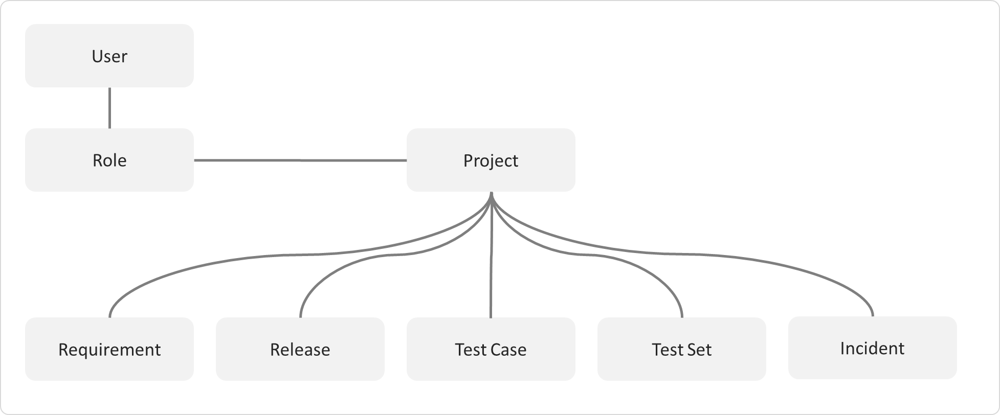
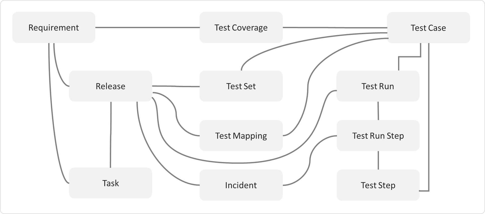

# Functionality Overview

This section outlines the functionality provided by SpiraPlan® in the areas of requirements management, test case management, release planning, sprint planning, incident tracking, task management and product / user management.

Please note, that SpiraPlan® is designed for use on a very wide range of devices from desktops, to tablets, to smartphones. This guide is written using desktop conventions (e.g. using 'click' throughout where 'tap'
would apply on mobile devices) but the functionality remains very similar throughout the application across all devices and platforms. See
[Mobile Access](../Mobile-Access/) for more information.

## Requirements Management

SpiraPlan® provides the ability to create, edit and delete product scope
/ requirements in a hierarchical organization that resembles a typical scope matrix. Each requirement is associated with a particular importance level and a status identifier that designates where the requirement is in the development lifecycle (requested, planned, in-progress and completed). The requirements can be organized according to which part of the system they relate to (called the Component) as well as being organized into different types (features, qualities, use cases, etc.). Certain types (such as use cases) allow you to define the scenario steps that help describe that requirement.

In addition, each requirement can be mapped to one or more test cases that can be used to validate that the functionality works as expected. This mapping is called the "Requirement Test Coverage", since the test cases "cover" the requirement so that if all the tests can be executed successfully, then the requirement is validated.

At the same time, from a development perspective, the team begins initial estimation of the lowest-level requirements in the requirements matrix to determine the complexity and associated resourcing. Once the high-level release schedule has been determined, the requirements can then be prioritized and scheduled against the appropriate release according to their business priority.

Once the release is underway, the requirements are further decomposed into their constituent low-level product tasks that can be assigned to the product team. The system will track the progress and revised estimates for the tasks and display them against the requirements so that risks to the schedule can be quickly determined.

## Test Case Management

SpiraPlan® provides the ability to create, edit and delete product test cases that are stored in a hierarchical folder structure that resembles Windows Explorer ®. Each test case consists of a set of test steps that represent the individual actions a user must take to complete the test. These test steps also contain a description of the expected result and any sample data elements that the tester should use when performing the action. When a user executes a test case, the results are stored in a test run that contains the success/failure status of each test step as well as the actual observed result that the tester experienced.

In addition each test case is mapped to one or more requirements that the test is effectively validating, providing the test coverage for the requirement. During the execution of the test case, each failure can be optionally used to record a new incident, which can then be managed in the incident tracking module (see below). This provides complete traceability from a recorded incident to the underlying requirement that was not satisfied.

To streamline the assignment and tracking of multiple test cases, SpiraPlan® allows users to select groups of test cases and arrange them into *test sets*. Each test set can contain test cases from a variety of different folders and can be associated with a specific release of the system being tested.

### Test Automation

As well as being able to store and manage manual test cases, SpiraPlan®
can be used to manage the scheduling and execution of automated test scripts for a variety of third-party test automation engines. This allows you to centrally plan your automated testing and monitor the results of automated unit, functional and load testing remotely. For example, you could schedule a set of automated functional tests to run on five different machines (each with a different browser/OS combination) at 2:00 AM and have the results be ready for the next morning.

## Release Planning

SpiraPlan® provides the ability to track different versions / releases of the application being tested. Each product in the system can be decomposed into an unlimited number of specific product releases, denoted by name and version number. Requirements and Test Cases developed during the design phase can then be assigned to these different releases. When a tester executes a series of test cases, they are able to choose the version of the product being tested and the resulting test run information is then associated with that release.

From a product planning perspective, the releases are the major milestones in the product, which are further sub-divided into sprints which are separate mini-products with associated product scope and tasks. The product's requirements are scheduled at a high-level against the releases and the detailed tasks are scheduled against specific sprint within the release.

In addition, all incidents raised during the testing process are associated with this release, allowing the development team to easily determine which version of the product is affected. Finally as the incidents are resolved and verified during the testing phase, the appropriate release can be selected to indicate which release the incident was resolved and/or verified in.

## Sprint Planning

As described in [Release Planning](#release-planning), in addition to high-level product releases, SpiraPlan® can also track the individual sprints that comprise a release, giving the product manager the option to manage agile methodology products within the SpiraPlan® environment. Unlike the release planning stage, where high-level requirements are estimated and scheduled, the sprint planning phase involves assigning each of the requirements, incidents and tasks in the product backlog against a specific sprint until the available effort in the sprint has been completely allocated.

When you first create sprints, you specify the start and end-dates together with the notional number of product resources assigned to the sprint and any non-working days. SpiraPlan® uses this information to calculate the planned effort available to the sprint, from which it will subtract the estimated task and incident effort values to determine how much effort is available to schedule.

## Incident Tracking

SpiraPlan® provides the ability to create, edit, assign, track, manage and close incidents that are raised during the testing of the software system under development. These incidents can be categorized into bugs, enhancements, issues, training items, limitations, change requests, and risks, and each type has its own specific workflow and business rules. Typically each incident is raised initially as a 'New' item of type
'Incident'. Following the review by the product manager and customer, they are changed to one of the other specific types, given a priority (critical, high, medium or low), and status changed to 'Open'. Once it is assigned to a developer for fixing, it is changed to status
'Assigned'.

The developer now works to correct the incident, after which time its status changes to 'Fixed' or 'Not Reproducible' depending on the actions taken (or not taken). Finally the product manager and customer verify that it has indeed been fixed, and the status is changed to 'Closed'. SpiraPlan® provides robust sorting and filtering of all the incidents in the system, as well as the ability to view the incidents associated with particular test cases and test runs, enabling drill-down from the requirements coverage display, right through to the open incidents that are affecting the requirement in question.

## Task Management

As described above, in addition to storing the requirements for a product, SpiraPlan® includes the capability of drilling each lowest-level requirement down further into a series of work items called
'Tasks'. These tasks are the discrete activities that each member of the development team would need to carry out for the requirement to be fulfilled. Each task can be assigned to an individual user as well as associated with a particular release or sprint. The system can then be used by the product manager to track the completion of the different tasks to determine if the product is on schedule.

The tasks can be organized into different folders as well as categorized by different types (development, testing, infrastructure, etc.), each of which can have its own *workflow* which defines the process by which the task changes status during the product lifecycle.

## Products and Users

SpiraPlan® supports the management of an unlimited number of users and products, which can be administered through the same web interface as the rest of the application. All artifacts (requirements, tests and incidents) are associated with a particular product, and each user of the system can be given a specific role for the particular product. So, a power user of one software product may be merely an observer of another. That way, a central set of users can be managed across the enterprise, whilst devolving product-level administration to the manager of the product. In addition to these administration functions, each user profile and product has its own personalized dashboard view of all the pertinent and relevant information. This feature reduces the information overload associated with managing such a rich source of product information, and allows a single user or product snapshot to be viewable at all times for rapid decision-making.

## Document Management

SpiraPlan® includes an integrated document management collaboration system that can be used to upload, manage and share documents between the different members of the product. This module includes support for uploading files and URLs, versioning of documents, the ability to organize into folders and categorize and search using meta-tags.

## Risk Management

SpiraPlan® (not available in SpiraTest or SpiraTeam) enables a complete risk management workflow. This module aids in the analyzing and categorizing of risks based on their Probability and their impact, which produces a calculated risk exposure. The tool tracks both risks and their mitigations, and provides dynamic risk reporting tools.

## Source Code Tracking

SpiraPlan® and SpiraPlan® provide the ability to browse your source code repository from within the main web application. This is an excellent way for managers and casual users of the product to browse the files and revisions of the software code without needing to install the version control software on their own workstations. In addition all users have the ability to link source code revisions with SpiraPlan®
artifacts--providing traceability from requirements, incidents, and tasks to the code changes that were made to implement the required feature, or fix the identified defect. Should a defect resurface later, you can view the associated source code revisions to determine which changes were made and did they truly correct the defect.

## Build Management

SpiraPlan® includes the ability to integrate with a variety of continuous integration / automated build servers so that the results of automated builds can be displayed in SpiraPlan linked to the associated release or sprint. In addition, the results of automated tests and source code operations can be linked to the build events, providing traceability from a specific build to the bugs that were fixed, tests that were run and source code files that were modified.

## Instant Messenger

SpiraPlan® comes with a build-in integrated instant messaging capability. This lets users see which users are currently logged-into the system, maintain a list of contacts and where available, send short instant messages to other users. Any messages exchanged can then be posted to relevant artifacts in the system as permanent comments.

## Miscellaneous

### Artifact Relationships

The sections above have outlined the different features and functions available in the system, and have described the various artifacts managed in the system (e.g. products, users, requirements, tests, etc.). To aid in understanding how the information is related, the following diagrams illustrates the relationships between the different artifacts and entities:

Figure 1: The main entities that comprise a SpiraTest product.

Figure 2: The relationships between the various SpiraTest entities

With these overall concepts in mind, the rest of this help manual will outline the functionality in each of the SpiraPlan® screens, and provide specific information on how to manage each of the artifacts illustrated above. Note that this manual does not explain the Administration-level functionality of the system; for that, please refer to the *SpiraPlan®
Administration Guide*.

### Artifact Naming Conventions

On various screens in the system, you will see lists of artifacts (requirements, test cases, etc.) together with a unique identification number. In order to make it easier to recognize at a glance which type of artifact the identification number refers to, SpiraPlan® uses a system of two-letter prefixes which help identify the type of artifact being displayed. The current prefixes used by the system are:

| Artifact         |   Prefix  | Artifact                |   Prefix |
| ---------------- | --------- | ----------------------- | -------- |
| Product          |  PR       | Program                 | PG |
| User             |  US       | Incident Type           | IT |
| Requirement      |  RQ       | Incident Priority       | IP |
| Requirement Step |  RS       | Incident Severity       | IV |
| Test Case        |  TC       | Workflow                | WK |
| Test Step        |  TS       | Workflow Transition     | WT |
| Test Run         |  TR       | Custom Property Values  | PV |
| Test Run Step    |  RS       | Product Role            | RX |
| Incident         |  IN       | Task                    | TK |
| Incident Status  |  IS       | Test Set                | TX |
| Custom List      |  CL       | Document                | DC |
| Document Type    |  DT       | Document Folder         | DF |
| Automation Host  |  AH       | Build                   | BL |
| Release/Sprint   |  RL       | Component               | CP |
| Risk             |  RK       | Risk Mitigation         | RM |

In addition, certain artifacts in the system are displayed with an icon that helps distinguish them from each other, and provides additional context on the state of the artifact:

 

| Icon                                   | Artifact Description |
| ----                                   | -------------------- |
|   |    Program |
|   |    Product |
|   |    Summary Requirement |
|  |    Detailed Requirement |
|  |    Use Case Requirement |
|  |    Use Case Scenario Step |
|  |    Folder |
|  |    Test Case with Test Steps |
|  |    Test Case without Test Steps |
|  |    Test Set |
|  |    Test Run |
|  |    Test Step |
|  |    Linked Test Case |
|  |    Test Automation Host |
|  |    Test Configuration |
|  |    Release |
|  |    Iteration / Sprint |
|  |    Component |
|  |    Task |
|  |    Incident |
|  |    Risk |
|  |    Risk Mitigation |
|  |    Source Code Revision |
|  |    Product User |
|  |    Build |
|  |    Artifact has an Attachment |

