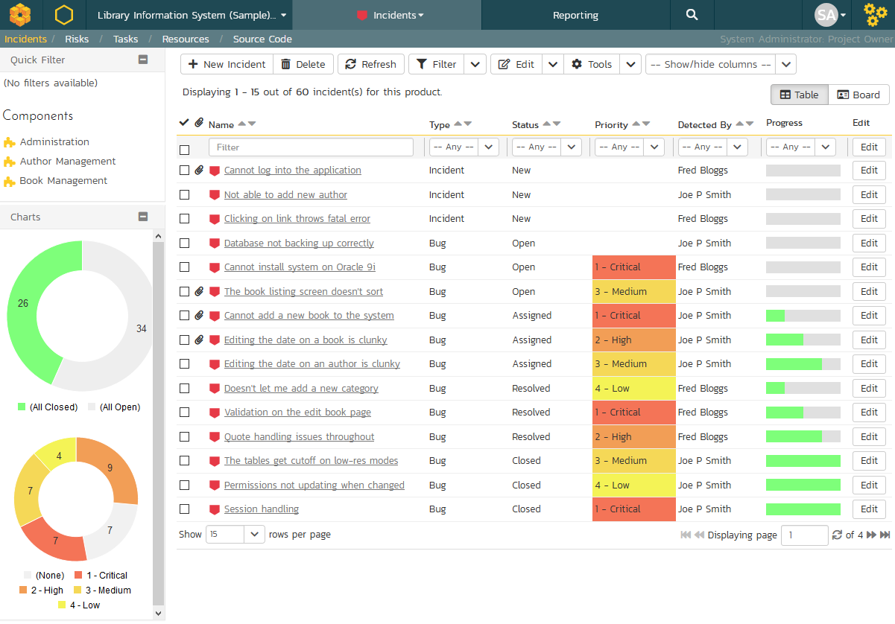
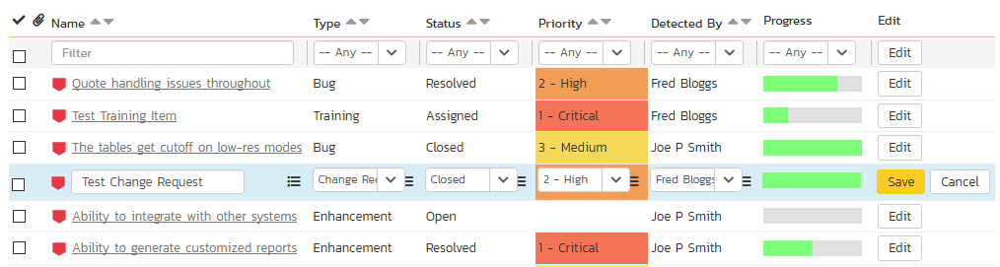
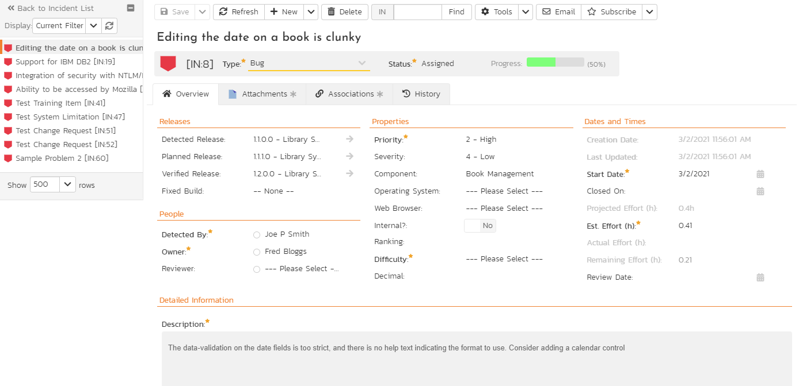
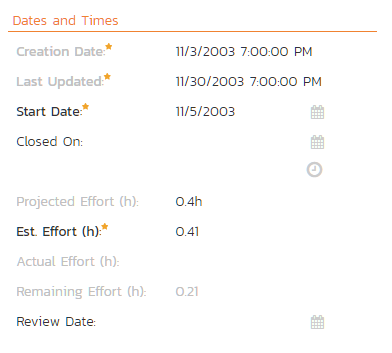
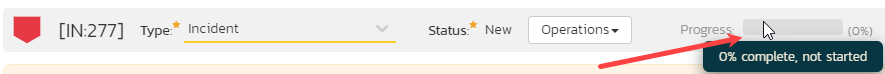
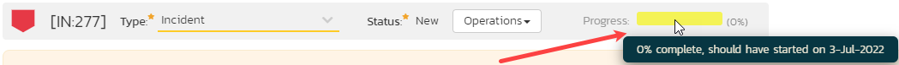
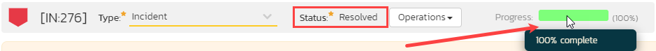
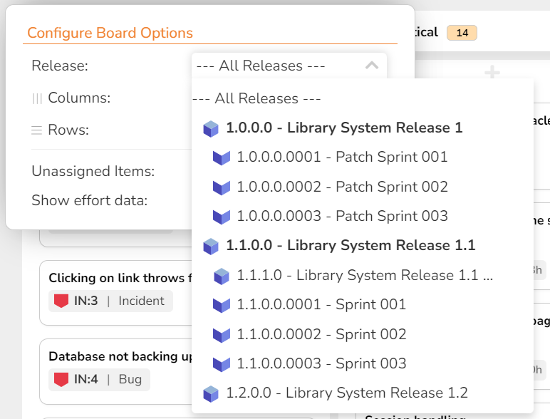
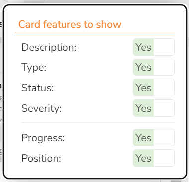
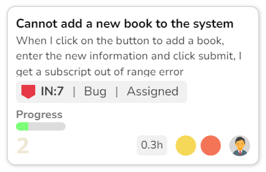

# Incident Tracking

This section outlines how the incident/defect tracking features of SpiraPlan® can be used to manage key product artifacts during the software development lifecycle. In addition to managing the defects raised during the execution of test cases in the test management module, the Incident Tracker is also a powerful risk/issue/bug tracking system in its own right. When coupled with the [product dashboard](User-Product-Management.md/#product-home) it is a powerful tool for representing all the key risks and issues associated with a product in a single, graphical format.

Unlike a standalone bug/issue tracking tool however, you can trace the incidents/defects back to the test case and the underlying requirement that generated them, giving the product manager unprecedented power in analyzing the "in-process" quality of a system during its lifecycle. This power is clearly illustrated in the "Requirement Incident Count" pane in the Product Home dashboard (see [User/Product Management > Requirements Coverage](User-Product-Management.md/#requirements-coverage)).

## Incident List

When you click on the Tracking \> Incidents global navigation link, you will initially be taken to the incidents list screen illustrated below:

The incident list screen displays all the incidents entered for the current product, in a filterable, sortable grid. The grid displays the incident number together with fields such as incident type (bug, issue, risk, etc.), status (new, open, etc.), priority, name, assigned owner, detection date, detector, closed date, etc. The choice of columns displayed is configurable per-user, per-product, giving extensive flexibility when it comes to viewing and searching incidents.

The sidebar on the left gives you quick access to saved filters, along with some useful charts to get an at-a-glance view of incidents for this product. These charts are: 

- a donut chart of the ratio of all incidents in the product that have an open status vs closed status
- a donut chart showing the mix of priorities assigned to all incidents with an open status

In addition, you can view a more detailed description of the incident (along with a resolution if any) by positioning the mouse pointer over the incident name hyperlink and waiting for the popup "tooltip" to appear. If you click on the incident name hyperlink, you will be taken to the incident details page described in [Incident Tracking > Incident Details](Incident-Tracking.md/#incident-details). Clicking on any of the pagination links at the bottom of the page will advance you to the next set of incidents in the list according to the applied filter and sort-order. There is also a drop-down-list at the bottom of the page which allows you to specify how many rows should be displayed in each page, helping accommodate different user preferences.

### Filtering & Sorting
Read about [how to create and manage filters, and how to sort the artifact list](Application-Wide.md#filtering).

Incidents can be filtered in special ways when filtering by incident status or incident type:

- **Incident Type**: Issues are a special subset of Incidents. [Admins define](../Spira-Administration-Guide/Template-Incidents.md/#edit-types) which types of incident should be considered issues. When filtering by incident type you can choose to filter by Issues. Doing this will show you all incidents that have any type that is marked as also being an "issue."
- **Incident Status**: Incidents have customizable statuses, each of which can be marked as ["open" or "closed" by the admin](../Spira-Administration-Guide/Template-Incidents.md/#edit-statuses). When filtering by incident status you can choose to filter by specific statuses, or "all open" or "all closed" - these last two options automatically filter by all statuses that are considered open or closed respectively. 

### New Incident
Clicking on the "***New Incident***" button takes you to the new incident screen. This is essentially the same screen as the incident details screen shown in [Incident Details](Incident-Tracking.md/#incident-details) except, depending on how the [workflow has been configured](../Spira-Administration-Guide/Template-Incidents.md/#incident-workflows) for this product, certain fields may be disabled.

### Delete
Clicking on the "***Delete***" button deletes the incidents whose check-boxes have been selected in the incident list.

### Refresh
Clicking on the "***Refresh***" button simply reloads the list of incidents; this is useful when new incidents are being added by other users, and you want to make sure you have the most up-to-date list displayed.

### Show / Hide Columns
This drop-down list allows you to change the fields that are displayed in the incident list as columns for the current product. To show a column that is not already displayed, simply select that column from the list of "Show..." column names and to hide an existing column, simply select that column from the list of "Hide..." column names. This is stored on a per-product basis, so you can have different display settings for each product that you are a member of. The fields can be any of the built-in fields or any of the custom properties set up by the product owner.

### Edit

Each incident in the list has an "***Edit***" button display in its right-most column. When you click this button or just
*double-click* on any of the cells in the row, you change the item from "View" mode to "Edit" mode. The various columns are made editable, and "***Save***" buttons are displayed in the last column:

If you click "***Edit***" on more than one row, the "***Save***" buttons are only displayed on the first row, and you can make changes to all the editable rows and then update the changes by clicking the one "***Save***" button. Also, if you want to make the same change to multiple rows (e.g. to change five incidents from "Resolved" status to "Closed"), you can click on the "fill" icon to the right of the editable item, which will propagate the new value to all editable items in the same column.

If you want to edit lots of items, first select their checkboxes and then click the "***Edit***" button on the same row as the Filters and it will switch all the selected items into edit mode.

When you have made your updates, you can either click "***Save***" to commit the changes, or "***Cancel***" to revert back to the original information. Alternatively, pressing the <ENTER\> key will commit the changes and pressing the <ESCAPE\> key will cancel the changes.

### Cloning Incidents
To create a clone of an existing incident or set of incidents, simply select the check-boxes of the incidents you want to copy and then click "***Clone***" under the Edit menu (or click "***Clone***" from the "New" dropdown menu from the  Incident's details page). This will make a copy of the current incident with its name prefixed 'Copy of ....' to distinguish itself from the original. Any file attachments will also be copied along with the incident itself.

When cloning Incidents please note that:

- all standard fields (like type and owner) and custom fields are cloned
- description and comment (with formatting) are cloned
- file attachments are cloned
- associations to artifacts are cloned
- followers and history are *not* cloned

### Exporting Incidents
Read about [how to export artifacts from one product to another](Application-Wide.md#export-to-another-product).

### Creating Requirement from Incidents
Sometimes you may have enhancements logged that now need to be converted into formal requirements. This may be useful for sprint planning or so test cases and tasks can be made from it. There is a shortcut to create new requirements from selected incidents (1 or more); and it automatically creates an association between each new requirement and the corresponding incident.[^rq-in]

To use this feature:

- select the checkboxes of the incidents you want to convert
- click Tools \> Convert Into Requirements
 

### Printing Items
To quickly print a single incident or list of incidents you can select the items' checkboxes and then click Tools \> Print Items. This will display a popup window containing a printable version of the selected items. You can also save the report in a variety of common formats from the same Tools menu.

## Incident Details

When you click on an incident item in the incident list, or click the "***New Incident***" button (as described in [Incident List](#incident-list)), you are taken to the incident details page illustrated below:

This page is made up of three areas:

-   the left pane is the navigation window where you can quickly jump to other incidents;

-   the upper part of the right pane contains the incident name and key information about it (it's ID number, and what type of incident it is), as well as the current status (see below); and

-   the bottom part of the right pane displays different information associated with the incident across a number of tabs.

The navigation pane consists of a link that will take you back to the incidents list, as well as a list of the peer incidents to the one selected. This latter list is useful as a navigation shortcut; you can quickly view the peer incidents by clicking on the navigation links without having to first return to the incidents list page. The navigation list can be switched between four different modes:

- The list of incidents matching the current filter
- The list of all incidents, irrespective of the current filter
- The list of incidents assigned to the current user
- The list of incidents detected/found by the current user

In addition to the left hand navigation, you can enter a specific incident number in the text-box in the toolbar and click the "***Find***" button. In the same toolbar, there is also a shortcut for creating a copy of the current by clicking the "***Clone***" button.

### Editing an Existing Incident
When editing an existing incident, the fields that are available and the fields that are required will depend on your stage in the incident workflow. Read about [using workflows to change the status of your artifact](Application-Wide.md#workflows), and how [electronic signatures](Application-Wide.md#electronic-signatures) can further control how you progress an incident through the workflow.

You can print the current incident by clicking Tools \> Print, which will display a printable version of the page in a separate window. Alternatively, you can export the incident to a number of formats by selecting the appropriate option from the Tools menu.

### Inserting a New Incident
If you are creating a new incident, the fields that are available and the fields that are required will depend on how your product has been for configured. For example, some products may require that all incidents be started with Status=New and Type=Incident, others may allow you to specify the incident type. The types of change allowed will depend on how your product administrator has setup the system for you. Administrators should refer to the *SpiraPlan Administration Guide* for details on configuring the incident workflows to meet their needs.

Once you've filled out the appropriate incident fields, you can either click "***Save***" or one of the options from the "***Save***" dropdown list to commit the changes or click on "***Back to Incident List***" to discard the insertion and return back to the incident list.

### Overview - Comments
Read about [how the comments works](Application-Wide.md#comments)

### Overview -- Dates and Times

This section displays the general schedule and completion status of the specific incident. You can enter/edit:

- the start-date (this gets set automatically when you add the incident to a release/sprint from the planning board)
- closed-date (i.e. the due-date)
- estimated effort
- actual effort
- remaining effort

Any custom date fields set up by the system administrator or product owner will also appear in this section (as shown below with the Review Date field).

!!! info "Calculating Incident Progress"
    To help you better track incidents, there are three special calculated fields used for showing the progress of the incident:
    
    - projected effort
    - percent complete
    - progress indicator

    **Projected Effort** is calculated by adding "Actual Effort" and "Remaining Effort" together, or if the "Actual Effort" is blank then the "Estimated Effort"

    **Percent Complete** is calculated as follows:
    
    - work out the effort already made by subtracting "Remaining Effort" from "Estimated Effort"
    - divide the above by the "Estimated Effort"
    - in other words Percent Complete = `(Est. Effort - Remaining Effort) / Est. Effort * 100`
    - For example, if Est. Effort is 7 hours and the Remaining effort is 1 hour, then the Percent Complete is about 85%

    The **Progress Indicator** is a colorful progress bar of the percent completion:
    
    | Progress Indicator Color | Incident Progress % | Start Date Value      |
    |--------------------------|---------------------|-----------------------|
    | Fully gray               | 0%                  | None or in the future |
    | Fully yellow             | 0%                  | In the past           |
    | Partly green             | Between 0% and 100% | Anything              |
    | Fully green              | 100%                | Anything              |

    Examples of the progress indicator are shown in the screenshots below:

    
    
    

    Note, that unlike for tasks, the progress bar will never be red (because incidents do not have an end (due) date).  

### Attachments

Read about [how the attachments tab works](Application-Wide.md#attachments)

### Associations

You can associate other incidents, requirements, test steps, tasks, and risks to an incident from this tab. 

The incidents and tasks in this list are ones that a user has decided are relevant to the current one and has created a direct link between them. In the case of requirements and test cases, the association can be either due to the creator of an incident directly linking the incident to the requirement or test step, or it can be the result of a tester executing a test-run and creating an incident during the test run. In this latter case, the check-box to the left of the association will be unavailable as the link is not editable.

Read more about [how to manage and add associations to this artifact](Application-Wide.md#associations)

### History

Read about [how the history tab works](Application-Wide.md#history)

### Creating a Requirement from an Incident

Sometimes you may have an enhancement logged that now needs to be converted into a formal requirement. This may be useful for sprint planning or so test cases and tasks can be made from it. There is a shortcut to create a new requirement from the current incident; and it automatically creates an association between the new requirement and the incident.[^rq-in]

To use this feature:

- go to the Associations tab
- click the `Add` button
- at the bottom right of the panel that displays click the `Create Requirement from this Incident` button 

### Emailing

Read about [emailing an incident to colleagues](Application-Wide.md#emailing).

### Incident Followers

Read about [how to add and manage followers to an artifact](Application-Wide.md#followers)

## Incident Board
!!! info "Incident Board Overview"
    
    The SpiraPlan incident board is a streamlined and highly customizable "kanban" style board. It lets you visualize incidents in a single place across a product. Based on the principles of **agile methodologies** such as Scrum and Kanban, the incident board is a great tool for planning and managing incidents.

    To learn more about how boards in Spira are structured and their general features refer to our [board overview](Application-Wide.md/#boards). Here you can learn about:

    - [board structure and configuration](Application-Wide.md/#board-structure)
    - [special board views](Application-Wide.md/#special-board-views) 
    - [working with board cards](Application-Wide.md/#board-cards) 

    **Specific features of or differences in the incident board are discussed more fully below**.

### Board configuration
The incident board configuration button has a number of options to configure the board to your needs. 

The [releases dropdown](#release-options) can be set to either "all releases" or a specific release. The dropdown shows all open releases and sprints.The table below shows what options are available, when. Certain configuration are discussed in more detail in subsequent sections:

| View options | All releases                                        | A specific release or sprint                                                |
| ------------ | --------------------------------------------------- | --------------------------------------------------------------------------- |
| **Columns**  | Priority  Release  Status  Type  Severity  Person | Priority  Release  Status  Type  Severity  Person  |
| **Rows**     | Priority  Release  Status  Type  Severity  Person | Priority  Release  Status  Type  Severity  Person  |
| **Grouping** | Team (if rows is person)                            | Team (if rows is person)                                                    |

The following options support showing unassigned items[^unassigned-with-group]:

- priority
- release (only when viewing "All Releases")
- severity
- person

[^unassigned-with-group]: when rows is set to person, and grouping is applied, then unassigned sections will show as normal, but the feature is more limited than usual to ensure consistency.

#### Release options
The **release dropdown** shows:

| Options                                    | Meaning                                                     | What cards will show                                                       |
| ------------------------------------------ | ----------------------------------------------------------- | -------------------------------------------------------------------------- |
| All Releases                               | All open[^open-release-definition] releases combined        | Those planned for any open release                                         |
| Any open[^open-release-definition] release | Any single open[^open-release-definition] release or sprint | Those planned for the selected release and its child sprints (if relevant) |

[^open-release-definition]: any release with a status of planned, in progress, or completed

#### Customizing cards

In addition to the standard [board card options](Application-Wide.md/#board-card-options), you can toggle whether to show each of the following features:

- **Progress**: a mini histogram chart of the incident's progress (hover to see a tooltip with detailed information)

Below is an example of an incident card showing all available data

[^rq-in]: 
    To create a requirement from an incident, the user needs must have the permission to create requirements (which makes sense).

    The creation process does **not** enforce the relevant requirement workflow to make sure that all required fields are filled in.

    What gets copied over from the incident to the new requirement:

    - Name
    - Description
    - Owner
    - "Detected By" becomes Author
    - Component (as long as only a single component is selected on the incident)
    - "Planned Release" becomes Release
    - Priority becomes Importance (using an intelligent name match)
    - "Estimated Effort" becomes Estimate (converting hours into points)
    - Custom Fields of type list or multilist that use the same list and have the same name (case insensitive)
    - Comments (using the name of the original author, but the comment creation date is the current date)
    - Auto-link any attachments linked to the incident are linked to the requirement too