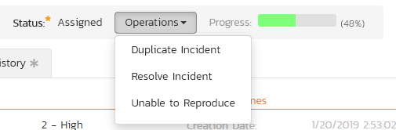
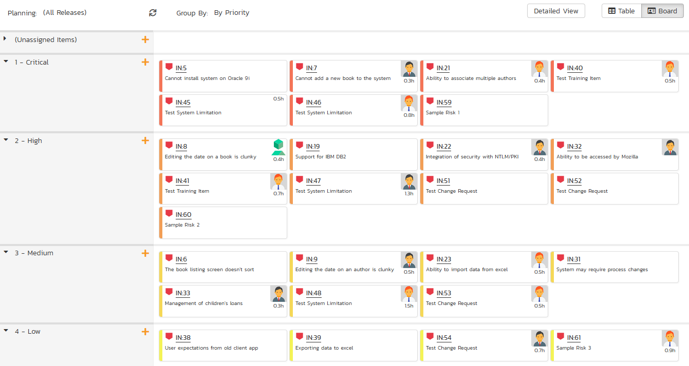
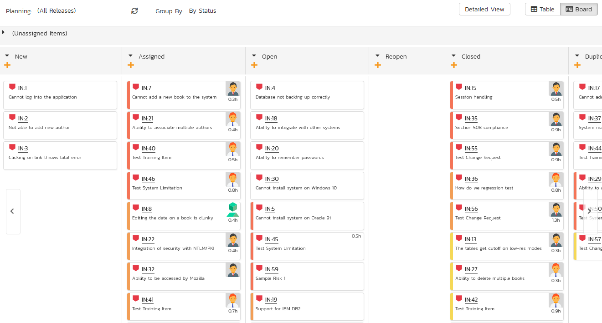

# Incident Tracking

This section outlines how the incident/defect tracking features of SpiraPlan® can be used to manage key product artifacts during the software development lifecycle. In addition to managing the defects raised during the execution of test cases in the test management module, the Incident Tracker is also a powerful risk/issue/bug tracking system in its own right. When coupled with the [product dashboard](../User-Product-Management/#product-home) it is a powerful tool for representing all the key risks and issues associated with a product in a single, graphical format.

Unlike a standalone bug/issue tracking tool however, you can trace the incidents/defects back to the test case and the underlying requirement that generated them, giving the product manager unprecedented power in analyzing the "in-process" quality of a system during its lifecycle. This power is clearly illustrated in the "Requirement Incident Count" pane in the Product Home dashboard (see [User/Product Management > Requirements Coverage](../User-Product-Management/#requirements-coverage)).

## Incident List

When you click on the Tracking \> Incidents global navigation link, you will initially be taken to the incidents list screen illustrated below:

The incident list screen displays all the incidents entered for the current product, in a filterable, sortable grid. The grid displays the incident number together with fields such as incident type (bug, issue, risk, etc.), status (new, open, etc.), priority, name, assigned owner, detection date, detector, closed date, etc. The choice of columns displayed is configurable per-user, per-product, giving extensive flexibility when it comes to viewing and searching incidents.

The sidebar on the left gives you quick access to saved filters, along with some useful charts to get an at-a-glance view of incidents for this product.

In addition, you can view a more detailed description of the incident (along with a resolution if any) by positioning the mouse pointer over the incident name hyperlink and waiting for the popup "tooltip" to appear. If you click on the incident name hyperlink, you will be taken to the incident details page described in [Incident Tracking > Incident Details](../Incident-Tracking/#incident-details). Clicking on any of the pagination links at the bottom of the page will advance you to the next set of incidents in the list according to the applied filter and sort-order. There is also a drop-down-list at the bottom of the page which allows you to specify how many rows should be displayed in each page, helping accommodate different user preferences.

### Sorting and Filtering

You can easily filter and sort the list of incidents as illustrated in the screen-shot below:

To filter the list by incident type, status, priority, owner or detector name, you simply choose an item from the appropriate drop-down list, and for the other fields, you enter a free-text phrase then click "***Filter***" or press the <ENTER\> key to apply the different filters. Note that the name field is searched using a "LIKE" comparison, so that searching for "database" would include any item with the word database in the name. The other freetext fields need to be exact matches (e.g. dates, incident numbers). There are also several aggregate filters that are used to filter on multiple values at once (e.g. filtering status on (All Open) will return any incident that is in one of the open statuses -- new, open, assigned, reopen).

To change the column that is sorted, or to change the direction of the current sort, simply click on the up/down arrow icon in the appropriate column. The currently sorted column is indicated by the darker arrow. In the screen-shot above, we are filtering on type=bug and sorting by decreasing priority.

Clicking on Filter \> Clear Filter removes any set filters and expands the incident list to display all incidents for the current product, and clicking on Filter \> Save Filter allows you to save the filter to your
'My Page' for use in the future. The list of saved filters can also be retrieved by clicking Filter \> Retrieve Filter.

As a shortcut, the left hand panel includes a set of **Quick Filters**
that can be applied in a single-click:

-   The topmost section displays any saved incident filters created by the current user or that are shared with the current user (the former are designated with an icon representing a single person, the latter a group of people)

-   **Components** -- This section lists the components defined for the current product. Clicking on any of the components in the list will filter the incidents to only show those that are associated with the selected component.

-   **Releases** -- This section lists the releases and sprints defined for the current product. Clicking on any of the releases or sprints in the list will filter the incident by that **resolved release/sprint**.

### New Incident

Clicking on the "***New Incident***" button takes you to the new incident screen. This is essentially the same screen as the incident details screen shown in [Incident Details](../Incident-Tracking/#incident-details) except, depending on how the workflow has been configured for your product, certain fields may be disabled. For more details on setting and up configuring workflow for your product, please refer to the *SpiraTest Administration Guide*.

### Delete

Clicking on the "***Delete***" button deletes the incidents whose check-boxes have been selected in the incident list.

### Refresh

Clicking on the "***Refresh***" button simply reloads the list of incidents; this is useful when new incidents are being added by other users, and you want to make sure you have the most up-to-date list displayed.

### Show / Hide Columns

This drop-down list allows you to change the fields that are displayed in the incident list as columns for the current product. To show a column that is not already displayed, simply select that column from the list of "Show..." column names and to hide an existing column, simply select that column from the list of "Hide..." column names. This is stored on a per-product basis, so you can have different display settings for each product that you are a member of. The fields can be any of the built-in fields or any of the custom properties set up by the product owner.

### Edit

Each incident in the list has an "***Edit***" button display in its right-most column. When you click this button or just
*double-click* on any of the cells in the row, you change the item from "View" mode to "Edit" mode. The various columns are made editable, and "***Save***" buttons are displayed in the last column:

If you click "***Edit***" on more than one row, the "***Save***" buttons are only displayed on the first row, and you can make changes to all the editable rows and then update the changes by clicking the one "***Save***" button. Also, if you want to make the same change to multiple rows (e.g. to change five incidents from "Resolved" status to "Closed"), you can click on the "fill" icon to the right of the editable item, which will propagate the new value to all editable items in the same column.

If you want to edit lots of items, first select their checkboxes and then click the "***Edit***" button on the same row as the Filters and it will switch all the selected items into edit mode.

When you have made your updates, you can either click "***Save***" to commit the changes, or "***Cancel***" to revert back to the original information. Alternatively, pressing the <ENTER\> key will commit the changes and pressing the <ESCAPE\> key will cancel the changes.

### Cloning Incidents

To create a clone of an existing incident or set of incidents, simply select the check-boxes of the incidents you want to copy and then click "***Clone***". This will make a copy of the current incident with its name prefixed 'Copy of ....' to distinguish itself from the original. Any file attachments will also be copied along with the incident itself.

### Exporting Incidents

To export an incident or set of incidents from the current product to another product in the system, select the check-boxes of the incident(s) you want to export and then click the Tools \> "***Export to Product***". This will then bring up a list of possible destination products:

Once you have chosen the destination product and clicked the "***Export***" button, the incidents will be exported from the current product to the destination product. Any file attachments will also be copied to the destination product along with the incidents.

### Creating Requirement from Incidents

Sometimes you may have enhancements logged that now need to be converted into formal requirements. This may be useful for sprint planning or so test cases and tasks can be made from it. There is a shortcut to create new requirements from selected incidents (1 or more); and it automatically creates an association between each new requirement and the corresponding incident.[^rq-in]

To use this feature:

- select the checkboxes of the incidents you want to convert
- click Tools \> Convert Into Requirements
 

### Printing Items

To quickly print a single incident or list of incidents you can select the items' checkboxes and then click Tools \> Print Items. This will display a popup window containing a printable version of the selected items. You can also save the report in a variety of common formats from the same Tools menu.

## Incident Details

When you click on an incident item in the incident list, or click the "***New Incident***" button (as described in [Incident List](#incident-list)), you are taken to the incident details page illustrated below:

This page is made up of three areas:

-   the left pane is the navigation window where you can quickly jump to other incidents;

-   the upper part of the right pane contains the incident name and key information about it (it's ID number, and what type of incident it is), as well as the current status (see below); and

-   the bottom part of the right pane displays different information associated with the incident across a number of tabs.

The navigation pane consists of a link that will take you back to the incidents list, as well as a list of the peer incidents to the one selected. This latter list is useful as a navigation shortcut; you can quickly view the peer incidents by clicking on the navigation links without having to first return to the incidents list page. The navigation list can be switched between four different modes:

-   The list of incidents matching the current filter

-   The list of all incidents, irrespective of the current filter

-   The list of incidents assigned to the current user

-   The list of incidents detected/found by the current user

In addition to the left hand navigation, you can enter a specific incident number in the text-box in the toolbar and click the "***Find***" button. In the same toolbar, there is also a shortcut for creating a copy of the current by clicking the "***Clone***" button.

### Editing an Existing Incident

If you are editing an existing incident, the fields that are available and the fields that are required will depend on your stage in the incident workflow. For example an open incident might not require a "Resolved Version" whereas a resolved incident may well. The types of change allowed and the email notifications that are sent will depend on how your product administrator has setup the system for you. Administrators should refer to the *SpiraPlan Administration Guide* for details on configuring the incident workflows to meet their needs.

Depending on the user's role and whether they are listed as the owner or detector of the incident or not, the dropdown next to the incident's current status shows the allowed workflow operations:

These workflow transitions allow the user to move the incident from one status to another. For example when the incident is in the Assigned status, you will be given the options to:

**Resolve the Incident** -- changes status to "Resolved"

**Unable to Reproduce** -- changes the status to "Not Reproducible"

**Duplicate Incident** - changes the status to "Duplicate"

After changing the status of the incident by clicking on the link, you can then fill in the additional fields that are now enabled and/or required. Once you've made the changes to the appropriate incident fields, you can click "***Save***" or one of the options from the "***Save***" dropdown list to commit the changes or "***Refresh***" to discard the changes and reload the incident from the database.

Please note that if digital signatures have been enabled for a particular workflow operation (and therefore a digital signature is required to confirm the status change. Workflow operations requiring a digital signature are marked with a padlock icon as in the example below:

On attempting to save changes made after clicking a workflow operation that requires a digital signature you will be presented with a popup similar to the one below (which is for a requirement):

You can print the current incident by clicking Tools \> Print, which will display a printable version of the page in a separate window. Alternatively, you can export the incident to a number of formats by selecting the appropriate option from the Tools menu.

### Inserting a New Incident

If you are creating a new incident, the fields that are available and the fields that are required will depend on how your product has been for configured. For example, some products may require that all incidents be started with Status=New and Type=Incident, others may allow you to specify the incident type. The types of change allowed will depend on how your product administrator has setup the system for you. Administrators should refer to the *SpiraPlan Administration Guide* for details on configuring the incident workflows to meet their needs.

Once you've filled out the appropriate incident fields, you can either click "***Save***" or one of the options from the "***Save***" dropdown list to commit the changes or click on "***Back to Incident List***" to discard the insertion and return back to the incident list.

### Overview - Comments

The Comments section allows users to add and view discussions related to the incident:

Existing comments are displayed by date (either newest-first or oldest-first) above the text box. To add a comment to the incident, enter your text into the textbox, then click the "***Add Comment***" button to save.

### Overview -- Dates and Times

This section displays the general schedule and completion status of the specific incident. You can enter/edit the start-date, closed-date (i.e. the due-date), estimate, actual and remaining effort. From these values, the system will display the calculated percent completion, progress indicator and producted final effort. Any custom date fields set up by the system administrator or product owner will also appear in this section (as shown below with the Review Date field).

### Attachments

Read about [how the attachments tab works](Application-Wide.md#attachments)

### Associations

You can associate other incidents, requirements, test steps, tasks, and risks to an incident from this tab. 

The incidents and tasks in this list are ones that a user has decided are relevant to the current one and has created a direct link between them. In the case of requirements and test cases, the association can be either due to the creator of an incident directly linking the incident to the requirement or test step, or it can be the result of a tester executing a test-run and creating an incident during the test run. In this latter case, the check-box to the left of the association will be unavailable as the link is not editable.

Read more about [how to manage and add associations to this artifact](Application-Wide.md#associations)

### History

Read about [how the history tab works](Application-Wide.md#history)

### Creating a Requirement from an Incident

Sometimes you may have an enhancement logged that now needs to be converted into a formal requirement. This may be useful for sprint planning or so test cases and tasks can be made from it. There is a shortcut to create a new requirement from the current incident; and it automatically creates an association between the new requirement and the incident.[^rq-in]

To use this feature:

- go to the Associations tab
- click the `Add` button
- at the bottom right of the panel that displays click the `Create Requirement from this Incident` button 

### Emailing

Read about [emailing an incident to colleagues](Application-Wide.md#emailing).

### Incident Followers

Read about [how to add and manage followers to an artifact](Application-Wide.md#followers)

## Incident Board

The incident board is an alternative to the [incident list](#incident-list) page designed to let you view the incidents planned for the current product. You can access this feature by clicking on the **Board** icon in the top-right of the Incidents list page. You can switch back to the Incident list page by clicking on the **Table**
view.

The incident board has the following different display modes:

-   **All Releases**

    -   By Release
    -   By Priority
    -   By Status
    -   By Person

-   **Release**

    -   By Sprint
    -   By Priority
    -   By Status
    -   By Person

-   **Sprint**

    -   By Priority
    -   By Status
    -   By Person

Each of these views is described below:

### Incidents -- By Priority

This view is designed to let you see the list of planned incidents organized by priority. Each of the possible priority values is displayed on the left-hand side and the incidents displayed in the same row on the right:

The top section will contain the list of incidents that are not assigned a priority, with the other sections containing the incidents that have been assigned to the specific priority.

### Incidents -- By Status

This view is designed to let you see the incidents in the current product / release / sprint organized by their status. Each incident status (not started, in progress, completed, blocked, deferred) is displayed as a heading, with the incidents displayed in the same column underneath:

You can click on the expand/collapse icons to hide any resources that are not relevant.

Depending on the view (all releases, release, or sprint), there may be sections with the release and sprint name. You can drag and drop the incidents between statuses or to/from the release/sprint backlog. Any incidents not assigned to a release/sprint will be listed in the (Unassigned Items) section at the top.

### Incidents - By Person

This view is designed to let you see the incidents in the current product / release / sprint organized by resource / person. Each of the users that is a member of the current product is displayed as a heading, with the incidents displayed in the same column underneath:

You can click on the expand/collapse icons to hide any resources that are not relevant. The system will display a progress bar for each resource to illustrate the allocation for that resource. Any resource that has a progress bar that is completely green has been fully scheduled and should not have any additional incidents assigned. If the progress bar for that resource turns red, it means that they have been over-scheduled and you need to reassign some of the incidents.

Depending on the view (all releases, release, or sprint), there may be sections with the release and sprint name; they contain incidents that are scheduled for the current release or sprint but have not yet been assigned to a resource. You can drag and drop the incidents between resources or to/from the release/sprint backlog. Any incidents not assigned to a resource and release/sprint will be listed in the (Unassigned Items) section at the top.

### Incidents - By Release

This view is only available when you are displaying the incident board for 'all releases'. Each of the active releases defined for the current product is displayed as a heading, with the incidents displayed in the same column underneath

You can drag and drop the incidents between the different releases. Once the incident has been added to the release, the utilized effort for the release will increase, and the available effort will decrease by the same amount.

Note: The system will allow you to assign more incidents to a release than it is possible to complete, however this will result in a negative value for 'available effort'. If this happens, the "Available Effort" value will be displayed in red, and you need to rebalance the items, extend the release length or add product personnel resources to the release.

Clicking on the release hyperlinks in the headers will switch the incident board into the release view.

### Incidents - By Sprint

This view is only available when you are displaying the incident board for a specific release. Each of the sprints defined for the current release is displayed as a heading, with the incidents displayed in the same column underneath. This view is commonly used in **Scrum**
products:

You can drag and drop the incidents between the different sprints. Once the incident has been added to the sprint, the utilized effort for the sprint will increase, and the available effort will decrease by the same amount.

Note: The system will allow you to assign more incidents to a sprint than it is possible to complete, however this will result in a negative value for 'available effort'. If this happens, the "Available Effort" value will be displayed in red, and you need to rebalance the items, extend the sprint length or add product personnel resources to the sprint.

Clicking on the sprint hyperlinks in the headers will switch the incident board into the sprint view.

[^rq-in]: 
    To create a requirement from an incident, the user needs must have the permission to create requirements (which makes sense).

    The creation process does not enforce the relevant requirement workflow.

    What gets copied over from the incident to the new requirement:

    - Name
    - Description
    - Owner
    - "Detected By" becomes Author
    - Component (as long as only a single component is selected on the incident)
    - "Resolved Release" becomes Release
    - Priority becomes Importance (if there is an exact name match)
    - "Estimated Effort" becomes Estimate (converting hours into points)
    - Custom Fields of type list or multilist that use the same list and have the same name (case insensitive)
    - Comments (using the name of the original author, but the comment creation date is the current date)
    - Attachments