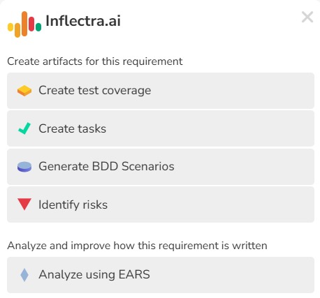
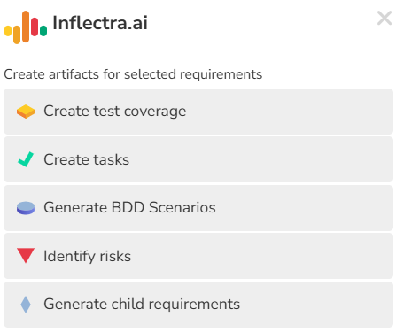

# Inflectra.ai
!!! abstract "Available in SpiraTest, SpiraTeam, SpiraPlan - cloud only"
    It is available to try for free in any cloud trial. 
    
    To add Inflectra.ai to your production site, you can do so from your customer area or [contact us to find out how to upgrade](mailto:sales@inflectra.com).

## Overview
Inflectra.ai provides a variety of different functionality in Spira.

Inflectra.ai lets users create content from existing artifacts. This enhances user activity by reducing manual work to create this content, and also leverages AI to provide potentially important ideas that could otherwise be missed. These collectively help users deliver at a high level of quality more quickly. 

Please see our statement on [responsible AI usage](https://www.inflectra.com/Company/Responsible-AI-Statement.aspx). Users can only create content based on their permissions in Spira, and are not able to access any information from Inflectra.ai that they are not able to access from the application itself. Inflectra is not responsible for any content generated by the ai. 

## Getting started
Trial customers can start using Inflectra.ai right away. Relevant settings are automatically turned on for trial customers.

Production customers need to proactively turn on Inflectra.ai inside Spira, before you can start using it. These actions need to be done by a system admin.

- System Admin > [General Settings](../Spira-Administration-Guide/System.md/#general-settings): set "Inflectra.ai" to yes
- System Admin > Workspaces > [View/Edit Product](../Spira-Administration-Guide/System-Workspaces.md/#edit-a-product): set "Inflectra.ai" to yes for any existing product you wish to use Inflectra.ai (note that new products will have Inflectra.ai on by default, as will sample products if the site was created at 8.10.0.0 or later)

### Where is Inflectra.ai available
You can tell if a page has Inflectra.ai functionality because you will see the Inflectra.ai icon in the navigation bar.

Inflectra.ai is available in the following places:

- **Details pages**: Inflectra.ai can generate content based on the current artifact being viewed from its details page. This content can either augment the artifact or create new artifacts.
 
    - Requirement details page
    - Test case details page
    - Task details page
    - Risk details page

- **List pages**: Inflectra.ai can generate content based on a selected list of artifacts on its list page. This content can either augment the artifact or create new artifacts.

    - Requirement list page (hierarchical)
    - Requirement list page (sortable)

- **Dashboards**: Inflectra.ai can generate content from user input on the My Page, and it is only accessible to users with the System Admin permission. This content can be used to create new artifacts.
    - My Page (for System Administrators only)

### Tagging AI generated content
Any new artifact created by Inflectra.ai will have the tag "ai-generated" added to it automatically.

Any artifact that is updated by Inflectra.ai will have the tag "ai-augmented" added to it automatically.

### Chat history
Inflectra.ai stores your chat history in the browser to allow you to look back over the most recent 50 messages. Because it is being stored in the browser, this history does not transfer across browsers or computers. Previous messages are grayed out compared to the current interaction.

### Loading Indicator
When Inflectra.ai is performing a task, it will show a progress bar for the artifact currently being processed. Above the progress bar is summary information about what actions are being performed, like how many artifacts, of what type, are being created. On list pages, this summary information also shows how many artifacts are being worked on and how many are finished. 

In the following example, the task is for 10 requirements, and 5 requirements have finished. For the 6th requirement (RQ:800), half of the 10 tasks have already been created:

### Supported Languages
The Inflectra.ai sidebar labels are localized based on the user's **[culture setting](../Spira-User-Manual/User-Product-Management.md/#regional-settings)** in these languages: English, French, German, Portuguese, Brazilian Portuguese, and Spanish. If the user's culture is not supported, English text will be shown.  
The responses from the AI are localized based on the Name and Description of the artifact being used. For example, when generating tasks for a requirement written in French, the generated tasks will also be written in French. When the input language cannot be determined or is not recognized, the response will be written in English.  

### Responsible AI Usage
Please see [our page on responsible AI usage](https://www.inflectra.com/Company/Responsible-AI-Statement.aspx). Inflectra.ai may refuse to fulfil any request which it deems to be inappropriate or potentially harmful. If you believe a reasonable request is being denied, please contact Inflectra technical support at [www.inflectra.com/support](https://www.inflectra.com/support).

## Artifact details pages
On artifact details pages, you can perform actions against one artifact at a time, while viewing the complete data. This provides more detailed information to you about what Inflectra.ai is doing for that artifact. Details pages can also allow more information about the artifact to be shared with Inflectra.ai. 

### Requirement details page

#### Content Generation from Requirements
From the requirement details page you can generate the following content: 

| Generated Content | Description                                                                                                                                      |
| ----------------- | ------------------------------------------------------------------------------------------------------------------------------------------------ |
| Test Cases        | Creates a set of test cases with steps to cover this requirement, to get a head start on test planning                                           |
| Task [^STSP]      | Creates a set of work tasks needed to deliver the functionality in this requirement                                                              |
| Scenarios         | Generates BDD scenarios for this requirement, to represent the requirement as defined behaviors (available if the requirement type allows steps) |
| Risks [^STSP]     | Identifies any risks that may impact the deployment or development of this functionality                                                         |

When generating content for a requirement, the following information is provided to Inflectra.ai:

- Name and description
- Type
- Component
- Any existing requirement steps
- Names of the parent, grandparent, and so on, of the requirement (its hierarchy)
- The product name of the product the requirement is in

#### Requirement Analysis
From the requirement details page you can analyze the requirement to see how well it is written and organized, based off specific frameworks. This provides valuable insights into the quality of the text and how effectively it may communicate its meaning to others.

The analysis includes a score from 1 to 5. A score of 5 means the requirement is very well written and does not need to be improved, while a score of 1 means lots of work is needed. Along with a score, detailed notes and guidance are provided about how to improve the requirement and why, as well as what is in good shape already.

| Analytical framework | Description                                                                                                                                                                          |
| -------------------- | ------------------------------------------------------------------------------------------------------------------------------------------------------------------------------------ |
| EARS                 | Provides an analysis of the requirement based on the EARS ruleset                                                                                                                    |
| ... Improve          | Use the current analysis to improve the requirement's description (for scores between 2 and 4 only)                                                                                  |
| ... Attachment       | Create a new document with this analysis and attach it to the requirement                                                                                                            |
| ... Task [^STSP]     | Create a new task with this analysis and attach it to the requirement (for scores between 1 and 4 only) The owner and priority will be automatically set based on the requirement |

#### EARS Analysis
!!! info "EARS"
    The EARS (Easy Approach to Requirements Syntax) framework provides a structured and constrained way to write clear, unambiguous requirements, typically following the "When [optional trigger], while [optional pre-conditions], the [system name] shall [system response]" pattern. Its value lies in reducing ambiguity and errors in requirements specifications, leading to more efficient development and testing, and ultimately, higher quality systems, because its precise structure forces clarity and helps prevent misinterpretations.

    Analytical scores are given from 1 to 5 (worst to best). This is a subjective and ultimately qualitative measure but a guide to each score is below:

    - **Score of 5**: perfectly clear, unambiguous, complete, and adheres strictly EARS patterns. It is easily testable and requires no further clarification.
    - **Score of 4**: largely clear and complete, with minor deviations from EARS. It might be missing a keyword or have a slight structural imperfection, but the intent is still very clear and it's easily understandable and testable.
    - **Score of 3**: understandable, but has noticeable issues with EARS compliance or clarity. It might be a natural language requirement that could be easily refactored into an EARS pattern, or it has some ambiguity that requires minor clarification.
    - **Score of 2**: difficult to understand, ambiguous, or incomplete. It significantly deviates from EARS principles, making it hard to interpret the true intent or to test the requirement effectively. It requires substantial rework.
    - **Score of 1**: poorly written and can not be readily interpreted. It provides little to no actionable information, is highly ambiguous, and offers no discernible path for testing. It may be contradictory.

!!! info "*Improving a description"
    If a requirement has a score of 2, 3, or 4, you can click the "Improve" button to generate a new description for the requirement. This will use the existing description, along with the already created analysis to provide a new description that is more aligned with the EARS framework. 

    The new description will overwrite the existing one, but the artifact is not saved. You must review the new description to decide whether or not to accept the changes. 
    
    Note that screenshots should be preserved in the updated description.

### Test Case details page
From the test case details page you can generate the following content:

| Generated Content | Description                                                                                                                                  |
| ----------------- | -------------------------------------------------------------------------------------------------------------------------------------------- |
| Test Steps        | Creates test steps to anticipate some of the individual items that will need to be tested to cover the test case topic                       |
| Requirement       | Creates requirement for the functionality this test case is going to cover, especially useful within TDD (Test Driven Development) processes |

When generating content for a test case, the following information is provided to Inflectra.ai:

- Name and description
- Type
- Components
- Any existing test steps

    - For linked test steps, only the name as shown on the test step grid is shared
    - For test case parameters, only the text as displayed for the test step (the parameter token) is shared

- The product name of the product the test case is in

### Releases details page

#### Release Analysis
From the release details page you can analyze the release to bring its different parts together into a text summary.
This allows you to get a birds-eye view of a release. 

| Analysis Type         | Description                                                                                                                                             |
| --------------------- | ------------------------------------------------------------------------------------------------------------------------------------------------------- |
| Progress              | Analyzes the progress of requirements that are associated to this specific release, giving a summary of overall status, risks, and requirement content. |
| ... Create Attachment | Create a new document with this analysis and attach it to the release                                                                                   |
| ... Add comment       | Add a comment with this analysis to the release (the comment will include a label to mark it as ai-generated)                                           |

### Task details page
!!! abstract "Available in SpiraTeam and SpiraPlan only"

From the task details page you can generate the following content: 

| Generated Content                   | Description                                                                                                                              |
| ----------------------------------- | ---------------------------------------------------------------------------------------------------------------------------------------- |
| Document (code file)                | Generates a code snippet in the specified programming language to kickstart development work APIs                                        |
| Document (unit test and code files) | Generates unit test coverage in the specified framework and code in the language right for that framework (or optionally of your choice) |

!!! tip "Generating code"
    When generating code, you are prompted to pick a programming language or a testing framework.
    
    You can give additional details to help guide Inflectra.ai to use specific tooling relevant to your codebase. For instance, if I am a web developer who works on a Java Spring Boot based application, I can enter "Java (Spring Boot)" as my programming language. The same goes for testing framework - for example: "NUnit 3 (ASP.NET Web API)".

    You can enter a value in the text input and hit enter to submit it, or quick select one of your previous entries. Previous entries are stored in the browser, so will not transfer to other browsers or computers. 

{.border-all}

### Risks details page
!!! abstract "Available in SpiraTeam and SpiraPlan only"

From the risk details page you can generate the following content:

| Generated Content | Description                                |
| ----------------- | ------------------------------------------ |
| Risk Mitigations  | Generates mitigations for the current risk |

When generating content for a risk, the following information is provided to Inflectra.ai:

- Name and description
- Type
- Probability
- Impact
- Any existing risk mitigations
- The product name of the product the risk is in

## Artifact list pages
When using Inflectra.ai on the list page, you can select a small number of artifacts at a time. 

Please make sure to keep the list page and the Inflectra.ai sidebar open while the operation completes (this may take a few minutes based on the amount of processing required). 

If Inflectra.ai encounters any problems for a specific artifact it will give you a clear message, to help you understand which artifacts were successfully acted upon and which ones were not. See example below:

{.border-all}

### Requirements list pages
From the requirements list page (both the hierarchical and sortable pages) you can select up to 10 requirements (unless otherwise stated) to generate the following content:

| Generated Content  | Description                                                                                                                                            |
| ------------------ | ------------------------------------------------------------------------------------------------------------------------------------------------------ |
| Test Cases         | Creates a set of test cases with steps to cover each requirement, to get a head start on test planning                                                 |
| Task [^STSP]       | Creates a set of work tasks needed to deliver the functionality in each requirement                                                                    |
| Scenarios          | Generates BDD scenarios for each requirement, to represent the requirements as defined behaviors (available if the requirement type allows steps)      |
| Risks [^STSP]      | Identifies any risks that may impact the deployment or development of each requirement's functionality                                                 |
| Child requirements | Generates child requirements for each selected requirement, to split them up into distinct user stories (available on the hierarchical list page only) |

When generating content for a requirement on the list page, the following information is provided to Inflectra.ai:

- Name and description
- Type
- Component
- Any existing requirement steps
- The product name of the product the requirement is in

## My Page
!!! warning "This functionality is only available for System Administrators"

From the My Page, system administrators can quickly generate a new product with a rich set of artifacts, by providing a name and description. The product is created with its own template, along with a high level set of requirements. You can then optionally use AI to generate more artifacts to fill out the product and speed up delivery. This way users can build out an entire product skeleton in a few minutes.

Optional artifacts are below and can be created in any order:

- Child requirements, to give more detail and depth (create these first if you want the other artifacts to be generated for these requirements too)
- Test cases, to provide test coverage to the requirements
- Risk, connected to each requirement
- Tasks, to carry out the work of each requirement

 

| Generated Content                   | Description                                                                                                                                  |
| ----------------------------------- | -------------------------------------------------------------------------------------------------------------------------------------------- |
| Product and Root level Requirements | Creates a product using a provided name and description, then generates root level requirements to help you get started                      |
| ... Child requirements              | Generates child requirements for each root level requirement, to split them up into distinct user stories                                    |
| ... Test Cases                      | Creates a set of test cases with steps to cover each requirement, including any new child requirements, to get a head start on test planning |
| ... Risks [^STSP]                   | Identifies risks that may impact the deployment or development of each requirement, including any new child requirements                     |
| ... Tasks [^STSP]                   | Creates a set of work tasks needed to deliver the functionality in each requirement, including any new child requirements                    |

[^STSP]: Available in SpiraTeam and SpiraPlan
[^SP]: Available in SpiraPlan