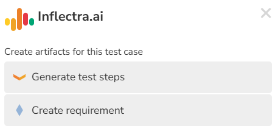

# Inflectra.ai

## Overview

This page describes the Inflectra.ai functionality available in Spira. This feature is a separately purchased product, only available for Spira users hosted by Inflectra in the cloud. 

Inflectra.ai gives users various options for creating content from existing artifacts, to cut down on the manual work needed for fleshing out the different pieces of your process required to deliver features at a high level of quality. We intend to continue to improve the prompts for existing functionality as well as add new features, to continue to expand what is possible within the Spira family of products. 

## Details Pages

This section will describe the available functionality on details pages within Inflectra.ai as well as what each of them do, to help you get started with workflows including generative AI. Inflectra.ai handles both generating the content of the other artifacts, creating those artifacts, and associating them to the original artifact they were based on. 

### Requirements

The requirement details page has options for generating supporting artifacts from what is described in the requirement. 

| Generated Artifact | Description                                                                                                   |
|--------------------|---------------------------------------------------------------------------------------------------------------|
| Test Cases         | Creates a set of test cases with steps to cover this requirement, to get a head start on test planning        | 
| Task               | Creates a set of work tasks needed to deliver the functionality in this requirements                          | 
| Scenarios          | Generates BDD scenarios for this requirement, to represent the requirement as defined behaviors               | 
| Risks              | Identifies any risks that may impact the deployment or development of this functionality                      | 

### Test Cases

The test case details page has options for generating requirements and steps based on the test case name & description. 

| Generated Artifact | Description                                                                                                                                  | 
|--------------------|----------------------------------------------------------------------------------------------------------------------------------------------|
| Test Steps         | Creates test steps to anticipate some of the individual items that will need to be tested to cover the test case topic                       | 
| Requirement        | Creates requirement for the functionality this test case is going to cover, especially useful within TDD (Test Driven Development) processes | 

### Tasks 

The task details page allows users to generate code to cover a given development task. This code can also come with unit tests if that is desired as part of the generated content.

When generating code, the user is prompted to enter either a programming language or a testing framework. Additional details can be provided to help guide Inflectra.ai to use specific tooling relevant to your codebase. For instance, if I am a web developer who works on a Java Spring Boot based application, I can enter "Java (Spring Boot)" as my programming language. The same goes for testing framework - for example: NUnit 3 (ASP.NET Web API).

You can enter a value in the text input & hit enter to submit it, or select one of your previous entries. Previous entries are stored in the browser, so will not transfer to other browsers or computers. 

| Generated Artifact                  | Description| 
|-------------------------------------|------------|
| Document (code file)                | Generates a code snippet in the specified programming language, to allow the user to get a head start on development or get pointed in the right direction in terms of applicable APIs | 
| Document (unit test and code files) | From a given test framework, generates a unit test file and an associated code snippet that can be used to cover that code snippet. Programming language is determined by the testing framework provided, however you can specify that if the testing framework spans multiple languages | 

### Risks

The risk details page allows mitigations to be automatically generated to help brainstorm ways to address identified risks.

## Chat history

Inflectra.ai will store your chat history in your browser to allow you to look back at what you have done previously, up to 50 previous messages. Because it is being stored in the browser, this history does not transfer across browsers or computers. 

## Responsible AI Usage

Please see [our page on responsible AI usage](https://www.inflectra.com/Company/Responsible-AI-Statement.aspx). Inflectra.ai may refuse to fulfil any request which it deems to be inappropriate or potentially harmful. If you believe a reasonable request is being denied, please contact Inflectra technical support at [www.inflectra.com/support](https://www.inflectra.com/support).