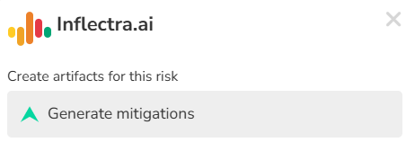

# Inflectra.ai

## Overview
Inflectra.ai provides a variety of different functionality in Spira.

Inflectra.ai lets users create content from existing artifacts. This enhances user activity by reducing manual work to create this content, and also leverages AI to provide potentially important ideas that could otherwise be missed. These collectively help users deliver at a high level of quality more quickly. 

Please see our statement on [responsible AI usage](https://www.inflectra.com/Company/Responsible-AI-Statement.aspx). Users can only create content based on their permissions in Spira, and are not able to access any information from Inflectra.ai that they are not able to access from the application itself. Inflectra is not responsible for any content generated by the ai. 

!!! info
    Inflectra.ai is only available for cloud hosted sites. It is available in all versions of Spira (SpiraTest, SpiraTeam, and SpiraPlan).

    It is available to try for free in any cloud trial. To add Inflectra.ai to your production site, you can do so from your customer area or [contact us to find out how to upgrade](mailto:sales@inflectra.com).

## Getting started
Trial customers can start using Inflectra.ai right away. Relevant settings are automatically turned on for trial customers.

Production customers need to proactively turn on Inflectra.ai inside Spira, before you can start using it. These actions need to be done by a system admin.

- System Admin > [General Settings](../Spira-Administration-Guide/System.md/#general-settings): set "Inflectra.ai" to yes
- System Admin > Workspaces > [View/Edit Product](../Spira-Administration-Guide/System-Workspaces.md/#edit-a-product): set "Inflectra.ai" to yes for any existing product you wish to use Inflectra.ai (note that new products will have Inflectra.ai on by default, as will sample products if the site was created at 8.10.0.0 or later)

### Where is Inflectra.ai available
You can tell if a page has Inflectra.ai functionality because you will see the Inflectra.ai icon in the navigation bar.

Inflectra.ai is available in the following places:

- **Details pages**: Inflectra.ai can generate content based on the current artifact being viewed from its details page. This content can either augment the artifact or create new artifacts.
 
    - Requirement details page
    - Test case details page
    - Task details page
    - Risk details page

### Tagging AI generated content
Any new artifact created by Inflectra.ai will have the tag "ai-generated" added to it automatically.

Any artifact that is updated by Inflectra.ai will have the tag "ai-augmented" added to it automatically.

### Chat history
Inflectra.ai stores your chat history in the browser to allow you to look back over the most recent 50 messages. Because it is being stored in the browser, this history does not transfer across browsers or computers. 

### Responsible AI Usage
Please see [our page on responsible AI usage](https://www.inflectra.com/Company/Responsible-AI-Statement.aspx). Inflectra.ai may refuse to fulfil any request which it deems to be inappropriate or potentially harmful. If you believe a reasonable request is being denied, please contact Inflectra technical support at [www.inflectra.com/support](https://www.inflectra.com/support).

## Requirement details page
From the requirement details page you can generate the following content: 

| Generated Content  | Description                                                                                                   |
|--------------------|---------------------------------------------------------------------------------------------------------------|
| Test Cases         | Creates a set of test cases with steps to cover this requirement, to get a head start on test planning        | 
| Task               | Creates a set of work tasks needed to deliver the functionality in this requirement (SpiraTeam and SpiraPlan only)                          | 
| Scenarios          | Generates BDD scenarios for this requirement, to represent the requirement as defined behaviors (available if the requirement type allows steps)              | 
| Risks              | Identifies any risks that may impact the deployment or development of this functionality (SpiraTeam and SpiraPlan only)                      | 

When generating content for a requirement, the following information is provided to Inflectra.ai:

- Name and description
- Type
- Component
- Any existing requirement steps
- Names of the parent, grandparent, and so on, of the requirement (its hierarchy)
- The product name of the product the requirement is in

## Test Case details page
From the test case details page you can generate the following content:

| Generated Content  | Description                                                                                                                                  | 
|--------------------|----------------------------------------------------------------------------------------------------------------------------------------------|
| Test Steps         | Creates test steps to anticipate some of the individual items that will need to be tested to cover the test case topic                       | 
| Requirement        | Creates requirement for the functionality this test case is going to cover, especially useful within TDD (Test Driven Development) processes | 

When generating content for a test case, the following information is provided to Inflectra.ai:

- Name and description
- Type
- Components
- Any existing test steps

    - For linked test steps, only the name as shown on the test step grid is shared
    - For test case parameters, only the text as displayed for the test step (the parameter token) is shared

- The product name of the product the test case is in

## Task details page
From the task details page (SpiraTeam and SpiraPlan only) you can generate the following content: 

| Generated Content                   | Description| 
|-------------------------------------|------------|
| Document (code file)                | Generates a code snippet in the specified programming language, to allow the user to get a head start on development or get pointed in the right direction in terms of applicable APIs | 
| Document (unit test and code files) | From a given test framework, generates a unit test file and an associated code snippet that can be used to cover that code snippet. Programming language is determined by the testing framework provided, however you can specify that if the testing framework spans multiple languages | 

!!! tip "Generating code"
    When generating code, you are prompted to pick a programming language or a testing framework.
    
    You can give additional details to help guide Inflectra.ai to use specific tooling relevant to your codebase. For instance, if I am a web developer who works on a Java Spring Boot based application, I can enter "Java (Spring Boot)" as my programming language. The same goes for testing framework - for example: "NUnit 3 (ASP.NET Web API)".

    You can enter a value in the text input and hit enter to submit it, or quick select one of your previous entries. Previous entries are stored in the browser, so will not transfer to other browsers or computers. 

## Risks details page
From the risk details page (SpiraTeam and SpiraPlan only) you can generate the following content:

| Generated Content  | Description                                         |
|--------------------|-----------------------------------------------------|
| Risk Mitigations   | Generates mitigations for the current risk          | 

When generating content for a risk, the following information is provided to Inflectra.ai:

- Name and description
- Type
- Probability
- Impact
- Any existing risk mitigations
- The product name of the product the risk is in