# Mobile Access
!!! abstract "Available in SpiraTest, SpiraTeam, SpiraPlan"

This section describes the functionality available in Spira when accessing the system from a mobile device such as an iOS® smartphone / tablet or an Android® smartphone / tablet.

The application has been designed to be fully "responsive", which means that it will dynamically rearrange the page based on the screen-sized used, to create an optimal experience on any device. As much as possible the application provides a consistent set of functions for any device. However, in order to make using the application on smaller devices as easy as possible, necessarily the experience on say, a smartphone, is less complete than on a desktop.

Whenever this user guide has referred to performing an action by 'clicking' if the same functionality is available, then 'tapping' on a mobile device will yield the same result. Due to the limitations of mobile devices, hovering over an element to display a "tooltip" is not possible.

Below, some illustrations of how the application looks at different screen sizes are provided.

## My Page
Desktop (a tablet in landscape mode will appear largely identical)

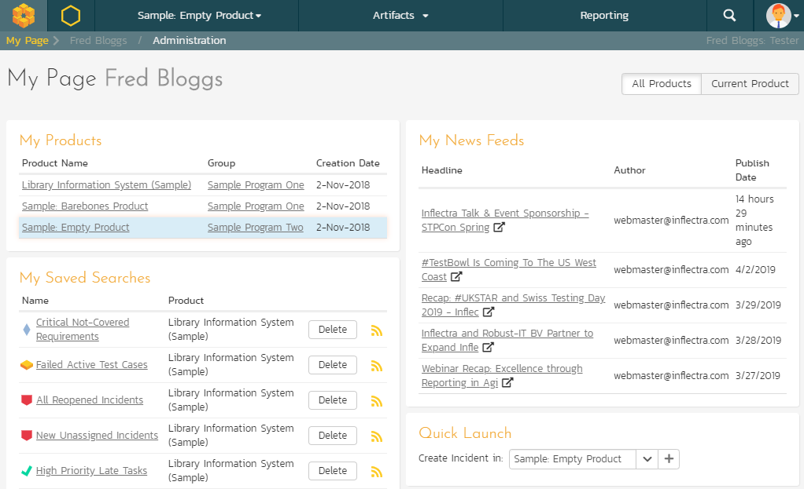

Table in portrait mode

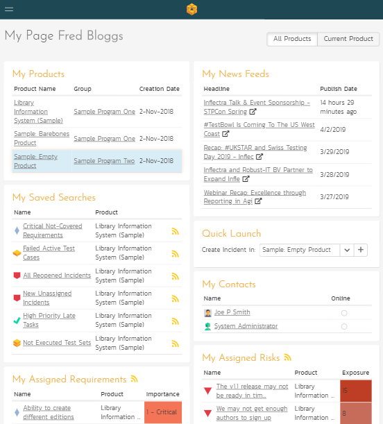

Smartphone in portrait mode

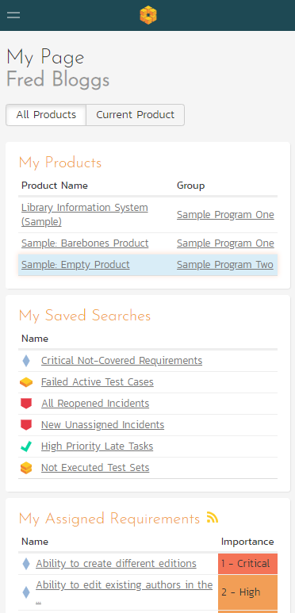

## My Profile
Desktop (a tablet in landscape mode will appear largely identical)

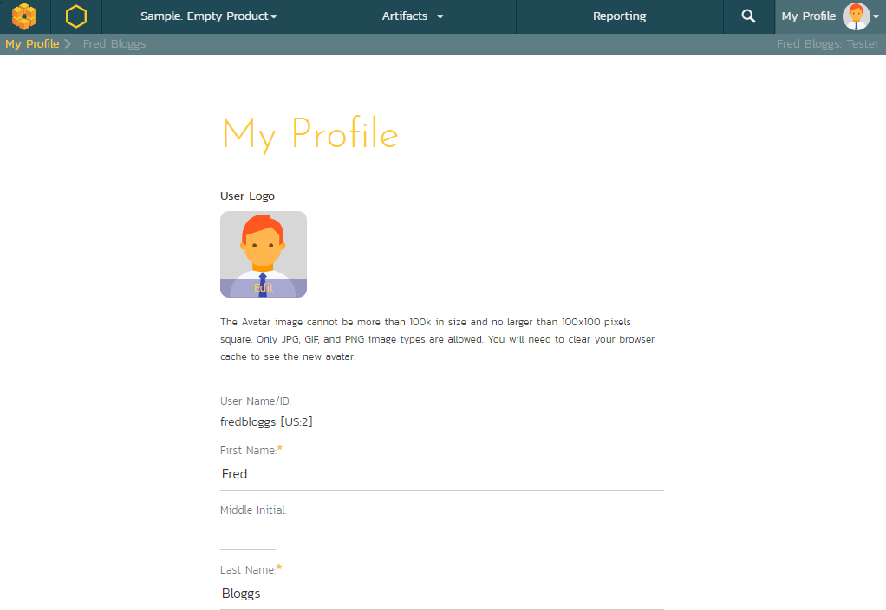

Tablet in portrait mode

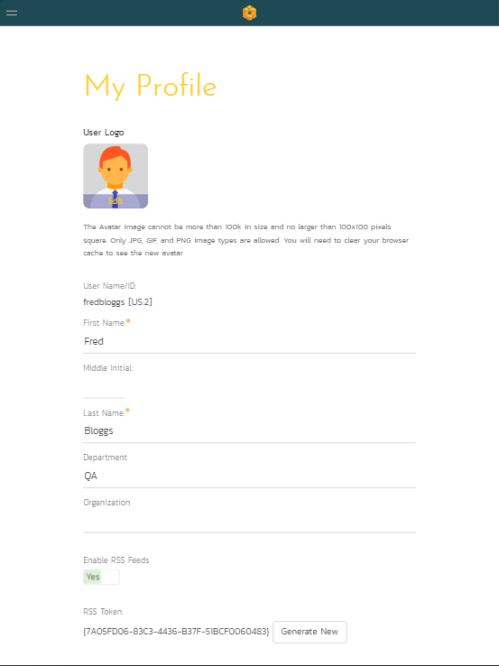

Smartphone in portrait mode

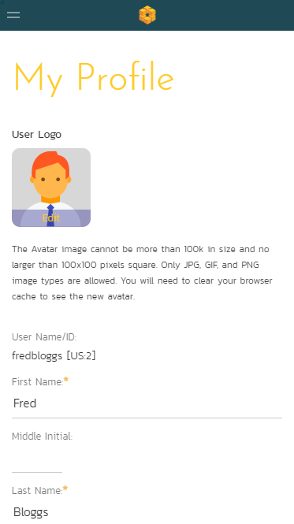

## Example List Page
Desktop (a tablet in landscape mode will appear largely identical)

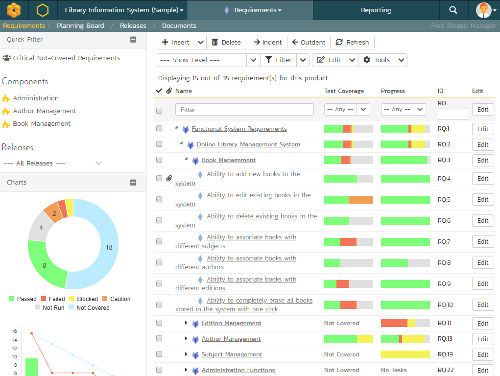

Tablet in portrait mode

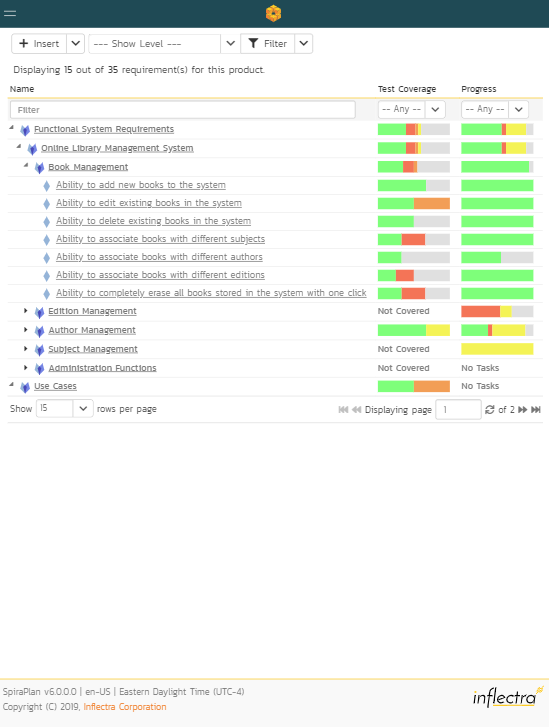

Smartphone in portrait mode

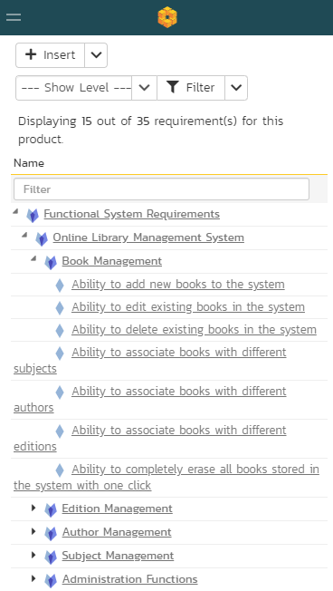

## Example Details Page
Desktop (a tablet in landscape mode will appear largely identical)

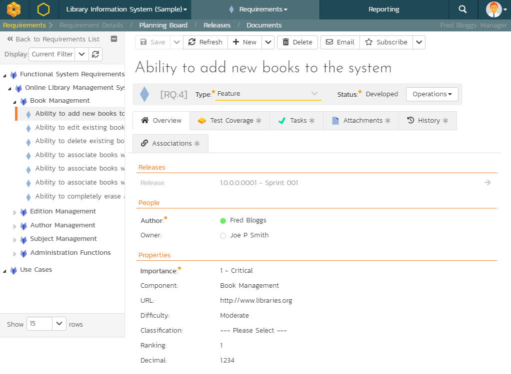

Tablet in portrait mode

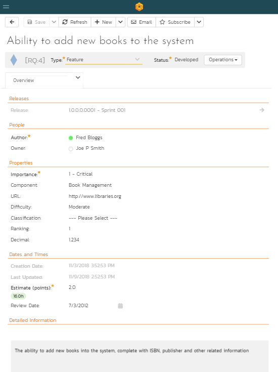

Smartphone in portrait mode

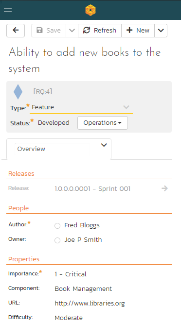

## Test Execution
Desktop (a tablet in landscape mode will appear largely identical)

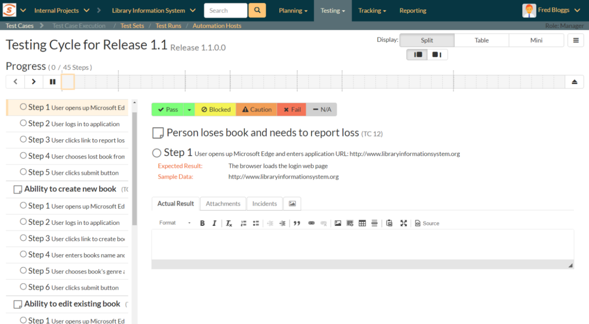

Tablet in portrait mode

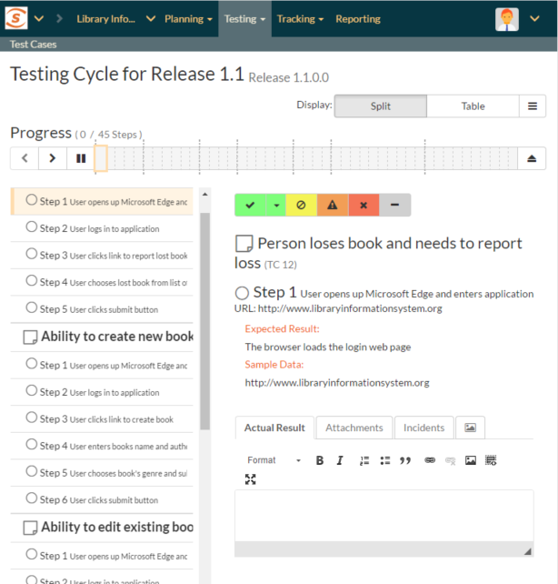

Smartphone in portrait mode

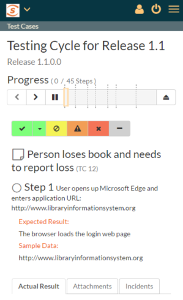