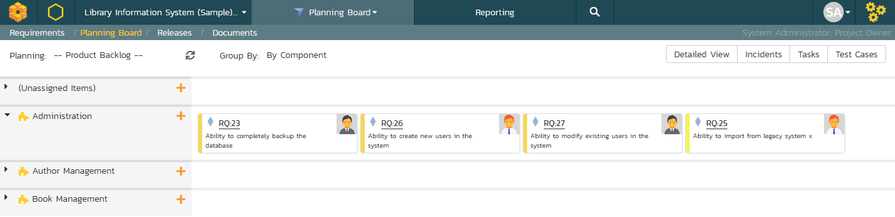
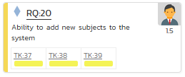
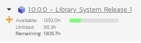

# Planning Board

The SpiraPlan planning board is a great way to visualize the backlog items (requirements, tasks, test cases and incidents) planned for your product. Based on the principles of **agile methodologies** such as Scrum and Kanban, the planning board is a great tool for planning agile products.

!!! warning "Planning Boards and Editing"
    Please note that the purpose of a planning board or Kanban board, is to make it straightforward for users to move cards around the interface to plan out their work. Therefore we do **not** enforce workflow restrictions on any planning board.

To access the SpiraPlan **product** planning board, select a product and go to Artifacts \> Planning Board and the following screen will be displayed:

To access the SpiraTest **program** planning board, select a program and go to the Planning menu and the following screen will be displayed:

We shall first discuss the product planning board, and then we will cover the program planning board.

By default, the system will display the product planning board in the product backlog view, with the backlog organized by component. You can change the view by click on the '**Planning'** drop down list:

-   **Product Backlog** -- This displays a list of all the backlog items that are not currently scheduled for a specific release or sprint. The items can be organized by component, package, priority or person.

-   **All Releases** -- This displays a list of all the releases as well as the product backlog and is designed to let you easily move items from the product backlog to a specific release.

-   **Release View** -- This displays a list of all the backlog items that are scheduled for the selected release and lets you organize them by sprint, status, or person.

-   **Sprint View** - This displays a list of all the backlog items that are scheduled for the selected sprint (also known as a Sprint in some methodologies) and lets you organize them by status, or person.

The '**Group By'** dropdown list is used to change how the view is organized. This list of options available in the 'Group By' dropdown will depend on the view being displayed.

The planning board will include the following backlog items:

-   **Requirements and Incidents** -- these are displayed as 'story cards' and are the primary items that can be moved in the planning board.

-   **Tasks and Test Cases** -- these are secondary artifacts and are considered part of a requirement. So within the planning board they are displayed as being part of a specific requirement, and if you move a requirement, the associated tasks and test cases will move as well.

The backlog items themselves can be configured to display in different ways. The choice of display will depend on how many backlog items you have to display, how large your screen is and what information you need. The display is controlled by the four checkboxes at the top of the planning board:

-   **Standard View** -- This is the view that will be displayed when
'detailed view' is unchecked. It displays the minimum necessary information in each story card, but maximizes how many story cards can be displayed on the screen. Each story card will contain the icon, ID, name, user avatar, and estimate (in story points) of the requirement.

-   **Detailed View** -- This view includes additional information in each story card. It adds the long description, a progress bar indicator (that indicates what percentage of the item has been completed) and for requirement artifacts it includes the number of tasks (red background) and number of test cases (yellow background) in the two small boxes under the user.

Numerical rankings are also shown. The ranking numbers go from left to right and top to bottom. They indicate the relative ordering and priority of the various story cards and defects.

-   **Incidents** -- The planning board will always include requirement backlog items, but because the number of incidents can be very large, there is the option to include/exclude them from the planning board. When you have the "Incidents" checkbox selected, incidents will appear in the planning board with their own story card format. The main difference is that the effort is recorded in hours rather than story points:

-   **Tasks** -- When the Tasks option is selected, the planning board will display the tasks associated with the requirements as part of each story card. Each task will be displayed with its ID and a miniature progress bar:

-   **Test Cases** -- When the Test Cases option is selected, the planning board will display the test cases associated with the requirements as part of each story card. Each test case will be displayed with its ID and a miniature test coverage bar-chart:

Regardless of the view, backlog items can be moved using "drag and drop" between the different parts of the planning board. To drag and drop multiple items, you should first select the items so that they are highlighted. Then you can drag and drop the entire selection:

You can add new requirement backlog items by clicking the "***+***" button. This will display the following dialog box:

On this screen you can enter the fields for a new requirement, click "***Add Requirement***" and the requirement will be added to the appropriate section of the planning board.

In some of the views of the planning board there will be more data that can be displayed on one screen, in which case you will be able to scroll the planning board left and right using the specially provided arrow buttons.

Each of the views is now described in more detail in the sections below.

## Product Backlog Planning

The product backlog view is designed to let you view the backlog items that have been created for the product and have not yet been assigned to a specific release or sprint. The backlog items can be requirements or incidents, and in the case of requirements, you can see the tasks and test cases associated with a specific requirement.

In this view you can drag and drop the backlog items from one section (e.g. component) to another and also rearrange the backlog items in their relative order. By default, the items are sorted according to their priority/importance value (the color of which is indicated in the left-hand side of the story card), but you can drag and drop them into a different order. This is particularly useful when you have several items of the same priority and you need to rank them. This process is typically called **backlog grooming**.

### Product Backlog -- By Component

This view is designed to let you see the product backlog organized by Component. Each of the components is displayed on the left-hand side and the backlog items displayed in the same row on the right. The backlog items can be requirements (with associated tasks and test cases) or incidents.

The top section will contain the list of items that are not assigned to a component, with the other sections containing the items that belong to the specific component.

### Product Backlog -- By Package

This view is designed to let you see the product backlog organized by requirement package (a summary requirement). Each of the packages is displayed on the left-hand side in a hierarchical structure, and the backlog items displayed in the same row on the right. The backlog items can be child requirements (with associated tasks and test cases) or incidents. In this view the incidents are the ones linked to the package through an association.

The top section will contain the list of items that are not assigned to a package, with the other sections containing the items that are children of the specific package.

### Product Backlog -- By Priority

This view is designed to let you see the product backlog organized by requirement importance. Each of the possible importance values is displayed on the left-hand side and the backlog items displayed in the same row on the right. The backlog items in this view will only be requirements (with associated tasks and test cases).

The top section will contain the list of items that are not assigned a priority, with the other sections containing the items that have been assigned to the specific priority.

### Product Backlog -- By Status

This view is designed to let you see the product backlog organized by requirement status. Each of the possible status values (for an unscheduled item) is displayed as a heading, with the backlog items displayed in the same column underneath. The backlog items in this view will only be requirements (with associated tasks and test cases). This view is commonly called a **Kanban** board:

Each of the vertical sections is one of the requirements' statuses, in order of the requirement lifecycle (Requested \> Accepted). Once a requirement is assigned to a release or sprint it will come automatically 'Planned' and not appear in this view. You can drag and drop the requirements between the different statuses.

## Release Planning

The 'All Releases' option lets you view all of the backlog items that have already been assigned to a release - and are therefore not in the product backlog. The backlog items can be requirements or incidents, and in the case of requirements, you can see the tasks and test cases associated with a specific requirement.

The lower section of the board allows you to view the items by either by release, priority, status, or person. Each section below will discuss each option in turn.

### Release Planning -- By Release

This release planning view is designed to let you view the backlog items that have been created for the product and associate them with different releases defined for the product

The 'Unassigned Items' section at the top allows you to see all the items not currently planned, and you can then drag and drop them into one of the lower sections that correspond to a specific release. Using the scroll arrows you can cycle through the releases and move any items from one release to another.

The header of each release section shows the overall progress and utilization of the release:

Clicking on the Release hyperlink will switch the planning board into the [Release Backlog](#release-backlog-planning) view described below.

### Release Planning -- By Priority

This view is designed to let you see the list of planned backlog items, organized by requirement importance. Each of the possible importance values is displayed on the left-hand side and the backlog items displayed in the same row on the right. The backlog items in this view will only be requirements (with associated tasks and test cases).

The top section will contain the list of items that are not assigned a priority, with the other sections containing the items that have been assigned to the specific priority.

### Release Planning -- By Status

This view is designed to let you see the product planned items organized by requirement status. Each of the possible status values (for a planned item) is displayed as a heading, with the backlog items displayed in the same column underneath. The backlog items in this view will only be requirements (with associated tasks and test cases). This view is commonly called a **Kanban** board:

Each of the vertical sections is one of the requirements' statuses, in order of the requirement lifecycle (Planned \> Completed). You can click on the expand/collapse icons to hide any statuses that are not used. You can drag and drop the requirements between the different statuses. If you have the planning options enabled to have requirements status'
automatically update based on changes to the associated tasks and test cases, then items will automatically move between the statuses based on tasks being completed and test cases being executed.

### Release Planning -- By Person

This view is designed to let you see the product planned items organized by resource / person. Each of the users that is a member of the current release is displayed as a heading, with the backlog items displayed in the same column underneath. The backlog items in this view can be either requirements (with associated tasks and test cases) or incidents.

You can click on the expand/collapse icons to hide any resources that are not relevant. Above the resource headings there is a section with the release name; that contains backlog items that are scheduled for the current release but have not yet been assigned to a resource. You can drag and drop the backlog items between resources or to/from the release backlog. Any backlog items not assigned to a resource and release will be listed in the (Unassigned Items) section at the top.

## Release Backlog Planning

The release backlog view is designed to let you view the backlog items that have been assigned to the selected release. You can always see the items not currently assigned to any release by expanding the 'Unassigned Items' section and then drag those items into the current release.

The lower section of the board allows you to segment the items by either iteration/sprint (typically used in **Scrum**), by status (typically used in **Kanban**), or by person.

### Release Backlog -- By Sprint

This view is designed to let you see the release backlog organized by iteration / sprint. Each of the sprints defined for the current release is displayed as a heading, with the backlog items displayed in the same column underneath. The backlog items in this view can be either requirements (with associated tasks and test cases) or incidents. This view is commonly called a **Scrum** board:

You can drag and drop the requirements between the different sprints. If you schedule a requirement for a specific sprint, all the child tasks that have not yet been started, will follow the parent requirement in being associated with the sprint. Once the backlog item has been added to the sprint, the utilized effort for the sprint will increase, and the available effort will decrease by the same amount.

Note: The system will allow you to assign more backlog items to an sprint than it is possible to complete, however this will result in a negative value for 'available effort'. If this happens, the "Available Effort" value will be displayed in red, and you need to rebalance the items, extend the sprint length or add product personnel resources to the sprint.

Clicking on the Sprint hyperlinks in the headers will switch the planning board into the [Sprint Backlog](#sprint-backlog-planning) view described below.

### Release Backlog -- By Status

This view is designed to let you see the release backlog organized by requirement status. Each of the possible status values (for a planned item) is displayed as a heading, with the backlog items displayed in the same column underneath. The backlog items in this view will only be requirements (with associated tasks and test cases). This view is commonly called a **Kanban** board:

Each of the vertical sections is one of the requirements' statuses, in order of the requirement lifecycle (Planned \> Completed). You can click on the expand/collapse icons to hide any statuses that are not used. You can drag and drop the requirements between the different statuses. If you have the planning options enabled to have requirements status'
automatically update based on changes to the associated tasks and test cases, then items will automatically move between the statuses based on tasks being completed and test cases being executed.

### Release Backlog -- By Person

This view is designed to let you see the release backlog organized by resource / person. Each of the users that is a member of the current release is displayed as a heading, with the backlog items displayed in the same column underneath. The backlog items in this view can be either requirements (with associated tasks and test cases) or incidents.

You can click on the expand/collapse icons to hide any resources that are not relevant. The system will display a progress bar for each resource to illustrate the allocation for that resource. Any resource that has a progress bar that is completely green has been fully scheduled and should not have any additional items assigned. If the progress bar for that resource turns red, it means that they have been over-scheduled and you need to reassign some of the items.

Above the resource headings there is a section with the release name;
that contains backlog items that are scheduled for the current release but have not yet been assigned to a resource. You can drag and drop the backlog items between resources or to/from the release backlog. Any backlog items not assigned to a resource and release will be listed in the (Unassigned Items) section at the top.

### Release Backlog -- By Priority

This view is designed to let you see the list of planned backlog items in the current release, organized by requirement importance. Each of the possible importance values is displayed on the left-hand side and the backlog items displayed in the same row on the right. The backlog items in this view will only be requirements (with associated tasks and test cases).

The top section will contain the list of items that are not assigned a priority, with the other sections containing the items that have been assigned to the specific priority.

## Sprint Backlog Planning

The sprint backlog view is designed to let you view the backlog items that have been assigned to the selected iteration / sprint. You can always see the items not currently assigned to any release or sprint by expanding the 'Unassigned Items' section and then drag those items into the current release or sprint.

The lower section of the board allows you to segment the items by either status (typically used in **Kanban**), or by person. You can also view the Task artifacts by person or status for the current sprint.

### Sprint Backlog -- By Status

This view is designed to let you see the iteration / sprint plan organized by requirement status. Each of the possible status values (for a planned item) is displayed as a heading, with the backlog items displayed in the same column underneath. The backlog items in this view will only be requirements (with associated tasks and test cases).

Each of the vertical sections is one of the requirements' statuses, in order of the requirement lifecycle (Planned \> Completed). You can drag and drop the requirements between the different statuses. If you have the planning options enabled to have requirements status' automatically update based on changes to the associated tasks and test cases, then items will automatically move between the statuses based on tasks being completed and test cases being executed.

### Sprint Backlog -- By Person

This view is designed to let you see the iteration / sprint plan organized by resource / person. Each of the users that is a member of the current sprint is displayed as a heading, with the backlog items displayed in the same column underneath. The backlog items in this view can be either requirements (with associated tasks and test cases) or incidents.

You can click on the expand/collapse icons to hide any resources that are not relevant. The system will display a progress bar for each resource to illustrate the allocation for that resource. Any resource that has a progress bar that is completely green has been fully scheduled and should not have any additional items assigned. If the progress bar for that resource turns red, it means that they have been over-scheduled and you need to reassign some of the items.

Above the resource headings there are sections with the release and sprint name; they contain backlog items that are scheduled for the current release or sprint but have not yet been assigned to a resource. You can drag and drop the backlog items between resources or to/from the release/sprint backlog. Any backlog items not assigned to a resource and release/sprint will be listed in the (Unassigned Items) section at the top.

### Sprint Backlog -- By Priority

This view is designed to let you see the list of planned backlog items in the current sprint, organized by requirement importance. Each of the possible importance values is displayed on the left-hand side and the backlog items displayed in the same row on the right. The backlog items in this view will only be requirements (with associated tasks and test cases).

The top section will contain the list of items that are not assigned a priority, with the other sections containing the items that have been assigned to the specific priority.

