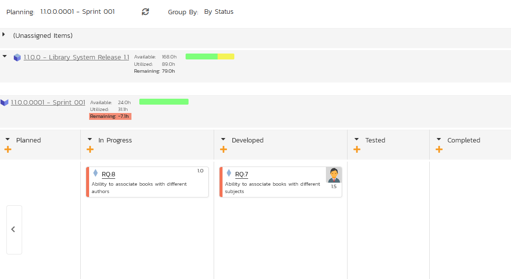
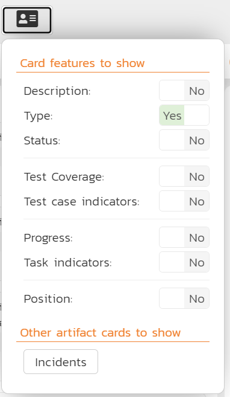
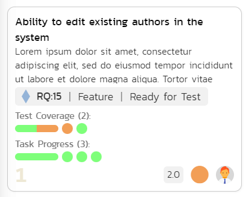
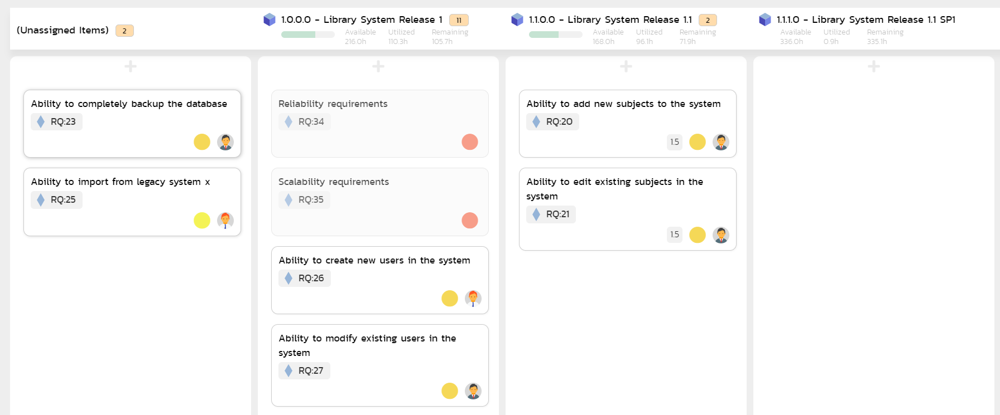
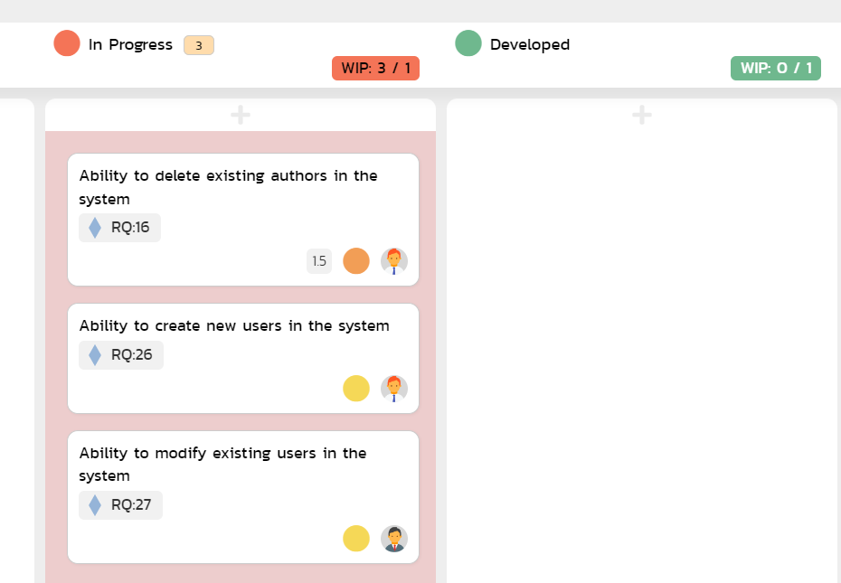

# Planning Board

The SpiraPlan planning board is a great way to visualize the backlog items (requirements, tasks, test cases and incidents) planned for your product. Based on the principles of **agile methodologies** such as Scrum and Kanban, the planning board is a great tool for planning agile products.

!!! info "Planning Boards and Editing"
    **Moving cards**: Please note that the purpose of a planning board or Kanban board, is to make it straightforward for users to move cards around the interface to plan out their work. Therefore we do **not** enforce workflow restrictions on the planning board when moving cards. Therefore only users with permissions to bulk edit the relevant artifact can move cards. If the template admin has prevented status changes while bulk editing, then noone can change a card's status by moving its card on the planning.

    **Viewing cards**: to view more information about the card you can: turn on Detailed View; hover on the card name to see a rich tooltip; click on the card's id to open a popup with much more detail; or ctrl/cmd+click on the card's id to open the full details page for that artifact. Information shown in the popup includes all standard and custom fields with fields being shown or hidden based on the workflow step that applies to that specific card. Users who cannot bulk edit the artifact but who can add comments can add comments when viewing the card.

    **Editing cards**: users with bulk edit permissions can edit a planning board card at any time by clicking on the card's id (including adding a new comment). This opens a popup with full information about that card. At all times, which fields are shown, required, or hidden is based on the workflow step that applies to that specific card. To save any changes you must fill in all required fields. Please note: you cannot change the status in this edit mode, to do so open the artifact's detail page (you can do this from the popup by clicking the button next to the artifact's id at the top).
    
    **Add new cards**: if you are able to create the requirements then you will see plus (add) symbols in different locations on the board. Clicking any of these will open an popup screen with all relevant fields available. Some of these fields may be prepopulated based on what add button you clicked and how you are using the board. For instance, if you are viewing for a release, that release will be preselected. And if you are grouping by person and click on a particular person, that person will be set as the owner of the artifact. The fields visible and required is driven based on what workflow step will apply to that new card.  

To access the SpiraPlan **product** planning board, select a product and go to Artifacts \> Planning Board and the following screen will be displayed:

By default, the system will display the product planning board in the product backlog view, with the backlog organized by component. You can change the view by click on the '**Planning'** drop down list:

-   **Product Backlog** -- This displays a list of all the backlog items that are not currently scheduled for a specific release or sprint. The items can be organized by component, parent requirement, priority, or person.
-   **All Releases** -- This displays a list of all the releases as well as the product backlog and is designed to let you easily move items from the product backlog to a specific release.
-   **Release View** -- This displays a list of all the backlog items that are scheduled for the selected release and lets you organize them by sprint, status, or person.
-   **Sprint View** - This displays a list of all the backlog items that are scheduled for the selected sprint (also known as a Sprint in some methodologies) and lets you organize them by status, or person.

The '**Group By'** dropdown list is used to change how the view is organized. This list of options available in the 'Group By' dropdown will depend on the view being displayed.

The planning board will include the following backlog items:

-   **Requirements and Incidents** -- these are displayed as 'story cards' and are the primary items that can be moved in the planning board.

-   **Tasks and Test Cases** -- these are secondary artifacts and are considered part of a requirement. So within the planning board they are displayed as being part of a specific requirement, and if you move a requirement, the associated tasks and test cases will move as well.

The backlog items themselves can be configured to display in different ways. The choice of display will depend on how many backlog items you have to display, how large your screen is and what information you need. The display is controlled by the four checkboxes at the top of the planning board:

-   **Standard View** -- This is the view that will be displayed when
'detailed view' is unchecked. It displays the minimum necessary information in each story card, but maximizes how many story cards can be displayed on the screen. Each story card will contain the icon, ID, name, user avatar, and estimate (in story points) of the requirement.

-   **Detailed View** -- This view includes additional information in each story card. It adds the long description, a progress bar indicator (that indicates what percentage of the item has been completed) and for requirement artifacts it includes the number of tasks (red background) and number of test cases (yellow background) in the two small boxes under the user.

Numerical rankings are also shown. The ranking numbers go from left to right and top to bottom. They indicate the relative ordering and priority of the various story cards and defects.

-   **Incidents** -- The planning board will always include requirement backlog items, but because the number of incidents can be very large, there is the option to include/exclude them from the planning board. When you have the "Incidents" checkbox selected, incidents will appear in the planning board with their own story card format. The main difference is that the effort is recorded in hours rather than story points:

-   **Tasks** -- When the Tasks option is selected, the planning board will display the tasks associated with the requirements as part of each story card. Each task will be displayed with its ID and a miniature progress bar:

-   **Test Cases** -- When the Test Cases option is selected, the planning board will display the test cases associated with the requirements as part of each story card. Each test case will be displayed with its ID and a miniature test coverage bar-chart:

Regardless of the view, backlog items can be moved using "drag and drop" between the different parts of the planning board. To drag and drop multiple items, you should first select the items so that they are highlighted. Then you can drag and drop the entire selection:

You can add new requirement backlog items by clicking the "***+***" button. This will display the following dialog box:

On this screen you can enter the fields for a new requirement, click "***Add Requirement***" and the requirement will be added to the appropriate section of the planning board.

In some of the views of the planning board there will be more data that can be displayed on one screen, in which case you will be able to scroll the planning board left and right using the specially provided arrow buttons.

Each of the views is now described in more detail in the sections below.

!!! question "What statuses show when grouping by status?"
    When you group by statuses, the statuses you see will change based on what you are looking at. Specifically, the statuses you see when on the product backlog view are different than those you see when looking at the "All Releases" view, or a single release or sprint.

    The statuses shown are based on the template's workflows.

    - Product backlog: the default status ("Requested") is always shown. The statuses of "Under Review", "Rejected", and "Accepted" are shown - as long as the status has a transition to another status *and* if another status has a transition to it. For example, if "Under Review" can transition to "Rejected" but "Rejected" has no transitions at all, it will not be visible in this view 
    - All releases / a release or sprint: here you are shown all statuses *not* shown on the product backlog view that transition to another status *and* are transitioned to from another status has a transition to it. For example, "Under Review" will never be shown, but "Developed" will be shown if you can transition to it (e.g. from "In Progress") and you can transition from it (e.g. to "Tested")
 

## Product Backlog Planning

The product backlog view is designed to let you view the backlog items that have been created for the product and have not yet been assigned to a specific release or sprint. The backlog items can be requirements or incidents, and in the case of requirements, you can see the tasks and test cases associated with a specific requirement.

In this view you can drag and drop the backlog items from one section (e.g. component) to another and also rearrange the backlog items in their relative order. By default, the items are sorted according to their priority/importance value (the color of which is indicated in the left-hand side of the story card), but you can drag and drop them into a different order. This is particularly useful when you have several items of the same priority and you need to rank them. This process is typically called **backlog grooming**.

### Product Backlog -- By Component

This view is designed to let you see the product backlog organized by Component. Each of the components is displayed on the left-hand side and the backlog items displayed in the same row on the right. The backlog items can be requirements (with associated tasks and test cases) or incidents.

The top section will contain the list of items that are not assigned to a component, with the other sections containing the items that belong to the specific component.

### Product Backlog -- By Parent

This view is designed to let you see the product backlog organized by parent requirements (those with at least one child requirement). Each of the parents is displayed on the left-hand side in a hierarchical structure, and the backlog items displayed in the same row on the right. The backlog items can be child requirements (with associated tasks and test cases) or incidents. In this view the incidents are the ones linked to the parent requirement through an association.

The top section will contain the list of items that are not assigned to a parent requirement, with the other sections containing the items that are children of the specific parent.

### Product Backlog -- By Priority

This view is designed to let you see the product backlog organized by requirement importance. Each of the possible importance values is displayed on the left-hand side and the backlog items displayed in the same row on the right. The backlog items in this view will only be requirements (with associated tasks and test cases).

The top section will contain the list of items that are not assigned a priority, with the other sections containing the items that have been assigned to the specific priority.

### Product Backlog -- By Status

This view is designed to let you see the product backlog organized by requirement status. Each of the possible status values (for an unscheduled item) is displayed as a heading, with the backlog items displayed in the same column underneath. The backlog items in this view will only be requirements (with associated tasks and test cases). This view is commonly called a **Kanban** board:

Each of the vertical sections is one of the requirements' statuses, in order of the requirement lifecycle (Requested \> Accepted). Once a requirement is assigned to a release or sprint it will come automatically 'Planned' and not appear in this view. You can drag and drop the requirements between the different statuses.

## Release Planning

The 'All Releases' option lets you view all of the backlog items that have already been assigned to a release - and are therefore not in the product backlog. The backlog items can be requirements or incidents, and in the case of requirements, you can see the tasks and test cases associated with a specific requirement.

The lower section of the board allows you to view the items by either by release, priority, status, or person. Each section below will discuss each option in turn.

### Release Planning -- By Component
This view is designed to let you see items across all releases organized by Component. Each of the components is displayed on the left-hand side and the backlog items displayed in the same row on the right. The backlog items can be requirements (with associated tasks and test cases) or incidents.

The top section will contain the list of items that are not assigned to a component, with the other sections containing the items that belong to the specific component.

### Release Planning -- By Parent

This view is designed to let you see items across all releases organized by parent requirement. Each of the parents is displayed on the left-hand side in a hierarchical structure, and the items are displayed in the same row on the right. The items can be child requirements (with associated tasks and test cases) or incidents. In this view the incidents are the ones linked to the parent requirement through an association.

The top section will contain the list of items that are not assigned to a parent requirement, with the other sections containing the items that are children of the specific parent.

### Release Planning -- By Priority
This view is designed to let you see the list of items across all releases, organized by requirement importance. Each of the possible importance values is displayed on the left-hand side and the items displayed in the same row on the right. The items in this view will only be requirements (with associated tasks and test cases).

The top section will contain the list of items that are not assigned a priority, with the other sections containing the items that have been assigned to the specific priority.

### Release Planning -- By Release
This release planning view is designed to let you view the items across all releases that have been created for the product and associate them with different releases defined for the product

The 'Unassigned Items' section at the top allows you to see all the items not currently planned, and you can then drag and drop them into one of the lower sections that correspond to a specific release. Using the scroll arrows you can cycle through the releases and move any items from one release to another.

The header of each release section shows the overall progress and utilization of the release:

Clicking on the Release hyperlink will switch the planning board into the [Release Backlog](#release-backlog-planning) view described below.

### Release Planning -- By Status
This view is designed to let you see the product planned items organized by requirement status. Each of the possible status values (for a planned item) is displayed as a heading, with the items displayed in the same column underneath. The items in this view will only be requirements (with associated tasks and test cases). This view is commonly called a **Kanban** board:

Each of the vertical sections is one of the requirements' statuses, in order of the requirement lifecycle (Planned \> Completed). You can click on the expand/collapse icons to hide any statuses that are not used. You can drag and drop the requirements between the different statuses. If you have the planning options enabled to have requirements status'
automatically update based on changes to the associated tasks and test cases, then items will automatically move between the statuses based on tasks being completed and test cases being executed.

### Release Planning -- By Person
This view is designed to let you see the product planned items organized by resource / person. Each of the users that is a member of the current release is displayed as a heading, with the items displayed in the same column underneath. The items in this view can be either requirements (with associated tasks and test cases) or incidents.

You can click on the expand/collapse icons to hide any resources that are not relevant. Above the resource headings there is a section with the release name; that contains items that are scheduled for the current release but have not yet been assigned to a resource. You can drag and drop the items between resources (as long as the item has a status that let's you set or edit its owner field). Or you can move them to/from the release backlog. Any items not assigned to a resource and release will be listed in the (Unassigned Items) section at the top.

## Release Backlog Planning

The release backlog view is designed to let you view the backlog items that have been assigned to the selected release. You can always see the items not currently assigned to any release by expanding the 'Unassigned Items' section and then drag those items into the current release.

The lower section of the board allows you to segment the items by either iteration/sprint (typically used in **Scrum**), by status (typically used in **Kanban**), or by person.

### Release Backlog -- By Component
This view is designed to let you see the release backlog organized by Component. Each of the components is displayed on the left-hand side and the backlog items displayed in the same row on the right. The backlog items can be requirements (with associated tasks and test cases) or incidents.

The top section will contain the list of items that are not assigned to a component, with the other sections containing the items that belong to the specific component.

### Release Backlog -- By Parent

This view is designed to let you see the release backlog organized by parent requirement. Each of the parents is displayed on the left-hand side in a hierarchical structure, and the items are displayed in the same row on the right. The items can be child requirements (with associated tasks and test cases) or incidents. In this view the incidents are the ones linked to the parent requirement through an association.

The top section will contain the list of items that are not assigned to a parent requirement, with the other sections containing the items that are children of the specific parent.

### Release Backlog -- By Priority

This view is designed to let you see the list of planned backlog items in the current release, organized by requirement importance. Each of the possible importance values is displayed on the left-hand side and the backlog items displayed in the same row on the right. The backlog items in this view will only be requirements (with associated tasks and test cases).

The top section will contain the list of items that are not assigned a priority, with the other sections containing the items that have been assigned to the specific priority.

### Release Backlog -- By Sprint

This view is designed to let you see the release backlog organized by iteration / sprint. Each of the sprints defined for the current release is displayed as a heading, with the backlog items displayed in the same column underneath. The backlog items in this view can be either requirements (with associated tasks and test cases) or incidents. This view is commonly called a **Scrum** board:

You can drag and drop the requirements between the different sprints. If you schedule a requirement for a specific sprint, all the child tasks that have not yet been started, will follow the parent requirement in being associated with the sprint. Once the backlog item has been added to the sprint, the utilized effort for the sprint will increase, and the remaining effort will decrease by the same amount.

Note: The system will allow you to assign more backlog items to an sprint than it is possible to complete, however this will result in a negative value for 'remaining effort'. If this happens, the "Remaining" value will be displayed in red - as will the sprint header area and the cards column. This alerts you that you need to rebalance the items, extend the sprint length, or add product personnel resources to the sprint.

Clicking on the Sprint hyperlinks in the headers will switch the planning board into the [Sprint Backlog](#sprint-backlog-planning) view described below.

### Release Backlog -- By Status

This view is designed to let you see the release backlog organized by requirement status. Each of the possible status values (for a planned item) is displayed as a heading, with the backlog items displayed in the same column underneath. The backlog items in this view will only be requirements (with associated tasks and test cases). This view is commonly called a **Kanban** board:

Each of the vertical sections is one of the requirements' statuses, in order of the requirement lifecycle (Planned \> Completed). You can click on the expand/collapse icons to hide any statuses that are not used. You can drag and drop the requirements between the different statuses. If you have the planning options enabled to have requirements status'
automatically update based on changes to the associated tasks and test cases, then items will automatically move between the statuses based on tasks being completed and test cases being executed.

### Release Backlog -- By Person

This view is designed to let you see the release backlog organized by resource / person. Each of the users that is a member of the current release is displayed as a heading, with the backlog items displayed in the same column underneath. The backlog items in this view can be either requirements (with associated tasks and test cases) or incidents.

You can click on the expand/collapse icons to hide any resources that are not relevant. The system will display a progress bar for each resource to illustrate the allocation for that resource. Any resource that has a progress bar that is completely green has been fully scheduled and should not have any additional items assigned. If the progress bar for that resource turns red, it means that they have been over-scheduled and you need to reassign some of the items.

Above the resource headings there is a section with the release name; that contains backlog items that are scheduled for the current release but have not yet been assigned to a resource (as long as the item has a status that let's you set or edit its owner field). You can drag and drop the backlog items between resources or to/from the release backlog. Any backlog items not assigned to a resource and release will be listed in the (Unassigned Items) section at the top.

## Sprint Backlog Planning

The sprint backlog view is designed to let you view the backlog items that have been assigned to the selected iteration / sprint. You can always see the items not currently assigned to any release or sprint by expanding the 'Unassigned Items' section and then drag those items into the current release or sprint.

The lower section of the board allows you to segment the items by either status (typically used in **Kanban**), or by person. You can also view the Task artifacts by person or status for the current sprint.

### Sprint Backlog -- By Component
This view is designed to let you see the sprint backlog organized by Component. Each of the components is displayed on the left-hand side and the backlog items displayed in the same row on the right. The backlog items can be requirements (with associated tasks and test cases) or incidents.

The top section will contain the list of items that are not assigned to a component, with the other sections containing the items that belong to the specific component.

### Sprint Backlog -- By Parent

This view is designed to let you see the sprint backlog organized by parent requirement. Each of the parents are displayed on the left-hand side in a hierarchical structure, and the items are displayed in the same row on the right. The items can be child requirements (with associated tasks and test cases) or incidents. In this view the incidents are the ones linked to the parent requirement through an association.

The top section will contain the list of items that are not assigned to a parent requirement, with the other sections containing the items that are children of the specific parent.

### Sprint Backlog -- By Priority
This view is designed to let you see the list of planned backlog items in the current sprint, organized by requirement importance. Each of the possible importance values is displayed on the left-hand side and the backlog items displayed in the same row on the right. The backlog items in this view will only be requirements (with associated tasks and test cases).

The top section will contain the list of items that are not assigned a priority, with the other sections containing the items that have been assigned to the specific priority.

### Sprint Backlog -- By Status
This view is designed to let you see the sprint plan organized by requirement status. Each of the possible status values (for a planned item) is displayed as a heading, with the backlog items displayed in the same column underneath. The backlog items in this view will only be requirements (with associated tasks and test cases).

Each of the vertical sections is one of the requirements' statuses, in order of the requirement lifecycle (Planned \> Completed). You can drag and drop the requirements between the different statuses. If you have the planning options enabled to have requirements status' automatically update based on changes to the associated tasks and test cases, then items will automatically move between the statuses based on tasks being completed and test cases being executed.

### Sprint Backlog -- By Person
This view is designed to let you see the sprint plan organized by resource / person. Each of the users that is a member of the current sprint is displayed as a heading, with the backlog items displayed in the same column underneath. The backlog items in this view can be either requirements (with associated tasks and test cases) or incidents.

You can click on the expand/collapse icons to hide any resources that are not relevant. The system will display a progress bar for each resource to illustrate the allocation for that resource. Any resource that has a progress bar that is completely green has been fully scheduled and should not have any additional items assigned. If the progress bar for that resource turns red, it means that they have been over-scheduled and you need to reassign some of the items.

Above the resource headings there are sections with the release and sprint name; they contain backlog items that are scheduled for the current release or sprint but have not yet been assigned to a resource. You can drag and drop the backlog items between resources or to/from the release/sprint backlog (as long as the item has a status that let's you set or edit its owner field). Any backlog items not assigned to a resource and release/sprint will be listed in the (Unassigned Items) section at the top.

## Work In Progress Limits
If the product is using [Work in Progress (WIP) limits set](../../Spira-Administration-Guide/Product-Planning/#kanban-work-in-progress-limits), they will be shown in a little pill shaped badge on each relevant status, along with the number of requirement cards in that status for that release/sprint.

- A status with "space" in it - one where the WIP limit has not been exceeded yet - will be shown in green
- Any status that has exceeded its WIP limit will be shown in red. You can still move cards into this status: the color is there as an indicator only.

Read more about [how to set up and use WIP limits](../../Spira-Administration-Guide/Product-Planning/#kanban-work-in-progress-limits).

## Beta planning board
!!! info "In beta, available in SpiraTeam and SpiraPlan"
    System admins [can enable](../../Spira-Administration-Guide/System/#general-settings) beta functionality across the application for their users from the System Admin > General Settings page.

To learn more about how the planning board is structured or how to enter the beta please refer to our [general information about the beta boards](../Application-Wide/#beta-boards).

### Views summary
Details about what combinations of views is possible and how each feature works is discussed in detail the sections below. For ease of reference, here is a summary of the different options available (you cannot select the same value for multiple view options at the same time):

| View options | Product Backlog                  | Release Backlog                             | Sprint Backlog                              |
| ------------ | -------------------------------- | ------------------------------------------- | ------------------------------------------- |
| **Releases** | Not Available                    | Open releases (excluding sprints)           | Open sprints  Open parents              |
| **Grouping** | Component  Priority           | Component  Priority  Release  Team | Component  Priority  Sprint  Team  |
| **Columns**  | Priority  Status              | Priority  Person  Status              | Priority  Person  Status              |
| **Rows**     | Component  Parent Requirement | Component  Person  Parent Requirement | Component  Person  Parent Requirement |

### View controls - Planning
The planning board has three different planning options. They impact what options are available in the other toolbar controls, and how the boards display:

- **Product backlog**: lets managers prioritize ("groom") unplanned work items that do not have a scheduled release. This view displays all unplanned items so the manager can prioritize work before assigning to a specific release or sprint. This is often called "backlog grooming" but is essentially prioritizing and categorizing unplanned work
- **Release backlog**: lets managers review planned or in progress work items. This view displays all the planned items (based on status) so that the project manager can:

    - assign work to a release
    - move work between releases
    - move planned items around ignoring releases

- **Sprint backlog**: lets managers review work in a release and its sprint, or for a single sprint. This view displays all the planned items in a release and its sprints so that the product owner or manager can:

    - assign work between sprints in a release
    - focus on a single sprint (if desired)

### View controls - Releases
The release selector is only visible when the planning dropdown is set to either the release backlog or the sprint backlog. 

**When viewing the release backlog** the dropdown will show:

- "all releases": displays items planned for any release
- any release with an "open" status (a status of planned, in progress, or completed) that is not a sprint: displays items planned for the selected release and its child sprints

**When viewing the sprint backlog** the dropdown will show:

- any release with an "open" status: displays items planned for the selected release and its child sprints
- child sprints (that are also "open") and any "open" parents: displays items planned for the selected sprint

### Grouping
Read about this [here](../Application-Wide/#board-grouping).

### Columns
Read about this [here](../Application-Wide/#board-columns).

!!! info "What statuses show"
    What statuses shown on the board depends on how the [template](../../Spira-Administration-Guide/Template-Requirements/#statuses) has been configured. In short:
        
    - if the template does not have requirement statuses customized for the boards, then all statuses with a transition to and from them will show in the order they appear on the workflow admin screens
    - if the template has customized requirement statuses for boards, then statuses chosen to be shown will show, in the order specified in the template.

### Rows
Read about this [here](../Application-Wide/#board-rows).

### Customizing the cards
You can customize what information is shown on each card. For each artifact the following fields are always shown:

- **Name** (click to open a popup with full details, or alt-click to open the details page for that item)
- **Artifact icon**: shown beneath the name in a gray bubble
- **ID token** of the artifact: shown to the right of the artifact icon
- **Story points** (if set): shown to the bottom right of the card (hover to see full information about the estimate and effort fields) 
- **Priority** (if set): shown to the bottom right of the card in a circle the color of the priority
- **Owner** (if set): shown at the bottom right of the card in a circle with the avatar or initials of the person (hover on this to see their full name)

You can toggle whether to show each of the following features:

- **Description**: this will show a snippet of the full artifact description below the artifact name
- **Type**: the artifact type, shown to the right of the ID token
- **Status**: the artifact statuses, shown to the right of the ID token and the type
- **Test coverage**: a mini histogram chart of the requirement's test coverage, shown in the test coverage mini section on the card (hover to see a tooltip with detailed information)
- **Test case indicators**: each test case covering the requirement is shown as a little circle, shaded based on its current execution status, in the test coverage mini section on the card (hover to see a tooltip with information about the test case, and click to open details about that test case)
- **Task progress**: a mini histogram chart of the requirement's task progress, shown in the task progress mini section on the card (hover to see a tooltip with detailed information)
- **Task indicators**: each child task of the the requirement is shown as a little circle, shaded based on its current progress, in the task progress mini section on the card (hover to see a tooltip with information about the task, and click to open details about that test case)
- **Position**: this shows a number in the bottom left of the card that represents the position of that card within the cell. For example, the topmost card will have position 1, and the card beneath it 2.

Note that the test coverage mini section shows the number of test cases covering the requirement in parentheses after its title. The task progress mini section shows the number of the requirement's child tasks in parentheses after its title.

Here's a typical card with all of the features described above turned off.

In the example below, is a card with all of the features described above turned on.

Finally, you can, based on your view, toggle other artifact cards to show. When this option is available you can toggle relevant artifact cards (eg Incidents) on or off. See below to learn [what cards and card artifact show when](#what-cards-show-when).

### What cards show when
Read about this [here](../Application-Wide/#board-what-cards-show-when). In addition to the rules explained there, the following rules apply to how incident card display on the planning board:

- incidents do not show at all if columns is set to status (because incidents and requirements have completely different statuses)
- incidents do not show at all if rows are set to parent (because incidents do not have parent requirements)
- incidents show when column or group is priority, but only if there is match (see below for further information)

??? info "Incidents and priority matching"
    Incidents have a priority field, which is different to the requirement importance field. These two fields are customized independently by template administrators.

    However on the planning board, when organizing by priority, you may see both requirement cards *and* incident cards (if set to show). This is because the system automatically matches up incident priority and requirement importance. It does based on their names. If a requirement importance has an exactly matching incident priority (case sensitive), then any incidents with that priority will show in that "priority" column on the planning board. You can move incident cards between priorities and as long as there is match, the incident priority will be updated.

#### What cards show when viewing the product backlog
The following cards will show in this view (in combination with the relevant principles described above):

- requirements with no release
- incidents with no planned release

#### What cards show when viewing the release backlog
The following rules apply to what cards will show (note that more than one of these rules may apply at once):

| View selected                                             | Requirements shown                                          | Incidents shown                                    |
| --------------------------------------------------------- | ----------------------------------------------------------- | -------------------------------------------------- |
| **Release is all releases** (Group by is not release)     | all requirements with a release set                         | incidents with a planned release                   |
| **Release is a single release** (Group by is not release) | requirements with that release, or any of its child sprints | incidents with that release as its planned release |
| **Group is release** (Groups that are for a release)      | requirements with that release, or any of its child sprints | incidents with that release as its planned release |
| **Group is release** (in the "unassigned" group)          | requirements with no release                                | incidents with no planned release                  |

#### What cards show when viewing the sprint backlog
The following rules apply to what cards will show (note that more than one of these rules may apply at once):

| View selected                                                 | Requirements shown                                          | Incidents shown                                              |
| ------------------------------------------------------------- | ----------------------------------------------------------- | ------------------------------------------------------------ |
| **Release is a single release** (Group by is not release)     | requirements with that release, or any of its child sprints | incidents with that release as its planned release           |
| **Release is a single sprint** (Group by is not release)      | requirements with that sprint                               | incidents with that sprint as its planned release            |
| **Group is sprint** (Groups that are for a sprint or release) | requirements with that specific sprint or release           | incidents with that sprint or release as its planned release |
| **Group is sprint** (in the "unassigned" group)               | requirements with no release                                | incidents with no planned release                            |

### Moving and ordering cards
Read about this [here](../Application-Wide/#board-moving-and-ordering-cards).

### Viewing by release or sprint
Read about this [here](../Application-Wide/#board-viewing-by-release-or-sprint).

### Viewing by Person
Read about this [here](../Application-Wide/#board-viewing-by-person).

### Status and Work in Progress Limits
When viewing by status and either grouping by releases/sprints or displaying for a release/sprint, extra information may show on each status column. If the product is using [Work in Progress (WIP) limits set](../../Spira-Administration-Guide/Product-Planning/#kanban-work-in-progress-limits), the relevant limit for each status will show in a little pill shaped badge in the header for that status, along with the number of requirement cards in that status for that release/sprint. For example, if the limit is 3 and there are 2 cards then the pill will read "2/3" - 2 of 3 requirements.

There are different colors to indicate the status of the WIP limit:

- **No badge**: no WIP limits have been defined for that status and release type (release vs sprint), or the current view does not support WIP limits
- **Green**: there is "space" in the status (the WIP limit has not been exceeded yet)
- **Red**: there are too many cards in this status (the WIP limit has been exceeded). In this case the cell will be shaded a pale red. Note that even in this status, you can still move cards into this status - the color is an indicator only.

Read more about [how to set up and use WIP limits](../../Spira-Administration-Guide/Product-Planning/#kanban-work-in-progress-limits).

### Editing and viewing cards
Read about this [here](../Application-Wide/#board-editing-and-viewing-cards).

### Example use cases
#### Scrum Projects
For Scrum projects, the boards support the most important agile ceremonies and planning activities. For example, you can show all the unplanned items in the product backlog for backlog grooming. In this example we are displaying user stories by parent (or epic) as rows, grouped by component and categorized into columns by priority.

**Release planning**: for a typical release planning section, you can use the following release backlog view. In this example, we are displaying all the releases, with the ability to take items from the product backlog (at the top) and assign them to a specific release.

**Sprint planning**: for a sprint planning session, the following view will let you assign work to each sprint from the release backlog:

Finally, you can drill down to look at an individual sprint and see the team's progress. This is useful for daily standup meetings:

#### Kanban Projects
For Kanban projects, in addition to the functionality described above, you have the ability to see the different releases by status, with the [Work In Progress Limits](#status-and-work-in-progress-limits) clearly visible in each of the swim-lanes. In this example, we are showing the release backlog for a specific release, with the columns set to display by status and the planning options set to include WIP limits for the In-Progress and Developed columns.

