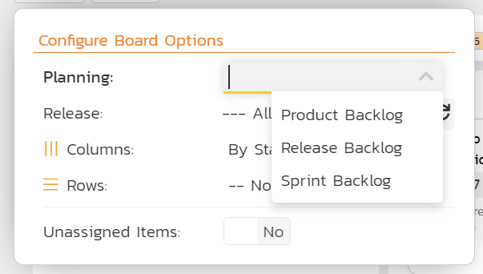
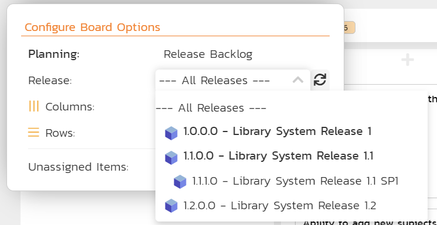

# Planning Board

!!! info "Planning Board Overview"
    
    The SpiraPlan planning board is a streamlined and highly customizable "kanban" style board. It lets you visualize backlog requirements and incidents in a single place across a product. Based on the principles of **agile methodologies** such as Scrum and Kanban, the planning board is a great tool for planning and managing agile products.

    To learn more about how boards in Spira are structured and their general features refer to our [board overview](Application-Wide.md/#boards). Here you can learn about:

    - [board structure and configuration](Application-Wide.md/#board-structure)
    - [special board views](Application-Wide.md/#special-board-views) 
    - [working with board cards](Application-Wide.md/#board-cards) 

    **Specific features of or differences in the Planning Board are discussed more fully below**.

## Board configuration
The Planning Board configuration button has a full set of options to configure the board to your needs. The first of these is the "Planning" dropdown that lets you toggle between the "Product Backlog", "Release Backlog", and "Sprint Backlog". Configuration options change depending on the "Planning" option selected. The table below shows what options are available, when. Certain configuration are discussed in more detail in subsequent sections:

| View options | Product Backlog                            | Release Backlog                                                                                         | Sprint Backlog                                                              |
| ------------ | ------------------------------------------ | ------------------------------------------------------------------------------------------------------- | --------------------------------------------------------------------------- |
| **Releases** | Not Available                              | All releases  Open releases (excluding sprints)                                                      | Open sprints  Open parent releases                                       |
| **Columns**  | Priority  Status  Type  Component | Priority  Status  Type  Component  Parent (if a release is selected)  Person  Release | Priority  Status  Type  Component  Parent  Person  Sprint |
| **Rows**     | Priority  Status  Type  Component | Priority  Status  Type  Component  Parent (if a release is selected)  Person  Release | Priority  Status  Type  Component  Parent  Person  Sprint |
| **Grouping** | Not Available                              | Component (if rows is Parent)  Team (if rows is Person)                                              | Component (if rows is Parent)  Team (if rows is Person)                  |

The following options support showing unassigned items[^unassigned-with-group]:

- priority
- parent
- component
- release (only when viewing "All Releases")
- person

[^unassigned-with-group]: when rows is set to either person or parent, and grouping is applied, then unassigned sections will show as normal, but the feature is more limited than usual to ensure consistency.

### Planning options
The planning board has three different planning options. They impact what options are available in the other toolbar controls, and how the boards display:

- **Product backlog**: lets managers prioritize ("groom") unplanned work items that do not have a scheduled release. This view displays all unplanned items so the manager can prioritize work before assigning to a specific release or sprint. This is often called "backlog grooming" but is essentially prioritizing and categorizing unplanned work
- **Release backlog**: lets managers review planned or in progress work items. This view displays all the planned items so that the project manager can, for example:

    - assign work to a release
    - move work between releases
    - move planned items around ignoring releases

- **Sprint backlog**: lets managers review work in a release and its sprint, or for a single sprint. This view displays all the planned items in a release and its sprints so that the product owner or manager can, for example:

    - assign work between sprints in a release
    - focus on a single sprint (if desired)

### Release options
The release selector is only visible when the planning dropdown is set to either "Release Backlog" or "Sprint Backlog". 

**When viewing the release backlog** the dropdown will show:

| Options                                    | Meaning                                                                 | What cards will show                                         |
| ------------------------------------------ | ----------------------------------------------------------------------- | ------------------------------------------------------------ |
| All Releases                               | All open[^open-release-definition] releases combined                    | Those planned for any open release                           |
| Any open[^open-release-definition] release | Any single open[^open-release-definition] releases that is not a sprint | Those planned for the selected release and its child sprints |

**When viewing the sprint backlog** the dropdown will show:

| Options                                    | Meaning                                       | What cards will show                                         |
| ------------------------------------------ | --------------------------------------------- | ------------------------------------------------------------ |
| Any open[^open-release-definition] release | Any single open release that has child sprint | Those planned for the selected release and its child sprints |
| Any open child sprint                      | Any single open sprint                        | Those planned for the selected sprint                        |

[^open-release-definition]: any release with a status of planned, in progress, or completed

### Customizing cards

In addition to the standard [board card options](Application-Wide.md/#board-card-options), you can toggle whether to show each of the following features:

- **Test coverage**: a mini histogram chart of the requirement's test coverage, shown in the test coverage mini section on the card (hover to see a tooltip with detailed information)
- **Test case indicators**: each test case covering the requirement is shown as a little circle, shaded based on its current execution status, in the test coverage mini section on the card (hover to see a tooltip with information about the test case, and click to open details about that test case)
- **Task progress**: a mini histogram chart of the requirement's task progress, shown in the task progress mini section on the card (hover to see a tooltip with detailed information)
- **Task indicators**: each child task of the the requirement is shown as a little circle, shaded based on its current progress, in the task progress mini section on the card (hover to see a tooltip with information about the task, and click to open details about that task)

Turning on either of the test options will show a test coverage mini section, with the number of test cases covering the requirement in parentheses after the title. In the same way, turning on either of the task options will show a task progress mini section, with the number of the requirement's child tasks in parentheses after the title.

Here's a typical minimal card with all of the features turned off.

In the example below, is a card with all of the features above turned on.

Finally, you can, based on your view, toggle other artifact cards to show. When this option is available you can toggle relevant artifact cards (eg Incidents) on or off. See below to learn [what cards and card artifact show when](#board-cards).

## Special board views
[Certain board configurations](Application-Wide.md/#special-board-views) will provide additional information or will work in a specific way.

### Statuses
What statuses shown on the board depends on how the [template](../Spira-Administration-Guide/Template-Requirements.md/#statuses) has been configured. In short:
        
- if the template does not have requirement statuses customized for the boards, then all statuses with a transition to and from them will show in the order they appear on the workflow admin screens
- if the template has customized requirement statuses for boards, then statuses chosen to be shown will show, in the order specified in the template.

### Work in Progress Limits
When viewing by status and either grouping by releases/sprints or displaying for a release/sprint, extra information may show on each status column. If the "effort data" configuration is set to "Yes", and if the product is using [Work in Progress (WIP) limits set](../Spira-Administration-Guide/Product-Planning.md/#kanban-work-in-progress-limits), the relevant limit for each status will show in a little pill shaped badge in the header for that status, along with the number of requirement cards in that status for that release/sprint. For example, if the limit is 3 and there are 2 cards then the pill will read "2/3" - 2 of 3 requirements.

There are different colors to indicate the status of the WIP limit:

- **No badge**: no WIP limits have been defined for that status and release type (release vs sprint), or the current view does not support WIP limits
- **Green**: there is "space" in the status (the WIP limit has not been exceeded yet)
- **Red**: there are too many cards in this status (the WIP limit has been exceeded). In this case the cell will be shaded a pale red. Note that even in this status, you can still move cards into this status - the color is an indicator only.

Read more about [how to set up and use WIP limits](../Spira-Administration-Guide/Product-Planning.md/#kanban-work-in-progress-limits).

## Board cards
There are [general rules](Application-Wide.md/#what-cards-show-when) that apply to how what cards show when on the Planning Board. The Planning Board also has the following standard board features: 

- [Moving and ordering cards](Application-Wide.md/#moving-and-ordering-cards)
- [Editing, adding, and viewing cards](Application-Wide.md/#editing-and-viewing-cards)

In addition, the Planning Board has extra "rules" that control what cards will show:
    
**Requirements** follow the rules below:

- parent requirements are never shown
- requirements with a status of either rejected or obsolete will only show if you are on the "Product Backlog" and columns is set to status

**Incidents** follow the rules below:

- incidents do not show at all if columns or rows is set to status, type, or parent (because incidents and requirements have completely different statuses, types, and parents do not apply to incidents at all)
- incidents show when column or row is priority, but only if there is match (see below for further information)
- incidents show when the board is in any other configuration

??? info "Incidents and priority matching"
    Incidents have a priority field, which is different to the requirement importance field. These two fields are customized independently by template administrators.

    However on the planning board, when organizing by priority, you may see both requirement cards *and* incident cards (if set to show). This is because the system automatically matches up incident priority and requirement importance. It does based on their names. If a requirement importance has an exactly matching incident priority (case sensitive), then any incidents with that priority will show in that "priority" column on the planning board. You can move incident cards between priorities and as long as there is match, the incident priority will be updated.

### What cards show in the product backlog
The following cards will show in this view (in combination with the relevant principles described above):

- requirements with no release
- incidents with no planned release

### What cards show in the release backlog
In addition to [how releases show on the board](./Application-Wide.md/#board-by-release-or-sprint), the following rules apply to what cards will show:

| View selected                   | Requirements shown                                          | Incidents shown                                    |
| ------------------------------- | ----------------------------------------------------------- | -------------------------------------------------- |
| **Release is all releases**     | all requirements with a release set                         | incidents with a planned release                   |
| **Release is a single release** | requirements with that release, or any of its child sprints | incidents with that release as its planned release |

### What cards show in the sprint backlog
In addition to [how releases show on the board](Application-Wide.md/#board-by-release-or-sprint), the following rules apply to what cards will show:

| View selected                   | Requirements shown                                          | Incidents shown                                    |
| ------------------------------- | ----------------------------------------------------------- | -------------------------------------------------- |
| **Release is a single release** | requirements with that release, or any of its child sprints | incidents with that release as its planned release |
| **Release is a single sprint**  | requirements with that sprint                               | incidents with that sprint as its planned release  |

### What cards show grouping by component 
The following rules apply when rows is set to "By Parent" and also groups is set to "By Component":

- rows are shown in the component group for each parent that has that component set 
- cards show that have a parent, and that have the same component as their parent

## Example use cases
### Scrum Projects
For Scrum projects, the boards support the most important agile ceremonies and planning activities. For example, you can show all the unplanned items in the product backlog for backlog grooming. In this example we are displaying the "Product Backlog" with columns as priority.

**Release planning**: for a typical release planning section, you can use the following release backlog view. In this example, we are displaying the "Release Backlog" for all releases, with the ability to take items from the product backlog (the unassigned column on the left) and assign them to a specific release.

**Sprint planning**: for a sprint planning session, the following view will let you assign work to each sprint from the release backlog (the left column showing cards in the release but not yet in a specific sprint):

Finally, you can drill down to look at an individual sprint and see the team's progress (with columns as priority, rows as person, and grouped by team). This is useful for daily standup meetings:

### Kanban Projects
For Kanban projects, in addition to the functionality described above, you have the ability to see the different releases by status, with the [Work In Progress Limits](../Spira-Administration-Guide/Product-Planning.md/#kanban-work-in-progress-limits) clearly visible in each of the swim-lanes. In this example, we are showing the release backlog for a specific release, with the columns set to display by status and the planning options set to include WIP limits for the In-Progress and Developed columns.

