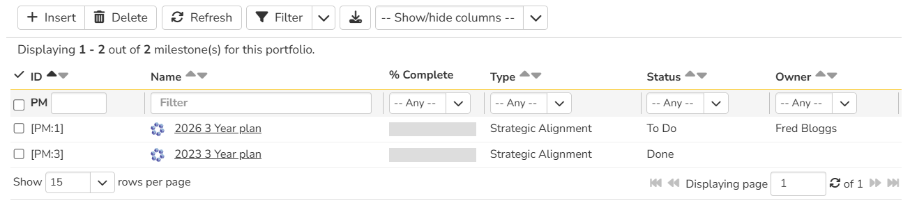
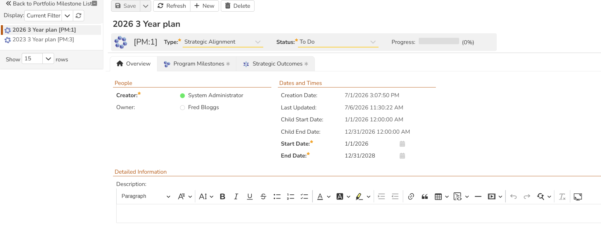
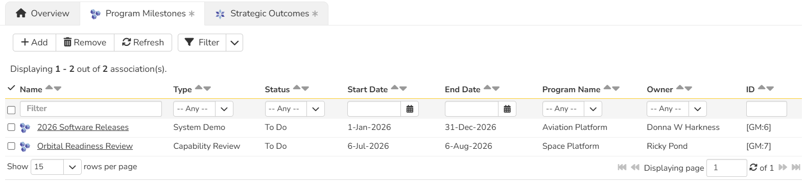
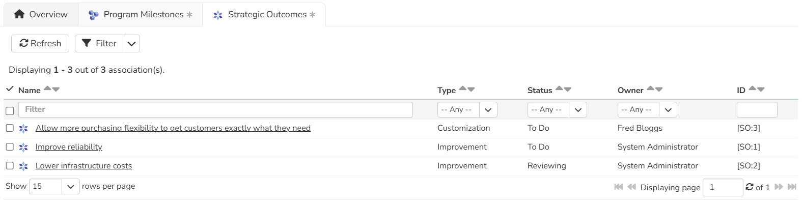

# Portfolio Milestones
!!! abstract "Available in SpiraPlan only"

Portfolio Milestones and [Strategic Outcomes](Portfolio-Strategic-Outcomes.md) give you powerful ways to manage delivery of features and program milestones across multiple programs at once - in other words at a portfolio level. Portfolio Milestones let you define cross-program, portfolio-level date goals / milestones (like program milestones). You can link portfolio milestones to program milestones to track their scheduling at a higher level. Portfolio Milestones also let you track strategic outcomes' delivery.

!!! question "Use cases for portfolio milestones"
    Portfolio Milestones can be used to track long term plans and reviews of cross-program functionality.
    Here are a few examples of how to use them.

    - You have an HR Portfolio for managing all the people-centric efforts in your organization. Create a portfolio milestone for the year to track key strategic outcomes across all your teams. 
    - You have a Core Products portfolio for the main software that your organization develops. Create a portfolio milestone to serve as a high-level review of all core products. Link it with integration program milestones and link those with releases to track cross-product feature rollouts across your portfolio.
    - After several meetings between customers and internal team leads, your executive team has decided on a 3-year plan with a mix of high-level goals, product integrations, and big feature rollouts. To track this efficiently, create a portfolio milestone with a high-level summary of the 3-year plan in the description. Then link it with new strategic outcomes for each of the high-level goals, and with new program milestones for the product integrations and feature rollouts.

## Start and End Dates
Portfolio Milestones have start and end dates. This lets you manually set the range when work for the portfolio milestone starts and ends. In addition, each portfolio milestone has a "Child Start Date" and a "Child End Date". These dates are set automatically based on all of the program milestones associated to the portfolio milestone:

- **Child Start Date**: is the earliest start date of any of the program milestones associated to the portfolio milestone
- **Child End Date**: is the latest end date of any of the program milestones associated to the portfolio milestone

!!! example "Examples"
    In this example, we have the following program milestones across a number of programs

    | Program milestone  | Start Date | End Date  |
    | -------- | ---------- | --------- |
    | Phase 1 | May 3rd    | May 20th  |
    | Phase 2 | May 15th   | June 2nd  |
    | Phase 3 | May 22nd   | June 5th  |
    | Phase 4 | May 1st    | June 10th |

    When we associate these to different portfolio milestones the child start and end dates get automatically set as follows:

    | Portfolio Milestone | Associated program milestones | Child start date | Child end date |
    | ----------------- | ------------------- | ---------------- | -------------- |
    | First             | Phase 1, Phase 2  | May 3rd          | June 2nd       |
    | Second            | Phase 1, Phase 4  | May 1st          | June 10th      |
    | Third             | Phase 2, Phase 3  | May 15th         | June 5th       |

## Milestone List
To access portfolio milestones, navigate to a portfolio and then open the artifact dropdown. Select "Portfolio Milestones". This will open the portfolio milestone list page. The list is a flat, sortable collection of the portfolio milestones.

### List page toolbar operations
You can carry out a number of useful operations with the toolbar:

- **New Milestone**: takes you to the new portfolio milestone details page, where you can enter its information and hit save to actually create the item
- **Delete**: deletes all currently selected portfolio milestones
- **Refresh**: this button will reload the portfolio milestone list (not the entire page)
- **Filter**: read about [how to create and manage filters](Application-Wide.md#filtering) - note that portfolio milestones do not support saving or sharing filters
- [download the list to a CSV file](Application-Wide.md/#download-as-csv)
- **Show / Hide Columns**: By default the following columns are shown: ID, name, progress, type, status, and owner. The columns dropdown lets you change the columns shown (for standard and custom properties). Toggle a column's visibility by clicking on it from the dropdown. The shown columns is saved for each user and for each program.

## Milestone Details
When you click on a portfolio milestone it will open its portfolio milestone details page:

This page is made up of *three* areas;

1.  the left pane displays the portfolio milestone list navigation
2.  the right pane's header: this displays the toolbar, the editable name of the portfolio milestone; and the info bar (with a shaded background)
3.  the right pane's tabbed interface with rich information related to the portfolio milestone (its Overview, Program Milestones, and Strategic Outcomes tabs are discussed below).

### Navigation pane
Please note that on smaller screen sizes the navigation pane is not displayed. While the navigation pane has a link to take you back to the list page, on mobile devices a 'back' button is shown on the left of the operations toolbar.

The navigation pane can be collapsed by clicking on the "-" button, or expanded by clicking anywhere on the gray title area. On desktops the user can also control the exact width of the navigation pane by dragging and dropping a red handle that appears on hovering at the rightmost edge of the navigation pane.

The navigation pane shows a list of portfolio milestones. This list is useful as a navigation shortcut - you can quickly view the peer portfolio milestones by clicking on the navigation links, without having to first return to the list page. The navigation list can be switched between two different modes:

-   The list of portfolio milestones matching the current filter
-   The list of all portfolio milestones, irrespective of the current filter

### Toolbar Operations
- **Save**: to save the current item

    - **Save > Save and Close** takes you back to the list page after the save is complete
    - **Save > Save and New** opens the new portfolio milestone details page after the save is complete

- **Refresh**: refreshes the name, info bar information, and overview tab for the item
- **New**: opens the new portfolio milestone details page, where you can enter its information and hit save to actually create the item

- **Delete**: deletes the current portfolio milestone

### Info bar
The info bar shows the following information for the portfolio milestone: name, icon, ID, type, status, and progress mini chart

### Progress
Portfolio milestones display an automatic progress bar calculated from their linked strategic outcomes. The progress percentage represents the proportion of linked strategic outcomes that have reached a closed status (Done or Rejected).

Progress updates in real time as strategic outcome statuses change. The progress value is visible as a column on the [milestone list page](#milestone-list) and as a mini chart in the info bar on the details page.

### Overview
The Overview tab is divided into a number of different sections. Each of these can be collapsed or expanded by clicking on the title of that section. Each section displays fields of a similar type. For instance, all fields regarding dates are grouped together in the "Dates and Times" area.

The bottom most section contains the long, formatted description. You can enter rich text or paste in from a word processing program or web page into this field. Note that you are not able to paste screenshots into this description box.

### Program milestone Associations
You can associate program milestones from any program inside the current portfolio to a portfolio milestone from this tab. Any program milestones linked to the portfolio milestone feed into the [child start and end dates](#start-and-end-dates) of the portfolio milestone. The associated program milestones show the following information: name, type, status, start date, end date, program name, owner, and ID. 

Read more about [how to manage and add associations to this artifact](Application-Wide.md#associations)

### Strategic Outcome Associations
When you create or edit strategic outcomes, you can optionally set their portfolio milestone. On this tab you can see all strategic outcomes currently linked to the portfolio milestone. The associated strategic outcomes show the following information: name, type, status, owner, and ID.

You can refresh the list of strategic outcomes, or filter the list.