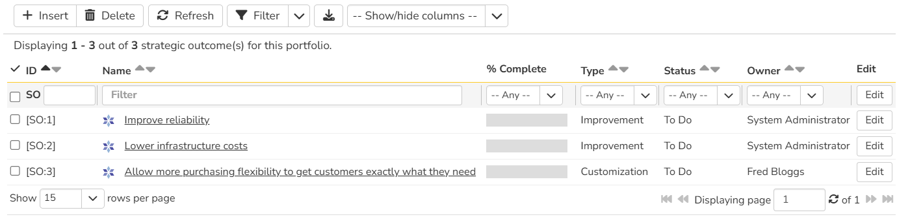
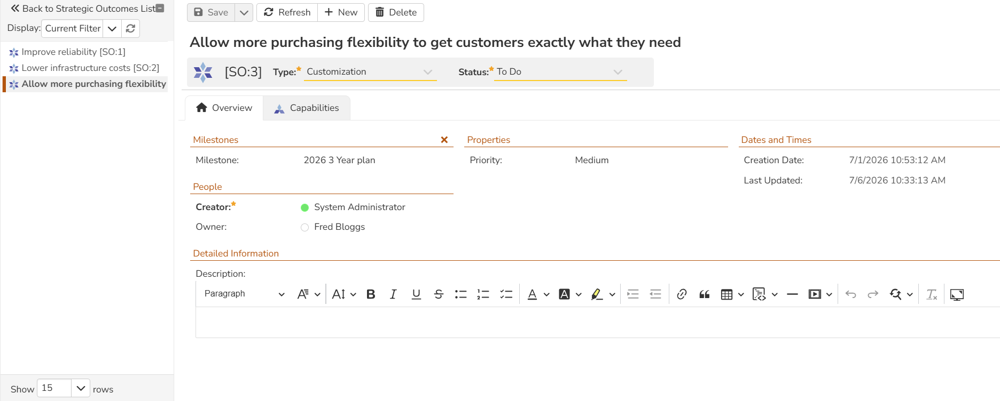
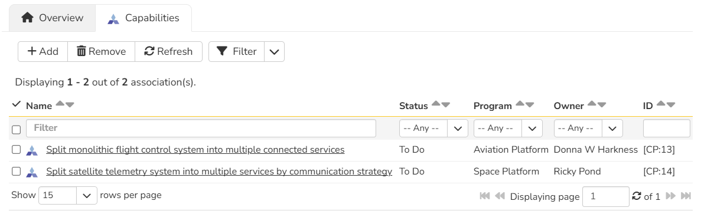

# Strategic Outcomes
!!! abstract "Available in SpiraPlan only"

Strategic Outcomes and [Portfolio Milestones](Portfolio-Milestones.md) give you powerful ways to track large scale efforts across all programs within a portfolio. 
You can link strategic outcomes to program capabilities to organize at a high level, and tag them with a portfolio milestone to manage their completion deadline.

If you are NOT a portfolio viewer, you can still see how your organization structures its portfolios, programs, and products from the workspace dropdown.

!!! question "Use cases for strategic outcomes"
    Strategic outcomes can be used to track big-picture goals across an entire portfolio.
    Here are a few examples for how to use them.

    - You have an HR Portfolio for managing all the people-centric efforts in your organization. Create strategic outcomes for upskilling your employees, or improving internal hiring efforts to reorganize teams with lower risk.
    - You have a Core Products portfolio for the main software that your organization develops. Create a strategic outcome for improving reliability across the board, or adopting generative AI to help users do more.
    - You have a 3-year plan in the form of a portfolio milestone, and you want to track efforts towards it all the way down to product requirements. Create strategic outcomes for the big-picture goals, and link them with program capabilities that define how your products could integrate or change to achieve those goals. Product teams should consider those capabilities in their backlog for long-term planning, and link relevant requirements to them as they are requested.

## Strategic Outcome List
To access strategic outcomes, navigate to a Portfolio and then open the artifact dropdown. Select "Strategic Outcomes". This will open the strategic outcome list page. You can sort the list by ascending or descending order of any field. You can apply filters for all fields to limit the strategic outcomes you see. At first, the list will be empty.

### List page toolbar operations
You can carry out a number of useful operations with the toolbar:

- **Insert**: create a new strategic outcome at the top of the list. The new strategic outcome is in "Edit" mode so you can set its name and other information. If any filters are in use, it will copy their values to the new artifact.
- **Delete**: deletes all currently selected strategic outcomes.
- **Refresh**: this button will reload the strategic outcomes list (not the entire page)
- **Filter**: read about [how to create and manage filters](Application-Wide.md#filtering) - note that strategic outcomes do not support saving or sharing filters

- [download the list to a CSV file](Application-Wide.md/#download-as-csv)
- **Show / Hide Columns**: By default the following columns are shown: ID, name, progress, type, status, and owner. The columns dropdown lets you change the columns shown. Toggle a column's visibility by clicking on it from the dropdown. The shown columns is saved by portfolio for each user.

## Strategic Outcomes Details
When you click on strategic outcome it will open its strategic outcome details page:

This page is made up of *three* areas;

1. the left pane displays the strategic outcome list navigation
2. the right pane's header: this displayes the toolbar, the editable name of the strategic outcome, and the info bar (with a shaded background)
3. the right pane's tabbed interface with rich information related to the strategic outcome (its Overview and Capabilities tabs are discussed below).

### Navigation pane
Please note that on smaller screen sizes the navigation pane is not displayed. While the navigation pane has a link to take you back to the list page, on mobile devices a 'back' button is shown on the left of the operations toolbar.

The navigation pane can be collapsed by clicking on the "-" button, or expanded by clicking anywhere on the gray title area. On desktops the user can also control the exact width of the navigation pane by dragging and dropping a red handle that appears on hovering at the rightmost edge of the navigation pane.

The navigation pane shows a list of strategic outcomes. This list is useful as a navigation shortcut - you can quickly view the peer strategic outcomes by clicking on the navigation links, without having to first return to the list page. The navigation list can be switched between two different modes:

-   The list of strategic outcomes matching the current filter
-   The list of all strategic outcomes, irrespective of the current filter

### Toolbar Operations
- **Save**: to save the current item

    - **Save > Save and Close** takes you back to the list page after the save is complete
    - **Save > Save and New** opens a new blank strategic outcome after the save is complete

- **Refresh**: refreshes the name, info bar information, and overview tab for the item
- **New**: adds a new strategic outcome with empty or default fields
- **Delete**: deletes the current strategic outcome

### Info bar
The info bar shows the following information for the strategic outcome: name, icon, ID, type, status, and progress mini chart

### Progress
Strategic outcomes display an automatic progress bar calculated from their linked program capabilities. The progress percentage represents the proportion of linked capabilities that have reached a closed status (Done or Rejected) out of all non-deleted linked capabilities. 

Progress updates in real time as capability statuses change. The progress value is visible as a column on the [strategic outcome list page](#strategic-outcome-list) and as a mini chart in the info bar on the details page.

### Overview
The Overview tab is divided into a number of different sections. Each of these can be collapsed or expanded by clicking on the title of that section. Each section displays fields of a similar type. For instance, all fields regarding dates are grouped together in the "Dates and Times" area.

The bottom most section contains the long, formatted description. You can enter rich text or paste in from a word processing program or web page into this field. Note that you are not able to paste screenshots into this description box.

### Capability Associations
You can associate capabilities from any program inside the current portfolio to a strategic outcome from this tab. The associated capabilities show the following information: name, status, program name, owner, and ID. 

Read more about [how to manage and add associations to this artifact](Application-Wide.md#associations)
