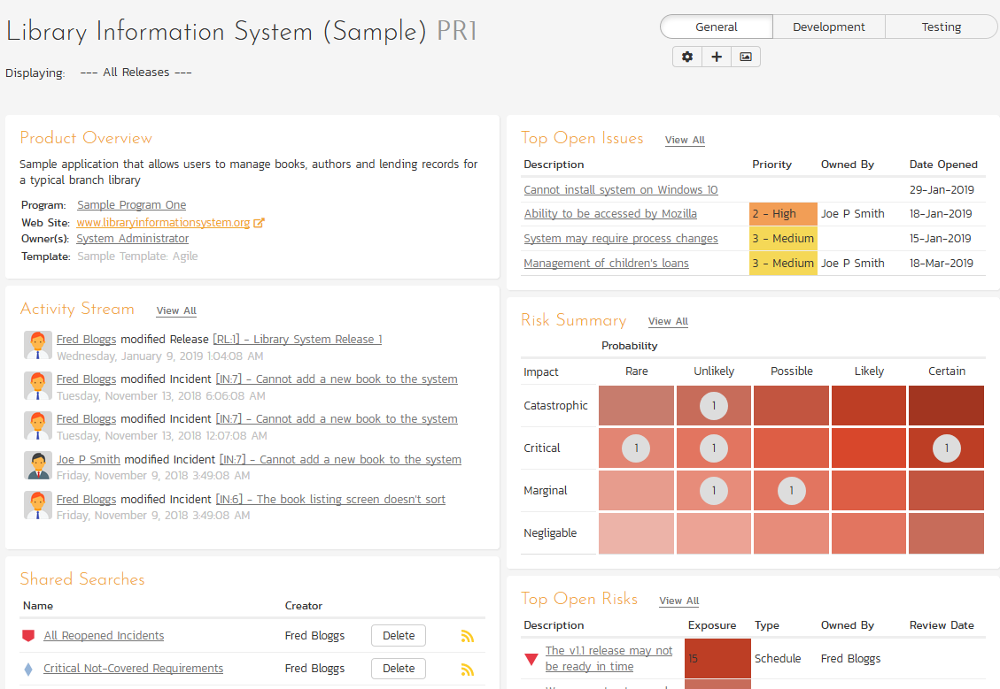
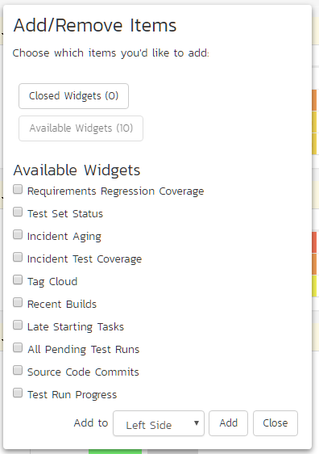

# Product Homepage
## Overview
When you click on either the "Product Home" tab or the name of the product in the "My Page" product list, you will be taken to the homepage of the specific product in question:

This page summarizes all of the information regarding the product into a comprehensive, easily digestible form that provides a "one-stop-shop" for people interested in understanding the overall status of the product at a glance. It contains summary-level information for all types of artifact (requirements, test cases, incidents, etc.) that you can use to drill-down into the appropriate section of the application.

You will see a small "i" in a circle at the top right of every chart. Hovering or clicking on this will show you information about that chart.

In addition to viewing the product home page, you can choose to filter by a specific release, to get the homepage for just that release (and any child sprints).

Just like the 'My Page', the Product Home dashboard is initially loaded in 'view mode' with pre-configured set of widgets. The Product Home has 3 versions you can quickly switch between. While each of these can be customized as you want, by default they are designed to help different types of product member -- be they managers, testers, or developers.

To download an image of the entire dashboard click the 'picture' button beneath the currently selected view.

To switch the page to 'edit mode', you should click on the button with the cog icon () below the currently selected Product Home view.

Once in 'edit mode', each of the 'widgets' displayed on the product homepage can be minimized by clicking on the arrow icon () in the top-left of the window, or closed by clicking-on the cross icon () in the top-right of the window. In addition, the widgets allow you change their settings by clicking on the settings icon ().This allows you to customize your view of the product to reflect the types of information that are relevant to you. If you have closed a widget that you subsequently decide you want to reopen, you can rectify by clicking the "***Add Items***" button at the top of the page, and locating the closed item from the list of 'Closed Widgets'.

By default, the product home page shows the "General" view. The following table shows which widgets are displayed on the different views of the 'Product Home':

| Widget Name                      | General | Development | Testing |
| -------------------------------- | ------- | ----------- | ------- |
| Product Overview                 | Y       | Y           | Y       |
| Activity Stream                  | Y       | Y           |         |
| Shared Searches                  | Y       |             |         |
| Schedule                         | Y       |             |         |
| Requirement Completion           | Y       |             |         |
| Requirement Incident Count       | Y       | Y           | Y       |
| Requirements Coverage            | Y       |             | Y       |
| Requirements Graphs              | Y       | Y           |         |
| Requirements Regression Coverage |         |             | Y       |
| Requirements Summary             | Y       | Y           | Y       |
| Release Task Progress            |         | Y           |         |
| Release Test Summary             |         |             | Y       |
| Releases/Sprints Completion      | Y       |             |         |
| Releases/Sprints Relative Size   | Y       |             |         |
| Recent Builds                    |         | Y           |         |
| Tag Cloud                        |         |             |         |
| Test Case Cumulative Progress    |         |             | Y       |
| Test Execution Status            |         |             | Y       |
| Test Set Status                  |         |             | Y       |
| All Pending Test Runs            |         |             | Y       |
| Test Run Progress                |         |             | Y       |
| Incident Aging                   |         | Y           |         |
| Incident Open Count              | Y       | Y           | Y       |
| Incident Test Coverage           |         |             |         |
| Incident Summary                 | Y       | Y           | Y       |
| Top Open Issues                  | Y       | Y           |         |
| Risk Summary                     | Y       |             |         |
| Top Open Risks                   | Y       |             |         |
| Late Finishing Tasks             | Y       | Y           |         |
| Late Starting Tasks              |         | Y           |         |
| Task Graphs                      | Y       | Y           |         |
| Source Code Commits              |         | Y           |         |

Please note that different widgets are shown by default for the "Developer" and for the "Tester" views.

If you click on the "***+ Add***" items button it will display the list of any additional widgets that are available for that view. Below is what this looks like for the 'General' view:

You can add the additional widgets by selecting the appropriate checkbox, choosing the destination location (left side vs. right side) and then click the "***Add***" button.

Each of the different widgets listed is described in more detail below:

## Product Overview

This section displays:

- the name of the product
- a brief description
- a link to view the products details on the [program product details page](Program-Products.md/#product-details) (only visible to program members)
- the product's program
- the web-site that points to any additional information about the product
- the names of the owners of the product
- the product's template

## Activity Stream

This section shows a list of the most recent changes made by any product member anywhere in the product. It only displays changes to artifacts that the current user is allowed to view (based on their product role). Here is an example activity item - you can see that it displays information about the user who made the change, what was changed, how it was changed, and when:

> System Administrator modified Incident [IN:1] - Cannot log into the application | Tuesday, November 2, 2021 2:01:34 PM

You can configure how many recent changes to display.

### Activity List Page
Clicking the "View All" button at the top of this section will open the "Activity List" page. This page shows every change ever made in the product in a single, paginated list for artifacts that the current user is allowed to view (based on their product role).The list can be sorted on or filtered by any field. The list shows the following columns:

- Change Date
- Artifact Type
- Artifact Name
- Artifact ID
- Change Type
- User

## Shared Searches

This section lists any filters/searches have been saved from the various artifact list screens throughout the application and marked as **shared filters**. This allows users to store specific combinations of searches that the product team needs to perform on a regular basis (e.g. display all newly logged incidents, display all requirements that are completed but have no test coverage).

The name of the saved search is displayed along with an icon that depicts which artifact it's for and the person who created it. Clicking on the name of the saved search will take you to the appropriate screen in the product and set the search parameters accordingly. If you are the creator of the saved search, clicking the "***Delete***" button next to the saved search will delete it. Clicking on the RSS icon will allow you to subscribe to the specific search so that it will be displayed in your RSS newsreader. This allows you to setup customized lists of information that can be displayed outside of SpiraPlan.

## Schedule
This Gantt chart shows all active releases[^active-release] and sprints in this product. Each bar spans from the item's start date to end date. The darker shaded portion of each bar tells you how complete its requirements are.

[^active-release]: any release / sprint / phase with a status that is *not* "Closed", "Deferred", or "Cancelled".

## Requirement Completion
This chart shows the proportion of all active requirements that have been completed across all active releases in this product. When 100% of the requirements are completed, the color changes so that it is easy to tell what is in progress vs completed.

## Requirement Incident Count
This section displays a count of the total number of incidents, and the number of open incidents mapped against requirements in the system, sorted by the requirements that have the most open incidents first. This section is useful for determining the parts of the application that have the most instability, as you can look at the requirements that have yielded the greatest number of incidents. Clicking on any of the requirements hyperlinks will take you to the 
[detail page](Requirements-Management.md/#requirements-details) for the requirement in question. *You can configure in the settings whether to include requirements with no open incidents, and also how many rows of data to display.*

## Requirements Coverage

This section consists of a bar graph that displays the aggregated count of requirements test coverage for the product. The Passed, Failed, Blocked, Caution and Not-Run bars indicate the total count of requirements that have tests covering them, allocated across the execution status of the covering tests. For example, if a requirement is covered by *four tests*, two that have passed, one that has failed and one that has not yet been run, the counts would be passed = 0.5, failed
= 0.25 and not-run 0.25. These fractional quantities are then summed across all the requirements to give the execution status breakdown of the covered requirements.

In addition to the five statuses for the covered requirements, the sixth ("Not Covered") bar depicts the total number of requirements that have no tests covering them, putting the five other bars into perspective. Typically a product is in good health if the "Not Covered" bar is zero, and the count of "Passed" requirements is greater than "Failed", "Caution" or "Not Run". The greatest risk lies with the "Blocked", "Not Covered" and "Not Run" status codes, since the severity/quantity of any bugs lurking within is not yet fully known.

If you position the mouse pointer over any of the four bars, the color of the bar changes slightly and the underlying raw data is displayed as a tooltip, together with the percentage equivalent. Clicking on the any of the bars in the chart will take you to the [requirements list page](Requirements-Management.md/#requirements-list) with the corresponding filters set.

When you filter the product home by release/sprint, this widget will filter the requirements coverage graph to only include ***requirements that are specifically mapped to the selected release/sprint***. This is useful when you want to determine the test coverage of new requirements that are being added to the specific release/sprint. If instead you want to determine the regression test coverage for a release, you should add the separate "Requirements Regression Coverage" widget to the page instead.

## Requirements Graphs

This widget lets you quickly view four different graphs used when measuring the progress of requirements in an agile methodology. They are described in more detail in [Reports](Reports-Center.md/#snapshot-graphs).

1. **[Requirement Velocity](Reports-Center.md/#requirements-velocity-graph)**: this graph shows the actual velocity delivered in each product release and/or sprint compared to the product average and the rolling average.
2. **[Requirement Burnup](Reports-Center.md/#requirements-burnup-graph**: this graph shows the cumulative number of story points outstanding for each release/sprint in the product with separate lines for the actual and ideal burnup overlaid on top of a bar-graph that shows the completed story points per release/sprint.
3. **[Requirement Burndown](Reports-Center.md/#requirements-burndown-graph)**: this graph shows the remaining number of story points that needs to be done for each release/sprint in the product with separate lines for the actual and ideal burndown overlaid on top of a bar-graph that shows the completed story points per release/sprint.
4. **[Requirements Coverage](Reports-Center.md/#requirements-coverage-graph)**: this graph shows the number of requirements that have test cases that are passed, failed, blocked, cautioned, not run as well those requirements that do not have any test cases (not covered). Unlike the main Requirements Coverage graph on the home page, this one is segmented by requirement importance.

For each of the three graphs you can click on the "Display Data Grid" link to display a grid of the underlying data that is represented in the graph and also there are options to save the graph in a variety of different image formats.

## Requirements Regression Coverage
This section consists of a bar graph that displays the aggregated count of requirements test coverage for the product in a similar fashion to the 'Requirements Coverage' widget:

However, unlike the 'Requirements Coverage' widget, when you filter the product home by release/sprint, this widget will filter the requirements coverage graph to include all requirements (regardless of release/sprint), but only considering covering test cases that are associated with the selected release/sprint. This is useful when you want to determine the regression requirements test coverage of a specific release (i.e. does running all the tests relevant to this release cover all the necessary requirements, not just new requirements).

## Requirements Summary
This section consists of a summary table that displays the aggregate count of requirements in the system broken-down by importance (on the x-axis) and status (on the y-axis). This allows the product manager to determine how many critical vs. low priority enhancements are waiting to be implemented, vs. actually being implemented. In addition, it makes a distinction between those requirements simply requested and those actually planned for implementation, so the product manager can see what the backlog is between the customer's demands, and the plan in place. Clicking on the "***View Details***" button at the top of the table takes you to the Requirement list page. Clicking on the individual values in the cells will display the requirements list with the filter set to match the importance and status of the value.

## Release Task Progress
This widget allows you to quickly ascertain the task progress of each of the active releases that make up the current product in one snapshot. Each release is displayed together with a graphical display that illustrates the completion percentage and status with different colored bars. In addition, if you hover the mouse over the graphical display it will display a tooltip that provides a more detailed description of the number of tasks in each status.

Each release will display the aggregate progress of any tasks directly assigned to itself, together with the task progress of any child sprints that are contained within the Release. Clicking on one of the releases will drill you down one level further and display the task progress for the parent release as well as each of the child sprints separately:

## Release Test Summary
This widget allows you to quickly ascertain the test execution status of each of the active releases that make up the current product in one snapshot. Each release is displayed together with a graphical display that illustrates the execution status with different colored bars. In addition, if you hover the mouse over the graphical display it will display a tooltip that provides a more detailed description of the number of tests in each status.

Each release will display the aggregate status of any test cases directly assigned to itself, together with the test status of any child sprints that are contained within the Release. Clicking on one of the releases will drill you down one level further and display the test execution status for the parent release as well as each of the child sprints separately:

## Releases/Sprints Completion
This chart shows the progress of each active release with requirements attached in this product. The left-hand chart shows progress from the start to end date of the release. The bar's color indicates how on track the schedule is against requirement completion. The right-hand chart shows the proportion of requirements in the release that have been completed.

!!! question "Displaying for a Release"
    Normally this widget does not show sprints. However if you have set the dashboard to display information for a particular release, this widget will show any children of that release - including any sprints. The specific release you are displaying for is not shown in the widget.

Schedule Progress color definitions:

- **Complete**: All requirements included against the release / in releases in this workspace are complete
- **Ahead of Schedule**: The percentage of completed requirements is greater than the percentage of the schedule that has elapsed
- **On Schedule**: The percentage of completed requirements is broadly the same as the percentage of the schedule that has elapsed
- **Behind Schedule**: The percentage of completed requirements is less than the percentage of the schedule that has elapsed
- **Overdue**: The workspace or any of its children (if relevant) is running late. For a workspace itself to be late, its requirements are not yet all complete, but its end date has already passed

!!! note "Example"
    A release started a week ago and will finish in a week. Therefore its schedule is 50% of the way through (1 week down, 1 week to go). 
    
    The Schedule Progress bar will show as 50% (if you click "Displaying" button to "As Numbers" it will show 7 days). 
    
    This release has a total of 20 requirements (summed up from all its active child releases and sprints, if any). Let's say that 15 of these are completed. That's 75% complete. So the Requirements Complete bar will show 75% (if you click "Displaying" button to "As Numbers" it will show 15 completed).

    So the schedule is half way through but we are three quarters done with the work (the requirements). So we are ahead of schedule (awesome!). The schedule bar will therefore have the "Ahead of Schedule" color.

    What if, instead of finishing next week, we were supposed to finish *last* week? Well, the schedule bar would be flagged as "Behind Schedule". This is because we are only 75% complete on the work, but the end date is in the past. 

    Tip: You can hover over a bar to get more information.

## Releases/Sprints Relatize Size
This chart shows the number of active requirements in each active release. Hovering over a segment will show its percentage of all requirements (this is visually represented by the size of the donut wedge). Please note, releases with no active requirements are not shown.

!!! question "Displaying for a Release"
    Normally this widget does not show sprints. However if you have set the dashboard to display information for a particular release, this widget will show any children of that release - including any sprints. The specific release you are displaying for is not shown in the widget. The widget will also show sprints if you ONLY have ative sprints in this product (i.e. if there are no active major or minor releases at all).

## Recent Builds

This widget displays a list of the most recent builds that have been performed as part of the current release or sprint:

For each build it will display whether the build succeeded or failed, the date the build occurred and the name of the build together with a hyperlink to the [build details](Release-Management.md/#build-details). Note: If no release or sprint is selected then the widget will not display any data.

## Test Case Cumulative Progress

This section consists of a chart that displays the last 30 days of test case executions cumulatively. That means it will display for each day, the total number of test cases executed plus the status from any previous days that have not been changed. Any test cases not executed up to that point will be considered "not run" and will appear in the "not run" category. For example, if you have 10 test cases created on day 1 you will see 10 test cases "not run" on day 1. On day 2, you execute 5 test cases and fail them all, you will now see 5 test cases failed and 5 not run. On day 3, you execute 3 of the previous 5 test cases and pass them. You will now see 3 test cases passed, 2 failed and 5 not run.

## Test Execution Status

This section consists of a bar graph that displays the aggregated count of test cases in each execution status for the product. Note that this graph does not consider past test-runs when calculating the totals in each status (Passed, Failed, Not Run, etc.), it simply looks at each test-case and uses the last-run status as the best health indicator. Thus if a test case that previously passed, has subsequently failed upon re-execution, it will be considered a failure only.

If you position the mouse pointer over any of the five bars, the color of the bar changes slightly and the underlying raw data is displayed as a tooltip, together with the percentage equivalent. Clicking on any of the bars will bring up the [product test case list](Test-Case-Management.md/#test-case-list) with the appropriate filter applied.

In addition to the bar-chart, there is also a display of the total number of test runs recorded for the product, and a list of the *five most recent* days of recorded test-runs, together with the daily count.

## Test Set Status
This section consists of a bar graph that displays the aggregated count of test cases in each execution status for each test set in the product:

Therefore if you have the same test cases stored in multiple test sets, then this widget will display the total test case count for all combinations of test set. This is useful if you have the same test cases being executed in different environments -- represented by different test sets -- and you need to make sure that the tests passed successfully in all environments.

If you position the mouse pointer over any of the five bars, the color of the bar changes slightly and the underlying raw data is displayed as a tooltip, together with the percentage equivalent. Clicking on any of the bars brings up the [product test set list](Test-Case-Management.md/#test-run-details) page with the appropriate filter applied. In addition to the bar-chart, there is also a display of (up to) the *five most overdue test sets in the product*.

## All Pending Test Runs
This section lists all the test runs that are currently being executed by testers in the product. Until a test case or test set is fully executed, a pending test run entry is stored in the system so that you can continue execution at a later date.

Any pending test run can be either deleted or reassigned to another member of the product. **NOTE**: only product administrators can delete or reassign test runs from this widget.

## Test Run Progress
This section consists of a chart that displays the last 30 days of test run activity, broken down, for each day, by the test run status. This is a useful chart to quickly track the testing activity of the product -- this is not the same as overall product status.

## Incident Aging
This section displays the number of days incidents have been left open in the system. The chart is organized as a histogram, with the count of incidents on the y-axis and different age intervals on the x-axis.

## Incident Open Count
This section show a bar chart to visualize the breakdown of all open incidents in the product by priority. The chart's bar match the color assigned to that priority. Clicking on the "View Details" link at the top of the widget opens the Incident list page.

## Incident Summary
This section consists of a summary table that displays the aggregate count of incidents in the system broken-down by priority (on the x-axis) and status (on the y-axis). This allow the product manager to determine how many critical vs. low priority incidents are waiting to be addressed, and how many new items need to be categorized and assigned. Clicking on the "View Details" link at the top of the table opens the Incident list page. Clicking on the individual values in the cells will display the incident list with the filter set to match the priority and status of the value.

By default this summary table displays the total count of all incidents
-- regardless of type, however my changing the drop-down list to a specific incident type (e.g. bug, enhancement, issue, etc.), the product manager can filter the summary table to just items of that type. *You can also configure in the settings whether to use Priority or Severity for the x-axis*

## Incident Test Coverage
This section displays a bar-graph that illustrates the execution status of any test cases that previously failed and resulted in the generation of an incident that has subsequently been resolved. This is very useful when a test case was executed in Release 1.0 and an incident was logged. That incident has now been resolved in Release 1.1 (and is in a closed status) but we need to know that the test case that caused the failure has been successfully re-run. Any test cases listed as Blocked, Caution, Not-Run, Not Applicable, or Failed in this graph need to be executed to verify that all resolved bugs in the release have truly been fixed.

## Top Open Issues
Issues are a subset of Incidents. [Admins can control](../Spira-Administration-Guide/Template-Incidents.md/#edit-types) which types of incident should be considered issues. All incidents that have a type marked in this way are considered "issues." 

This widget shows a breakdown of the top issues logged in the product, in order of decreasing priority. Issues that do not have a priority are listed at the top, since critical issues could be lurking in that list. Only open issues are shown. Clicking on the issue's hyperlink opens [incident details page](Incident-Tracking.md/#incident-details) for that issue. 

*You can configure in the settings whether to use Priority or Severity for the display, and also how many rows of data to display.*

## Risk Summary
This section displays a two dimensional matrix of the open risks logged against the product of impact against probability. Combined these two dimensions are reflected in the risks exposure and each differently colored rectangle in the matrix represents one possible exposure. The number of risks that have a particular exposure are shown inside each rectangle as appropriate. Clicking on that number will take you to the risk list page filtered by the relevant exposure.

## Top Open Risks
This widget displays a breakdown of the top open risks in the product, in order of decreasing risk exposure. For each row you see:

- **Risk name**: hovering shows more information about the risk, and clicking the name opens the risk details page
- **Exposure**: the background color is consistent with that shown for exposure in other locations
- **Type**
- **Owned By**
- **Review Date**

You can edit the widget to: show/hide the risk owner column; show/hide the risk type column; and the number of rows to display (max of 50).

## Late Finishing Tasks
This section displays the list of any product tasks that have not yet been completed, but whose scheduled end date has already elapsed. A graphical progress bar is included with each task in the grid, so that you can easily see which tasks are nearest completion.

## Late Starting Tasks
This section displays the list of any product tasks that have not yet started, but whose scheduled start date has already elapsed:

Each task is listed along with its owner, priority and due-date so that you quickly ascertain how many days late it will be starting, how important it is to the product, and who needs to be contacted to get more information.

## Task Graphs
This widget lets you quickly view the three main graphs used when measuring the progress of tasks in an agile methodology. They are described in more detail in [Reports](Reports-Center.md/#snapshot-graphs).

1.  **[Task Velocity](Reports-Center.md/#task-velocity-chart)**: this graph shows the total estimated and actual effort delivered in each product release and/or sprint
2.  **[Task Burnup](Reports-Center.md/#task-burnup-chart)**: this graph shows the cumulative amount of work outstanding for each release/sprint in the product with separate lines for the estimated, remaining and completed effort.
3.  **[Task Burndown](Reports-Center.md/#task-burndown-chart)**: Read more about how this graph works here [here](Reports-Center.md/#task-burndown-chart).

## Source Code Commits

This section consists of a chart that displays the last 3 months of code commits to the product (if you are using the source code functionality of the application). Commits are aggregated by week. The chart is color coded by bottom quartile, the middle 50%, and the top quartile of activity.

Above the chart is a branch selector. This shows you the current branch and lets you choose which branch in the source code repository to view. This is stored for your user across the whole product, which means that you will see information for this same branch in other relevant places - eg when viewing files, or when viewing commits.

Below the chart is a list of the five most recent commits, along with the date they were made (hovering over the commit name will show a tooltip with the commit message and exact time of the commit). Click the "View All" button to open the [commit list](Commits.md/#commit-list) page.

## Custom Graphs

This category of charts are user defined, and utilizes Spira's [custom graphs](../Reporting/Custom-Graph-Tutorial.md) functionality. All custom graphs are available to users to add to the product home page. 

When a specific release is selected to display, this will work the same way as it does on the Reporting page, where the custom graph query will have any {ReleaseId} or {ReleaseAndChildIds} tokens replaced with the appropriate values. 

To learn more about how to create custom graphs, check out the [reporting documentation](../Reporting/index.md).