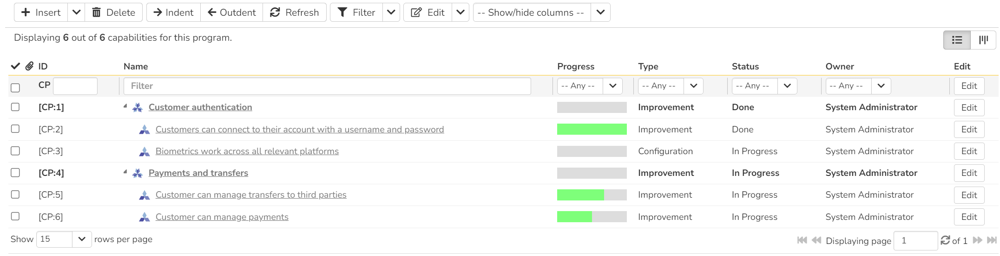

# Program Capabilities
!!! abstract "Available in SpiraPlan only"

Capabilities and [Program Milestones](Program-Milestones.md) give you powerful ways to manage delivery of features and releases across multiple products at once - in other words at a program level. Capabilities let you define cross-product, program-level features (requirements). You can customize capabilities with system-wide [types](../Spira-Administration-Guide/Program-Capabilities.md/#types), [statuses](../Spira-Administration-Guide/Program-Capabilities.md/#statuses), [priorities](../Spira-Administration-Guide/Program-Capabilities.md/#priorities), and fully [customizable fields](../Spira-Administration-Guide/System-Custom-Properties.md). You can link capabilities to product requirements to track their progress at a higher level, and tag them with a program milestone to manage their delivery timetable.

!!! question "Use cases for capabilities"
    You can think of capabilities as program-level requirements. With deep customizations, you can use them in a variety of different ways. Here are a few to help guide you using them.

    - You have two **separate but similar products** - one for an iOS app, the other for an Android app. Create a capability for a common feature (e.g. a new user interaction), and link the relevant requirements to that capability. You can now easily see how those requirements are doing. This lets you know when the higher level capability is ready so you can release the feature to both platforms at the same time. In this way, you can track progress of similar or complimentary features delivered across multiple products.
    - You have **multiple products that each create a module for a larger application**. You can create capabilities at the program level to represent the features of that large application. By linking a capability to the requirements in the various product that it depends on, you can track how the modules are progressing at that higher level, and capture interdependencies at the program level.
    - You are **building a new feature set for a large project** that will consist of multiple parts / products. Create capabilities as you plan out the large project. You can create parents and children to better organize them. When you are ready you can go one level lower and create the requirements for each part / product, then link them up
    - You want to **track cross-product activity** unrelated to specific product requirements. Maybe your products are all separate, but there are still some work you want to capture that spans the whole program. You could create capabilities to capture work for improving documentation across a multi product documentation site, or for marketing work required to better explain new features across all your relevant products.

## Progress
A capability's Progress is a special field that shows a mini chart. This chart represents the percentage completion of all relevant requirements associated directly to the capability.

The percentaged complete is calculated by dividing the number of "completed requirements" (described below) by the total number of requirements associated to the capability. A "completed requirement" is a requirement with a status of either "Tested", "Completed", or "Released". Hover over the mini chart to see more specific information.

!!! example "Examples"
    - A capability is associated to 3 requirements with statuses of "Developed", "In Progress", and "Tested" respectively. The progress will be 33%.
    - A capability is associated to 6 requirements all with a status of "Requested". The progress will be 0%.
    - A capability is associated to 2 requirements, where one has a status of "Completed", and the other a status of "Released". The progress will be 100%.

## Capability List
To access capabilities, navigate to a program and then open the artifact dropdown. Select "Capabilities". This will open the capability list page. The capability list is a hierarchical collection of the capabilities. You can move the capabilities to a specific position in the hierarchy (above or below another specific capability), and you can indent capabilities to create parent and child capabilities. You can only have one level of indentation (in other words, you cannot have children that themselves also have children). At first, the list will be empty.

### List page toolbar operations
You can carry out a number of useful operations with the toolbar:

- **Insert** this button has several features to add new capabilities (see below). When added the new capability is in "Edit" mode so you can set its name and other information.

    - to insert a new capability *above* another, select that capability (click its checkbox) then click `Insert` or `New Capability` from the button's dropdown
    - to insert a capability as a child of a root level capability, select that capability (click its checkbox) then, click the Insert > `Child Capability` button from the dropdown 
    - to insert a capability at the end of the list, click `Insert` with nothing selected. Note that if the list goes over more than one page, the new capability will be at the bottom of the last page

- **Delete**: deletes all currently selected capabilities. If any of them is a parent, their child capabilities are also deleted. If all the children are deleted from a parent, it changes back into a non-parent
- **Indent**: indents the selected capabilities under the root capability above them. You can only have one level of indents - you will not be able to indent a capability under one that is already a child
- **Outdent**: outdents the selected child capabilities back to the root level
- **Refresh**: this button will reload the capabilities list (not the entire page)
- **Filter**: read about [how to create and manage filters](Application-Wide.md#filtering) - note that capabilities do not support saving or sharing filters
- **Edit**: this will switch any selected capabilities into Edit mode. You can achieve the same thing by clicking the "Edit" button at the top of the list itself. You can switch on edit mode for capabilities one at a time by clicking the "Edit" button for each specific row or by double clicking one of the cells in a row. When in edit mode, the row will show a "Save" button to commit the changes, and "Cancel" to discard them. The edit menu also has a dropdown of other options

    - **Copy Items**: to copy the selected capability/capabilities to the clipboard
    - **Cut Items**: to cut the selected capability/capabilities from their current position
    - **Paste Items**: to paste any capability/capabilities on the clipboard above the currently selected capability (make sure to only select a single capability)

- [download the list to a CSV file](Application-Wide.md/#download-as-csv)
- **Show / Hide Columns**: By default the following columns are shown: ID, name, progress, type, status, and owner. The columns dropdown lets you change the columns shown (for standard and custom properties). Toggle a column's visibility by clicking on it from the dropdown. The shown columns is saved for each user and for each program.

Using the cut and paste buttons described above, you can move capabilities around the hierarchy. Alternatively, you can select the capabilities and drag and drop them into their new position.

## Capability Details
When you click on a capability it will open its capability details page:

This page is made up of *three* areas;

1.  the left pane displays the capability list navigation
2.  the right pane's header: this displays the toolbar, [any parent capability](Application-Wide.md#breadcrumbs), the editable name of the capability; and the info bar (with a shaded background)
3.  the right pane's tabbed interface with rich information related to the capability (its Overview and Requirements tabs are discussed below).

### Navigation pane
Please note that on smaller screen sizes the navigation pane is not displayed. While the navigation pane has a link to take you back to the list page, on mobile devices a 'back' button is shown on the left of the operations toolbar.

The navigation pane can be collapsed by clicking on the "-" button, or expanded by clicking anywhere on the gray title area. On desktops the user can also control the exact width of the navigation pane by dragging and dropping a red handle that appears on hovering at the rightmost edge of the navigation pane.

The navigation pane shows a list of capabilities. This list is useful as a navigation shortcut - you can quickly view the peer capabilities by clicking on the navigation links, without having to first return to the list page. The navigation list can be switched between two different modes:

-   The list of capabilities matching the current filter
-   The list of all capabilities, irrespective of the current filter

### Toolbar Operations
- **Save**: to save the current item

    - **Save > Save and Close** takes you back to the list page after the save is complete
    - **Save > Save and New** opens a new blank capability after the save is complete

- **Refresh**: refreshes the name, info bar information, and overview tab for the item
- **New**: adds a new item immediately below the current capability (and if the current capability is a child the new item is added as a child to the same parent)

    - **New > Clone**: creates a clone of the current capability (and its children if it is parent) and adds it above the current capability
    - **New > Child Capability**: adds a new item as a child of the current capability at the bottom of any children that capability already has (you are not able add a child to an existing child capability)

- **Delete**: deletes the current capability. If it is a parent, its child capabilities are also deleted

### Info bar
The info bar shows the following information for the capability: name, icon (different for parent and children), ID, type, status, and [progress](#progress) mini chart

### Overview
The Overview tab is divided into a number of different sections. Each of these can be collapsed or expanded by clicking on the title of that section. Each section displays fields of a similar type. For instance, all fields regarding dates are grouped together in the "Dates and Times" area.

The bottom most section contains the long, formatted description, followed by any rich text custom fields. You can enter rich text or paste in from a word processing program or web page into these fields. Note that you are not able to paste screenshots into these description boxes

### Requirement Associations
You can associate requirements from any product inside the current program to a capability from this tab. Any requirements linked to the capability feed into the [progress](#progress) calculation of the capability. The associated requirements show the following information: name, status, product name, owner, and ID. 

Read more about [how to manage and add associations to this artifact](Application-Wide.md#associations)

## Capability Board
!!! info "Capability Board Overview"
    
    The Spira capability board is a streamlined and highly customizable "kanban" style board. It lets you visualize, manage, and plan capabilities across a program.

    To learn more about how boards in Spira are structured and their general features refer to our [board overview](Application-Wide.md/#boards). Here you can learn about:

    - [board structure and configuration](Application-Wide.md/#board-structure)
    - [special board views](Application-Wide.md/#special-board-views) 
    - [working with board cards](Application-Wide.md/#board-cards) 

    **Specific features of or differences in the capability board are discussed more fully below**.

### Board configuration
The capability board configuration button has a number of options to configure the board to your needs. 

The [program milestone dropdown](#program-milestone-options) can be set to either "all program milestones" or a specific program milestone. The dropdown shows all open program milestones.The table below shows what options are available, when. Certain configuration are discussed in more detail in subsequent sections:

| View options | All program milestones                                        | A specific program milestone                                  |
| ------------ | ------------------------------------------------------------- | ------------------------------------------------------------- |
| **Columns**  | Priority  Program Milestone  Status  Type  Person | Priority  Program Milestone  Status  Type  Person |
| **Rows**     | Priority  Program Milestone  Status  Type  Person | Priority  Program Milestone  Status  Type  Person |

The following options support showing unassigned items:

- priority (rows and columns)
- program milestone (columns if showing all program milestones)
- person (rows and columns)

#### Program Milestone options
The **release dropdown** shows:

| Options                                    | Meaning                                                     | What cards will show                                                       |
| ------------------------------------------ | ----------------------------------------------------------- | -------------------------------------------------------------------------- |
| All Program Milestones                               | All open[^open-program-milestones-definition] program milestones combined        | Those planned for any open program milestones                                         |
| Any open[^open-program-milestones-definition] program milestones | Any single open[^open-program-milestones-definition] program milestones | Those planned for the selected release and its child sprints (if relevant) |

[^open-program-milestones-definition]: any program milestone with a status marked as "open"

#### Customizing cards

In addition to the standard [board card options](Application-Wide.md/#board-card-options), you can toggle whether to show each of the following features:

- **Progress**: a mini histogram chart of the capability's progress (hover to see a tooltip with detailed information)
- **Requirement Indicators**: each requirement associated to the capability is shown as a little circle, shaded based on whether or not it has been completed (hover to see a tooltip with information about the requirement, and click to open details about that requirement)

Below is an example of an capability card showing all available data

