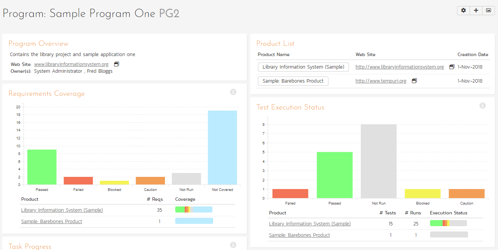
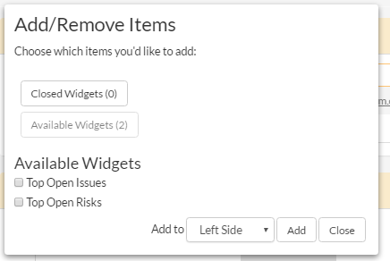

# Program Homepage
## Overview
When you navigate to a Program from the global navigation bar or from any link to it in the application, you will be taken to the homepage of that program:

This page summarizes all of the information about the program in a "one-stop-shop". The Program Homepage has 3 versions you can quickly switch between. While each of these can be customized as you want, by default they are designed to help different types of user: managers, testers, and developers.

You will see a small "i" in a circle at the top right of each widget. Hovering or clicking on this will show you information about that chart.

In a similar manner to other home pages in the application (like the 'My Page'), the Program Home is loaded in 'view mode'. To switch the page to 'edit mode', click the button with the cog icon () on the right.

In 'edit mode', each widget can be:

- minimized by clicking on the arrow icon () at the top-left of the widget
- closed by clicking-on the cross icon () at the top-right of the widget
- move the widget around the page by clicking on its top bar and dragging it to where you want it to go
- in some cases, widgets allow you change their settings by clicking on the settings icon (). 

Together, these editing options let you change the page to suit your needs. If you close a widget and then later want to open it again (or the widget is not visible on the page) click the "***+ Add***" button at the top of the page (next to the 'edit mode' button). This brings up a list of all the widgets you can add onto the page (including a list of 'Closed Widgets'). You can choose where on the page each widget should go.

!!! info "Please note"
    Any changes you make to this page (e.g. editing, moving, closing widgets) will only affect your user and on this particular home page. They do not affect any other user.

By default, the program home page shows the "General" view. The following table shows which widgets are displayed on the different views of the 'Product Home':

| Widget Name                           | General | Capabilities | Quality |
| ------------------------------------- | ------- | ------------ | ------- |
| Capability Open Count                 |         | Y            |         |
| Capability Summary                    |         | Y            |         |
| Incident Aging                        |         | Y            | Y       |
| Product List                          | Y       | Y            | Y       |
| Products: Completion                  | Y       |              |         |
| Products: Relative Size               | Y       |              |         |
| Program Overview                      | Y       | Y            | Y       |
| Program Milestone Capability Progress |         | Y            |         |
| Program Milestone Completion          |         | Y            |         |
| Requirement Completion                | Y       |              | Y       |
| Requirements Coverage                 | Y       |              | Y       |
| Recent Builds                         |         |              | Y       |
| Schedule                              | Y       |              |         |
| Task Progress                         |         | Y            |         |
| Test Execution Status                 |         | Y            | Y       |
| Top Open Issues                       | Y       | Y            |         |
| Top Open Risks                        | Y       |              |         |

## Program Overview

This section displays the name of the program, together with a brief description, the web-site that points to any additional information about the program, and the names of the owners of the program. In SpiraPlan, if the program is part of a portfolio, the portfolio name is also shown.

## Product List

This section lists all the active products that make up the program, together with the name, description, program and date of creation. To view the description of the product, simply position the mouse pointer over the link, and a tooltip window will popup containing the description.

## Products: Completion
This chart shows the progress of each active release with requirements attached in this product. The left-hand chart shows progress from the start to end date of the release. The bar's color indicates how on track the schedule is against requirement completion. The right-hand chart shows the proportion of requirements in the release that have been completed.

Schedule Progress color definitions:

- **Complete**: All requirements included against the release / in releases in this workspace are complete
- **Ahead of Schedule**: The percentage of completed requirements is greater than the percentage of the schedule that has elapsed
- **On Schedule**: The percentage of completed requirements is broadly the same as the percentage of the schedule that has elapsed
- **Behind Schedule**: The percentage of completed requirements is less than the percentage of the schedule that has elapsed
- **Overdue**: The workspace or any of its children (if relevant) is running late. For a workspace itself to be late, its requirements are not yet all complete, but its end date has already passed

!!! note "Example"
    A product started a week ago and will finish in a week. Therefore its schedule is 50% of the way through (1 week down, 1 week to go). 
    
    The Schedule Progress bar will show as 50% (if you click "Displaying" button to "As Numbers" it will show 7 days). 
    
    This product has a total of 20 requirements (summed up from all of its active releases). Let's say that 15 of these are completed. That's 75% complete. So the Requirements Complete bar will show 75% (if you click "Displaying" button to "As Numbers" it will show 15 completed).

    So the schedule is half way through but we are three quarters done with the work (the requirements). So we are ahead of schedule (awesome!). The schedule bar will therefore have the "Ahead of Schedule" color.

    What if, instead of finishing next week, we were supposed to finish *last* week? Well, the schedule bar would be flagged as "Behind Schedule". This is because we are only 75% complete on the work, but the end date is in the past. 

    Tip: You can hover over a bar to get more information.

## Products: Relative Size
This chart shows the number of active requirements in each active product. Hovering over a segment will show its percentage of all requirements (this is visually represented by the size of the donut wedge). Please note, products with no active requirements are not shown.

## Schedule 
This Gantt chart shows all active releases and sprints in this program. Each bar spans from the item's start date to end date. The darker shaded portion of each bar tells you how complete its requirements are.

## Requirement Completion 
This chart shows the proportion of all active requirements that have been completed across all active products in this program. When 100% of the requirements are completed, the color changes so that it is easy to tell what is in progress vs completed.

## Requirements Coverage

This section consists of a bar graph that displays the aggregated count of requirements test coverage for the entire program. The Passed, Failed, Blocked, Caution and Not-Run bars indicate the total count of requirements that have tests covering them, allocated across the execution status of the covering tests

Under the main bar graph is displayed a table containing each product in the program and a colored bar illustrating the specific requirements coverage distribution for that product. That way you can see both the aggregate coverage and also the relative coverage for the products. *You can choose to show the aggregate bar graph, and/or the product-specific requirements coverage from the widget settings.*

By default, this widget shows data for **active releases only** in each product in the program. *You can choose to show data for all releases in all products of the program from the widget settings.*

## Task Progress

This section consists of a bar graph that displays the aggregated count of tasks by progress category for the entire program. The 'On Schedule',
'Late Finish', 'Late Start' and 'Not Started' bars indicate the total count of tasks that are in that category for all the products in the program.

Under the main bar graph is displayed a table containing each product in the program and a colored bar illustrating the specific task progress for that product (using the same coloring convention as the main graph). That way you can see both the aggregate task progress and also the relative progress for each product. *You can choose to show the aggregate bar graph, and/or the product-specific task progress from the widget settings.*

By default, this widget shows data for **active releases only** in each product in the program. *You can choose to show data for all releases in all products of the program from the widget settings.*

## Test Execution Status

This section consists of a bar graph that displays the aggregated count of test cases by execution status for the entire program. The Passed, Failed, Blocked, Caution and Not-Run bars indicate the total count of test cases that are in that category for all the products in the program.

Under the main bar graph is displayed a table showing each product in the program with the following information:

- product name
- number of test cases in the product 
- number of test runs
- execution status mini chart: a colored bar illustrating the specific test case execution status for that product (using the same coloring convention as the main graph). This lets you see the aggregate test status and the relative status for each product

By default, this widget shows data for **active releases only** in each product in the program. 

In the widget settings you can choose to:

- show data for active releases in all products of the program (default) or otherwise across all releases
- show/hide the product table
- show/hide the bar graph (tip: don't hide both this AND the product table - if you do your widget will be totally empty)

## Incident Aging

This section displays the number of days incidents have been left open in the system. The chart is organized as a histogram, with the count of incidents on the y-axis (for all products in the program) and different age intervals on the x-axis.

Under the main bar graph is displayed a table containing each product in the program and a colored bar illustrating the distribution of open incidents by priority for that product. That way you can see both the aggregate aging for the program and also the relative priority of open incidents for each product. *You can configure in the widget settings whether you want to see the aggregate aging histogram, and/or the product-specific incident count by priority.*

## Top Open Issues

This section displays a breakdown of the top issues logged against any of the products in the program, in order of decreasing priority. Note that items not given a priority are listed at the top, since critical issues could be lurking in that list, and the product manager will want to immediately review these to assign priorities. Clicking on the issue item hyperlink will take you to the incident details page for the issue in question (see [Incident Tracking > Incident Details](../Incident-Tracking/#incident-details)). *You can configure in the settings whether to use Priority or Severity for the display, and also how many rows of data to display.*

## Top Open Risks
This widget lists the top risks logged against any of the products in the portfolio, ordered by exposure. Clicking on the risk name will open the [risk details](../Risks-Management/#risk-details) page for the risk in question. *Note: you can configure the widget settings to control the maximum number of risks to show.*

## Recent Builds
This widget displays a list of the most recent builds for each active release (organized alphabetically by product; in each product the builds are listed by date). For each build it shows: 

- the release name (which links to the specific [release](../Release-Management/#release-details))
- the build name (which links to the specific [build details](../Release-Management/#build-details))
- the build status (did it succeed or fail)
- the date of the build

You can change the number of builds the widget should show in the widget's settings (the default is 15).

## Product Test Summary
This table shows an information-dense, but easy to understand assessment of each product by a number of key metrics. It shows each product in the program, together with:

- the product ID and name
- the end date of the product (which is the furthest out end date of the product's active releases)
- the number of requirements across all active releases
- requirement coverage (by test execution status and by those not covered by any tests)
- the number of test cases
- the number of tests executed (test runs)
- the proportion of tests that have passed, failed, blocked, caution or not run
- the number of open incidents and the priority distribution of them
